Coorong 16S Analyses (2021)
================
Christopher Keneally
07/8/2023

\#opts_knit\$set(root.dir = “home/chriskeneally/Desktop/RWD”)

### Setup

#### Load Libraries and other setup

``` r
require(mgcv)
require(phyloseq)
require(DescTools)
require(plyr)
require(ggpubr)
require(tidyverse)
require(qiime2R)
require(metagMisc)
require(vegan)
require(scales)
require(grid)
require(reshape2)
require(magrittr)
require(rcompanion)
require(bestNormalize)
require("data.table")
require(ggsci)
require(microbiome)
require(janitor)
require(RColorBrewer) # nice color options
require(SpiecEasi) # Network analysis for sparse compositional data  
require(network)
require(intergraph)
require(decontam)
```

#### Set theme

``` r
theme_set(theme_bw())
```

### Analysis (June Sampling)

#### Import taxonomy, ASVs & metadata

``` r
metadata <- read_tsv("~/Documents/Postgrad/Data/PhoenixOutputs/coorong16sanalysis_2021/sample-metadata.tsv")
ASVs <- read_qza("~/Documents/Postgrad/Data/PhoenixOutputs/coorong16sanalysis_2021/table-240.qza")
ASVs$data[1:20,1:20] # Show the first 13 samples and features
```

    ##                                   GS1  GS2  GS3  JB2  PA1  PA2  PA3  PO1  PO2
    ## 6ad56f9b84e37a8de38a8530dbfb1d30 1323 1453 1448  741  573  723  921  199   78
    ## 190a40b9b984142ccef1c64bbc0fb4c3  188  314  663    0   31   64   24   29    0
    ## a4dd6d36ee0ced07649305a0e562cf25  842 1009  321   80 2068 2097 2473 1287  978
    ## 60d7d5102ed73e81a657bd00d2cedf0e  971 1008 1474    0  778  718  688  325  185
    ## 23c4c99a9ea7109f647497e045e04fad 1242  993  636  482 3186 2796 3096 1095 1319
    ## af8744828d42c41f7a57e1690a12b9e9  120  119  105 1827   54   64   24  663  652
    ## 2381615305d705826e1c109a3a056e57  123   84   64    0  405  285  404   53   54
    ## 44881109704520a5a33c3fb9c2606556  211  173  214    0  471  473  340  325  398
    ## 365d094b6d2180ecc0f9c1ece8a2bff5  437  569  815    0   54   78   62    0    0
    ## e52401328fb78881500d5b510fa5c743 1155 1555 1486    0 1480 1362 1674  174   44
    ## d5e590d36b009e7b555c01dd47ccf766  806  914  220    0 2252 2433 2317  180  115
    ## f55bb09675d5ea38552270c29286278e  287  581  720  180   61   72   28   81   59
    ## dbdaf8dc61acec3b61f4b1c9d9859808   51   55    0  399    0   48    0  167  259
    ## 001b54a1d8cb8213c0ec843e5161cb0f 1021  877  586    0  133  138   99   70   43
    ## 9cf89672bf80e0d803340938d223a34f  140  108  132    0  343  399  218   85  120
    ## ae26f19cd4d77921844f8fa6441c836c  271  325  302   21  755  871  815  144  159
    ## e6186c92ca0721a43bb29b0decde62f8   22   28   31 1887    0    0    0    0   24
    ## ce4c3b75675a254de1ca32f0e7645975   91   97  116    0  332  400  153   74   72
    ## 4e9f309280b9d63ccea02980754211b9  952  792  741    0  719  860  876  896  979
    ## e932ddf6a5a2b7f7a297be06f8dbf38e  117  162   99  114   30   29    0  183  202
    ##                                  PO3  SC1  SC2  SC3 T1D1_1 T1D1_2 T1D1_3 T1D2_1
    ## 6ad56f9b84e37a8de38a8530dbfb1d30  95 1223  518 1347    192    219     79   2236
    ## 190a40b9b984142ccef1c64bbc0fb4c3   0  411  619  290   2758   3592   2377   1626
    ## a4dd6d36ee0ced07649305a0e562cf25 868 1602 1629 1341     89     92      0    213
    ## 60d7d5102ed73e81a657bd00d2cedf0e 194  593  686  423     83    133      0    951
    ## 23c4c99a9ea7109f647497e045e04fad 995  388  248  474    176    151      0    360
    ## af8744828d42c41f7a57e1690a12b9e9 463   48   58   40     40     39      0    206
    ## 2381615305d705826e1c109a3a056e57  87  136  131  148    234    430      0    478
    ## 44881109704520a5a33c3fb9c2606556 375  339  550  420    221    183      0    427
    ## 365d094b6d2180ecc0f9c1ece8a2bff5  24 1658 1487 1105    331    421   1810    619
    ## e52401328fb78881500d5b510fa5c743  72  432  253  482    849    725      7    621
    ## d5e590d36b009e7b555c01dd47ccf766 137  357  387  376     97     87      0    196
    ## f55bb09675d5ea38552270c29286278e  34 1247 1174 1096    217    205    754    520
    ## dbdaf8dc61acec3b61f4b1c9d9859808 167   58   60   45     13      4      0     34
    ## 001b54a1d8cb8213c0ec843e5161cb0f  50  163  208  122     71    110      0    574
    ## 9cf89672bf80e0d803340938d223a34f  98   83   73   90    156    196    115    760
    ## ae26f19cd4d77921844f8fa6441c836c  99  200  390  133    291    303      0    325
    ## e6186c92ca0721a43bb29b0decde62f8   6    0    0    0      0      0      0      0
    ## ce4c3b75675a254de1ca32f0e7645975  40   78   65   81    402    480     10    336
    ## 4e9f309280b9d63ccea02980754211b9 879  314  246  273     29     30      0    364
    ## e932ddf6a5a2b7f7a297be06f8dbf38e 139   37   48   27     96    118      0    180
    ##                                  T1D2_2 T1D2_3 T1S1_1
    ## 6ad56f9b84e37a8de38a8530dbfb1d30   2113   5689    258
    ## 190a40b9b984142ccef1c64bbc0fb4c3   1299   2045   1044
    ## a4dd6d36ee0ced07649305a0e562cf25    247    404    337
    ## 60d7d5102ed73e81a657bd00d2cedf0e    665    791    968
    ## 23c4c99a9ea7109f647497e045e04fad    197    281    380
    ## af8744828d42c41f7a57e1690a12b9e9    241    647    658
    ## 2381615305d705826e1c109a3a056e57    359    364   1077
    ## 44881109704520a5a33c3fb9c2606556    247    219    548
    ## 365d094b6d2180ecc0f9c1ece8a2bff5    917   1355    647
    ## e52401328fb78881500d5b510fa5c743    382    208    265
    ## d5e590d36b009e7b555c01dd47ccf766    182    373    161
    ## f55bb09675d5ea38552270c29286278e    766   1050    756
    ## dbdaf8dc61acec3b61f4b1c9d9859808     43     73    414
    ## 001b54a1d8cb8213c0ec843e5161cb0f    650    886    342
    ## 9cf89672bf80e0d803340938d223a34f    492    359    470
    ## ae26f19cd4d77921844f8fa6441c836c    365    286    415
    ## e6186c92ca0721a43bb29b0decde62f8     13     37     53
    ## ce4c3b75675a254de1ca32f0e7645975    271    398    350
    ## 4e9f309280b9d63ccea02980754211b9    250    488    164
    ## e932ddf6a5a2b7f7a297be06f8dbf38e    250    235    155

``` r
taxonomy <- read_qza("~/Documents/Postgrad/Data/PhoenixOutputs/coorong16sanalysis_2021/taxonomy-240.qza")
### convert table to tabular split version
taxtable <- taxonomy$data %>%
  as_tibble() %>%
  separate(Taxon, sep=";", c("Kingdom","Phylum","Class","Order","Family","Genus","Species"))
```

#### Metadata boxplots

``` r
metad <- metadata %>% dplyr::filter(month=="june")

#Summarise raw primary Metadata by sample
temp_summary <- metad %>% # the names of the new data frame and the data frame to be summarised
  group_by(site, depth, side, dep) %>%   # the grouping variables
  dplyr::summarise(mean_temp = mean(temp_c),  # calculates the mean of each group
            sd_temp = sd(temp_c), # calculates the standard deviation of each group
            n_temp = n(),  # calculates the sample size per group
            SE_temp = sd(temp_c)/sqrt(n())) # calculates the standard error of each group

do_summary <- metad %>% 
  group_by(dep, depth, side) %>%   
  dplyr::summarise(mean_DO = mean(do_mgl),  
            sd_DO = sd(do_mgl), 
            n_DO = n(),  
            SE_DO = sd(do_mgl)/sqrt(n()))

psu_summary <- metad %>% 
  group_by(dep, depth, side) %>%   
  dplyr::summarise(mean_PSU = mean(psu),  
            sd_PSU = sd(psu), 
            n_PSU = n(),  
            SE_PSU = sd(psu)/sqrt(n()))

turb_summary <- metad %>% 
  group_by(dep, depth, side) %>%   
  dplyr::summarise(mean_turb = mean(turb_ntu),  
            sd_turb = sd(turb_ntu), 
            n_turb = n(),  
            SE_turb = sd(turb_ntu)/sqrt(n()))

ph_summary <- metad %>% 
  group_by(dep, depth, side) %>%   
  dplyr::summarise(mean_ph = mean(ph),  
            sd_ph = sd(ph), 
            n_ph = n(),  
            SE_ph = sd(ph)/sqrt(n()))

wc_summary <- metad %>% 
  group_by(dep, depth, side) %>%   
  dplyr::summarise(mean_wc = mean(watercont),  
            sd_wc = sd(watercont), 
            n_wc = n(),  
            SE_wc = sd(watercont)/sqrt(n()))

oc_summary <- metad %>% 
  group_by(dep, depth, side) %>%   
  dplyr::summarise(mean_ph = mean(organiccont),  
            sd_oc = sd(organiccont), 
            n_oc = n(),  
            SE_oc = sd(organiccont)/sqrt(n()))

bd_summary <- metad %>% 
  group_by(dep, depth, side) %>%   
  dplyr::summarise(mean_bd = mean(bulkdensity),  
            sd_bd = sd(bulkdensity), 
            n_bd = n(),  
            SE_bd = sd(bulkdensity)/sqrt(n()))

m_summary <- metad %>% 
  group_by(dep, depth, side) %>%   
  dplyr::summarise(mean_m = mean(mud),  
            sd_m = sd(mud), 
            n_m = n(),  
            SE_m = sd(mud)/sqrt(n()))

wd_summary <- metad %>% 
  group_by(dep, depth, side) %>%   
  dplyr::summarise(mean_wd = mean(waterdepth),  
            sd_wd = sd(waterdepth), 
            n_wd = n(),  
            SE_wd = sd(waterdepth)/sqrt(n()))

mcr_summary <- metad %>% 
  group_by(dep, depth, side) %>%   
  dplyr::summarise(mean_mcr = mean(mcrA_raw),  
            sd_mcr = sd(mcrA_raw), 
            n_mcr = n(),  
            SE_mcr = sd(mcrA_raw)/sqrt(n()))

pro_summary <- metad %>% 
  group_by(dep, depth, side) %>%   
  dplyr::summarise(mean_pro = mean(pro_raw),  
            sd_pro = sd(pro_raw), 
            n_pro = n(),  
            SE_pro = sd(pro_raw)/sqrt(n()))

mbp_summary <- metad %>% 
  group_by(dep, depth, side) %>%   
  dplyr::summarise(mean_mbp = mean(mcrabypro),  
            sd_mbp = sd(mcrabypro), 
            n_mbp = n(),  
            SE_mbp = sd(mcrabypro)/sqrt(n()))

ch4pw_summary <- metad %>% 
  group_by(dep, depth, side) %>%   
  dplyr::summarise(mean_ch4pw = mean(CH4pw),  
            sd_ch4pw = sd(CH4pw), 
            n_ch4pw = n(),  
            SE_ch4pw = sd(CH4pw)/sqrt(n()))

sulfpw_summary <- metad %>% 
  group_by(dep, depth, side) %>%   
  dplyr::summarise(mean_sulfpw = mean(Sulfatepw),  
            sd_sulfpw = sd(Sulfatepw), 
            n_sulfpw = n(),  
            SE_sulfpw = sd(Sulfatepw)/sqrt(n()))

gbb_summary <- metad %>% 
  group_by(dep, depth, side) %>%   
  dplyr::summarise(mean_gbb = mean(glycine_betaine_biosynth),  
            sd_gbb = sd(glycine_betaine_biosynth), 
            n_gbb = n(),  
            SE_gbb = sd(glycine_betaine_biosynth)/sqrt(n()))

mgtmm_summary <- metad %>% 
  group_by(dep, depth, side) %>%   
  dplyr::summarise(mean_mgtmm = mean(methanogenesis_trimethylamine),  
            sd_mgtmm = sd(methanogenesis_trimethylamine), 
            n_mgtmm = n(),  
            SE_mgtmm = sd(methanogenesis_trimethylamine)/sqrt(n()))

mgtmmplot <- ggplot(mgtmm_summary, aes(x=dep, y=mean_mgtmm)
        ) + geom_boxplot( ) + stat_compare_means(paired=TRUE,method = 'kruskal.test')

gbbplot <- ggplot(gbb_summary, aes(x=dep, y=mean_gbb, fill = dep)) + geom_boxplot()

sulfpwplot <- ggplot(sulfpw_summary, aes(x=dep, y=mean_sulfpw, fill = dep)) + geom_boxplot() + stat_compare_means(paired=TRUE,method = 'kruskal.test')

wdplot <- ggplot(wd_summary, aes(x=dep, y=mean_wd, fill = dep)) + geom_boxplot() + stat_compare_means(paired=TRUE,method = 'kruskal.test')


mbpplot <- ggplot(mbp_summary, aes(x=dep, y=mean_mbp, fill = dep)) + geom_boxplot() + stat_compare_means(paired=TRUE,method = 'kruskal.test')

# Transform the data to long format
long_data <- metadata %>%
  dplyr::select(mcrA_raw, pro_raw, dep) %>%
  gather(key = "variable", value = "value", -dep)

# Create the ggplot with dodged boxplots
p <- ggplot(long_data, aes(x = variable, y = value, fill = dep)) +
  geom_boxplot(position = position_dodge(width = 0.6)) +
  xlab(NULL) +
  ylab(NULL) + stat_compare_means(paired = T, method = 'kruskal.test', 
                                label = "p.format") 
pcrplot <- p +
  labs(y = expression(paste('log DNA Abundance (copies g'^-1*' dw)'))) +
  scale_x_discrete(labels = c("mcrA_raw" = expression(italic(mcrA)), "pro_raw" = "16S (V3-V4)")) +
  scale_y_log10() + annotation_logticks(sides = "lr") + scale_fill_jco()

p <- ggplot(metadata, aes(x=dep, y=CH4pw, fill = dep)
        ) + geom_boxplot() + stat_compare_means(paired=F,method = 'kruskal.test', label = "p.format", 
                                                label.x.npc = "centre") +  scale_fill_jco()
ch4pwplot <- p + labs(y = expression(paste('Porewater [CH'['4'], "] (nmol L" ^ -1, ")")))

ch4pcrplot <- ggarrange(pcrplot, ch4pwplot, ncol = 2, nrow = 1, 
               align = "h", common.legend = T, widths = c(0.5, 0.4))
```

    ## Warning: Transformation introduced infinite values in continuous y-axis
    ## Transformation introduced infinite values in continuous y-axis

    ## Warning: Removed 16 rows containing non-finite values (`stat_boxplot()`).

    ## Warning: Removed 16 rows containing non-finite values (`stat_compare_means()`).

    ## Warning: Transformation introduced infinite values in continuous y-axis
    ## Transformation introduced infinite values in continuous y-axis

    ## Warning: Removed 16 rows containing non-finite values (`stat_boxplot()`).

    ## Warning: Removed 16 rows containing non-finite values (`stat_compare_means()`).

    ## Warning: Removed 16 rows containing non-finite values (`stat_boxplot()`).

    ## Warning: Removed 16 rows containing non-finite values (`stat_compare_means()`).

``` r
ch4pcrplot
```

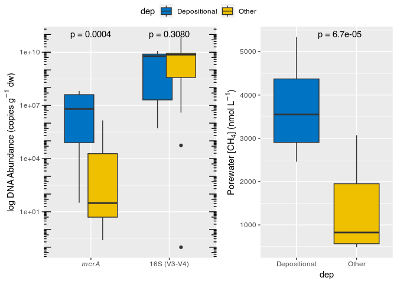<!-- -->

``` r
ggsave(path = "~/Documents/Postgrad/Figures/June_Methane/draft2", "CH4PCRplot.png", 
       width = 6, height = 7, device = 'png', dpi = 300)
```

#### 2

``` r
# Load the necessary libraries
library(tidyverse)
library(DescTools)
library(car)

# Select variables - uncomment last line to pull out only numeric vars
positions <- c(8:21, 24, 26:36)
numeric_vars <- metadata %>%
  filter(month == "june") %>%
  dplyr::select(positions) #%>%
```

    ## Warning: Using an external vector in selections was deprecated in tidyselect 1.1.0.
    ## ℹ Please use `all_of()` or `any_of()` instead.
    ##   # Was:
    ##   data %>% select(positions)
    ## 
    ##   # Now:
    ##   data %>% select(all_of(positions))
    ## 
    ## See <https://tidyselect.r-lib.org/reference/faq-external-vector.html>.
    ## This warning is displayed once every 8 hours.
    ## Call `lifecycle::last_lifecycle_warnings()` to see where this warning was
    ## generated.

``` r
  #select(where(is.numeric))

# Perform Kruskal-Wallis tests for each numeric variable between the two conditions of 'dep'
kruskal_test_results <- sapply(numeric_vars, function(x) {
  kruskal.test(x ~ numeric_vars$dep)$p.value
})

# Store the results in a data frame
kruskal_test_results_df <- data.frame(Variable = names(kruskal_test_results),
                                      P_Value = kruskal_test_results)

# Filter significant variables
# significance_level <- 0.05
significant_vars <- kruskal_test_results_df %>%
  #filter(P_Value < significance_level) %>%
  pull(Variable)

# Function to perform the Dunn test and return the adjusted p-value
dunn_test <- function(var_name, data, grouping_var, adjustment_method = "BH") {
  # Check if the variable is numeric
  is_numeric <- is.numeric(data[[var_name]])

  if (is_numeric) {
    # Remove rows with missing values
    test_data <- data %>%
      dplyr::select(!!sym(var_name), !!sym(grouping_var)) %>%
      na.omit()  # Remove rows with missing values

    # Perform the Dunn test
    test_result <- DescTools::DunnTest(test_data[[var_name]], g = as.factor(test_data[[grouping_var]]))

    # Extract the p-value matrix
    p_matrix <- test_result$pmat

    # Extract the p-value for the comparison
    comparison_p_value <- p_matrix[1, 2]

    # Adjust the p-value
    p_adjusted <- p.adjust(comparison_p_value, method = adjustment_method)
    p_adjusted  # Return the adjusted p-value for the comparison
  } else {
    NA  # Return NA for non-numeric variables
  }
}

# Perform the Dunn test for each significant variable
dunn_test_results <- sapply(significant_vars, function(x) {
  dunn_test(x, numeric_vars, "dep")
})

# Store the results in a data frame
dunn_test_results_df <- data.frame(Variable = names(dunn_test_results),
                                   Adjusted_P_Value = dunn_test_results)

# Filter significant variables based on adjusted p-values
# significant_vars_dunn <- dunn_test_results_df %>%
#   filter(Adjusted_P_Value < significance_level) %>%
#   pull(Variable)

# Convert the metadata data frame to long format for plotting
metadata_long <- numeric_vars %>%
  #dplyr::select(dep, any_of(significant_vars_dunn)) %>%
  pivot_longer(cols = -dep, names_to = "Variable", values_to = "Value") %>%
  left_join(dunn_test_results_df, by = "Variable") %>%
  mutate(Adjusted_P_Value_Label = paste0(" (p = ", round(Adjusted_P_Value, 6), ")"))

# Create a custom facet label function
custom_labeller <- function(labels) {
  p_values <- metadata_long %>% distinct(Variable, Adjusted_P_Value_Label) %>% deframe()
  paste(labels, p_values[labels])
}

# Create a facetted box plot for the significant variables after the Dunn test
sigvarsplot <- ggplot(metadata_long, aes(x = dep, y = Value, fill = dep)) +
  geom_boxplot() +
  facet_wrap(~ Variable, labeller = labeller(Variable = custom_labeller), ncol = 4, scales = "free_y") +
  labs(y = "Value") +
  theme_bw() +
  theme(legend.position = "none",
        strip.background = element_blank(),
        strip.text = element_text(size = 10)) + scale_fill_jco()

sigvarsplot
```

    ## Warning: Removed 14 rows containing non-finite values (`stat_boxplot()`).

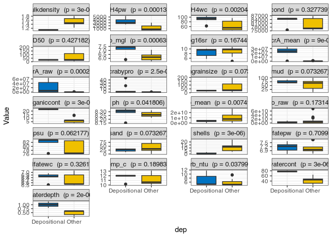<!-- -->

``` r
ggplot2::ggsave("metadataDunn.tiff",  path = "~/Documents/Postgrad/Figures/June_Methane/metadata/", dpi = 300)
```

    ## Warning: Removed 14 rows containing non-finite values (`stat_boxplot()`).

#### Metadata Corr Matrix

``` r
library(PerformanceAnalytics)

#make selected columns in metadata df into list
positions <- c(8:11, 13:21, 24, 27:28, 33:35)

#Use distinct to delete duplicate rows from DF
avgs <- metadata %>%
distinct(dep, site, .keep_all = TRUE) %>%
  dplyr::filter(month=="june")

metadata %>%
dplyr::filter(month=="june") %>%
dplyr::select(positions) %>%
chart.Correlation(histogram=TRUE, method = c("spearman"))
```

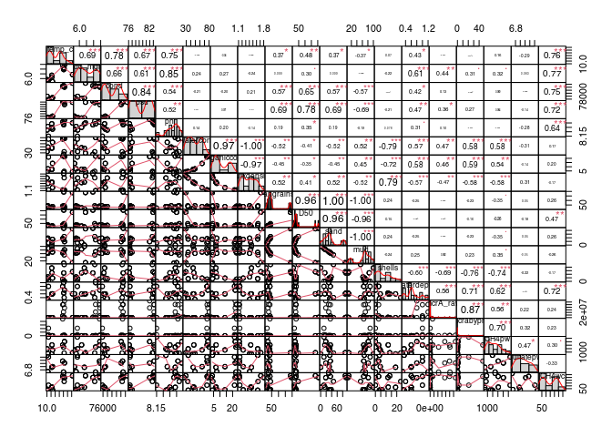<!-- -->

#### Mult regression to find drivers of CH4

``` r
library(glmnet)
library(mice)
library(relaimpo)

#Filter, select & uncomment to log transform numeric vars
filt <- metadata %>%
dplyr::filter(month=="june") %>%
#dplyr::mutate_if(is.numeric, log) %>%
   dplyr::select(-ruppia)
# #-Inf introduced, replace with 0
filt[filt == -Inf] <- 0
# #Pull out numvars
# nums <- unlist(lapply(log_transformed, is.numeric), use.names = FALSE)  
# num_log <- log_transformed[ , nums]

watercolmvars <- c("do_mgl", "psu", "Sulfatewc", "temp_c", "waterdepth", "turb_ntu", "CH4wc")

lassometa <- avgs %>%
  dplyr::filter(month=="june") %>%
  #select(any_of(significant_vars_dunn)) %>%
  dplyr::select(any_of(watercolmvars)) %>% na.omit()

#seperate response and predictor vars
response <- lassometa$CH4wc
predictors <- lassometa[, !colnames(lassometa) %in% "CH4wc"]

# to impute missing data - uncomment
# imputed_data <- mice(predictors, m = 5, maxit = 50, method = "pmm", seed = 500)
# complete_data <- complete(imputed_data, 1)
#
# imputed_data <- mice(response, m = 5, maxit = 50, method = "pmm", seed = 500)
# complete_data <- complete(imputed_data, 1)

scaled_predictors <- scale(predictors)

#LASSO regression
set.seed(3)
lasso_model <- glmnet(scaled_predictors, response, alpha = 1, family = "gaussian")
#choose optimal lambda by cross-validating
cv_lasso <- cv.glmnet(scaled_predictors, response, alpha = 1, nfolds = 10)
```

    ## Warning: Option grouped=FALSE enforced in cv.glmnet, since < 3 observations per
    ## fold

``` r
optimal_lambda <- cv_lasso$lambda.min
plot(cv_lasso$glmnet.fit, "lambda", label=FALSE)
```

<!-- -->

``` r
#obtain coefs
lasso_coef <- coef(lasso_model, s = optimal_lambda)
selected_var_names <- rownames(lasso_coef)[apply(lasso_coef != 0, 1, any)]
selected_var_names
```

    ## [1] "(Intercept)" "do_mgl"      "psu"         "temp_c"      "waterdepth"

``` r
#[1]"(Intercept)" "do_mgl"      "psu"         "temp_c"      "waterdepth" 

#Model selection WC vars
#stepwise with all water column variables (remove covariate vars)
full_model <- lm(CH4wc ~ waterdepth + psu, data = avgs)
# stepwise_model_wc <- step(full_model, direction = "both")
summary(full_model)
```

    ## 
    ## Call:
    ## lm(formula = CH4wc ~ waterdepth + psu, data = avgs)
    ## 
    ## Residuals:
    ##     Min      1Q  Median      3Q     Max 
    ## -9.4814 -2.5430  0.5091  2.5292  9.0356 
    ## 
    ## Coefficients:
    ##              Estimate Std. Error t value Pr(>|t|)    
    ## (Intercept) -371.3648    40.3786  -9.197 7.15e-06 ***
    ## waterdepth    25.6083     6.4005   4.001  0.00311 ** 
    ## psu            5.3432     0.5248  10.181 3.08e-06 ***
    ## ---
    ## Signif. codes:  0 '***' 0.001 '**' 0.01 '*' 0.05 '.' 0.1 ' ' 1
    ## 
    ## Residual standard error: 5.437 on 9 degrees of freedom
    ## Multiple R-squared:  0.9517, Adjusted R-squared:  0.941 
    ## F-statistic: 88.69 on 2 and 9 DF,  p-value: 1.195e-06

``` r
# Call:
# lm(formula = CH4wc ~ waterdepth + psu, data = avgs)
# 
# Residuals:
#     Min      1Q  Median      3Q     Max 
# -9.4814 -2.5430  0.5091  2.5292  9.0356 
# 
# Coefficients:
#              Estimate Std. Error t value Pr(>|t|)    
# (Intercept) -371.3648    40.3786  -9.197 7.15e-06 ***
# waterdepth    25.6083     6.4005   4.001  0.00311 ** 
# psu            5.3432     0.5248  10.181 3.08e-06 ***
# ---
# Signif. codes:  0 ‘***’ 0.001 ‘**’ 0.01 ‘*’ 0.05 ‘.’ 0.1 ‘ ’ 1
# 
# Residual standard error: 5.437 on 9 degrees of freedom
# Multiple R-squared:  0.9517,  Adjusted R-squared:  0.941 
# F-statistic: 88.69 on 2 and 9 DF,  p-value: 1.195e-06
# MODEL MEETS ASSUMPTIONS

#Partition predictors to determine relative importance
rel_imp <- calc.relimp(full_model, type = "lmg")
rel_imp_perc <- rel_imp$lmg * 100

rel_imp_perc
```

    ## waterdepth        psu 
    ##   24.07242   71.09886

``` r
# waterdepth        psu     temp_c     do_mgl 
#   16.70379   30.42382   27.92660   21.77781

avPlots(full_model)
```

<!-- -->

``` r
# Obtain the predicted values from the fitted model
predicted_values <- predict(full_model)

# Extract the observed values (actual CH4wc values) from the dataset
observed_values <- avgs$CH4wc

# Create the scatter plot of predicted vs. observed values
plot(observed_values, predicted_values, xlab = "Observed CH4wc", ylab = "Predicted CH4wc")

# Add the perfect fit line (45-degree line) to the plot
abline(a = 0, b = 1, col = "blue", lwd = 2)

# Add the model equation line (regression line) to the plot
fit_line <- lm(predicted_values ~ observed_values)
abline(fit_line, col = "red", lwd = 2)

# Extract the coefficients from the fitted line and calculate the adjusted R-squared value
fit_line_coeff <- coef(fit_line)
adj_r_squared <- summary(full_model)$adj.r.squared

# Create a character string for the line equation and adjusted R-squared value
line_eq <- paste("y = ", round(fit_line_coeff[1], 2), " + ", round(fit_line_coeff[2], 2), "x", sep = "")
adj_r2_text <- paste("Adjusted R^2 =", round(adj_r_squared, 3))

# Add the line equation and adjusted R-squared value as text to the plot
text(x = 43, y = 97, labels = adj_r2_text, pos = 4, cex = 0.8)

# Add a legend to the plot to distinguish the lines
legend("topleft", legend = c("Perfect Fit Line", "Model Equation Line (y = 2.27 + 0.97x)"), col = c("blue", "red"), lty = 1, cex = 0.8)
```

<!-- -->

``` r
####POREWATERCH4

#mgen/16s
metadata$mgenproppcr <- (metadata$mcrA_mean/metadata$pro_mean)*100
filt$mgenproppcr <- (filt$mcrA_mean/filt$pro_mean)*100

#######Uncomment for LASSO reression

sediment_vars <- c("organiccont", "mgenproppcr", "bulkdensity", "CH4pw", "Sulfatepw")

lassometa <- metadata %>%
  dplyr::filter(month=="june") %>%
  #select(any_of(significant_vars_dunn)) %>%
  dplyr::select(any_of(sediment_vars)) %>% na.omit()

#seperate response and predictor vars
shapiro.test(lassometa$CH4pw)
```

    ## 
    ##  Shapiro-Wilk normality test
    ## 
    ## data:  lassometa$CH4pw
    ## W = 0.91599, p-value = 0.05471

``` r
response <- lassometa$CH4pw
predictors <- lassometa[, !colnames(lassometa) %in% "CH4pw"]

# to impute missing data - uncomment
# imputed_data <- mice(predictors, m = 5, maxit = 50, method = "pmm", seed = 500)
# complete_data <- complete(imputed_data, 1)
#
# imputed_data <- mice(response, m = 5, maxit = 50, method = "pmm", seed = 500)
# complete_data <- complete(imputed_data, 1)

scaled_predictors <- scale(predictors)

#LASSO regression
set.seed(3)
lasso_model <- glmnet(scaled_predictors, response, alpha = 1, family = "gaussian")
#choose optimal lambda by cross-validating
cv_lasso <- cv.glmnet(scaled_predictors, response, alpha = 1, nfolds = 10)
```

    ## Warning: Option grouped=FALSE enforced in cv.glmnet, since < 3 observations per
    ## fold

``` r
optimal_lambda <- cv_lasso$lambda.min
plot(cv_lasso$glmnet.fit, "lambda", label=FALSE)
```

<!-- -->

``` r
#obtain coefs
lasso_coef <- coef(lasso_model, s = optimal_lambda)
selected_var_names <- rownames(lasso_coef)[apply(lasso_coef != 0, 1, any)]
selected_var_names
```

    ## [1] "(Intercept)" "organiccont" "mgenproppcr" "Sulfatepw"

``` r
#[1] "(Intercept)" "organiccont" "mgenproppcr" Sulfatepw"  

#Modelling pwCH4 with sediment vars
full_model_pw <- lm(CH4pw ~ organiccont + mgenproppcr + Sulfatepw, data = lassometa)
summary(full_model_pw)
```

    ## 
    ## Call:
    ## lm(formula = CH4pw ~ organiccont + mgenproppcr + Sulfatepw, data = lassometa)
    ## 
    ## Residuals:
    ##     Min      1Q  Median      3Q     Max 
    ## -590.51 -240.12   87.86  168.31  683.85 
    ## 
    ## Coefficients:
    ##              Estimate Std. Error t value Pr(>|t|)    
    ## (Intercept) -12161.43    1847.34  -6.583 2.66e-06 ***
    ## organiccont    130.19      11.81  11.024 1.07e-09 ***
    ## mgenproppcr     96.75      22.00   4.398 0.000309 ***
    ## Sulfatepw     1734.42     255.28   6.794 1.73e-06 ***
    ## ---
    ## Signif. codes:  0 '***' 0.001 '**' 0.01 '*' 0.05 '.' 0.1 ' ' 1
    ## 
    ## Residual standard error: 399.3 on 19 degrees of freedom
    ## Multiple R-squared:  0.9394, Adjusted R-squared:  0.9299 
    ## F-statistic: 98.21 on 3 and 19 DF,  p-value: 9.5e-12

``` r
# Call:
# lm(formula = CH4pw ~ organiccont + mgenproppcr + Sulfatepw, data = lassometa)
# 
# Residuals:
#     Min      1Q  Median      3Q     Max 
# -590.51 -240.12   87.86  168.31  683.85 
# 
# Coefficients:
#              Estimate Std. Error t value Pr(>|t|)    
# (Intercept) -12161.43    1847.34  -6.583 2.66e-06 ***
# organiccont    130.19      11.81  11.024 1.07e-09 ***
# mgenproppcr     96.75      22.00   4.398 0.000309 ***
# Sulfatepw     1734.42     255.28   6.794 1.73e-06 ***
# ---
# Signif. codes:  0 ‘***’ 0.001 ‘**’ 0.01 ‘*’ 0.05 ‘.’ 0.1 ‘ ’ 1
# 
# Residual standard error: 399.3 on 19 degrees of freedom
# Multiple R-squared:  0.9394,  Adjusted R-squared:  0.9299 
# F-statistic: 98.21 on 3 and 19 DF,  p-value: 9.5e-12
#MODEL MEETS ASSUMPTIONS

# Partition predictors to determine relative importance
rel_imp <- calc.relimp(full_model_pw, type = "lmg")
rel_imp_perc <- rel_imp$lmg * 100

rel_imp_perc
```

    ## organiccont mgenproppcr   Sulfatepw 
    ##    47.12476    26.20963    20.60766

``` r
# organiccont mgenproppcr   Sulfatepw 
#    47.12476    26.20963    20.60766 

avPlots(full_model_pw)
```

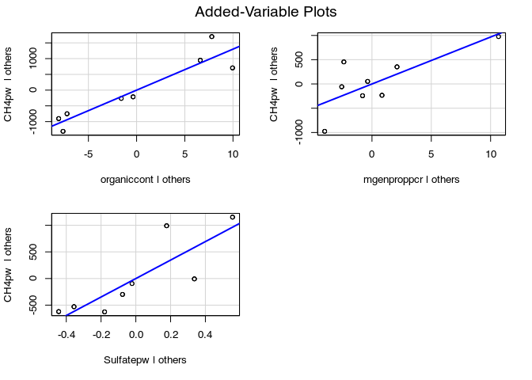<!-- -->

``` r
# Obtain the predicted values from the fitted model
predicted_values <- predict(full_model_pw)

# Extract the observed values (actual CH4wc values) from the dataset
observed_values <- lassometa$CH4pw

# Create the scatter plot of predicted vs. observed values
plot(observed_values, predicted_values, xlab = "Observed CH4pw", ylab = "Predicted CH4pw")

# Add the perfect fit line (45-degree line) to the plot
abline(a = 0, b = 1, col = "blue", lwd = 2)

# Add the model equation line (regression line) to the plot
fit_line <- lm(predicted_values ~ observed_values)
abline(fit_line, col = "red", lwd = 2)

# Extract the coefficients from the fitted line and calculate the adjusted R-squared value
fit_line_coeff <- coef(fit_line)
adj_r_squared <- summary(full_model_pw)$adj.r.squared

# Create a character string for the line equation and adjusted R-squared value
line_eq <- paste("y = ", round(fit_line_coeff[1], 2), " + ", round(fit_line_coeff[2], 2), "x", sep = "")
adj_r2_text <- paste("Adjusted R^2 =", round(adj_r_squared, 3))

# Add the line equation and adjusted R-squared value as text to the plot
text(x = 550, y = 4970, labels = adj_r2_text, pos = 4, cex = 0.8)

# Add a legend to the plot to distinguish the lines
legend("topleft", legend = c("Perfect Fit Line", "Model Equation Line (y = 140.28 + 0.94x)"), col = c("blue", "red"), lty = 1, cex = 0.8)
```

<!-- -->

``` r
#Selection with PW vars (inc)
# full_model_pw <- lm(CH4pw ~ mgenproppcr + Ass_sulfate_red + trehalose_biosynth + methanogenesis_methanol + methanogenesis_trimethylamine + methanogenesis_methylamine + methanogenesis_methylcomp + glycine_betaine_degradation + mgen_superpath + Acetatoclastic + Sulfatepw + organiccont + D50, data = metadata)
# stepwise_model_pw <- step(full_model_pw, direction = "both")
# summary(stepwise_model_pw)
# 
#  af <- anova(stepwise_model_pw)
#  afss <- af$"Sum Sq"
#  print(cbind(af,PctExp=afss/sum(afss)*100))


# Coefficients:
#                                 Estimate Std. Error
# (Intercept)                   -2.979e+04  4.695e+03
# trehalose_biosynth            -1.129e-01  5.614e-02
# methanogenesis_methanol        8.625e+00  1.633e+00
# methanogenesis_trimethylamine -4.135e-01  1.266e-01
# glycine_betaine_degradation    4.094e-01  1.102e-01
# Acetatoclastic                -3.716e-01  7.047e-02
# Sulfatepw                      4.153e+03  5.807e+02
# organiccont                    3.138e+02  4.004e+01
#                               t value Pr(>|t|)    
# (Intercept)                    -6.346 8.56e-07 ***
# trehalose_biosynth             -2.012 0.054328 .  
# methanogenesis_methanol         5.281 1.43e-05 ***
# methanogenesis_trimethylamine  -3.267 0.002958 ** 
# glycine_betaine_degradation     3.714 0.000939 ***
# Acetatoclastic                 -5.273 1.46e-05 ***
# Sulfatepw                       7.151 1.09e-07 ***
# organiccont                     7.835 2.00e-08 ***
# ---
# Signif. codes:  
# 0 ‘***’ 0.001 ‘**’ 0.01 ‘*’ 0.05 ‘.’ 0.1 ‘ ’ 1
# 
# Residual standard error: 910.2 on 27 degrees of freedom
#   (13 observations deleted due to missingness)
# Multiple R-squared:  0.8499,  Adjusted R-squared:  0.8109 
# F-statistic: 21.83 on 7 and 27 DF,  p-value: 1.428e-09

# model <- lm(mcrA_mean ~ waterdepth + organiccont, data = log_transformed)


# waterdepth covaries with orgcont
# mgs covaries with mud + sand
```

###### Pairwaise tests for Table 1

``` r
#Summary stats
ch4pw_summary <- metad %>% 
  group_by(dep) %>%   
  dplyr::summarise(mean_ch4pw = mean(CH4pw, na.rm = TRUE),  
                   sd_ch4pw = sd(CH4pw, na.rm = TRUE), 
                   n_ch4pw = sum(!is.na(CH4pw)),  
                   SE_ch4pw = sd(CH4pw, na.rm = TRUE)/sqrt(sum(!is.na(CH4pw))))

ch4wc_summary <- metad %>% 
  group_by(dep) %>%   
  dplyr::summarise(mean_ch4wc = mean(CH4wc, na.rm = TRUE),  
                   sd_ch4wc = sd(CH4wc, na.rm = TRUE), 
                   n_ch4wc = sum(!is.na(CH4wc)),  
                   SE_ch4wc = sd(CH4wc, na.rm = TRUE)/sqrt(sum(!is.na(CH4wc))))

mcra_summary <- metad %>% 
  group_by(dep) %>%   
  dplyr::summarise(mean_mcra = mean(mcrA_raw, na.rm = TRUE),  
                   sd_mcra = sd(mcrA_raw, na.rm = TRUE), 
                   n_mcra = sum(!is.na(mcrA_raw)),  
                   SE_mcra = sd(mcrA_raw, na.rm = TRUE)/sqrt(sum(!is.na(mcrA_raw))))

pro_summary <- metad %>% 
  group_by(dep) %>%   
  dplyr::summarise(mean_pro = mean(pro_raw, na.rm = TRUE),  
                   sd_pro = sd(pro_raw, na.rm = TRUE), 
                   n_pro = sum(!is.na(pro_raw)),  
                   SE_pro = sd(pro_raw, na.rm = TRUE)/sqrt(sum(!is.na(pro_raw))))

ch4pw_summary
```

    ## # A tibble: 2 × 5
    ##   dep          mean_ch4pw sd_ch4pw n_ch4pw SE_ch4pw
    ##   <chr>             <dbl>    <dbl>   <int>    <dbl>
    ## 1 Depositional      3579.    1069.      11     322.
    ## 2 Other             1352.     914.      20     204.

``` r
ch4wc_summary
```

    ## # A tibble: 2 × 5
    ##   dep          mean_ch4wc sd_ch4wc n_ch4wc SE_ch4wc
    ##   <chr>             <dbl>    <dbl>   <int>    <dbl>
    ## 1 Depositional       89.9     14.9      11     4.49
    ## 2 Other              63.1     20.1      23     4.19

``` r
mcra_summary
```

    ## # A tibble: 2 × 5
    ##   dep          mean_mcra   sd_mcra n_mcra  SE_mcra
    ##   <chr>            <dbl>     <dbl>  <int>    <dbl>
    ## 1 Depositional 21540589. 24634978.     11 7427725.
    ## 2 Other          159729.   410876.     23   85673.

``` r
pro_summary
```

    ## # A tibble: 2 × 5
    ##   dep              mean_pro       sd_pro n_pro      SE_pro
    ##   <chr>               <dbl>        <dbl> <int>       <dbl>
    ## 1 Depositional  3548130636.  3937953242.    11 1187337577.
    ## 2 Other        10203065017. 15953121455.    23 3326455773.

``` r
#KWtests
kwmcraraw <- kruskal.test(metadata$mcrA_raw ~ metadata$dep)
kwproraw <- kruskal.test(metadata$pro_raw ~ metadata$dep)
kwpw <- kruskal.test(metadata$CH4pw ~ metadata$dep)
kwwc <- kruskal.test(metadata$CH4wc ~ metadata$dep)

kwmcraraw
```

    ## 
    ##  Kruskal-Wallis rank sum test
    ## 
    ## data:  metadata$mcrA_raw by metadata$dep
    ## Kruskal-Wallis chi-squared = 14.359, df = 1, p-value = 0.000151

``` r
kwproraw
```

    ## 
    ##  Kruskal-Wallis rank sum test
    ## 
    ## data:  metadata$pro_raw by metadata$dep
    ## Kruskal-Wallis chi-squared = 1.0394, df = 1, p-value = 0.308

``` r
kwpw
```

    ## 
    ##  Kruskal-Wallis rank sum test
    ## 
    ## data:  metadata$CH4pw by metadata$dep
    ## Kruskal-Wallis chi-squared = 15.883, df = 1, p-value = 6.738e-05

``` r
kwwc
```

    ## 
    ##  Kruskal-Wallis rank sum test
    ## 
    ## data:  metadata$CH4wc by metadata$dep
    ## Kruskal-Wallis chi-squared = 9.1993, df = 1, p-value = 0.002421

``` r
# Collect p-values into a vector
p_values <- c(kwmcraraw$p.value, kwproraw$p.value, kwpw$p.value, kwwc$p.value)

# Adjust p-values using FDR method
adjusted_p_values <- p.adjust(p_values, method = "fdr")

# Create a named vector for better identification
names(adjusted_p_values) <- c("kwmcraraw", "kwproraw", "kwpw", "kwwc")

# Print or store the adjusted p-values
print(adjusted_p_values)
```

    ##    kwmcraraw     kwproraw         kwpw         kwwc 
    ## 0.0003020975 0.3079530455 0.0002695262 0.0032281325

#### Create Phyloseq Object

``` r
phyloseq2021 <- qza_to_phyloseq(
  features = "~/Documents/Postgrad/Data/PhoenixOutputs/coorong16sanalysis_2021/table-240.qza", 
  tree = "~/Documents/Postgrad/Data/PhoenixOutputs/coorong16sanalysis_2021/rooted-tree.qza", 
  taxonomy = "~/Documents/Postgrad/Data/PhoenixOutputs/coorong16sanalysis_2021/taxonomy-240.qza", 
  metadata = "~/Documents/Postgrad/Data/PhoenixOutputs/coorong16sanalysis_2021/sample-metadata.tsv")
phyloseq2021
```

    ## phyloseq-class experiment-level object
    ## otu_table()   OTU Table:         [ 18442 taxa and 48 samples ]
    ## sample_data() Sample Data:       [ 48 samples by 47 sample variables ]
    ## tax_table()   Taxonomy Table:    [ 18442 taxa by 7 taxonomic ranks ]
    ## phy_tree()    Phylogenetic Tree: [ 18442 tips and 18401 internal nodes ]

#### Decontam

``` r
#inspect lib size
df <- as.data.frame(sample_data(phyloseq2021)) # Put sample_data into a ggplot-friendly data.frame
df$LibrarySize <- sample_sums(phyloseq2021)
df <- df[order(df$LibrarySize),]
df$Index <- seq(nrow(df))
contamplot <- ggplot(data=df, aes(x=Index, y=LibrarySize, color=ctrl)) + geom_point()

contamplot
```

<!-- -->

``` r
#Using qPCR of 16SV3_V4 to provide frequency backgrounds
contamdf.freq <- isContaminant(phyloseq2021, method="combined", conc="pro_raw", neg ="is.neg")

table(contamdf.freq$contaminant)
```

    ## 
    ## FALSE  TRUE 
    ## 18432    10

``` r
#10 contams discovered by decontam

ps.pa <- transform_sample_counts(phyloseq2021, function(abund) 1*(abund>0))
ps.pa.neg <- prune_samples(sample_data(ps.pa)$ctrl == "blank", ps.pa)
ps.pa.pos <- prune_samples(sample_data(ps.pa)$ctrl != "blank", ps.pa)
# Make data.frame of prevalence in positive and negative samples
df.pa <- data.frame(pa.pos=taxa_sums(ps.pa.pos), pa.neg=taxa_sums(ps.pa.neg),
                      contaminant=contamdf.freq$contaminant)
ggplot(data=df.pa, aes(x=pa.neg, y=pa.pos, color=contaminant)) + geom_point() +
  xlab("Prevalence (Negative Controls)") + ylab("Prevalence (True Samples)")
```

<!-- -->

``` r
ps <- prune_taxa(!contamdf.freq$contaminant, phyloseq2021)
ps
```

    ## phyloseq-class experiment-level object
    ## otu_table()   OTU Table:         [ 18432 taxa and 48 samples ]
    ## sample_data() Sample Data:       [ 48 samples by 47 sample variables ]
    ## tax_table()   Taxonomy Table:    [ 18432 taxa by 7 taxonomic ranks ]
    ## phy_tree()    Phylogenetic Tree: [ 18432 tips and 18391 internal nodes ]

``` r
#10 contaminant taxa removed
```

### Data Summarisation

#### Sample sequencing depths

``` r
primsample_sum_df <- data.frame(
  sum = sample_sums(ps))

cs2 <- ggplot(primsample_sum_df, 
       aes(x = sum)) + 
  geom_bar(
    color = "black", 
    fill = "grey", 
    binwidth = 2500) +
  ggtitle("Distribution of sample sequencing depth") + 
  xlab("Read counts") +
  theme(
    axis.title.y = element_blank())

print(cs2)
```

<!-- -->

#### Sample read count stats

``` r
psmin <- min(
  sample_sums(phyloseq2021))
psmean <- mean(
  sample_sums(phyloseq2021))
psmax <- max(
  sample_sums(phyloseq2021))

psmin  
```

    ## [1] 23226

``` r
psmean
```

    ## [1] 51663.27

``` r
psmax
```

    ## [1] 77415

``` r
#after decontam
psmin <- min(
  sample_sums(ps))
psmean <- mean(
  sample_sums(ps))
psmax <- max(
  sample_sums(ps))

psmin
```

    ## [1] 23213

``` r
psmean
```

    ## [1] 51656.94

``` r
psmax
```

    ## [1] 77415

#### Table S1

``` r
#make selected columns in metadata df into list
positions <- c(8:11, 13:21, 24, 27, 32:36)

#Use distinct to delete duplicate rows from DF
avgs <- metadata %>%
distinct(dep, site, .keep_all = TRUE) %>%
  dplyr::filter(month=="june")
```

#### Clean taxa & subset into seperate Phyloseq objects

``` r
tax_table(ps)[tax_table(ps) == "uncultured"] <- ""
tax_table(ps)[tax_table(ps) == "uncultured archaeon"] <- ""
tax_table(ps)[tax_table(ps) == "uncultured euryarchaeote"] <- ""
tax_table(ps)[tax_table(ps) == "uncultured crenarchaeote"] <- ""
tax_table(ps)[tax_table(ps) == "uncultured archaeon 20c-10"] <- ""
tax_table(ps)[tax_table(ps) == "candidate divison MSBL1 archaeon SCGC-AAA382N08"] <- ""
tax_table(ps)[tax_table(ps) == "uncultured haloarchaeon"] <- ""
tax_table(ps)[tax_table(ps) == "uncultured Halobacteriales archaeon"] <- ""
tax_table(ps)[tax_table(ps) == "uncultured archaeon 2MT16"] <- ""
tax_table(ps)[tax_table(ps) == "uncultured Methanosarcinales archaeon"] <- ""
tax_table(ps)[tax_table(ps) == "uncultured archaeon VC2.1 Arc6"] <- ""
tax_table(ps)[tax_table(ps) == "uncultured Thermoplasmatales archaeon"] <- ""
tax_table(ps)[tax_table(ps) == "uncultured Thermoplasmata archaeon"] <- ""
tax_table(ps)[tax_table(ps) == "unidentified archaeon"] <- ""
tax_table(ps)[tax_table(ps) == "unidentified marine bacterioplankton"] <- ""
tax_table(ps)[tax_table(ps) == "uncultured archaeon 20c-39"] <- ""
tax_table(ps)[tax_table(ps) == "uncultured archeon 'KTK 4A'"] <- ""
tax_table(ps)[tax_table(ps) == "uncultured sediment archaeon"] <- ""
tax_table(ps)[tax_table(ps) == "uncultured archaeon 19b-26"] <- ""
tax_table(ps)[tax_table(ps) == "uncultured archaeon 20c-52"] <- ""
tax_table(ps)[tax_table(ps) == "uncultured archaeon TA1f2"] <- ""
tax_table(ps)[tax_table(ps) == "uncultured eukaryote"] <- ""
tax_table(ps)[tax_table(ps) == "uncultured archaeon 19a-29"] <- ""
tax_table(ps)[tax_table(ps) == "uncultured archaeon 19b-39"] <- ""
tax_table(ps)[tax_table(ps) == "uncultured euryarchaeote VAL31-1"] <- ""
tax_table(ps)[tax_table(ps) == "uncultured bacterium"] <- ""
tax_table(ps)[tax_table(ps) == "uncultured Firmicutes bacterium"] <- ""
tax_table(ps)[tax_table(ps) == "uncultured microorganism"] <- ""
tax_table(ps)[tax_table(ps) == "uncultured Chloroflexi bacterium"] <- ""
tax_table(ps)[tax_table(ps) == "uncultured Aminicenantes bacterium"] <- ""
tax_table(ps)[tax_table(ps) == "uncultured sediment bacterium"] <- ""
tax_table(ps)[tax_table(ps) == "uncultured proteobacterium"] <- ""
tax_table(ps)[tax_table(ps) == "uncultured spirochete"] <- ""
tax_table(ps)[tax_table(ps) == "uncultured cyanobacterium"] <- ""
tax_table(ps)[tax_table(ps) == "possible genus 03"] <- ""
tax_table(ps)[tax_table(ps) == "uncultured soil bacterium"] <- ""
tax_table(ps)[tax_table(ps) == "uncultured candidate division SR1 bacterium"] <- ""
tax_table(ps)[tax_table(ps) == "uncultured marine bacterium"] <- ""
tax_table(ps)[tax_table(ps) == "uncultured candidate division WS6 bacterium"] <- ""
tax_table(ps)[tax_table(ps) == "uncultured anaerobic bacterium"] <- ""
tax_table(ps)[tax_table(ps) == "uncultured deep-sea bacterium"] <- ""
tax_table(ps)[tax_table(ps) == "uncultured Flavobacterium sp."] <- ""
tax_table(ps)[tax_table(ps) == "uncultured Microgenomates group bacterium"] <- ""
tax_table(ps)[tax_table(ps) == "uncultured KB1 group bacterium"] <- ""
tax_table(ps)[tax_table(ps) == "uncultured Dehalococcoides sp."] <- ""
tax_table(ps)[tax_table(ps) == "uncultured Chlorobi bacterium"] <- ""
tax_table(ps)[tax_table(ps) == "uncultured delta proteobacterium"] <- ""
tax_table(ps)[tax_table(ps) == "uncultured prokaryote"] <- ""
tax_table(ps)[tax_table(ps) == "uncultured bacterium HF0500_03M05"] <- ""
tax_table(ps)[tax_table(ps) == "uncultured Candidatus Gracilibacteria bacterium"] <- ""
tax_table(ps)[tax_table(ps) == "uncultured Parcubacteria group bacterium"] <- ""
tax_table(ps)[tax_table(ps) == "uncultured Dehalococcoidia bacterium"] <- ""
tax_table(ps)[tax_table(ps) == "uncultured Anaerolineae bacterium"] <- ""
tax_table(ps)[tax_table(ps) == "uncultured Actinomycetales bacterium"] <- ""
tax_table(ps)[tax_table(ps) == "uuncultured Clostridia bacterium"] <- ""
tax_table(ps)[tax_table(ps) == "uncultured Lentisphaerae bacterium"] <- ""
tax_table(ps)[tax_table(ps) == "uncultured actinomycete"] <- ""
tax_table(ps)[tax_table(ps) == "uncultured soil bacterium PBS-III-18"] <- ""
tax_table(ps)[tax_table(ps) == "uncultured candidate division BRC1 bacterium"] <- ""
tax_table(ps)[tax_table(ps) == "uncultured soil bacterium PBS-III-4"] <- ""
tax_table(ps)[tax_table(ps) == "uncultured actinobacterium"] <- ""
tax_table(ps)[tax_table(ps) == "uncultured Latescibacteria bacterium"] <- "Latescibacteria"
tax_table(ps)[tax_table(ps) == "uncultured bacterium mle1-16"] <- ""
tax_table(ps)[tax_table(ps) == "uncultured soil bacterium PBS-III-30"] <- ""
tax_table(ps)[tax_table(ps) == "uncultured Verrucomicrobia bacterium"] <- ""
tax_table(ps)[tax_table(ps) == "uncultured Acidobacteria bacterium"] <- ""
tax_table(ps)[tax_table(ps) == "uncultured Omnitrophica bacterium"] <- ""
tax_table(ps)[tax_table(ps) == "uncultured Kiritimatiellaeota bacterium"] <- ""
tax_table(ps)[tax_table(ps) == "uncultured Verrucomicrobium sp."] <- ""
tax_table(ps)[tax_table(ps) == "uncultured planctomycete"] <- ""
tax_table(ps)[tax_table(ps) == "uncultured Planctomyces sp."] <- ""
tax_table(ps)[tax_table(ps) == "uncultured Planctomycetales bacterium"] <- ""
tax_table(ps)[tax_table(ps) == "uncultured Deferribacteres bacterium"] <- ""
tax_table(ps)[tax_table(ps) == "uncultured Chitinivibrionia bacterium"] <- ""
tax_table(ps)[tax_table(ps) == "uncultured Caldithrix sp."] <- ""
tax_table(ps)[tax_table(ps) == "uncultured candidate division TA06 bacterium"] <- ""
tax_table(ps)[tax_table(ps) == "uncultured Clostridia bacterium"] <- ""
tax_table(ps)[tax_table(ps) == "uncultured verrucomicrobium DEV007"] <- ""
tax_table(ps)[tax_table(ps) == "uncultured Geobacter sp."] <- ""
tax_table(ps)[tax_table(ps) == "uncultured candidate division GN04 bacterium"] <- ""
tax_table(ps)[tax_table(ps) == "uncultured Ignavibacteriales bacterium"] <- ""
tax_table(ps)[tax_table(ps) == "uncultured Bacteroidetes bacterium"] <- ""
tax_table(ps)[tax_table(ps) == "uncultured Cytophagales bacterium"] <- ""
tax_table(ps)[tax_table(ps) == "uncultured Epsilonproteobacteria bacterium"] <- ""
tax_table(ps)[tax_table(ps) == "uncultured Bacteroidetes/Chlorobi group bacterium"] <- ""
tax_table(ps)[tax_table(ps) == "uncultured gamma proteobacterium"] <- ""
tax_table(ps)[tax_table(ps) == "uncultured Cytophaga sp."] <- ""
tax_table(ps)[tax_table(ps) == "uncultured candidate division KSB1 bacterium"] <- ""
tax_table(ps)[tax_table(ps) == "uncultured Bacteroidales bacterium"] <- ""
tax_table(ps)[tax_table(ps) == "uncultured Acidobacteriaceae bacterium"] <- ""
tax_table(ps)[tax_table(ps) == "uncultured Syntrophobacterales bacterium"] <- ""
tax_table(ps)[tax_table(ps) == "uncultured Actinobacteridae bacterium"] <- ""
tax_table(ps)[tax_table(ps) == "uncultured forest soil bacterium"] <- ""
tax_table(ps)[tax_table(ps) == "uncultured Gemmatimonadetes bacterium"] <- ""
tax_table(ps)[tax_table(ps) == "uncultured Gloeobacter sp."] <- ""
tax_table(ps)[tax_table(ps) == "uncultured low G+C Gram-positive bacterium"] <- ""
tax_table(ps)[tax_table(ps) == "uncultured alpha proteobacterium"] <- ""
tax_table(ps)[tax_table(ps) == "uncultured archaeon"] <- "uncultured bacterium zdt-33i5"
tax_table(ps)[tax_table(ps) == "uncultured Desulfuromonadales bacterium"] <- ""
tax_table(ps)[tax_table(ps) == "uncultured compost bacterium"] <- ""
tax_table(ps)[tax_table(ps) == "uncultured bacterium zdt-33i5"] <- ""
tax_table(ps)[tax_table(ps) == "uncultured Rickettsiales bacterium"] <- ""
tax_table(ps)[tax_table(ps) == "uncultured Ochrobactrum sp."] <- "Ochrobactrum"
tax_table(ps)[tax_table(ps) == "uncultured Rhizobiales bacterium"] <- ""
tax_table(ps)[tax_table(ps) == "uncultured Marinobacter sp."] <- ""
tax_table(ps)[tax_table(ps) == "uncultured candidate division GN06 bacterium"] <- ""
tax_table(ps)[tax_table(ps) == "Verruc-01"] <- ""
tax_table(ps)[tax_table(ps) == "Unknown Family"] <- ""
tax_table(ps)[tax_table(ps) == "uncultured bacterium GR-WP33-58"] <- ""
tax_table(ps)[tax_table(ps) == "uncultured Polyangiaceae bacterium"] <- ""
tax_table(ps)[tax_table(ps) == "uncultured Kofleriaceae bacterium"] <- ""
tax_table(ps)[tax_table(ps) == "uncultured eubacterium AB16"] <- ""
tax_table(ps)[tax_table(ps) == "uncultured Desulfobulbaceae bacterium"] <- ""
tax_table(ps)[tax_table(ps) == "uncultured Geobacteraceae bacterium"] <- ""
tax_table(ps)[tax_table(ps) == "uncultured Marinobacter sp."] <- ""
tax_table(ps)[tax_table(ps) == "metagenome"] <- ""
tax_table(ps)[tax_table(ps) == "marine metagenome"] <- ""
tax_table(ps)[tax_table(ps) == "hypersaline lake metagenome"] <- ""
tax_table(ps)[tax_table(ps) == "wastewater metagenome"] <- ""
tax_table(ps)[tax_table(ps) == "bioreactor metagenome"] <- ""
tax_table(ps)[tax_table(ps) == "umicrobial mat metagenome"] <- ""
tax_table(ps)[tax_table(ps) == "anaerobic digester metagenome"] <- ""
tax_table(ps)[tax_table(ps) == "hydrothermal vent metagenome"] <- ""
tax_table(ps)[tax_table(ps) == "Ambiguous_taxa"] <- ""
tax_table(ps)[tax_table(ps) == "uncultured archaeon"] <- ""
tax_table(ps)[tax_table(ps) == "uncultured organism"] <- ""

ps <- ps %>% subset_taxa( Family!= "Mitochondria" | is.na(Family) & Order!="Chloroplast" | is.na(Class) ) 


phylojune <- subset_samples(ps, month=="june")
phylofeb <- subset_samples(ps, month=="february")
phyloseq1 <- subset_samples(ps, site != "blank")

mean(sample_sums(phylojune)) #47944.03 ASVs
```

    ## [1] 47944.03

``` r
phylojune #16691 Taxa
```

    ## phyloseq-class experiment-level object
    ## otu_table()   OTU Table:         [ 16691 taxa and 34 samples ]
    ## sample_data() Sample Data:       [ 34 samples by 47 sample variables ]
    ## tax_table()   Taxonomy Table:    [ 16691 taxa by 7 taxonomic ranks ]
    ## phy_tree()    Phylogenetic Tree: [ 16691 tips and 16652 internal nodes ]

``` r
#Export .biom for picrust
#Filter ASVS with <5 reads, and not present in at least 2 samples
filter <- phyloseq::genefilter_sample(ps, filterfun_sample(function(x) x >= 5), A = 2)
pi_ps <- phyloseq::prune_taxa(filter, ps)
mean(sample_sums(pi_ps)) #46464.46 ASVs
```

    ## [1] 46464.46

``` r
pi_ps #5063 Taxa
```

    ## phyloseq-class experiment-level object
    ## otu_table()   OTU Table:         [ 5063 taxa and 48 samples ]
    ## sample_data() Sample Data:       [ 48 samples by 47 sample variables ]
    ## tax_table()   Taxonomy Table:    [ 5063 taxa by 7 taxonomic ranks ]
    ## phy_tree()    Phylogenetic Tree: [ 5063 tips and 5045 internal nodes ]

``` r
library(biomformat)
biom_pi <- make_biom(otu_table(pi_ps))
output_path <- "~/Documents/Postgrad/Data/Resuspension/PICRUST/biom_pi.biom"  # Set the output file path
write_biom(biom_pi, output_path)

# To get the rep-seqs (input for picrust2), rep-seqs.qza must be exported from qiime as follows:
#qiime tools export --input-path rep-seqs.qza  --output-path $
```

#### June Sample read count stats

``` r
junepsmin <- min(
  sample_sums(phylojune))
junepsmean <- mean(
  sample_sums(phylojune))
junepsmax <- max(
  sample_sums(phylojune))

junepsmin  
```

    ## [1] 22074

``` r
junepsmean
```

    ## [1] 47944.03

``` r
junepsmax
```

    ## [1] 69712

### Visualisations

#### New barplots - Arch

``` r
archaea21 <- subset_taxa(phyloseq1, Kingdom=="Archaea")
archaea21j <- subset_samples(archaea21, month=="june")
bact21 <- subset_taxa(phyloseq1, Kingdom=="Bacteria")
bact21j <- subset_samples(bact21, month=="june")

methano_orders <- c("Methanosarcinales", "Methanobacteriales", "Methanococcales", "Methanomicrobiales", "Methanofastidiosales", "Methanomassiliicoccales", "Methanopyrales", "Methanocellales")
methano_all <- subset_taxa(archaea21j, Order %in% methano_orders)

library(microbiomeutilities)
```

    ## Warning: replacing previous import 'ggplot2::alpha' by 'microbiome::alpha' when
    ## loading 'microbiomeutilities'

``` r
arch.bh <- format_to_besthit(archaea21j)

tax_table(arch.bh)[tax_table(arch.bh) == "c__Asgardaeota"] <- "p__Asgardaeota"
tax_table(arch.bh)[tax_table(arch.bh) == "c__Diapherotrites"] <- "p__Diapherotrites"
tax_table(arch.bh)[tax_table(arch.bh) == "c__Hadesarchaeaeota"] <- "p__Hadesarchaeaeota"
tax_table(arch.bh)[tax_table(arch.bh) == "c__Nanoarchaeaeota"] <- "p__Nanoarchaeaeota"
tax_table(arch.bh)[tax_table(arch.bh) == "c__Euryarchaeota"] <- "p__Euryarchaeota"
tax_table(arch.bh)[tax_table(arch.bh) == "c__Thaumarchaeota"] <- "p__Thaumarchaeota"


arch21_relabund <- transform_sample_counts(
  arch.bh, function(x) x/sum(x))                
arch21_agglom <- tax_glom(
  arch21_relabund, taxrank = 'Class')  
arch21_dat <- psmelt(arch21_agglom)   
arch21_dat$Order <- as.character(arch21_dat$Class)  

arch21_dat %>% group_by(Class, dep) %>% 
  summarize(Abundance = sum(Abundance)) -> plot_df

#Plot
archbar <- ggplot(plot_df, 
  aes(x = dep, 
      y = Abundance, fill = Class)
  ) +
  geom_bar(position = "fill", stat = "identity"
  ) + 
  theme(axis.title.y = element_blank(), legend.position = "top", 
       # legend.text = element_text(angle=45, hjust = 0),
      #  legend.key.height = unit(0.5, "cm"),
      # legend.key.width = unit(0.5, "cm")
  ) + 
  guides(fill = guide_legend(reverse = TRUE, 
       nrow = 5 ,direction = "horizontal")
  ) +
  labs(y = "Relative Archaeal Abundance") + scale_fill_igv() + scale_color_igv() + coord_flip() + 
  labs(fill="Archaeal Class")

ggsave(path = "~/Documents/Postgrad/Figures/June_Methane/draft2", "archbar.tiff", device = 'tiff', dpi = 300)

ggsave(path = "~/Documents/Postgrad/Figures/June_Methane/draft2", "archbar.png", width = 6, height = 7, device = 'png', dpi = 300)

print(archbar)
```

<!-- -->

#### New barplots - Bact

``` r
bact.bh <- format_to_besthit(bact21j)

tax_table(bact.bh)[tax_table(bact.bh) == "c__Latescibacteria"] <- "p__Latescibacteria"

bact21_relabund <- transform_sample_counts(
  bact.bh, function(x) x/sum(x))                
bact21_agglom <- tax_glom(
  bact21_relabund, taxrank = 'Class')  
bact21_dat <- psmelt(bact21_agglom)   
bact21_dat$Class <- as.character(bact21_dat$Class)  

prim_medians <- ddply(
  bact21_dat,  ~Class,
  function(x) c(median=median(x$Abundance)))    #calc median
prim_remainder <- prim_medians[
  prim_medians$median <= 0.005,]$Class          #find phyla <0.05% abundance
bact21_dat[bact21_dat$Class 
  %in% 
prim_remainder,]$Class <- 'Other Bacterial Classes (<0.5%)'    #Rename them!

bact21_dat %>% group_by(Class, dep) %>% 
  summarize(Abundance = sum(Abundance)) -> plot_df

#Plot
bactbar <- ggplot(plot_df, 
  aes(x = dep, 
      y = Abundance, fill = Class)
  ) +
  geom_bar(position = "fill", stat = "identity"
  ) + 
  theme(axis.title.y = element_blank(), legend.position = "top", 
       # legend.text = element_text(angle=45, hjust = 0),
      #  legend.key.height = unit(0.5, "cm"),
      # legend.key.width = unit(0.5, "cm")
  ) + 
  guides(fill = guide_legend(reverse = TRUE, 
       nrow = 3 ,direction = "horizontal")
  ) +
  labs(y = "Relative Bacterial Abundance") + scale_fill_igv() + scale_color_igv() + coord_flip() + 
  labs(fill="Bacterial Class")


ggsave(path = "~/Documents/Postgrad/Figures/June_Methane/draft2", "bactbar.tiff", 
       device = 'tiff', dpi = 300)
```

#### Kingdom level diffabund testing

``` r
king_agglom <- tax_glom(
  phyloseq1, taxrank = 'Kingdom')  
king_dat <- psmelt(king_agglom) 

##############################################
# Select variables 
kingabund <- king_dat %>%
  dplyr::select(Abundance, Kingdom, dep)

# Group the data and calculate mean abundance
mean_abundance <- kingabund %>%
  group_by(Kingdom, dep) %>%
  summarise(MeanAbundance = mean(Abundance, na.rm = TRUE))
# Function to perform the t-test for each Order
perform_t_test <- function(data, order_name) {
  depositional_data <- data %>% dplyr::filter(dep == "Depositional" & Kingdom == order_name) %>% pull(Abundance)
  other_data <- data %>% dplyr::filter(dep == "Other" & Kingdom == order_name) %>% pull(Abundance)
  
  t_test_result <- t.test(depositional_data, other_data)
  return(t_test_result)
}

unique_orders <- unique(kingabund$Kingdom)
# Perform the t-test for each Order and store the results
t_test_results <- lapply(unique_orders, function(order_name) perform_t_test(kingabund, order_name))
# Combine the results with the Order names
t_test_results_with_order <- setNames(t_test_results, unique_orders)

t_test_results_with_order
```

    ## $Bacteria
    ## 
    ##  Welch Two Sample t-test
    ## 
    ## data:  depositional_data and other_data
    ## t = -1.4246, df = 35.544, p-value = 0.163
    ## alternative hypothesis: true difference in means is not equal to 0
    ## 95 percent confidence interval:
    ##  -10785.75   1887.48
    ## sample estimates:
    ## mean of x mean of y 
    ##  39822.28  44271.41 
    ## 
    ## 
    ## $Archaea
    ## 
    ##  Welch Two Sample t-test
    ## 
    ## data:  depositional_data and other_data
    ## t = 4.9411, df = 29.526, p-value = 2.86e-05
    ## alternative hypothesis: true difference in means is not equal to 0
    ## 95 percent confidence interval:
    ##  3621.870 8731.092
    ## sample estimates:
    ## mean of x mean of y 
    ## 10221.722  4045.241 
    ## 
    ## 
    ## $Unassigned
    ## 
    ##  Welch Two Sample t-test
    ## 
    ## data:  depositional_data and other_data
    ## t = 0.88634, df = 17.558, p-value = 0.3874
    ## alternative hypothesis: true difference in means is not equal to 0
    ## 95 percent confidence interval:
    ##  -13.25907  32.55025
    ## sample estimates:
    ## mean of x mean of y 
    ## 11.611111  1.965517

``` r
#Bacteria 
#t = -1.9443
#df = 35.459
```

#### Subsets methanogen & Tax analyses

``` r
#ref = Ralph Conrad, Microbial Ecology of Methangens & Methanotrophs (2007)
#acetoclastic methanos = methanosarcina spp., methanosaeta spp.
#Hydrogenotrophs = methanosarcina spp., methanobrevibacterium, methanobacterium
#ref = Zhang et al., Genomic & transcriptomic insight into... (2020)
#class 1 = Methanococcales, methanopyrales & methanobacteriales
#class 2 = methanomicrobiales, methanocellales, methanosarcinales
#novel candidate orders = Methanofastidiosales, Methanomassiliicoccales

methano_orders <- c("Methanosarcinales", "Methanobacteriales",
"Methanococcales", "Methanomicrobiales",
"Methanofastidiosales", "Methanomassiliicoccales",
"Methanopyrales", "Methanocellales")
# methano_june <- subset_taxa(phylojune, Order %in% methano_orders)
# methano_june_merge <- subset_taxa(phylojunemerge, Order %in% methano_orders)

min(
  sample_sums(archaea21j))
```

    ## [1] 276

``` r
methano_scale <- rarefy_even_depth(
  physeq = archaea21j, sample.size = 370,
  trimOTUs = TRUE, rngseed = 1)                             #rarefy at depth of min sample count (determined above)
                               # seed set to 1 for reproducibility of employed subsampling
sample_sums(methano_scale)   
```

    ## T1D1_1 T1D1_2 T1D2_1 T1D2_2 T1D2_3 T1S1_1 T1S1_2 T1S1_3 T1S2_1 T1S2_3 T2D1_1 
    ##    370    370    370    370    370    370    370    370    370    370    370 
    ## T2D1_2 T2D1_3 T2D2_1 T2D2_2 T2D2_3 T2S1_1 T2S1_2 T2S1_3 T2S2_1 T2S2_2 T2S2_3 
    ##    370    370    370    370    370    370    370    370    370    370    370 
    ## T3D1_1 T3D1_2 T3D1_3 T3D2_1 T3D2_2 T3D2_3 T3S1_1 T3S1_2 T3S1_3 T3S2_2 T3S2_3 
    ##    370    370    370    370    370    370    370    370    370    370    370

``` r
#RELATIVE ABUNDANCE PLOTS
#get relative abundances in %
methano_abund <- transform_sample_counts(
  methano_scale, function(x) x/sum(x)*100)          

#need to get rid of NAs which were introduced to otu_table (unsure how phyloseq did that?)
otu_table(methano_abund)[is.na(otu_table(methano_abund))] <- 0

methano_agglom <- tax_glom(
methano_abund, taxrank = "Order")               #agglomerate @ Order level
methano_dat <- psmelt(methano_agglom)      #create data frame
cdata <- ddply(methano_dat, c("Replicate", "Order"), mutate,
N    = sum(!is.na(Abundance)),
mean = mean(Abundance, na.rm=TRUE),
sd   = sd(Abundance, na.rm=TRUE),
se   = sd / sqrt(N)
)
#Rows are duplicated (204 rows)
nrow(cdata)
```

    ## [1] 726

``` r
#Use distinct to delete duplicate rows from DF
# avgs <- cdata %>%
# distinct(Replicate, .keep_all = TRUE)
avgs
```

    ## # A tibble: 12 × 49
    ##    `sample-id` month ctrl  is.neg site  side  depth temp_c do_mgl  cond   psu
    ##    <chr>       <chr> <chr> <lgl>  <chr> <chr> <dbl>  <dbl>  <dbl> <dbl> <dbl>
    ##  1 T1D1_1      june  <NA>  FALSE  T1D1  W         2   10.2   5.86 75706  76.4
    ##  2 T1D2_1      june  <NA>  FALSE  T1D2  E         2   12.0   7.14 84963  83.2
    ##  3 T1S1_1      june  <NA>  FALSE  T1S1  W         1   10.0   5.88 77908  76.5
    ##  4 T1S2_1      june  <NA>  FALSE  T1S2  E         1   12.0   6.95 85011  83.4
    ##  5 T2D1_1      june  <NA>  FALSE  T2D1  W         2   10.6   6.35 76709  76.2
    ##  6 T2D2_1      june  <NA>  FALSE  T2D2  E         2   11.9   7.42 84743  83.2
    ##  7 T2S1_1      june  <NA>  FALSE  T2S1  W         1   10.1   5.77 75500  76.5
    ##  8 T2S2_1      june  <NA>  FALSE  T2S2  E         1   13.1   6.43 86804  82.9
    ##  9 T3D1_1      june  <NA>  FALSE  T3D1  W         2   10.6   6.16 76390  76.2
    ## 10 T3D2_1      june  <NA>  FALSE  T3D2  E         2   12.1   7.44 84097  82.0
    ## 11 T3S1_1      june  <NA>  FALSE  T3S1  W         1   10.7   5.66 77019  77.0
    ## 12 T3S2_2      june  <NA>  FALSE  T3S2  E         1   12.1   7.08 84558  82.7
    ## # ℹ 38 more variables: turb_ntu <dbl>, ph <dbl>, watercont <dbl>,
    ## #   organiccont <dbl>, bulkdensity <dbl>, meangrainsize <dbl>, D50 <dbl>,
    ## #   sand <dbl>, mud <dbl>, shells <dbl>, ruppia <dbl>, `Ruppia Presence` <chr>,
    ## #   waterdepth <dbl>, Replicate <chr>, dep <chr>, mcrA_raw <dbl>,
    ## #   mcrabypro <dbl>, mcrA_mean <dbl>, pro_raw <dbl>, log16sr <dbl>,
    ## #   pro_mean <dbl>, CH4pw <dbl>, Sulfatepw <dbl>, CH4wc <dbl>, Sulfatewc <dbl>,
    ## #   glycine_betaine_biosynth <dbl>, glycine_betaine_degradation <dbl>, …

``` r
#cdata <- ddply(methanotroph_dat, c("Replicate", "Order"), mutate,
#N    = sum(!is.na(Abundance)),
#mean = mean(Abundance, na.rm=TRUE),
#sd   = sd(Abundance, na.rm=TRUE),
#se   = sd / sqrt(N)
#)

# Barplot of Absolute counts (scaled to 100)
methano_agglom <- tax_glom(
methano_abund, taxrank = "Order")               #agglomerate @ Order level
methano_dat <- psmelt(methano_agglom)      #create data frame
cdata <- ddply(methano_dat, c("Replicate", "Order"), mutate,
N    = sum(!is.na(Abundance)),
mean = mean(Abundance, na.rm=TRUE),
sd   = sd(Abundance, na.rm=TRUE),
se   = sd / sqrt(N)
)

# methanobarrel <-  cdata %>%
# mutate(Replicate = fct_relevel(
#   Replicate, "West deep", "East deep",
#   "West shallow", "East shallow")) %>%
#   ggplot(aes(x = dep, y = mean, fill = Replicate)
# ) +
# geom_bar(position = position_dodge(width = 0.9), stat = "identity"
# ) +
# geom_errorbar(position = position_dodge(width = 0.9),
# aes(ymin=mean-se, ymax=mean+se), width = .2, alpha = 0.3
# ) +
# theme(axis.title.x = element_blank()
# ) +
# guides(fill = guide_legend(reverse = FALSE,
# keywidth = 1, keyheight = 1)
# ) +
# labs(y = expression(paste("Relative Abundance (Mean" %+-% "SEM)"))
# ) +
# scale_fill_manual(values = c("#a6cee3", "#b2df8a", "#fdbf6f", "#E31A1C" )
# ) +
# theme(axis.title.x = element_blank(), legend.title = element_blank(),
# axis.text.x = element_text(angle = 45, hjust = 1)) 
# 
# print(methanobarrel)

sig_arch <- c("Aenigmarchaeales", "archaeon GW2011_AR13", "Halobacteriales", "Methanofastidiosales", "Methanomassiliicoccales", "Methanosarcinales", "Methanomicrobiales", "SG8-5")

a <- cdata %>%
  #dplyr::filter(Order == sig_arch) %>%
ggplot(aes(x=dep, y=Abundance, fill = dep)
) +
geom_boxplot(
) +
#geom_line(aes(x=Replicate,y=mcrA_mean/0.3, colour = "grey90"), group = 1
#) +
#scale_y_continuous(limits = c(0,100), 
#          sec.axis = sec_axis(~(log10(.)),
#                              name = "mcrA Copies g ww")
#) +
theme(axis.title.x = element_blank(), legend.title = element_blank(),
axis.text.x = element_blank(), axis.ticks.x = element_blank()
) +
labs(y = expression(paste("% Abundance")) 
) +
scale_fill_manual(values = c("#a6cee3", "#b2df8a", "#fdbf6f", "#E31A1C" ))
 
lev <- levels(as.factor(a$data$dep)) # get the variables

# make a pairwise list that we want to compare.
L.pairs <- combn(seq_along(lev), 2, simplify = FALSE, 
                 FUN = function(i) lev[i])

#Facet taxa and add KW significance for site differences
methanoboxes <- a + facet_wrap(Order~.,ncol=3) +
stat_compare_means(label = "p.signif", 
                   label.y = 30, 
                   inherit.aes = F, 
                   comparisons = L.pairs)

methanoboxes
```

<!-- -->

``` r
###############################################
# Select variables 
archabund <- methano_dat %>%
  dplyr::select(Abundance, Order, dep)

# Group the data and calculate mean abundance
mean_abundance <- archabund %>%
  group_by(Order, dep) %>%
  summarise(MeanAbundance = mean(Abundance, na.rm = TRUE))
# Function to perform the t-test for each Order
perform_t_test <- function(data, order_name) {
  depositional_data <- data %>% filter(dep == "Depositional" & Order == order_name) %>% pull(Abundance)
  other_data <- data %>% filter(dep == "Other" & Order == order_name) %>% pull(Abundance)
  
  t_test_result <- t.test(depositional_data, other_data)
  return(t_test_result)
}


# Extract unique Orders from the dataset
unique_orders <- unique(archabund$Order)

# Perform the t-test for each Order and store the results
t_test_results <- lapply(unique_orders, function(order_name) perform_t_test(archabund, order_name))

# Combine the results with the Order names
t_test_results_with_order <- setNames(t_test_results, unique_orders)

# Print the results
print(t_test_results_with_order)
```

    ## $`Marine Benthic Group D and DHVEG-1`
    ## 
    ##  Welch Two Sample t-test
    ## 
    ## data:  depositional_data and other_data
    ## t = 0.65745, df = 15.419, p-value = 0.5206
    ## alternative hypothesis: true difference in means is not equal to 0
    ## 95 percent confidence interval:
    ##  -4.776071  9.051256
    ## sample estimates:
    ## mean of x mean of y 
    ##  29.50860  27.37101 
    ## 
    ## 
    ## $Halobacteriales
    ## 
    ##  Welch Two Sample t-test
    ## 
    ## data:  depositional_data and other_data
    ## t = 2.2548, df = 14.624, p-value = 0.03994
    ## alternative hypothesis: true difference in means is not equal to 0
    ## 95 percent confidence interval:
    ##   0.4200098 15.5505061
    ## sample estimates:
    ## mean of x mean of y 
    ## 17.051597  9.066339 
    ## 
    ## 
    ## $Methanofastidiosales
    ## 
    ##  Welch Two Sample t-test
    ## 
    ## data:  depositional_data and other_data
    ## t = 1.9384, df = 30.809, p-value = 0.06178
    ## alternative hypothesis: true difference in means is not equal to 0
    ## 95 percent confidence interval:
    ##  -0.06569022  2.57183272
    ## sample estimates:
    ## mean of x mean of y 
    ##  3.587224  2.334152 
    ## 
    ## 
    ## $`Candidatus Diapherotrites archaeon ADurb.Bin253`
    ## 
    ##  Welch Two Sample t-test
    ## 
    ## data:  depositional_data and other_data
    ## t = -2.1807, df = 24.47, p-value = 0.03904
    ## alternative hypothesis: true difference in means is not equal to 0
    ## 95 percent confidence interval:
    ##  -2.03149884 -0.05695325
    ## sample estimates:
    ## mean of x mean of y 
    ## 0.5405405 1.5847666 
    ## 
    ## 
    ## $Methanosarcinales
    ## 
    ##  Welch Two Sample t-test
    ## 
    ## data:  depositional_data and other_data
    ## t = -0.029858, df = 29.222, p-value = 0.9764
    ## alternative hypothesis: true difference in means is not equal to 0
    ## 95 percent confidence interval:
    ##  -0.8535204  0.8289503
    ## sample estimates:
    ## mean of x mean of y 
    ##  1.400491  1.412776 
    ## 
    ## 
    ## $`archaeon GW2011_AR13`
    ## 
    ##  Welch Two Sample t-test
    ## 
    ## data:  depositional_data and other_data
    ## t = 1.6422, df = 14.351, p-value = 0.1223
    ## alternative hypothesis: true difference in means is not equal to 0
    ## 95 percent confidence interval:
    ##  -0.2159174  1.6409789
    ## sample estimates:
    ## mean of x mean of y 
    ##  1.965602  1.253071 
    ## 
    ## 
    ## $Aenigmarchaeales
    ## 
    ##  Welch Two Sample t-test
    ## 
    ## data:  depositional_data and other_data
    ## t = 1.2907, df = 13.867, p-value = 0.2179
    ## alternative hypothesis: true difference in means is not equal to 0
    ## 95 percent confidence interval:
    ##  -0.3911053  1.5704665
    ## sample estimates:
    ## mean of x mean of y 
    ## 1.2039312 0.6142506 
    ## 
    ## 
    ## $`Deep Sea Euryarchaeotic Group(DSEG)`
    ## 
    ##  Welch Two Sample t-test
    ## 
    ## data:  depositional_data and other_data
    ## t = -1.5131, df = 27.698, p-value = 0.1416
    ## alternative hypothesis: true difference in means is not equal to 0
    ## 95 percent confidence interval:
    ##  -0.7231190  0.1088684
    ## sample estimates:
    ## mean of x mean of y 
    ## 0.2702703 0.5773956 
    ## 
    ## 
    ## $`Desulfobacteraceae bacterium 4572_19`
    ## 
    ##  Welch Two Sample t-test
    ## 
    ## data:  depositional_data and other_data
    ## t = -0.90571, df = 26.552, p-value = 0.3732
    ## alternative hypothesis: true difference in means is not equal to 0
    ## 95 percent confidence interval:
    ##  -0.4013791  0.1556789
    ## sample estimates:
    ##  mean of x  mean of y 
    ## 0.04914005 0.17199017 
    ## 
    ## 
    ## $`Marine Group III`
    ## 
    ##  Welch Two Sample t-test
    ## 
    ## data:  depositional_data and other_data
    ## t = -1.0583, df = 30.462, p-value = 0.2982
    ## alternative hypothesis: true difference in means is not equal to 0
    ## 95 percent confidence interval:
    ##  -0.6835739  0.2167435
    ## sample estimates:
    ## mean of x mean of y 
    ## 0.4668305 0.7002457 
    ## 
    ## 
    ## $`SG8-5`
    ## 
    ##  Welch Two Sample t-test
    ## 
    ## data:  depositional_data and other_data
    ## t = 2.221, df = 11.95, p-value = 0.04644
    ## alternative hypothesis: true difference in means is not equal to 0
    ## 95 percent confidence interval:
    ##  0.008660124 0.925000810
    ## sample estimates:
    ## mean of x mean of y 
    ## 0.6633907 0.1965602 
    ## 
    ## 
    ## $`Candidatus Staskawiczbacteria bacterium RIFOXYA2_FULL_32_7`
    ## 
    ##  Welch Two Sample t-test
    ## 
    ## data:  depositional_data and other_data
    ## t = -0.46113, df = 26.694, p-value = 0.6484
    ## alternative hypothesis: true difference in means is not equal to 0
    ## 95 percent confidence interval:
    ##  -0.3348895  0.2120394
    ## sample estimates:
    ## mean of x mean of y 
    ## 0.2211302 0.2825553 
    ## 
    ## 
    ## $`Candidatus Pacearchaeota archaeon CG1_02_32_21`
    ## 
    ##  Welch Two Sample t-test
    ## 
    ## data:  depositional_data and other_data
    ## t = 0.839, df = 11.509, p-value = 0.4186
    ## alternative hypothesis: true difference in means is not equal to 0
    ## 95 percent confidence interval:
    ##  -0.1383866  0.3103768
    ## sample estimates:
    ##  mean of x  mean of y 
    ## 0.12285012 0.03685504 
    ## 
    ## 
    ## $`Candidatus Amesbacteria bacterium GW2011_GWC1_47_15`
    ## 
    ##  Welch Two Sample t-test
    ## 
    ## data:  depositional_data and other_data
    ## t = 1.3976, df = 14.257, p-value = 0.1836
    ## alternative hypothesis: true difference in means is not equal to 0
    ## 95 percent confidence interval:
    ##  -0.09150245  0.43548279
    ## sample estimates:
    ##  mean of x  mean of y 
    ## 0.24570025 0.07371007 
    ## 
    ## 
    ## $Methanomassiliicoccales
    ## 
    ##  Welch Two Sample t-test
    ## 
    ## data:  depositional_data and other_data
    ## t = 1.0458, df = 16.331, p-value = 0.3109
    ## alternative hypothesis: true difference in means is not equal to 0
    ## 95 percent confidence interval:
    ##  -0.1006079  0.2971681
    ## sample estimates:
    ## mean of x mean of y 
    ## 0.1965602 0.0982801 
    ## 
    ## 
    ## $`Euryarchaeota archaeon SCGC AAA286-E23`
    ## 
    ##  Welch Two Sample t-test
    ## 
    ## data:  depositional_data and other_data
    ## t = -0.41421, df = 29.911, p-value = 0.6817
    ## alternative hypothesis: true difference in means is not equal to 0
    ## 95 percent confidence interval:
    ##  -0.1457287  0.0965886
    ## sample estimates:
    ##  mean of x  mean of y 
    ## 0.07371007 0.09828010 
    ## 
    ## 
    ## $`Candidatus Staskawiczbacteria bacterium RIFCSPHIGHO2_01_FULL_34_27`
    ## 
    ##  Welch Two Sample t-test
    ## 
    ## data:  depositional_data and other_data
    ## t = 1.0038, df = 14.975, p-value = 0.3314
    ## alternative hypothesis: true difference in means is not equal to 0
    ## 95 percent confidence interval:
    ##  -0.06901829  0.19186841
    ## sample estimates:
    ##  mean of x  mean of y 
    ## 0.09828010 0.03685504 
    ## 
    ## 
    ## $Methanomicrobiales
    ## 
    ##  Welch Two Sample t-test
    ## 
    ## data:  depositional_data and other_data
    ## t = -1.4491, df = 21, p-value = 0.1621
    ## alternative hypothesis: true difference in means is not equal to 0
    ## 95 percent confidence interval:
    ##  -0.05982973  0.01068968
    ## sample estimates:
    ##  mean of x  mean of y 
    ## 0.00000000 0.02457002 
    ## 
    ## 
    ## $`Candidatus Pacearchaeota archaeon CG1_02_31_27`
    ## 
    ##  Welch Two Sample t-test
    ## 
    ## data:  depositional_data and other_data
    ## t = -1, df = 21, p-value = 0.3287
    ## alternative hypothesis: true difference in means is not equal to 0
    ## 95 percent confidence interval:
    ##  -0.03783309  0.01326307
    ## sample estimates:
    ##  mean of x  mean of y 
    ## 0.00000000 0.01228501 
    ## 
    ## 
    ## $Nanohaloarchaeales
    ## 
    ##  Welch Two Sample t-test
    ## 
    ## data:  depositional_data and other_data
    ## t = 0.44721, df = 15.173, p-value = 0.661
    ## alternative hypothesis: true difference in means is not equal to 0
    ## 95 percent confidence interval:
    ##  -0.04620794  0.07077796
    ## sample estimates:
    ##  mean of x  mean of y 
    ## 0.02457002 0.01228501 
    ## 
    ## 
    ## $`Candidatus Heimdallarchaeota archaeon AB_125`
    ## 
    ##  Welch Two Sample t-test
    ## 
    ## data:  depositional_data and other_data
    ## t = -1, df = 21, p-value = 0.3287
    ## alternative hypothesis: true difference in means is not equal to 0
    ## 95 percent confidence interval:
    ##  -0.03783309  0.01326307
    ## sample estimates:
    ##  mean of x  mean of y 
    ## 0.00000000 0.01228501 
    ## 
    ## 
    ## $`Candidatus Pacearchaeota archaeon RBG_19FT_COMBO_34_9`
    ## 
    ##  Welch Two Sample t-test
    ## 
    ## data:  depositional_data and other_data
    ## t = -1, df = 21, p-value = 0.3287
    ## alternative hypothesis: true difference in means is not equal to 0
    ## 95 percent confidence interval:
    ##  -0.03783309  0.01326307
    ## sample estimates:
    ##  mean of x  mean of y 
    ## 0.00000000 0.01228501

``` r
# Extract p-values
p_values <- sapply(t_test_results_with_order, function(x) x$p.value)

# Create a data frame with Order names and p-values
plot_data <- data.frame(Order = names(p_values), P_Value = p_values)

# Add a column to indicate whether the p-value is statistically significant (p < 0.05)
plot_data$Significance <- ifelse(plot_data$P_Value < 0.05, "Significant", "Not Significant")

# Calculate mean abundance for each Order and category
mean_abundance <- archabund %>%
  group_by(Order, dep) %>%
  summarize(Mean_Abundance = mean(Abundance)) %>%
  ungroup()

# Add p-values to mean_abundance data frame
mean_abundance <- mean_abundance %>%
  mutate(P_Value = p_values[Order]) %>%
  mutate(Significance = ifelse(P_Value < 0.05, "Significant", "Not Significant"))

# Filter significant Orders and remove Orders with a mean abundance of zero in either dep category
significant_orders <- mean_abundance %>%
  group_by(Order) %>%
  filter(any(Significance == "Significant") & !any(Mean_Abundance == 0)) %>%
  ungroup()


# Function to convert p-values into symbols
p_value_symbol <- function(p_value) {
  if (p_value < 0.001) {
    return("***")
  } else if (p_value < 0.01) {
    return("**")
  } else if (p_value < 0.05) {
    return("*")
  } else {
    return("ns")
  }
}

# Create the plot
p <- ggplot(significant_orders, aes(x = reorder(Order, Mean_Abundance), y = Mean_Abundance, fill = dep)) +
  geom_bar(stat = "identity", position = "dodge", color = "black") +
  theme_bw() +
  theme(axis.title.y = element_blank(),
        axis.text.y = element_text(angle = 0, hjust = 1),
        legend.title = element_text(size = 16)) +
  ylab("Mean Relative Archaeal Abundance (%)") +
  scale_fill_manual(values = c("Depositional" = "#56B4E9", "Other" = "#D55E00"))+ coord_flip()

# Display the plot
print(p)
```

<!-- -->

``` r
ggplot2::ggsave("sigvariableArch.tiff",  path = "~/Documents/Postgrad/Figures/June_Methane/", dpi = 300)
```

#### Subsets Methanotroph & Taxa level analyses

``` r
#ref = Ralph Conrad, Microbial Ecology of Methangens & Methanotrophs (2007)
#Aerobic methanotrophs
## Type 1 = (Gammaproteobacteria, family Methylococcaceae genera):
## Methyloligellaceae ref - https://www.ncbi.nlm.nih.gov/pmc/articles/PMC8625253/
## Methylophilaceae involved in methane metabolism - https://www.frontiersin.org/articles/10.3389/fmicb.2017.02392/full
## Family Thiohalorhabaceae, Genus Methylohalomonas Isolated from hypersaline lakes in Russian steppe - https://www.microbiologyresearch.org/content/journal/ijsem/10.1099/ijs.0.64955-0
methanotroph_fam <- c("Beijerinckiaceae", "Methylacidiphilaceae", "Methyloligellaceae",
                      "Methylophagaceae", "Methylohalobiaceae")

methanotroph_june <- subset_taxa(phylojune, Family %in% methanotroph_fam)
# methanotroph_june_merge <- subset_taxa(phylojunemerge, Family %in% methanotroph_fam)

#get relative abundances in %
methanotroph_abund <- transform_sample_counts(
  methanotroph_june, function(x) x/sum(x)*100)          

#need to get rid of NAs which were introduced to otu_table (unsure how phyloseq did that?)
otu_table(methanotroph_abund)[is.na(otu_table(methanotroph_abund))] <- 0

methanotroph_agglom <- tax_glom(
methanotroph_abund, taxrank = "Family")               #agglomerate @ Fam level
methanotroph_dat <- psmelt(methanotroph_agglom)      #create data frame
cdata <- ddply(methanotroph_dat, c("Replicate", "Family"), mutate,
N    = sum(!is.na(Abundance)),
mean = mean(Abundance, na.rm=TRUE),
sd   = sd(Abundance, na.rm=TRUE),
se   = sd / sqrt(N)
)
#Rows are duplicated (170 rows)
nrow(cdata)
```

    ## [1] 170

``` r
#Use distinct to delete duplicate rows from DF
#avgs <- cdata %>%
#distinct(Replicate, Order, .keep_all = TRUE)
#avgs
#cdata <- ddply(methanotroph_dat, c("Replicate", "Order"), mutate,
#N    = sum(!is.na(Abundance)),
#mean = mean(Abundance, na.rm=TRUE),
#sd   = sd(Abundance, na.rm=TRUE),
#se   = sd / sqrt(N)
#)

# Barplot
methanotrophbarrel <- cdata %>%
mutate(Replicate = fct_relevel(Replicate, "West deep", "East deep",
"West shallow", "East shallow")) %>%
  ggplot(aes(x = Family, y = mean, fill = dep)
) +
geom_bar(position = position_dodge(width = 0.9), stat = "identity"
) +
geom_errorbar(position = position_dodge(width = 0.9),
aes(ymin=mean-se, ymax=mean+se), width = .2, alpha = 0.3
) +
theme(axis.title.x = element_blank()
) +
guides(fill = guide_legend(reverse = FALSE,
keywidth = 1, keyheight = 1)
) +
labs(y = expression(paste("Absolute ASV Count (Mean" %+-% "SEM)"))
) +
scale_fill_manual(values = c("#a6cee3", "#b2df8a", "#fdbf6f", "#E31A1C" )
) +
theme(axis.title.x = element_blank(), legend.title = element_blank(),
axis.text.x = element_text(angle = 45, hjust = 1))

print(methanotrophbarrel)
```

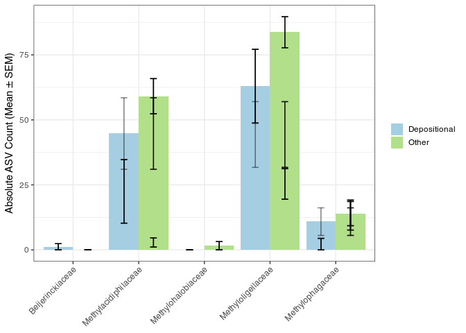<!-- -->

``` r
a <- cdata %>%
mutate(Replicate = fct_relevel(Replicate, "West deep", "East deep",
"West shallow", "East shallow")) %>%
ggplot(aes(dep, Abundance, fill = dep)
) +
geom_boxplot(
) +
theme(axis.title.x = element_blank(), legend.title = element_blank(),
axis.text.x = element_blank(), axis.ticks.x = element_blank()
) +
labs(y = expression(paste("% Abundance"))
) +
scale_fill_manual(values = c("#a6cee3", "#b2df8a", "#fdbf6f", "#E31A1C" ))
#Facet taxa and add KW significance for site differences
methanotrophboxes <- a + facet_wrap(Family~.,ncol=3) +
stat_compare_means(label = "p", label.y = 90, inherit.aes = TRUE)
methanotrophboxes
```

<!-- -->

#### Taxa bar plots (King Level agglom)

Set up data to visualise relative abundance and group phyla

``` r
king_abund <- transform_sample_counts(
  phylojune, function(x) x/sum(x))                 #get relative abundances in %
king_agglom <- tax_glom(
  king_abund, taxrank = 'Kingdom')                #agglomerate @ phy level
king_dat <- psmelt(
  king_agglom)                                  #create dataframe
king_dat$Kingdom <- as.character(
  king_dat$Kingdom)                              #Kingdom into Character vector
```

Plot

``` r
#Plot
kingbar <- ggplot(king_dat, 
  aes(x = dep, y = Abundance, fill = Kingdom)
  ) +
  geom_bar(position = "fill", stat = "identity"
  ) + 
  theme(axis.title.x = element_blank()
  ) + 
  guides(fill = guide_legend(reverse = FALSE, 
      keywidth = 1, keyheight = 1)
  ) +
  labs(title = "Bacterial/Archaeal Composition of Coorong Sediment Microbial Communities (June Methane Transects)",
    y = "Relative Abundance") 

print(kingbar)
```

<!-- -->

#### Rarefication (without mirlyn)

``` r
#view prevalence before scaling data
p0 <- core(phylojune, detection = 0, prevalence = 0)
plot_taxa_prevalence(p0, "Phylum", detection = 10) + 
  theme(legend.position = "none") 
```

<!-- -->

``` r
ntaxa(p0)
```

    ## [1] 12837

``` r
#Scale reads to even depth 
june_scale <- rarefy_even_depth(
  physeq = phylojune, sample.size = junepsmin,
  trimOTUs = TRUE, rngseed = 1)                             #rarefy at depth of min sample count (determined above)
                               # seed set to 1 for reproducibility of employed subsampling
sample_sums(june_scale)                      #rarefied to 25058 read per sample
```

    ## T1D1_1 T1D1_2 T1D2_1 T1D2_2 T1D2_3 T1S1_1 T1S1_2 T1S1_3 T1S2_1 T1S2_2 T1S2_3 
    ##  22074  22074  22074  22074  22074  22074  22074  22074  22074  22074  22074 
    ## T2D1_1 T2D1_2 T2D1_3 T2D2_1 T2D2_2 T2D2_3 T2S1_1 T2S1_2 T2S1_3 T2S2_1 T2S2_2 
    ##  22074  22074  22074  22074  22074  22074  22074  22074  22074  22074  22074 
    ## T2S2_3 T3D1_1 T3D1_2 T3D1_3 T3D2_1 T3D2_2 T3D2_3 T3S1_1 T3S1_2 T3S1_3 T3S2_2 
    ##  22074  22074  22074  22074  22074  22074  22074  22074  22074  22074  22074 
    ## T3S2_3 
    ##  22074

``` r
# Define detection and prevalence thresholds to filter out rare taxa
p1 <- core(june_scale, detection = 10, prevalence = 0)

# For the available taxonomic levels
plot_taxa_prevalence(p1, "Class", detection = 10) + 
  theme(legend.position = "none")
```

<!-- -->

``` r
ntaxa(p1)
```

    ## [1] 2559

``` r
ntaxa(p0)-ntaxa(p1)
```

    ## [1] 10278

``` r
#11375 ASVs removed!

# Transform all variables to factors just in case...
df <- as.data.frame(lapply(sample_data(june_scale),function (y) if(class(y)!="factor" ) as.factor(y) else y),stringsAsFactors=T)
row.names(df) <- sample_names(june_scale)
sample_data(june_scale) <- sample_data(df)

#merge currently transforms all variables? do not use
#merged_june_scale <- merge_samples(june_scale, "site")
```

#### Multiplot: ENV variables ~ Richness (Chao1)

``` r
#OTUs to matrix
OTU1 <- as(otu_table(archaea21j), "matrix")
# transpose if necessary
if(taxa_are_rows(archaea21j)){OTU1 <- t(OTU1)}
# Coerce to data.frame
abund_table <- as.data.frame(OTU1)

# Metadata
meta_table <- as.data.frame(sample_data(archaea21j))
meta_table$mgenproppcr <- meta_table$mcrA_mean/meta_table$pro_mean*100
#take out groupingvar
metareplicate <- meta_table$dep
metaside <- meta_table$side

meta_table[is.na(meta_table)] <- 0

#meta_table <- meta_table[rownames(abund_table),]
#Extract the corresponding meta_table for the samples in abund_table
meta_table <- as.matrix(subset(meta_table, select = c(7:20,23,26:35,48)))
meta_table <- as.data.frame(meta_table)

# Calculate species richness
N <- rowSums(abund_table)
S <- specnumber(abund_table)
S.rar <- rarefy(abund_table, min(N))

names(S.rar) <- rownames(abund_table)

#change chr to num
meta_table %<>% mutate_if(is.character,as.numeric)

# Regression of S.rar against meta_table
S.lm <- lm(S.rar ~ ., data=meta_table)
S.lm <- step(S.lm, direction = "back")
```

    ## Start:  AIC=204.39
    ## S.rar ~ temp_c + do_mgl + cond + psu + turb_ntu + ph + watercont + 
    ##     organiccont + bulkdensity + meangrainsize + D50 + sand + 
    ##     mud + shells + waterdepth + mcrA_raw + mcrabypro + mcrA_mean + 
    ##     pro_raw + log16sr + pro_mean + CH4pw + Sulfatepw + CH4wc + 
    ##     Sulfatewc + mgenproppcr
    ## 
    ## 
    ## Step:  AIC=204.39
    ## S.rar ~ temp_c + do_mgl + cond + psu + turb_ntu + ph + watercont + 
    ##     organiccont + bulkdensity + meangrainsize + D50 + sand + 
    ##     mud + shells + waterdepth + mcrA_raw + mcrabypro + mcrA_mean + 
    ##     pro_raw + log16sr + pro_mean + CH4pw + Sulfatepw + CH4wc + 
    ##     Sulfatewc
    ## 
    ## 
    ## Step:  AIC=204.39
    ## S.rar ~ temp_c + do_mgl + cond + psu + turb_ntu + ph + watercont + 
    ##     organiccont + bulkdensity + meangrainsize + D50 + sand + 
    ##     mud + shells + waterdepth + mcrA_raw + mcrabypro + mcrA_mean + 
    ##     pro_raw + log16sr + pro_mean + CH4pw + Sulfatepw + CH4wc
    ## 
    ## 
    ## Step:  AIC=204.39
    ## S.rar ~ temp_c + do_mgl + cond + psu + turb_ntu + ph + watercont + 
    ##     organiccont + bulkdensity + meangrainsize + D50 + sand + 
    ##     mud + shells + waterdepth + mcrA_raw + mcrabypro + mcrA_mean + 
    ##     pro_raw + log16sr + pro_mean + CH4pw + Sulfatepw
    ## 
    ## 
    ## Step:  AIC=204.39
    ## S.rar ~ temp_c + do_mgl + cond + psu + turb_ntu + ph + watercont + 
    ##     organiccont + bulkdensity + meangrainsize + D50 + sand + 
    ##     mud + shells + waterdepth + mcrA_raw + mcrabypro + mcrA_mean + 
    ##     pro_raw + log16sr + pro_mean + CH4pw
    ## 
    ## 
    ## Step:  AIC=204.39
    ## S.rar ~ temp_c + do_mgl + cond + psu + turb_ntu + ph + watercont + 
    ##     organiccont + bulkdensity + meangrainsize + D50 + sand + 
    ##     mud + shells + waterdepth + mcrA_raw + mcrabypro + mcrA_mean + 
    ##     pro_raw + log16sr + pro_mean
    ## 
    ## 
    ## Step:  AIC=204.39
    ## S.rar ~ temp_c + do_mgl + cond + psu + turb_ntu + ph + watercont + 
    ##     organiccont + bulkdensity + meangrainsize + D50 + sand + 
    ##     mud + shells + waterdepth + mcrA_raw + mcrabypro + mcrA_mean + 
    ##     pro_raw + log16sr
    ## 
    ## 
    ## Step:  AIC=204.39
    ## S.rar ~ temp_c + do_mgl + cond + psu + turb_ntu + ph + watercont + 
    ##     organiccont + bulkdensity + meangrainsize + D50 + sand + 
    ##     mud + shells + waterdepth + mcrA_raw + mcrabypro + pro_raw + 
    ##     log16sr
    ## 
    ## 
    ## Step:  AIC=204.39
    ## S.rar ~ temp_c + do_mgl + cond + psu + turb_ntu + ph + watercont + 
    ##     organiccont + bulkdensity + meangrainsize + D50 + sand + 
    ##     mud + shells + mcrA_raw + mcrabypro + pro_raw + log16sr
    ## 
    ## 
    ## Step:  AIC=204.39
    ## S.rar ~ temp_c + do_mgl + cond + psu + turb_ntu + ph + watercont + 
    ##     organiccont + bulkdensity + meangrainsize + D50 + sand + 
    ##     mud + mcrA_raw + mcrabypro + pro_raw + log16sr
    ## 
    ## 
    ## Step:  AIC=204.39
    ## S.rar ~ temp_c + do_mgl + cond + psu + turb_ntu + ph + watercont + 
    ##     organiccont + bulkdensity + meangrainsize + D50 + sand + 
    ##     mcrA_raw + mcrabypro + pro_raw + log16sr
    ## 
    ## 
    ## Step:  AIC=204.39
    ## S.rar ~ temp_c + do_mgl + cond + psu + turb_ntu + ph + watercont + 
    ##     organiccont + bulkdensity + meangrainsize + D50 + mcrA_raw + 
    ##     mcrabypro + pro_raw + log16sr
    ## 
    ##                 Df Sum of Sq    RSS    AIC
    ## - mcrabypro      1      2.76 5415.8 202.40
    ## - log16sr        1     12.95 5426.0 202.47
    ## - pro_raw        1     48.02 5461.1 202.69
    ## <none>                       5413.1 204.39
    ## - mcrA_raw       1    348.37 5761.4 204.51
    ## - temp_c         1   1565.30 6978.4 211.02
    ## - bulkdensity    1   1566.44 6979.5 211.03
    ## - watercont      1   1572.34 6985.4 211.06
    ## - cond           1   1576.57 6989.6 211.08
    ## - D50            1   1577.13 6990.2 211.08
    ## - meangrainsize  1   1580.35 6993.4 211.10
    ## - turb_ntu       1   1589.27 7002.3 211.14
    ## - do_mgl         1   1593.17 7006.2 211.16
    ## - psu            1   1623.43 7036.5 211.31
    ## - organiccont    1   1696.34 7109.4 211.66
    ## - ph             1   1711.28 7124.3 211.73
    ## 
    ## Step:  AIC=202.4
    ## S.rar ~ temp_c + do_mgl + cond + psu + turb_ntu + ph + watercont + 
    ##     organiccont + bulkdensity + meangrainsize + D50 + mcrA_raw + 
    ##     pro_raw + log16sr
    ## 
    ##                 Df Sum of Sq    RSS    AIC
    ## - log16sr        1     10.48 5426.3 200.47
    ## - pro_raw        1     52.04 5467.9 200.73
    ## <none>                       5415.8 202.40
    ## - mcrA_raw       1    346.65 5762.5 202.51
    ## - temp_c         1   1595.57 7011.4 209.18
    ## - bulkdensity    1   1596.89 7012.7 209.19
    ## - watercont      1   1603.89 7019.7 209.22
    ## - D50            1   1605.64 7021.5 209.23
    ## - cond           1   1605.93 7021.7 209.23
    ## - meangrainsize  1   1608.80 7024.6 209.25
    ## - turb_ntu       1   1618.56 7034.4 209.29
    ## - do_mgl         1   1620.97 7036.8 209.31
    ## - psu            1   1652.76 7068.6 209.46
    ## - ph             1   1739.54 7155.4 209.88
    ## - organiccont    1   1744.30 7160.1 209.90
    ## 
    ## Step:  AIC=200.47
    ## S.rar ~ temp_c + do_mgl + cond + psu + turb_ntu + ph + watercont + 
    ##     organiccont + bulkdensity + meangrainsize + D50 + mcrA_raw + 
    ##     pro_raw
    ## 
    ##                 Df Sum of Sq    RSS    AIC
    ## - pro_raw        1    117.94 5544.2 199.20
    ## <none>                       5426.3 200.47
    ## - mcrA_raw       1    530.49 5956.8 201.64
    ## - bulkdensity    1   1751.41 7177.7 207.98
    ## - temp_c         1   1757.69 7184.0 208.01
    ## - watercont      1   1759.16 7185.5 208.02
    ## - D50            1   1760.09 7186.4 208.02
    ## - meangrainsize  1   1763.58 7189.9 208.04
    ## - cond           1   1763.89 7190.2 208.04
    ## - do_mgl         1   1774.73 7201.0 208.09
    ## - turb_ntu       1   1783.37 7209.7 208.13
    ## - psu            1   1811.07 7237.4 208.26
    ## - organiccont    1   1893.04 7319.3 208.65
    ## - ph             1   1918.56 7344.9 208.76
    ## 
    ## Step:  AIC=199.2
    ## S.rar ~ temp_c + do_mgl + cond + psu + turb_ntu + ph + watercont + 
    ##     organiccont + bulkdensity + meangrainsize + D50 + mcrA_raw
    ## 
    ##                 Df Sum of Sq    RSS    AIC
    ## <none>                       5544.2 199.20
    ## - mcrA_raw       1    579.88 6124.1 200.58
    ## - bulkdensity    1   1644.11 7188.4 206.03
    ## - temp_c         1   1650.59 7194.8 206.06
    ## - watercont      1   1652.44 7196.7 206.07
    ## - D50            1   1653.12 7197.4 206.07
    ## - meangrainsize  1   1656.72 7201.0 206.09
    ## - cond           1   1656.75 7201.0 206.09
    ## - do_mgl         1   1670.03 7214.3 206.15
    ## - turb_ntu       1   1677.57 7221.8 206.19
    ## - psu            1   1703.99 7248.2 206.31
    ## - organiccont    1   1795.58 7339.8 206.74
    ## - ph             1   1822.65 7366.9 206.87

``` r
summary(S.lm)
```

    ## 
    ## Call:
    ## lm(formula = S.rar ~ temp_c + do_mgl + cond + psu + turb_ntu + 
    ##     ph + watercont + organiccont + bulkdensity + meangrainsize + 
    ##     D50 + mcrA_raw, data = meta_table)
    ## 
    ## Residuals:
    ##     Min      1Q  Median      3Q     Max 
    ## -37.532  -2.612   0.246   5.839  23.135 
    ## 
    ## Coefficients:
    ##                 Estimate Std. Error t value Pr(>|t|)  
    ## (Intercept)    3.157e+04  1.422e+04   2.221   0.0375 *
    ## temp_c        -2.220e+03  8.879e+02  -2.500   0.0208 *
    ## do_mgl        -2.336e+03  9.289e+02  -2.515   0.0201 *
    ## cond           1.108e+00  4.424e-01   2.505   0.0206 *
    ## psu           -4.074e+02  1.603e+02  -2.541   0.0190 *
    ## turb_ntu       4.248e+01  1.685e+01   2.521   0.0199 *
    ## ph             6.072e+03  2.311e+03   2.627   0.0157 *
    ## watercont     -5.798e+02  2.318e+02  -2.502   0.0207 *
    ## organiccont    9.176e+01  3.519e+01   2.608   0.0164 *
    ## bulkdensity   -4.943e+04  1.981e+04  -2.495   0.0210 *
    ## meangrainsize -1.523e+02  6.080e+01  -2.505   0.0206 *
    ## D50            1.630e+02  6.515e+01   2.502   0.0207 *
    ## mcrA_raw      -3.529e-07  2.381e-07  -1.482   0.1532  
    ## ---
    ## Signif. codes:  0 '***' 0.001 '**' 0.01 '*' 0.05 '.' 0.1 ' ' 1
    ## 
    ## Residual standard error: 16.25 on 21 degrees of freedom
    ## Multiple R-squared:  0.6555, Adjusted R-squared:  0.4586 
    ## F-statistic: 3.329 on 12 and 21 DF,  p-value: 0.007737

``` r
#use step output to select vars:
#Option 1 
#chosen_vars <- names(unlist(S.lm[[1]]))
# Remove intercept
#chosen_vars <- chosen_vars[chosen_vars != "(Intercept)"] 

#Option 2
#Choose manually:
chosen_vars <- c('psu','bulkdensity', 'CH4pw', 'CH4wc', 'do_mgl', 'mgenproppcr', 'organiccont', 'ph', 'turb_ntu', 'watercont', 'waterdepth')

meta_table <- meta_table %>% dplyr::select(chosen_vars)

#Format the data for ggplot
df_S<-NULL
for (i in 1:dim(meta_table)[2]){
  tmp<-data.frame(row.names=NULL,
                  Sample=names(S.rar),
                  Richness=S.rar,
                  Env=meta_table[,i],
                  Label=rep(colnames(meta_table)[i],length(meta_table[,i])))
  if (is.null(df_S)){
    df_S=tmp
  }else{
    df_S<-rbind(df_S,tmp)
  }
}
 
#Get grouping information
grouping_info<-data.frame(row.names=rownames(df_S),t(as.data.frame(strsplit(as.character(df_S[,"Sample"]),"_"))))
colnames(grouping_info)<-c("Site", "rep")
grouping_info$Dep <- metareplicate
 
#Merge this information with df_S
df_S<-cbind(df_S,grouping_info)

head(df_S)
```

    ##   Sample  Richness   Env Label Site rep          Dep
    ## 1 T1D1_1  98.55999 76.37   psu T1D1   1 Depositional
    ## 2 T1D1_2 101.18357 76.37   psu T1D1   2 Depositional
    ## 3 T1D2_1  96.42543 83.20   psu T1D2   1 Depositional
    ## 4 T1D2_2  91.24187 83.20   psu T1D2   2 Depositional
    ## 5 T1D2_3 115.73577 83.20   psu T1D2   3 Depositional
    ## 6 T1S1_1 100.53050 76.47   psu T1S1   1        Other

``` r
#We now make sure there are no factors in df_S
df_S$Label<-as.character(df_S$Label)
df_S$Site<-as.character(df_S$Site)
df_S$Dep<-as.character(df_S$Dep) 
df_S$rep<-as.character(df_S$rep) 
 
#We need a Pvalue formatter
formatPvalues <- function(pvalue) {
  ra<-""
  if(pvalue <= 0.1) ra<-"."
  if(pvalue <= 0.05) ra<-"*"
  if(pvalue <= 0.01) ra<-"**"
  if(pvalue <= 0.001) ra<-"***"
  return(ra)
}

#Now use ddply to get correlations
library(plyr)
cors <- ddply(df_S,.(Label), summarise, cor = round(cor(Richness, Env, method = "spearman"),2), 
              sig=formatPvalues(cor.test(Richness, Env, exact = TRUE)$p.value))
 
cors
```

    ##          Label   cor sig
    ## 1  bulkdensity -0.57 ***
    ## 2        CH4pw  0.32   *
    ## 3        CH4wc -0.11    
    ## 4       do_mgl  0.07    
    ## 5  mgenproppcr  0.33    
    ## 6  organiccont  0.55   *
    ## 7           ph  0.13    
    ## 8          psu -0.28    
    ## 9     turb_ntu  0.44   *
    ## 10   watercont  0.57  **
    ## 11  waterdepth  0.15

``` r
#Leftjoin ddply output back into df
df_S <- df_S %>% left_join(cors)

#relabel with sprintf()
df_S$Label <- sprintf("%s(%s %s)", 
                      df_S$Label, 
                      df_S$cor, 
                      df_S$sig)

corprim <- ggplot(df_S,aes(Env,Richness)) + 
  geom_point(aes(colour=Dep)) +
  geom_smooth(method="lm", size=1, se=T) +
  facet_wrap( ~ Label, scales="free", ncol=3) +
  scale_fill_manual(values = c("#a6cee3", "#b2df8a", 
                               "#fdbf6f", "#E31A1C" ))

print(corprim)
```

<!-- -->

#### Uncononstrained ordinations (PCoA and NMDS)

``` r
set.seed(3)
june_rar <- rarefy_even_depth(bact21j)

# Ordinate pcoa
arch_pcoa <- ordinate(
  physeq = june_rar, 
  method = "PCoA", 
  distance = "unifrac"
)
#plot pcoa
archpcoa <- plot_ordination(
  physeq = june_rar,
  ordination = arch_pcoa,
  type = 'split',
  color = 'Phylum',
  shape = 'dep') + scale_color_igv() +
  geom_point(aes(color = Phylum), alpha = 0.7, size = 2)

metadf <- metadata %>%
  dplyr::filter(month=="june") %>%
  dplyr::select(mcrabypro, Sulfatepw, psu,
                CH4pw, organiccont, bulkdensity,
                CH4wc, do_mgl, ph, pro_mean, shells, waterdepth)
# metadf <- boxcox_trans(as.matrix(metadf))
metadf[is.na(metadf)] <- 0  

#envfit of variables
fit <- envfit(na.omit(arch_pcoa$vectors), metadf, scale = TRUE)
fitdf <- (fit$vectors$arrows * fit$vectors$r)

# Add labels, make a data.frame
fitdflabels <- data.frame(labels = row.names(fitdf), fitdf)
#fitdflabels <- slice(fitdflabels, -c(1))

# Define the arrow aesthetic mapping
arrow_mapping_split <- aes(xend = Axis.1*0.3, 
    yend = Axis.2*0.3, 
    x = 0, 
    y = 0, 
    shape = NULL,  
    label = labels)

label_map_split <- aes(x = 0.3 * Axis.1, 
    y = 0.3 * Axis.2, 
    shape = NULL, 
    color = NULL, 
    label = labels)

arrowhead = arrow(
  length = unit(0.01, "npc"))

p5 <- archpcoa + 
geom_segment(
    mapping = arrow_mapping_split,
    size = .5, data = fitdflabels, 
    color = "black", 
    alpha = 0.5,
    arrow = arrowhead
  ) +
  geom_text(
    mapping = label_map_split, 
    size = 4, colour = "black",
    alpha = 0.5,
    data = fitdflabels, 
    show.legend = FALSE
  )
```

    ## Warning in geom_segment(mapping = arrow_mapping_split, size = 0.5, data =
    ## fitdflabels, : Ignoring unknown aesthetics: label

``` r
print(p5)
```

    ## Warning: This manual palette can handle a maximum of 51 values. You have
    ## supplied 58.

    ## Warning: Removed 402 rows containing missing values (`geom_point()`).

<!-- -->

``` r
ggplot2::ggsave("bactpcoa_unifrac_split.tiff", dpi = 300)
```

    ## Warning: This manual palette can handle a maximum of 51 values. You have
    ## supplied 58.

    ## Warning: Removed 402 rows containing missing values (`geom_point()`).

``` r
methanopcoa <- ordinate(
  physeq = methano_all,
  method = "PCoA",
  distance = "wunifrac"
)
```

### Mirlyn

#### Analysis of diversity with multiple iterations of rarefication

``` r
# Creation of rarefaction curve data frame
#resource intensive
library(mirlyn)
Rarefy_whole_rep_example <- rarefy_whole_rep(phylojune, rep = 100)

# Visualization of rarefaction curve
Rarecurve_ex <- rarecurve(Rarefy_whole_rep_example)
Rarecurve_ex
```

    ## Warning: Removed 1049 rows containing missing values (`geom_line()`).

<!-- -->

``` r
ggsave("MirlynRareCurve_rep100.png", width = 10, height = 6, device = 'png', dpi = 300)
```

    ## Warning: Removed 1049 rows containing missing values (`geom_line()`).

``` r
set.seed(3)

physcale <- mirl(phylojune, rep = 100)
# # Generates dataframe of alpha-diversity metric from mirl_object
alphadiv_df <- alphadivDF(physcale)
# # Generates visualization from alphadiv_df. Substitute xvar for your own metadata column. 
alphawichVis(alphadiv_df, xvar = "dep")
```

<!-- -->

``` r
# # Generates PCA from mirl_object for specified dissimilarity metric (dsim).
betamatPCA_object <- betamatPCA(physcale, dsim = "bray")
# # Generates visualization of PCA.
groupnams <- rownames(sample_data(phylojune))
library(RColorBrewer)
n <- 34
qual_col_pals = brewer.pal.info[brewer.pal.info$category == 'qual',]
col_vector = unlist(mapply(brewer.pal, qual_col_pals$maxcolors, rownames(qual_col_pals)))

betamatPCAvis(betamatPCA_object, groups=sample_data(phylojune)$site, reps = 100, colours=sample(col_vector,n))
```

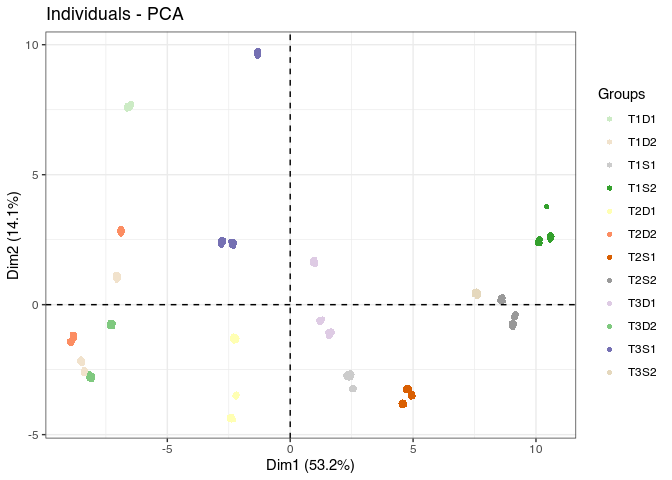<!-- -->

``` r
physcale <- physcale[[1]]
```

#### NMDS Plot - All microbes

``` r
# Ordinate nmds
june_nmds <- ordinate(
  physeq = physcale, 
  method = "NMDS", 
  distance = "bray"
)
```

    ## Square root transformation
    ## Wisconsin double standardization
    ## Run 0 stress 0.1071962 
    ## Run 1 stress 0.10701 
    ## ... New best solution
    ## ... Procrustes: rmse 0.02109011  max resid 0.06542587 
    ## Run 2 stress 0.10701 
    ## ... New best solution
    ## ... Procrustes: rmse 1.430969e-05  max resid 3.970367e-05 
    ## ... Similar to previous best
    ## Run 3 stress 0.1072477 
    ## ... Procrustes: rmse 0.02198573  max resid 0.06540945 
    ## Run 4 stress 0.1072476 
    ## ... Procrustes: rmse 0.02195569  max resid 0.06541849 
    ## Run 5 stress 0.1279257 
    ## Run 6 stress 0.1071963 
    ## ... Procrustes: rmse 0.02106562  max resid 0.06539626 
    ## Run 7 stress 0.138223 
    ## Run 8 stress 0.1299902 
    ## Run 9 stress 0.1318749 
    ## Run 10 stress 0.1070138 
    ## ... Procrustes: rmse 0.001267957  max resid 0.005445761 
    ## ... Similar to previous best
    ## Run 11 stress 0.139626 
    ## Run 12 stress 0.10701 
    ## ... New best solution
    ## ... Procrustes: rmse 1.116044e-05  max resid 4.267344e-05 
    ## ... Similar to previous best
    ## Run 13 stress 0.1421195 
    ## Run 14 stress 0.10701 
    ## ... Procrustes: rmse 7.595656e-06  max resid 2.165515e-05 
    ## ... Similar to previous best
    ## Run 15 stress 0.1318749 
    ## Run 16 stress 0.1071963 
    ## ... Procrustes: rmse 0.02103986  max resid 0.06538816 
    ## Run 17 stress 0.1241275 
    ## Run 18 stress 0.1234822 
    ## Run 19 stress 0.1117261 
    ## Run 20 stress 0.1310654 
    ## *** Best solution repeated 2 times

``` r
#check stresstplot
stressplot(june_nmds)
```

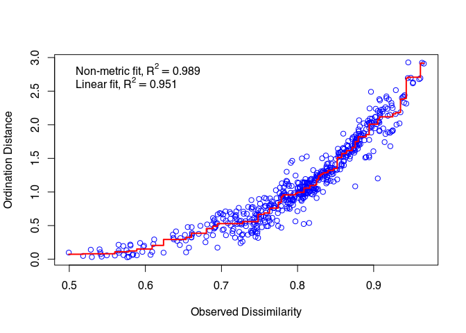<!-- -->

``` r
june_nmds$stress
```

    ## [1] 0.10701

``` r
#Stress = 0.1056203

nmds <- plot_ordination(
  physeq = physcale,
  type = 'split',
  color = 'Kingdom',
  ordination = june_nmds) + stat_ellipse(geom = "polygon", alpha=0.1, aes(fill=dep))#, size = 4) + scale_color_grey() 

nmds1 <- ggplot(nmds$data, aes(NMDS1, NMDS2, color=Kingdom)) + geom_point() + 
 facet_wrap(~Kingdom) + scale_color_grey()

nmds <- plot_ordination(
  physeq = physcale,
  ordination = june_nmds) + 
  geom_point(aes(color=dep)) +
  stat_ellipse(type = "norm",geom = "polygon", alpha=0.1, aes(fill=dep))+
  scale_color_jco(name = " ", labels =c("Depositional", "Other"))+
  scale_fill_jco(name = " ", labels =c("Depositional", "Other"))

metadf1 <- metadata %>%
  dplyr::filter(month=="june") %>%
  dplyr::select(psu, organiccont, Sulfatepw, waterdepth, CH4pw, bulkdensity)

metadf1[is.na(metadf1)] <- 0

metadf1 <- sqrt(metadf1)

# envfit of variables ($points for an NMDS, $vectors for a PCoA)
fit <- envfit(june_nmds$points, metadf1, scale = TRUE)
fitdf <- (fit$vectors$arrows * fit$vectors$r)

# Add labels, make a data.frame, rename varlabels
customvarlabs <- c("Sal.", "Org%", "Sul.", "WDep", "CH4", "Bulk Dens.")
fitdflabels <- data.frame(labels = customvarlabs, fitdf)
#fitdflabels <- data.frame(labels = row.names(fitdf), fitdf)
# fitdflabels <- slice(fitdflabels, -c(1))

# Define the arrow aesthetic mapping
arrow_mapping_split <- aes(xend = MDS1 * 1.5,
    yend = MDS2 * 1.5,
    x = 0,
    y = 0,
    shape = NULL,
    label = labels)

label_map_split <- aes(x = MDS1 * 1.85,
    y =  MDS2 * 1.85,
    shape = NULL,
    color = NULL,
    label = labels)

arrowhead = arrow(
  length = unit(0.01, "npc"))

p5 <- nmds +
geom_segment(
    mapping = arrow_mapping_split,
    size = .5, data = fitdflabels,
    color = "black",
    alpha = 0.5,
    arrow = arrowhead
  ) +
  geom_text(
    mapping = label_map_split,
    size = 4, colour = "black",
    alpha = 0.5,
    data = fitdflabels,
    show.legend = FALSE
  ) 
```

    ## Warning in geom_segment(mapping = arrow_mapping_split, size = 0.5, data =
    ## fitdflabels, : Ignoring unknown aesthetics: label

``` r
print(p5)
```

<!-- -->

``` r
ggsave(path = "~/Documents/Postgrad/Figures/June_Methane/draft2", "NMDSwnNormEllipseJCO.png", width = 6, height = 4, device = 'png', dpi = 500)

metad <- sample_data(physcale)

#Check homogeniety of dispersion
braydis <- phyloseq::distance(physcale, method = "bray")
# Homogeneity of dispersion test  ~ depth
depdisp <- betadisper(braydis, metad$dep)
# anova is sig therefore group dispersions are not the same
anova(depdisp)
```

    ## Analysis of Variance Table
    ## 
    ## Response: Distances
    ##           Df  Sum Sq  Mean Sq F value   Pr(>F)   
    ## Groups     1 0.11836 0.118360  9.5368 0.004142 **
    ## Residuals 32 0.39715 0.012411                    
    ## ---
    ## Signif. codes:  0 '***' 0.001 '**' 0.01 '*' 0.05 '.' 0.1 ' ' 1

``` r
#permutest on betadisper obj
permutest(depdisp)
```

    ## 
    ## Permutation test for homogeneity of multivariate dispersions
    ## Permutation: free
    ## Number of permutations: 999
    ## 
    ## Response: Distances
    ##           Df  Sum Sq  Mean Sq      F N.Perm Pr(>F)   
    ## Groups     1 0.11836 0.118360 9.5368    999  0.006 **
    ## Residuals 32 0.39715 0.012411                        
    ## ---
    ## Signif. codes:  0 '***' 0.001 '**' 0.01 '*' 0.05 '.' 0.1 ' ' 1

``` r
#Adonis~dep
adonis2(braydis ~ metad$dep)
```

    ## Permutation test for adonis under reduced model
    ## Terms added sequentially (first to last)
    ## Permutation: free
    ## Number of permutations: 999
    ## 
    ## adonis2(formula = braydis ~ metad$dep)
    ##           Df SumOfSqs      R2      F Pr(>F)    
    ## metad$dep  1   1.8970 0.27484 12.128  0.001 ***
    ## Residual  32   5.0054 0.72516                  
    ## Total     33   6.9025 1.00000                  
    ## ---
    ## Signif. codes:  0 '***' 0.001 '**' 0.01 '*' 0.05 '.' 0.1 ' ' 1

``` r
anosim(braydis, metad$dep)
```

    ## 
    ## Call:
    ## anosim(x = braydis, grouping = metad$dep) 
    ## Dissimilarity: bray 
    ## 
    ## ANOSIM statistic R: 0.559 
    ##       Significance: 0.001 
    ## 
    ## Permutation: free
    ## Number of permutations: 999

``` r
#Continuous vars
adonis2(braydis ~ metad$organiccont+metad$bulkdensity+metad$psu +metad$mcrabypro)
```

    ## Permutation test for adonis under reduced model
    ## Terms added sequentially (first to last)
    ## Permutation: free
    ## Number of permutations: 999
    ## 
    ## adonis2(formula = braydis ~ metad$organiccont + metad$bulkdensity + metad$psu + metad$mcrabypro)
    ##                   Df SumOfSqs      R2       F Pr(>F)    
    ## metad$organiccont  1   2.2093 0.32007 20.0465  0.001 ***
    ## metad$bulkdensity  1   0.9561 0.13851  8.6754  0.001 ***
    ## metad$psu          1   0.4150 0.06012  3.7656  0.005 ** 
    ## metad$mcrabypro    1   0.1261 0.01827  1.1442  0.300    
    ## Residual          29   3.1960 0.46302                   
    ## Total             33   6.9025 1.00000                   
    ## ---
    ## Signif. codes:  0 '***' 0.001 '**' 0.01 '*' 0.05 '.' 0.1 ' ' 1

``` r
anosim(braydis, metad$organiccont+metad$bulkdensity+metad$psu)
```

    ## 
    ## Call:
    ## anosim(x = braydis, grouping = metad$organiccont + metad$bulkdensity +      metad$psu) 
    ## Dissimilarity: bray 
    ## 
    ## ANOSIM statistic R: 0.8932 
    ##       Significance: 0.001 
    ## 
    ## Permutation: free
    ## Number of permutations: 999

``` r
vardisp <- betadisper(braydis, metad$organiccont+metad$bulkdensity+metad$psu)

permutest(vardisp)
```

    ## 
    ## Permutation test for homogeneity of multivariate dispersions
    ## Permutation: free
    ## Number of permutations: 999
    ## 
    ## Response: Distances
    ##           Df   Sum Sq   Mean Sq      F N.Perm Pr(>F)
    ## Groups    11 0.095598 0.0086907 0.9698    999    0.5
    ## Residuals 22 0.197146 0.0089612

### Beta diversity: Homogeneity of group dispersions and compositional dissimilarity/similarity

betadisper - calculates avg distance of group members to group centroid
and ANOVA then tests agains a null hypothesis of: No difference in
dispersion btw groups. ADONIS - tests compositional difference between
groups “The ANOSIM statistic”R” compares the mean of ranked
dissimilarities between groups to the mean of ranked dissimilarities
within groups. An R value close to “1.0” suggests dissimilarity between
groups while an R value close to “0” suggests an even distribution of
high and low ranks within and between groups” (GUSTAME). In other words,
the higher the R value, the more dissimilar your groups are in terms of
microbial community composition.

### Kruskal-Wallis testing for significant Taxa

``` r
physcale1 <- format_to_besthit(physcale)
physcaleagg <- tax_glom(physcale1, taxrank = 'Genus', NArm = TRUE)
#Duplicate name due to error in silva db
physcaleagg <- physcaleagg %>% subset_taxa(Family !="Latescibacteria")
taxa_names(physcaleagg) <- paste0(tax_table(physcaleagg)[,6])

#OTUs to matrix
OTU1 <- as(otu_table(physcaleagg), "matrix")
# transpose if necessary
if(taxa_are_rows(physcaleagg)){OTU1 <- t(OTU1)}
# Coerce to data.frame
abund_table <- as.data.frame(OTU1)
 
#Get grouping information
grouping_info<-data.frame(row.names=rownames(abund_table),dep=sample_data(physcaleagg)$dep)
# head(grouping_info)
# dep
# T1D1_1 Depositional
# T1D1_2 Depositional
# T1D2_1 Depositional
# T1D2_2 Depositional
# T1D2_3 Depositional
# T1S1_1        Other
 
#Use dep as grouping information
groups<-as.factor(grouping_info[,1])
 
#Apply normalisation (either use relative, log-relative transformation)
#data<-abund_table/rowSums(abund_table)
data<-log((abund_table+1)/(rowSums(abund_table)+dim(abund_table)[2]))

data<-as.data.frame(data)
 
#Reference: http://www.bigre.ulb.ac.be/courses/statistics_bioinformatics/practicals/microarrays_berry_2010/berry_feature_selection.html
kruskal.wallis.alpha=1
kruskal.wallis.table <- data.frame()
for (i in 1:dim(data)[2]) {
  ks.test <- kruskal.test(data[,i], g=groups)
  # Store the result in the data frame
  kruskal.wallis.table <- rbind(kruskal.wallis.table,
                                data.frame(id=names(data)[i],
                                           p.value=ks.test$p.value
                                ))
  # Report number of values tested
  cat(paste("Kruskal-Wallis test for ",names(data)[i]," ", i, "/", 
            dim(data)[2], "; p-value=", ks.test$p.value,"\n", sep=""))
}
```

    ## Kruskal-Wallis test for c__Woesearchaeia 1/964; p-value=0.868427169045584
    ## Kruskal-Wallis test for Desulfobacteraceae bacterium 4572_19 2/964; p-value=0.714440900452915
    ## Kruskal-Wallis test for Candidatus Pacearchaeota archaeon CG1_02_31_27 3/964; p-value=0.0819108638459115
    ## Kruskal-Wallis test for Candidatus Staskawiczbacteria bacterium RIFOXYA2_FULL_32_7 4/964; p-value=0.0002130134064726
    ## Kruskal-Wallis test for Candidatus Staskawiczbacteria bacterium RIFCSPHIGHO2_01_FULL_34_27 5/964; p-value=0.419942191760003
    ## Kruskal-Wallis test for archaeon GW2011_AR13 6/964; p-value=4.04459946994304e-05
    ## Kruskal-Wallis test for Candidatus Pacearchaeota archaeon RBG_19FT_COMBO_34_9 7/964; p-value=0.203870804334459
    ## Kruskal-Wallis test for Candidatus Diapherotrites archaeon ADurb.Bin253 8/964; p-value=0.782443152440473
    ## Kruskal-Wallis test for Candidatus Amesbacteria bacterium GW2011_GWC1_47_15 9/964; p-value=0.000201663275016693
    ## Kruskal-Wallis test for Candidatus Pacearchaeota archaeon CG1_02_32_21 10/964; p-value=0.00355312651150698
    ## Kruskal-Wallis test for Euryarchaeota archaeon SCGC AAA286-E23 11/964; p-value=0.794030143595467
    ## Kruskal-Wallis test for o__Deep Sea Euryarchaeotic Group(DSEG) 12/964; p-value=0.0269805730184836
    ## Kruskal-Wallis test for Candidatus Aenigmarchaeota archaeon CG1_02_38_14 13/964; p-value=0.00723510786933168
    ## Kruskal-Wallis test for o__Aenigmarchaeales 14/964; p-value=1.94756127748175e-05
    ## Kruskal-Wallis test for o__Methanofastidiosales 15/964; p-value=2.48665410926282e-05
    ## Kruskal-Wallis test for c__Euryarchaeota 16/964; p-value=0.968580820027704
    ## Kruskal-Wallis test for f__Nanohaloarchaeaceae 17/964; p-value=0.103030565733924
    ## Kruskal-Wallis test for o__Iainarchaeales 18/964; p-value=0.728534058751117
    ## Kruskal-Wallis test for Diapherotrites archaeon SCGC AAA011-K09 19/964; p-value=0.693387373263585
    ## Kruskal-Wallis test for Candidatus Iainarchaeum 20/964; p-value=0.682445393353969
    ## Kruskal-Wallis test for Halovenus 21/964; p-value=0.0334246348019557
    ## Kruskal-Wallis test for f__Halomicrobiaceae 22/964; p-value=0.0127197668919819
    ## Kruskal-Wallis test for Halomicrobium 23/964; p-value=0.0401277191779554
    ## Kruskal-Wallis test for Natronoarchaeum 24/964; p-value=0.0257141543390896
    ## Kruskal-Wallis test for Salinigranum 25/964; p-value=0.00432822605515028
    ## Kruskal-Wallis test for Halolamina 26/964; p-value=0.0161260078982018
    ## Kruskal-Wallis test for Haloferax 27/964; p-value=0.00152565271057548
    ## Kruskal-Wallis test for Haloplanus 28/964; p-value=0.000222628346299972
    ## Kruskal-Wallis test for A07HB70 29/964; p-value=0.43623914809057
    ## Kruskal-Wallis test for o__Halobacteriales 30/964; p-value=0.0293108512739464
    ## Kruskal-Wallis test for Halopelagius 31/964; p-value=0.752450479563837
    ## Kruskal-Wallis test for f__Haloferacaceae 32/964; p-value=0.0107291549567472
    ## Kruskal-Wallis test for Candidatus Halobonum 33/964; p-value=0.61646217620425
    ## Kruskal-Wallis test for Halobellus 34/964; p-value=0.379688406963498
    ## Kruskal-Wallis test for Halogeometricum 35/964; p-value=0.558904664612843
    ## Kruskal-Wallis test for Halogranum 36/964; p-value=0.000297403464452775
    ## Kruskal-Wallis test for Halonotius 37/964; p-value=0.11384946002502
    ## Kruskal-Wallis test for Halohasta 38/964; p-value=0.000284115404387181
    ## Kruskal-Wallis test for Halapricum 39/964; p-value=0.00563703524846798
    ## Kruskal-Wallis test for Halorhabdus 40/964; p-value=0.616137265285251
    ## Kruskal-Wallis test for Halorientalis 41/964; p-value=0.0131283568370369
    ## Kruskal-Wallis test for Halodesulfurarchaeum 42/964; p-value=0.424460761103576
    ## Kruskal-Wallis test for Halanaeroarchaeum 43/964; p-value=0.640116894946359
    ## Kruskal-Wallis test for f__Halobacteriaceae 44/964; p-value=0.737554467784136
    ## Kruskal-Wallis test for Haladaptatus 45/964; p-value=0.876333424177727
    ## Kruskal-Wallis test for Salinirubrum 46/964; p-value=0.77010724917345
    ## Kruskal-Wallis test for Haloarchaeobius 47/964; p-value=0.00228534345067412
    ## Kruskal-Wallis test for Halococcus 48/964; p-value=0.507752213353591
    ## Kruskal-Wallis test for Halorussus 49/964; p-value=0.34354755649153
    ## Kruskal-Wallis test for Salinarchaeum 50/964; p-value=0.100459883212413
    ## Kruskal-Wallis test for Halorubellus 51/964; p-value=0.126724442403458
    ## Kruskal-Wallis test for Halovivax 52/964; p-value=0.000850804645019057
    ## Kruskal-Wallis test for Halostagnicola 53/964; p-value=0.682445393353969
    ## Kruskal-Wallis test for Haloterrigena 54/964; p-value=0.000119327691979792
    ## Kruskal-Wallis test for Natribaculum 55/964; p-value=0.859192241347604
    ## Kruskal-Wallis test for Halostella 56/964; p-value=0.813032331952885
    ## Kruskal-Wallis test for Natronomonas 57/964; p-value=8.3618612994029e-06
    ## Kruskal-Wallis test for Halomarina 58/964; p-value=0.31602269962235
    ## Kruskal-Wallis test for Halobacterium 59/964; p-value=0.471080562260225
    ## Kruskal-Wallis test for Halarchaeum 60/964; p-value=0.860811880112703
    ## Kruskal-Wallis test for Halobaculum 61/964; p-value=5.12405818020962e-05
    ## Kruskal-Wallis test for Halosimplex 62/964; p-value=0.35992303488897
    ## Kruskal-Wallis test for Halomicroarcula 63/964; p-value=0.0172671640586258
    ## Kruskal-Wallis test for Haloarcula 64/964; p-value=0.200235268798977
    ## Kruskal-Wallis test for Halorubrum 65/964; p-value=0.00086130446842215
    ## Kruskal-Wallis test for Methanoculleus sp. 1H2c2 66/964; p-value=0.708020160967681
    ## Kruskal-Wallis test for Methanocorpusculum 67/964; p-value=0.782560639771393
    ## Kruskal-Wallis test for f__Methanomicrobiaceae 68/964; p-value=0.828344508815806
    ## Kruskal-Wallis test for Methanogenium 69/964; p-value=0.722712385531457
    ## Kruskal-Wallis test for f__Methanosarcinaceae 70/964; p-value=0.284591142506188
    ## Kruskal-Wallis test for Methanohalobium 71/964; p-value=0.953909848787381
    ## Kruskal-Wallis test for Methanococcoides 72/964; p-value=0.000645123978545154
    ## Kruskal-Wallis test for Methanosarcina 73/964; p-value=0.722712385531457
    ## Kruskal-Wallis test for Methanolobus 74/964; p-value=0.0420988490519073
    ## Kruskal-Wallis test for Methanohalophilus 75/964; p-value=0.0733770061424082
    ## Kruskal-Wallis test for f__Methermicoccaceae 76/964; p-value=0.00124775525361571
    ## Kruskal-Wallis test for c__Hadesarchaeaeota 77/964; p-value=0.924979434192229
    ## Kruskal-Wallis test for o__Marine Group III 78/964; p-value=0.0672185303851774
    ## Kruskal-Wallis test for c__Thermoplasmata 79/964; p-value=0.0375336809451073
    ## Kruskal-Wallis test for f__Methanomassiliicoccaceae 80/964; p-value=0.00369775595106926
    ## Kruskal-Wallis test for o__Methanomassiliicoccales 81/964; p-value=0.000522030146865987
    ## Kruskal-Wallis test for o__SG8-5 82/964; p-value=8.87181993727772e-05
    ## Kruskal-Wallis test for archaeon enrichment culture clone AOM-Clone-F5 83/964; p-value=0.782560639771393
    ## Kruskal-Wallis test for o__Marine Benthic Group D and DHVEG-1 84/964; p-value=2.12008236779248e-05
    ## Kruskal-Wallis test for c__Bathyarchaeia 85/964; p-value=6.3266952705287e-05
    ## Kruskal-Wallis test for c__Thaumarchaeota 86/964; p-value=0.722712385531457
    ## Kruskal-Wallis test for f__Nitrosopumilaceae 87/964; p-value=0.682445393353969
    ## Kruskal-Wallis test for Candidatus Heimdallarchaeota archaeon AB_125 88/964; p-value=0.53752541117303
    ## Kruskal-Wallis test for k__Archaea 89/964; p-value=0.000492779378524458
    ## Kruskal-Wallis test for c__Odinarchaeia 90/964; p-value=0.0125353806382452
    ## Kruskal-Wallis test for c__Lokiarchaeia 91/964; p-value=0.00038131922592097
    ## Kruskal-Wallis test for c__Asgardaeota 92/964; p-value=0.414559921411786
    ## Kruskal-Wallis test for k__Unassigned 93/964; p-value=0.87933929412054
    ## Kruskal-Wallis test for c__Micrarchaeia 94/964; p-value=1.49877850714022e-05
    ## Kruskal-Wallis test for c__Diapherotrites 95/964; p-value=0.828344508815806
    ## Kruskal-Wallis test for Candidatus Micrarchaeota archaeon CG1_02_55_41 96/964; p-value=0.682445393353969
    ## Kruskal-Wallis test for c__Altiarchaeia 97/964; p-value=2.08646412210629e-05
    ## Kruskal-Wallis test for c__Iainarchaeia 98/964; p-value=0.0116775366027445
    ## Kruskal-Wallis test for c__Nanoarchaeaeota 99/964; p-value=0.000125216786340177
    ## Kruskal-Wallis test for Candidatus Allobeggiatoa 100/964; p-value=0.679157429423096
    ## Kruskal-Wallis test for c__WS2 101/964; p-value=0.695315346269263
    ## Kruskal-Wallis test for f__Family III 102/964; p-value=0.782560639771393
    ## Kruskal-Wallis test for c__Aerophobetes 103/964; p-value=0.302552435141925
    ## Kruskal-Wallis test for o__Aminicenantales 104/964; p-value=0.00843573931625933
    ## Kruskal-Wallis test for c__Firmicutes 105/964; p-value=0.745504947165555
    ## Kruskal-Wallis test for f__Leptotrichiaceae 106/964; p-value=0.955548269084776
    ## Kruskal-Wallis test for o__Lineage IV 107/964; p-value=0.782560639771393
    ## Kruskal-Wallis test for o__MD2894-B20 108/964; p-value=0.375013587655571
    ## Kruskal-Wallis test for c__Elusimicrobia 109/964; p-value=0.128167771567016
    ## Kruskal-Wallis test for Elusimicrobia bacterium RIFCSPHIGHO2_02_FULL_39_36 110/964; p-value=0.782560639771393
    ## Kruskal-Wallis test for c__Lineage IIb 111/964; p-value=0.062898123449445
    ## Kruskal-Wallis test for Candidatus Endomicrobium 112/964; p-value=4.72495884838382e-05
    ## Kruskal-Wallis test for c__TA06 113/964; p-value=0.311664804890957
    ## Kruskal-Wallis test for f__Kosmotogaceae 114/964; p-value=0.759905225851536
    ## Kruskal-Wallis test for Geotoga 115/964; p-value=0.558904664612843
    ## Kruskal-Wallis test for SC103 116/964; p-value=0.345579120697258
    ## Kruskal-Wallis test for f__WCHB1-02 117/964; p-value=0.782560639771393
    ## Kruskal-Wallis test for f__LF045 118/964; p-value=0.622004065398075
    ## Kruskal-Wallis test for c__MAT-CR-M4-B07 119/964; p-value=0.235901466512034
    ## Kruskal-Wallis test for c__MVP-15 120/964; p-value=0.654113700975164
    ## Kruskal-Wallis test for Exilispira 121/964; p-value=0.0691202264724371
    ## Kruskal-Wallis test for Brevinema 122/964; p-value=0.163185183318973
    ## Kruskal-Wallis test for o__Cloacimonadales 123/964; p-value=0.00640247872580272
    ## Kruskal-Wallis test for f__NK-L14 124/964; p-value=0.00161956032098638
    ## Kruskal-Wallis test for f__MSBL8 125/964; p-value=0.00458564233467919
    ## Kruskal-Wallis test for bacterium enrichment culture clone E23 126/964; p-value=0.288871909013705
    ## Kruskal-Wallis test for f__LK-44f 127/964; p-value=0.495351252275209
    ## Kruskal-Wallis test for Candidatus Cloacimonas 128/964; p-value=0.722712385531457
    ## Kruskal-Wallis test for o__MSBL2 129/964; p-value=0.532999466137198
    ## Kruskal-Wallis test for f__Spirochaetaceae 130/964; p-value=0.190755655528862
    ## Kruskal-Wallis test for Salinispira 131/964; p-value=0.0103450182517949
    ## Kruskal-Wallis test for Alkalispirochaeta 132/964; p-value=0.057846038409903
    ## Kruskal-Wallis test for Spirochaeta 2 133/964; p-value=0.156399734282512
    ## Kruskal-Wallis test for Candidatus Marispirochaeta 134/964; p-value=5.41041750721838e-05
    ## Kruskal-Wallis test for Sediminispirochaeta 135/964; p-value=0.000438758063657378
    ## Kruskal-Wallis test for c__Spirochaetes 136/964; p-value=0.682445393353969
    ## Kruskal-Wallis test for f__LH041 137/964; p-value=0.562887868597107
    ## Kruskal-Wallis test for M2PT2-76 termite group 138/964; p-value=0.558904664612843
    ## Kruskal-Wallis test for GWE2-31-10 139/964; p-value=0.144006177510057
    ## Kruskal-Wallis test for f__Chitinivibrionaceae 140/964; p-value=0.284315219437463
    ## Kruskal-Wallis test for o__Vampirovibrionales 141/964; p-value=0.424817198984509
    ## Kruskal-Wallis test for o__Candidatus Pacebacteria 142/964; p-value=0.00746606610866136
    ## Kruskal-Wallis test for o__Candidatus Roizmanbacteria 143/964; p-value=0.682445393353969
    ## Kruskal-Wallis test for c__Microgenomatia 144/964; p-value=0.25481321244454
    ## Kruskal-Wallis test for o__Candidatus Shapirobacteria 145/964; p-value=0.752450479563837
    ## Kruskal-Wallis test for o__Candidatus Woesebacteria 146/964; p-value=0.00554541992857443
    ## Kruskal-Wallis test for o__GWA2-38-13b 147/964; p-value=0.558904664612843
    ## Kruskal-Wallis test for c__Berkelbacteria 148/964; p-value=0.782560639771393
    ## Kruskal-Wallis test for o__Absconditabacteriales (SR1) 149/964; p-value=0.417048404425798
    ## Kruskal-Wallis test for candidate division WS2 bacterium ADurb.Bin280 150/964; p-value=0.782560639771393
    ## Kruskal-Wallis test for Chloroflexi bacterium RBG_13_46_9 151/964; p-value=0.708239577124104
    ## Kruskal-Wallis test for c__WS6 (Dojkabacteria) 152/964; p-value=0.617539421578975
    ## Kruskal-Wallis test for c__WWE3 153/964; p-value=0.00122187620159186
    ## Kruskal-Wallis test for o__Candidatus Abawacabacteria 154/964; p-value=0.92317563729482
    ## Kruskal-Wallis test for o__JGI 0000069-P22 155/964; p-value=0.702433188614169
    ## Kruskal-Wallis test for o__Candidatus Peribacteria 156/964; p-value=0.0284019847655673
    ## Kruskal-Wallis test for bacterium enrichment culture clone 24(2013) 157/964; p-value=0.782560639771393
    ## Kruskal-Wallis test for c__Gracilibacteria 158/964; p-value=0.000199398984199634
    ## Kruskal-Wallis test for Candidatus Peregrinibacteria bacterium GW2011_GWF2_39_17 159/964; p-value=0.782560639771393
    ## Kruskal-Wallis test for Candidatus Peregrinibacteria bacterium CG2_30_44_17 160/964; p-value=0.105299095516974
    ## Kruskal-Wallis test for o__Candidatus Peregrinibacteria 161/964; p-value=0.808164781780607
    ## Kruskal-Wallis test for candidate division Kazan bacterium RBG_13_50_9 162/964; p-value=0.127656990895282
    ## Kruskal-Wallis test for c__Kazania 163/964; p-value=0.0293278582415651
    ## Kruskal-Wallis test for o__Candidatus Kuenenbacteria 164/964; p-value=0.782560639771393
    ## Kruskal-Wallis test for o__Candidatus Falkowbacteria 165/964; p-value=0.815165339455047
    ## Kruskal-Wallis test for o__Candidatus Kerfeldbacteria 166/964; p-value=0.782560639771393
    ## Kruskal-Wallis test for Parcubacteria bacterium SG8_24 167/964; p-value=0.782560639771393
    ## Kruskal-Wallis test for c__Patescibacteria 168/964; p-value=0.585406510828661
    ## Kruskal-Wallis test for o__GWB1-42-6 169/964; p-value=0.000112902973498552
    ## Kruskal-Wallis test for o__Candidatus Portnoybacteria 170/964; p-value=0.000152551094203299
    ## Kruskal-Wallis test for o__CG1-02-42-13 171/964; p-value=3.38356313003038e-05
    ## Kruskal-Wallis test for o__Candidatus Nealsonbacteria 172/964; p-value=0.558904664612843
    ## Kruskal-Wallis test for o__Candidatus Yanofskybacteria 173/964; p-value=0.00561790939425392
    ## Kruskal-Wallis test for Candidatus Paceibacter 174/964; p-value=5.72703208069874e-05
    ## Kruskal-Wallis test for c__Parcubacteria 175/964; p-value=0.000476004447653992
    ## Kruskal-Wallis test for o__Candidatus Wolfebacteria 176/964; p-value=0.782560639771393
    ## Kruskal-Wallis test for o__Candidatus Nomurabacteria 177/964; p-value=0.28011352046036
    ## Kruskal-Wallis test for Parcubacteria group bacterium GW2011_GWD2_42_14 178/964; p-value=0.782560639771393
    ## Kruskal-Wallis test for o__Candidatus Kaiserbacteria 179/964; p-value=0.0143189860232545
    ## Kruskal-Wallis test for microbial mat metagenome 180/964; p-value=0.782560639771393
    ## Kruskal-Wallis test for bacterium SH4-10 181/964; p-value=0.61914778600883
    ## Kruskal-Wallis test for Candidatus Kaiserbacteria bacterium RIFCSPLOWO2_12_FULL_50_10 182/964; p-value=0.722712385531457
    ## Kruskal-Wallis test for o__Candidatus Campbellbacteria 183/964; p-value=0.558904664612843
    ## Kruskal-Wallis test for o__Saccharimonadales 184/964; p-value=0.00285901682819916
    ## Kruskal-Wallis test for bacterium YC-ZSS-LKJ63 185/964; p-value=0.782560639771393
    ## Kruskal-Wallis test for Candidatus Hydrogenedentes bacterium ADurb.Bin101 186/964; p-value=0.682445393353969
    ## Kruskal-Wallis test for f__Hydrogenedensaceae 187/964; p-value=0.366482386270894
    ## Kruskal-Wallis test for c__Thermodesulfovibrionia 188/964; p-value=0.391767922599782
    ## Kruskal-Wallis test for Deinococcus 189/964; p-value=0.558904664612843
    ## Kruskal-Wallis test for Truepera 190/964; p-value=0.0342832990214366
    ## Kruskal-Wallis test for bacterium enrichment culture clone 73(2013) 191/964; p-value=0.114091840183538
    ## Kruskal-Wallis test for c__Acetothermiia 192/964; p-value=0.386550515076725
    ## Kruskal-Wallis test for f__JG30-KF-CM45 193/964; p-value=0.682445393353969
    ## Kruskal-Wallis test for f__AKYG1722 194/964; p-value=0.476461007210503
    ## Kruskal-Wallis test for o__MSB-5E12 195/964; p-value=0.693387373263585
    ## Kruskal-Wallis test for bacterium YC-ZSS-LKJ145 196/964; p-value=0.178194099847646
    ## Kruskal-Wallis test for o__SBR1031 197/964; p-value=0.000102616062452255
    ## Kruskal-Wallis test for o__Ardenticatenales 198/964; p-value=0.796556397046884
    ## Kruskal-Wallis test for c__Anaerolineae 199/964; p-value=0.97062321960745
    ## Kruskal-Wallis test for o__KZNMV-5-B42 200/964; p-value=0.664514614479203
    ## Kruskal-Wallis test for f__Anaerolineaceae 201/964; p-value=0.135865540864018
    ## Kruskal-Wallis test for Levilinea 202/964; p-value=0.740494003720055
    ## Kruskal-Wallis test for Pelolinea 203/964; p-value=0.699763124428062
    ## Kruskal-Wallis test for ADurb.Bin120 204/964; p-value=2.10780815416658e-05
    ## Kruskal-Wallis test for o__ADurb.Bin180 205/964; p-value=0.782801709684544
    ## Kruskal-Wallis test for o__RBG-13-54-9 206/964; p-value=0.140216700360634
    ## Kruskal-Wallis test for bacterium YC-ZSS-LKJ74 207/964; p-value=0.0438440852741956
    ## Kruskal-Wallis test for o__MSB-5B2 208/964; p-value=0.752450479563837
    ## Kruskal-Wallis test for f__Caldilineaceae 209/964; p-value=0.000660612832551994
    ## Kruskal-Wallis test for o__SJA-15 210/964; p-value=0.722712385531457
    ## Kruskal-Wallis test for o__1-20 211/964; p-value=0.815165339455047
    ## Kruskal-Wallis test for c__KD4-96 212/964; p-value=0.428563572446414
    ## Kruskal-Wallis test for o__FS117-23B-02 213/964; p-value=0.54155380399093
    ## Kruskal-Wallis test for Dehalogenimonas 214/964; p-value=0.558904664612843
    ## Kruskal-Wallis test for o__FW22 215/964; p-value=0.0114509971771011
    ## Kruskal-Wallis test for o__t0.6.f 216/964; p-value=0.59890398775794
    ## Kruskal-Wallis test for o__H3.93 217/964; p-value=0.693387373263585
    ## Kruskal-Wallis test for o__MB-C2-126 218/964; p-value=0.636131282901886
    ## Kruskal-Wallis test for o__vadinBA26 219/964; p-value=0.554326212327629
    ## Kruskal-Wallis test for o__Sh765B-AG-111 220/964; p-value=0.495351252275209
    ## Kruskal-Wallis test for o__RBG-13-46-9 221/964; p-value=0.679157429423096
    ## Kruskal-Wallis test for c__Dehalococcoidia 222/964; p-value=0.802234516511375
    ## Kruskal-Wallis test for o__3051bac4-16 223/964; p-value=0.693387373263585
    ## Kruskal-Wallis test for o__SPG12-343-353-B75 224/964; p-value=0.380688284200756
    ## Kruskal-Wallis test for o__661239 225/964; p-value=0.664514614479203
    ## Kruskal-Wallis test for o__Sh765B-TzT-20 226/964; p-value=0.797759300618799
    ## Kruskal-Wallis test for o__Napoli-4B-65 227/964; p-value=0.502131142512833
    ## Kruskal-Wallis test for Dehalococcoidia bacterium SCGC AB-540-C11 228/964; p-value=0.782560639771393
    ## Kruskal-Wallis test for o__GIF3 229/964; p-value=0.15366961437792
    ## Kruskal-Wallis test for f__AB-539-J10 230/964; p-value=0.0110646350441708
    ## Kruskal-Wallis test for SCGC-AB-539-J10 231/964; p-value=0.896812530795176
    ## Kruskal-Wallis test for o__GIF9 232/964; p-value=0.496050864378558
    ## Kruskal-Wallis test for o__S085 233/964; p-value=0.541483085536835
    ## Kruskal-Wallis test for o__MSBL5 234/964; p-value=0.0033388887708999
    ## Kruskal-Wallis test for o__SAR202 clade 235/964; p-value=0.525201247009829
    ## Kruskal-Wallis test for c__WPS-2 236/964; p-value=0.664569801501521
    ## Kruskal-Wallis test for c__Actinobacteria 237/964; p-value=0.00348255259087693
    ## Kruskal-Wallis test for bacterium ADurb.Bin236 238/964; p-value=0.209269026030273
    ## Kruskal-Wallis test for c__JS1 239/964; p-value=0.00303800404265907
    ## Kruskal-Wallis test for f__Clostridiaceae 1 240/964; p-value=0.725849796505126
    ## Kruskal-Wallis test for c__WOR-1 241/964; p-value=0.351000131142989
    ## Kruskal-Wallis test for candidate division WOR-1 bacterium RIFOXYA12_FULL_43_27 242/964; p-value=0.334914435602781
    ## Kruskal-Wallis test for c__Margulisbacteria 243/964; p-value=0.0682944732809753
    ## Kruskal-Wallis test for Candidatus Margulisbacteria bacterium GWF2_35_9 244/964; p-value=0.507715893661359
    ## Kruskal-Wallis test for o__OPB41 245/964; p-value=0.59552273306436
    ## Kruskal-Wallis test for o__Micrococcales 246/964; p-value=0.558904664612843
    ## Kruskal-Wallis test for Micrococcus 247/964; p-value=0.682445393353969
    ## Kruskal-Wallis test for Brachybacterium 248/964; p-value=0.782560639771393
    ## Kruskal-Wallis test for Pontimonas 249/964; p-value=0.682445393353969
    ## Kruskal-Wallis test for DS001 250/964; p-value=0.301991196532763
    ## Kruskal-Wallis test for ML602J-51 251/964; p-value=0.782560639771393
    ## Kruskal-Wallis test for f__Microbacteriaceae 252/964; p-value=0.558904664612843
    ## Kruskal-Wallis test for Candidatus Aquiluna 253/964; p-value=0.558904664612843
    ## Kruskal-Wallis test for Blastococcus 254/964; p-value=0.752450479563837
    ## Kruskal-Wallis test for Modestobacter 255/964; p-value=0.782560639771393
    ## Kruskal-Wallis test for o__PeM15 256/964; p-value=0.685431750270667
    ## Kruskal-Wallis test for Mycobacterium 257/964; p-value=0.59890398775794
    ## Kruskal-Wallis test for Corynebacterium 1 258/964; p-value=0.782560639771393
    ## Kruskal-Wallis test for Nocardioides 259/964; p-value=0.782560639771393
    ## Kruskal-Wallis test for Cutibacterium 260/964; p-value=0.892605513413117
    ## Kruskal-Wallis test for Micromonospora 261/964; p-value=0.984273605255394
    ## Kruskal-Wallis test for Geodermatophilus 262/964; p-value=0.558904664612843
    ## Kruskal-Wallis test for Pseudonocardia 263/964; p-value=0.782560639771393
    ## Kruskal-Wallis test for f__Propionibacteriaceae 264/964; p-value=0.0488987527967222
    ## Kruskal-Wallis test for Syntrophomonas 265/964; p-value=0.797759300618799
    ## Kruskal-Wallis test for Desulfitibacter 266/964; p-value=0.737554467784136
    ## Kruskal-Wallis test for Fusibacter 267/964; p-value=0.87757062995069
    ## Kruskal-Wallis test for Gottschalkia 268/964; p-value=0.471383877425596
    ## Kruskal-Wallis test for Dethiosulfatibacter 269/964; p-value=0.955180800970318
    ## Kruskal-Wallis test for f__Clostridiaceae 3 270/964; p-value=0.984273605255394
    ## Kruskal-Wallis test for Paramaledivibacter 271/964; p-value=0.664514614479203
    ## Kruskal-Wallis test for f__livecontrolB21 272/964; p-value=0.28011352046036
    ## Kruskal-Wallis test for f__GoM-GC232-4463-Bac1 273/964; p-value=0.782560639771393
    ## Kruskal-Wallis test for Peptoclostridium 274/964; p-value=0.782560639771393
    ## Kruskal-Wallis test for f__Clostridiaceae 4 275/964; p-value=0.471383877425596
    ## Kruskal-Wallis test for Tepidibacter 276/964; p-value=0.722712385531457
    ## Kruskal-Wallis test for Paeniclostridium 277/964; p-value=0.905863254735665
    ## Kruskal-Wallis test for Romboutsia 278/964; p-value=0.782560639771393
    ## Kruskal-Wallis test for Clostridiisalibacter 279/964; p-value=0.89559197403763
    ## Kruskal-Wallis test for Anaerococcus 280/964; p-value=0.558904664612843
    ## Kruskal-Wallis test for Sporosalibacterium 281/964; p-value=0.847213661777144
    ## Kruskal-Wallis test for Haloimpatiens 282/964; p-value=0.0321785752399289
    ## Kruskal-Wallis test for Clostridium sensu stricto 10 283/964; p-value=0.782560639771393
    ## Kruskal-Wallis test for Oceanirhabdus 284/964; p-value=0.585406510828661
    ## Kruskal-Wallis test for f__Clostridiales vadinBB60 group 285/964; p-value=0.782560639771393
    ## Kruskal-Wallis test for f__Christensenellaceae 286/964; p-value=0.818534307477948
    ## Kruskal-Wallis test for Natranaerovirga 287/964; p-value=0.907881210574768
    ## Kruskal-Wallis test for f__Lachnospiraceae 288/964; p-value=0.558904664612843
    ## Kruskal-Wallis test for Defluviitaleaceae UCG-011 289/964; p-value=0.507715893661359
    ## Kruskal-Wallis test for Herbinix 290/964; p-value=0.722712385531457
    ## Kruskal-Wallis test for Lachnotalea 291/964; p-value=0.782560639771393
    ## Kruskal-Wallis test for Tyzzerella 3 292/964; p-value=0.782560639771393
    ## Kruskal-Wallis test for f__Ruminococcaceae 293/964; p-value=0.28420333092854
    ## Kruskal-Wallis test for Ruminococcaceae UCG-012 294/964; p-value=0.606207598622127
    ## Kruskal-Wallis test for Acetivibrio 295/964; p-value=0.722712385531457
    ## Kruskal-Wallis test for Ruminiclostridium 1 296/964; p-value=0.00301866754105514
    ## Kruskal-Wallis test for Pseudobacteroides 297/964; p-value=0.264174147560083
    ## Kruskal-Wallis test for [Eubacterium] coprostanoligenes group 298/964; p-value=0.782560639771393
    ## Kruskal-Wallis test for Ruminococcus 1 299/964; p-value=0.782560639771393
    ## Kruskal-Wallis test for c__Rs-M47 300/964; p-value=0.108947845902402
    ## Kruskal-Wallis test for f__Halobacteroidaceae 301/964; p-value=0.144379504131078
    ## Kruskal-Wallis test for f__Halanaerobiaceae 302/964; p-value=0.195462782904912
    ## Kruskal-Wallis test for Orenia 303/964; p-value=0.737554467784136
    ## Kruskal-Wallis test for Halonatronum 304/964; p-value=0.558904664612843
    ## Kruskal-Wallis test for Halanaerobium 305/964; p-value=0.0869362416142549
    ## Kruskal-Wallis test for Halocella 306/964; p-value=0.447905842668455
    ## Kruskal-Wallis test for o__Clostridiales 307/964; p-value=0.000796050370492514
    ## Kruskal-Wallis test for f__Peptococcaceae 308/964; p-value=0.681348042378738
    ## Kruskal-Wallis test for f__Limnochordaceae 309/964; p-value=0.640116894946359
    ## Kruskal-Wallis test for Veillonella 310/964; p-value=0.782560639771393
    ## Kruskal-Wallis test for bacterium enrichment culture clone R4-81B 311/964; p-value=0.752450479563837
    ## Kruskal-Wallis test for o__Izimaplasmatales 312/964; p-value=0.782560639771393
    ## Kruskal-Wallis test for f__Izimaplasmataceae 313/964; p-value=0.00760510707741001
    ## Kruskal-Wallis test for Izimaplasma 314/964; p-value=0.984273605255394
    ## Kruskal-Wallis test for Haloplasma 315/964; p-value=0.952886455236441
    ## Kruskal-Wallis test for Gemella 316/964; p-value=0.782560639771393
    ## Kruskal-Wallis test for Streptococcus 317/964; p-value=0.290938165467624
    ## Kruskal-Wallis test for Lactobacillus 318/964; p-value=0.682445393353969
    ## Kruskal-Wallis test for c__Bacilli 319/964; p-value=0.558904664612843
    ## Kruskal-Wallis test for Planococcus 320/964; p-value=0.984273605255394
    ## Kruskal-Wallis test for Bacillus 321/964; p-value=0.0217994369563672
    ## Kruskal-Wallis test for o__Bacillales 322/964; p-value=0.968594543292654
    ## Kruskal-Wallis test for f__Planococcaceae 323/964; p-value=0.558904664612843
    ## Kruskal-Wallis test for f__Bacillaceae 324/964; p-value=0.0954751789020377
    ## Kruskal-Wallis test for Paraliobacillus 325/964; p-value=0.782560639771393
    ## Kruskal-Wallis test for Halobacillus 326/964; p-value=0.585438608909484
    ## Kruskal-Wallis test for Salimicrobium 327/964; p-value=0.558904664612843
    ## Kruskal-Wallis test for Pontibacillus 328/964; p-value=0.722712385531457
    ## Kruskal-Wallis test for Tumebacillus 329/964; p-value=0.585406510828661
    ## Kruskal-Wallis test for Candidatus Desulforudis 330/964; p-value=0.558904664612843
    ## Kruskal-Wallis test for f__Lenti-02 331/964; p-value=0.485433674793654
    ## Kruskal-Wallis test for SBZC-1223 332/964; p-value=0.507715893661359
    ## Kruskal-Wallis test for f__PRD18C08 333/964; p-value=0.708020160967681
    ## Kruskal-Wallis test for o__SS1-B-02-17 334/964; p-value=0.507715893661359
    ## Kruskal-Wallis test for f__BD2-3 335/964; p-value=0.708020160967681
    ## Kruskal-Wallis test for f__Family XVII 336/964; p-value=0.679157429423096
    ## Kruskal-Wallis test for c__RBG-16-55-12 337/964; p-value=0.633028247522726
    ## Kruskal-Wallis test for f__Syntrophomonadaceae 338/964; p-value=0.782560639771393
    ## Kruskal-Wallis test for f__Synergistaceae 339/964; p-value=7.67350014529899e-06
    ## Kruskal-Wallis test for EBM-39 340/964; p-value=0.00291509880942596
    ## Kruskal-Wallis test for Thermovirga 341/964; p-value=0.407032816718792
    ## Kruskal-Wallis test for c__BRC1 342/964; p-value=0.113407290674242
    ## Kruskal-Wallis test for Bacteroidetes bacterium MO48 343/964; p-value=0.558904664612843
    ## Kruskal-Wallis test for c__Latescibacteria 344/964; p-value=3.21174208010427e-06
    ## Kruskal-Wallis test for Candidatus Latescibacter 345/964; p-value=0.150965405940031
    ## Kruskal-Wallis test for f__Latescibacteraceae 346/964; p-value=0.0105132437561705
    ## Kruskal-Wallis test for bacterium enrichment culture clone 58 347/964; p-value=0.4025795585687
    ## Kruskal-Wallis test for o__Chlamydiales 348/964; p-value=0.682445393353969
    ## Kruskal-Wallis test for f__Simkaniaceae 349/964; p-value=0.722712385531457
    ## Kruskal-Wallis test for Neochlamydia 350/964; p-value=0.8943952274386
    ## Kruskal-Wallis test for Latescibacteria 351/964; p-value=0.815304957777536
    ## Kruskal-Wallis test for Latescibacteria bacterium SCGC AAA257-K07 352/964; p-value=0.722712385531457
    ## Kruskal-Wallis test for c__PAUC34f 353/964; p-value=0.908685799396428
    ## Kruskal-Wallis test for c__LD1-PA32 354/964; p-value=0.815304957777536
    ## Kruskal-Wallis test for c__BHI80-139 355/964; p-value=0.828344508815806
    ## Kruskal-Wallis test for c__FCPU426 356/964; p-value=0.00282296160514081
    ## Kruskal-Wallis test for c__Poribacteria 357/964; p-value=0.693387373263585
    ## Kruskal-Wallis test for c__Omnitrophia 358/964; p-value=0.558904664612843
    ## Kruskal-Wallis test for Candidatus Omnitrophus 359/964; p-value=0.938511389438152
    ## Kruskal-Wallis test for c__Omnitrophicaeota 360/964; p-value=0.0400920742920984
    ## Kruskal-Wallis test for o__113B434 361/964; p-value=0.650545215887793
    ## Kruskal-Wallis test for o__WCHB1-41 362/964; p-value=0.000753370809565525
    ## Kruskal-Wallis test for R76-B128 363/964; p-value=0.743046485444627
    ## Kruskal-Wallis test for MSBL3 364/964; p-value=0.782560639771393
    ## Kruskal-Wallis test for f__Methylacidiphilaceae 365/964; p-value=0.00291433914903855
    ## Kruskal-Wallis test for f__Pedosphaeraceae 366/964; p-value=0.131508036887416
    ## Kruskal-Wallis test for f__Verrucomicrobiaceae 367/964; p-value=0.911806853588319
    ## Kruskal-Wallis test for f__DEV007 368/964; p-value=0.00322008878125314
    ## Kruskal-Wallis test for Roseibacillus 369/964; p-value=0.0212448757275706
    ## Kruskal-Wallis test for Haloferula 370/964; p-value=0.000800830627587014
    ## Kruskal-Wallis test for Luteolibacter 371/964; p-value=0.969232828670189
    ## Kruskal-Wallis test for Rubritalea 372/964; p-value=0.682445393353969
    ## Kruskal-Wallis test for Persicirhabdus 373/964; p-value=0.77010724917345
    ## Kruskal-Wallis test for f__Rubritaleaceae 374/964; p-value=0.00209247378226539
    ## Kruskal-Wallis test for c__Planctomycetes 375/964; p-value=0.0981997151609702
    ## Kruskal-Wallis test for o__SM23-32 376/964; p-value=0.728534058751117
    ## Kruskal-Wallis test for Planctomycetes bacterium SM23_32 377/964; p-value=0.774581618934348
    ## Kruskal-Wallis test for c__ODP123 378/964; p-value=0.375013587655571
    ## Kruskal-Wallis test for c__Pla3 lineage 379/964; p-value=0.288871909013705
    ## Kruskal-Wallis test for f__Gemmataceae 380/964; p-value=0.782560639771393
    ## Kruskal-Wallis test for f__Rubinisphaeraceae 381/964; p-value=0.471383877425596
    ## Kruskal-Wallis test for Candidatus Anammoximicrobium 382/964; p-value=0.711284016913974
    ## Kruskal-Wallis test for Pir4 lineage 383/964; p-value=0.722712385531457
    ## Kruskal-Wallis test for f__Pirellulaceae 384/964; p-value=0.668233207456537
    ## Kruskal-Wallis test for Bythopirellula 385/964; p-value=0.558904664612843
    ## Kruskal-Wallis test for Rhodopirellula 386/964; p-value=0.660386333849836
    ## Kruskal-Wallis test for f__AKAU3564 sediment group 387/964; p-value=0.850514260866949
    ## Kruskal-Wallis test for o__Pla1 lineage 388/964; p-value=0.782560639771393
    ## Kruskal-Wallis test for SM1A02 389/964; p-value=0.0823390728898378
    ## Kruskal-Wallis test for CL500-3 390/964; p-value=0.740494003720055
    ## Kruskal-Wallis test for Urania-1B-19 marine sediment group 391/964; p-value=1
    ## Kruskal-Wallis test for Algisphaera 392/964; p-value=0.558904664612843
    ## Kruskal-Wallis test for f__Phycisphaeraceae 393/964; p-value=0.471383877425596
    ## Kruskal-Wallis test for o__DG-20 394/964; p-value=0.502097635429727
    ## Kruskal-Wallis test for c__SGST604 395/964; p-value=0.124282494442352
    ## Kruskal-Wallis test for c__vadinHA49 396/964; p-value=0.00876432096121962
    ## Kruskal-Wallis test for c__Pla4 lineage 397/964; p-value=0.897449876519758
    ## Kruskal-Wallis test for c__OM190 398/964; p-value=0.0124091759785401
    ## Kruskal-Wallis test for c__Aegiribacteria 399/964; p-value=0.618512247605028
    ## Kruskal-Wallis test for bacterium YC-ZSS-LKJ186 400/964; p-value=0.77010724917345
    ## Kruskal-Wallis test for Calorithrix 401/964; p-value=0.161785368519911
    ## Kruskal-Wallis test for Caldithrix 402/964; p-value=0.231501306890802
    ## Kruskal-Wallis test for c__LCP-89 403/964; p-value=0.568155872219802
    ## Kruskal-Wallis test for f__Candidatus Raymondbacteria 404/964; p-value=0.782560639771393
    ## Kruskal-Wallis test for f__B5-096 405/964; p-value=0.968580820027704
    ## Kruskal-Wallis test for f__Fibrobacteraceae 406/964; p-value=0.336627595558138
    ## Kruskal-Wallis test for f__TG3 407/964; p-value=0.712653486377009
    ## Kruskal-Wallis test for f__B122 408/964; p-value=0.782560639771393
    ## Kruskal-Wallis test for f__MAT-CR-H6-H10 409/964; p-value=0.00598098884303999
    ## Kruskal-Wallis test for f__SBYS-2995 410/964; p-value=0.174704883281082
    ## Kruskal-Wallis test for f__SBYC 411/964; p-value=0.0014525846098783
    ## Kruskal-Wallis test for o__Fibrobacterales 412/964; p-value=0.00128988255722498
    ## Kruskal-Wallis test for f__SBYZ-1017 413/964; p-value=0.682445393353969
    ## Kruskal-Wallis test for f__possible family 01 414/964; p-value=0.890361384509655
    ## Kruskal-Wallis test for c__CK-2C2-2 415/964; p-value=0.00143772661265959
    ## Kruskal-Wallis test for candidate division Zixibacteria bacterium SM1_73 416/964; p-value=0.622438983803954
    ## Kruskal-Wallis test for c__Zixibacteria 417/964; p-value=0.450281108007387
    ## Kruskal-Wallis test for Calditrichaeota bacterium AABM5.125.24 418/964; p-value=0.782560639771393
    ## Kruskal-Wallis test for f__Calditrichaceae 419/964; p-value=0.00112234428727217
    ## Kruskal-Wallis test for JdFR-76 420/964; p-value=0.664514614479203
    ## Kruskal-Wallis test for SM23-31 421/964; p-value=0.161368411938997
    ## Kruskal-Wallis test for saltmarsh clone LCP-89 422/964; p-value=0.767481469526689
    ## Kruskal-Wallis test for c__Chitinivibrionia 423/964; p-value=0.56757247184365
    ## Kruskal-Wallis test for f__MSB-3C8 424/964; p-value=0.0604229012388826
    ## Kruskal-Wallis test for ST-3K26 425/964; p-value=0.782560639771393
    ## Kruskal-Wallis test for Ignavibacterium 426/964; p-value=0.0293357422608199
    ## Kruskal-Wallis test for Melioribacter 427/964; p-value=0.788971130967204
    ## Kruskal-Wallis test for IheB3-7 428/964; p-value=0.00484709238227463
    ## Kruskal-Wallis test for o__OPB56 429/964; p-value=0.941160385201943
    ## Kruskal-Wallis test for saltmarsh clone LCP-67 430/964; p-value=0.000136795088587617
    ## Kruskal-Wallis test for f__Lentimicrobiaceae 431/964; p-value=0.000215643925591587
    ## Kruskal-Wallis test for f__ST-12K33 432/964; p-value=0.555679121265161
    ## Kruskal-Wallis test for f__LKC2.127-25 433/964; p-value=0.782560639771393
    ## Kruskal-Wallis test for o__Sphingobacteriales 434/964; p-value=0.938511389438152
    ## Kruskal-Wallis test for o__Cytophagales 435/964; p-value=0.782560639771393
    ## Kruskal-Wallis test for Ekhidna 436/964; p-value=0.782560639771393
    ## Kruskal-Wallis test for Catalinimonas 437/964; p-value=0.782560639771393
    ## Kruskal-Wallis test for Marinoscillum 438/964; p-value=0.00017442876167346
    ## Kruskal-Wallis test for f__Amoebophilaceae 439/964; p-value=0.00578400570698229
    ## Kruskal-Wallis test for Marivirga 440/964; p-value=0.567877575364337
    ## Kruskal-Wallis test for f__Cyclobacteriaceae 441/964; p-value=0.000160922570299406
    ## Kruskal-Wallis test for Roseivirga 442/964; p-value=0.782560639771393
    ## Kruskal-Wallis test for Fulvivirga 443/964; p-value=0.0767293005550616
    ## Kruskal-Wallis test for Candidatus Amoebophilus 444/964; p-value=0.708020160967681
    ## Kruskal-Wallis test for Hymenobacter 445/964; p-value=0.558904664612843
    ## Kruskal-Wallis test for Rapidithrix 446/964; p-value=0.782560639771393
    ## Kruskal-Wallis test for Flexithrix 447/964; p-value=0.782560639771393
    ## Kruskal-Wallis test for Aquiflexum 448/964; p-value=0.782560639771393
    ## Kruskal-Wallis test for Cyclobacterium 449/964; p-value=0.907881210574768
    ## Kruskal-Wallis test for o__Bacteroidetes VC2.1 Bac22 450/964; p-value=0.001356859269548
    ## Kruskal-Wallis test for f__NS11-12 marine group 451/964; p-value=0.27201665321508
    ## Kruskal-Wallis test for f__Cryomorphaceae 452/964; p-value=0.0030313006530825
    ## Kruskal-Wallis test for f__NS9 marine group 453/964; p-value=0.527435066697963
    ## Kruskal-Wallis test for o__Flavobacteriales 454/964; p-value=0.93855765557229
    ## Kruskal-Wallis test for Schleiferia 455/964; p-value=0.0207240262054435
    ## Kruskal-Wallis test for Cryomorpha 456/964; p-value=0.2425086764231
    ## Kruskal-Wallis test for Crocinitomix 457/964; p-value=0.0249740488626055
    ## Kruskal-Wallis test for f__Crocinitomicaceae 458/964; p-value=0.0783800322921397
    ## Kruskal-Wallis test for Fluviicola 459/964; p-value=0.968578073215286
    ## Kruskal-Wallis test for NS10 marine group 460/964; p-value=0.679157429423096
    ## Kruskal-Wallis test for Owenweeksia 461/964; p-value=0.04918203845188
    ## Kruskal-Wallis test for f__Prolixibacteraceae 462/964; p-value=0.555830150711154
    ## Kruskal-Wallis test for Tangfeifania 463/964; p-value=0.00760972563202194
    ## Kruskal-Wallis test for f__E6aC02 464/964; p-value=0.0243259284219589
    ## Kruskal-Wallis test for bacterium YC-LK-LKJ31 465/964; p-value=0.0450120440312306
    ## Kruskal-Wallis test for f__Marinilabiliaceae 466/964; p-value=0.897481045169895
    ## Kruskal-Wallis test for f__Blattabacteriaceae 467/964; p-value=0.782560639771393
    ## Kruskal-Wallis test for o__ML602M-17 468/964; p-value=0.693387373263585
    ## Kruskal-Wallis test for Spongiimonas 469/964; p-value=0.782560639771393
    ## Kruskal-Wallis test for Actibacter 470/964; p-value=0.000234235528330624
    ## Kruskal-Wallis test for Chryseobacterium 471/964; p-value=0.782560639771393
    ## Kruskal-Wallis test for f__Weeksellaceae 472/964; p-value=0.937204859994501
    ## Kruskal-Wallis test for o__SM1A07 473/964; p-value=0.782560639771393
    ## Kruskal-Wallis test for f__Salinivirgaceae 474/964; p-value=0.00142684316359784
    ## Kruskal-Wallis test for Salinivirga 475/964; p-value=1
    ## Kruskal-Wallis test for f__Marinifilaceae 476/964; p-value=0.682445393353969
    ## Kruskal-Wallis test for f__Paludibacteraceae 477/964; p-value=0.782560639771393
    ## Kruskal-Wallis test for Maritimimonas 478/964; p-value=0.558904664612843
    ## Kruskal-Wallis test for Marinilabilia 479/964; p-value=0.00696858198667766
    ## Kruskal-Wallis test for Anaerophaga 480/964; p-value=0.622438983803954
    ## Kruskal-Wallis test for f__Bacteroidetes BD2-2 481/964; p-value=0.726549159338885
    ## Kruskal-Wallis test for o__Bacteroidales 482/964; p-value=0.484210847017003
    ## Kruskal-Wallis test for Draconibacterium 483/964; p-value=0.770317304112225
    ## Kruskal-Wallis test for Roseimarinus 484/964; p-value=0.0775194340241881
    ## Kruskal-Wallis test for f__S15A-MN91 485/964; p-value=0.307130361099036
    ## Kruskal-Wallis test for f__KD1-131 486/964; p-value=0.782560639771393
    ## Kruskal-Wallis test for f__SBYC-2600 487/964; p-value=0.937204859994501
    ## Kruskal-Wallis test for f__ADurb.Bin408 488/964; p-value=0.782560639771393
    ## Kruskal-Wallis test for bacterium episymbiont of Kiwa sp. 489/964; p-value=0.679157429423096
    ## Kruskal-Wallis test for Segetibacter 490/964; p-value=0.782560639771393
    ## Kruskal-Wallis test for o__Chitinophagales 491/964; p-value=8.76935604874367e-05
    ## Kruskal-Wallis test for f__SB-5 492/964; p-value=0.531405595137491
    ## Kruskal-Wallis test for Phaeodactylibacter 493/964; p-value=0.203934162963383
    ## Kruskal-Wallis test for f__Saprospiraceae 494/964; p-value=0.671949336025394
    ## Kruskal-Wallis test for Lewinella 495/964; p-value=0.580384852271192
    ## Kruskal-Wallis test for Portibacter 496/964; p-value=0.00152784304812556
    ## Kruskal-Wallis test for Blvii28 wastewater-sludge group 497/964; p-value=0.782560639771393
    ## Kruskal-Wallis test for Prevotellaceae UCG-003 498/964; p-value=0.782560639771393
    ## Kruskal-Wallis test for Aureispira 499/964; p-value=0.232249701890559
    ## Kruskal-Wallis test for Maribacter 500/964; p-value=0.98475981626369
    ## Kruskal-Wallis test for Robiginitalea 501/964; p-value=0.868427169045584
    ## Kruskal-Wallis test for Croceitalea 502/964; p-value=0.558904664612843
    ## Kruskal-Wallis test for Muricauda 503/964; p-value=0.02333814218043
    ## Kruskal-Wallis test for Muriicola 504/964; p-value=0.373240220417793
    ## Kruskal-Wallis test for Ulvibacter 505/964; p-value=0.00274129247355927
    ## Kruskal-Wallis test for Salinimicrobium 506/964; p-value=0.782560639771393
    ## Kruskal-Wallis test for Psychroflexus 507/964; p-value=0.00866108484191461
    ## Kruskal-Wallis test for Salegentibacter 508/964; p-value=0.782560639771393
    ## Kruskal-Wallis test for Subsaxibacter 509/964; p-value=0.549978398228882
    ## Kruskal-Wallis test for Arcticiflavibacter 510/964; p-value=0.678470860995448
    ## Kruskal-Wallis test for Psychroserpens 511/964; p-value=0.782560639771393
    ## Kruskal-Wallis test for Aquibacter 512/964; p-value=0.0452154325359075
    ## Kruskal-Wallis test for f__Flavobacteriaceae 513/964; p-value=0.698839866554835
    ## Kruskal-Wallis test for Flavirhabdus 514/964; p-value=0.782560639771393
    ## Kruskal-Wallis test for Winogradskyella 515/964; p-value=0.0136390530567867
    ## Kruskal-Wallis test for c__Subgroup 22 516/964; p-value=4.49610385221651e-06
    ## Kruskal-Wallis test for Spongiibacter 517/964; p-value=0.782560639771393
    ## Kruskal-Wallis test for c__d142 518/964; p-value=0.00445001425861518
    ## Kruskal-Wallis test for c__Subgroup 18 519/964; p-value=0.782560639771393
    ## Kruskal-Wallis test for c__Subgroup 9 520/964; p-value=0.18740783897077
    ## Kruskal-Wallis test for c__Subgroup 17 521/964; p-value=0.654390071995419
    ## Kruskal-Wallis test for bacterium YC-LK-LKJ1 522/964; p-value=0.178892462084451
    ## Kruskal-Wallis test for c__Subgroup 21 523/964; p-value=9.49963756487641e-05
    ## Kruskal-Wallis test for f__Ktedonobacteraceae 524/964; p-value=0.737554467784136
    ## Kruskal-Wallis test for c__Acidobacteria 525/964; p-value=0.567979133860275
    ## Kruskal-Wallis test for Subgroup 23 526/964; p-value=0.00342196138581778
    ## Kruskal-Wallis test for Subgroup 10 527/964; p-value=0.000790487317417997
    ## Kruskal-Wallis test for c__Subgroup 26 528/964; p-value=0.782560639771393
    ## Kruskal-Wallis test for c__Schekmanbacteria 529/964; p-value=0.169377566530877
    ## Kruskal-Wallis test for c__P9X2b3D02 530/964; p-value=0.678918653792864
    ## Kruskal-Wallis test for c__MD2902-B12 531/964; p-value=0.782069433770747
    ## Kruskal-Wallis test for c__DG-56 532/964; p-value=0.478331224455363
    ## Kruskal-Wallis test for k__Bacteria 533/964; p-value=0.531405595137491
    ## Kruskal-Wallis test for JTB255 marine benthic group 534/964; p-value=0.0869362416142549
    ## Kruskal-Wallis test for f__Nitriliruptoraceae 535/964; p-value=3.45168201275469e-05
    ## Kruskal-Wallis test for soda lake metagenome 536/964; p-value=0.436935156457115
    ## Kruskal-Wallis test for Nitriliruptor 537/964; p-value=0.512407032939815
    ## Kruskal-Wallis test for Egicoccus 538/964; p-value=0.722968277701125
    ## Kruskal-Wallis test for c__PAUC43f marine benthic group 539/964; p-value=0.726097114291733
    ## Kruskal-Wallis test for c__S0134 terrestrial group 540/964; p-value=0.650545215887793
    ## Kruskal-Wallis test for Gemmatimonas 541/964; p-value=0.782560639771393
    ## Kruskal-Wallis test for Gemmatirosa 542/964; p-value=0.558904664612843
    ## Kruskal-Wallis test for f__Gemmatimonadaceae 543/964; p-value=0.143077590394643
    ## Kruskal-Wallis test for c__BD2-11 terrestrial group 544/964; p-value=0.00513907982096936
    ## Kruskal-Wallis test for Hyaloperonospora arabidopsidis 545/964; p-value=0.163185183318973
    ## Kruskal-Wallis test for Candidatus Melainabacteria bacterium GWA2_34_9 546/964; p-value=0.740494003720055
    ## Kruskal-Wallis test for o__Gastranaerophilales 547/964; p-value=0.738767566002794
    ## Kruskal-Wallis test for Dactylococcopsis PCC-8305 548/964; p-value=1.65136858512381e-05
    ## Kruskal-Wallis test for Phormidium MBIC10003 549/964; p-value=0.334914435602781
    ## Kruskal-Wallis test for o__Phormidesmiales 550/964; p-value=0.678918653792864
    ## Kruskal-Wallis test for Halomicronema C2206 551/964; p-value=0.650288129066362
    ## Kruskal-Wallis test for f__Nodosilineaceae 552/964; p-value=0.210390991774572
    ## Kruskal-Wallis test for Cyanobium PCC-6307 553/964; p-value=0.0264191301227085
    ## Kruskal-Wallis test for Synechococcus CC9902 554/964; p-value=0.280153856797266
    ## Kruskal-Wallis test for Synechococcus MBIC10613 555/964; p-value=3.20066298435857e-06
    ## Kruskal-Wallis test for Schizothrix LEGE 07164 556/964; p-value=0.782560639771393
    ## Kruskal-Wallis test for Pleurocapsa PCC-7319 557/964; p-value=0.375013587655571
    ## Kruskal-Wallis test for Halospirulina CCC Baja-95 Cl.2 558/964; p-value=0.507715893661359
    ## Kruskal-Wallis test for f__Microcystaceae 559/964; p-value=0.488037364057498
    ## Kruskal-Wallis test for SU2 symbiont group 560/964; p-value=0.0660443737588155
    ## Kruskal-Wallis test for Calothrix PCC-6303 561/964; p-value=0.558904664612843
    ## Kruskal-Wallis test for Spirulina PCC-6313 562/964; p-value=0.682445393353969
    ## Kruskal-Wallis test for Isochrysis sp. SAG 927-2 563/964; p-value=0.782560639771393
    ## Kruskal-Wallis test for Pavlova lutheri 564/964; p-value=0.708020160967681
    ## Kruskal-Wallis test for Planoglabratella opercularis 565/964; p-value=3.45672246108206e-05
    ## Kruskal-Wallis test for Virgulinella fragilis 566/964; p-value=0.682445393353969
    ## Kruskal-Wallis test for Pleurosigma intermedium 567/964; p-value=0.558904664612843
    ## Kruskal-Wallis test for Fragilaria pinnata 568/964; p-value=0.859192241347604
    ## Kruskal-Wallis test for Cylindrotheca closterium 569/964; p-value=0.650288129066362
    ## Kruskal-Wallis test for uncultured diatom 570/964; p-value=0.149618995995274
    ## Kruskal-Wallis test for Nannochloropsis gaditana CCMP526 571/964; p-value=0.0271095120287529
    ## Kruskal-Wallis test for Gymnochlora stellata 572/964; p-value=0.782560639771393
    ## Kruskal-Wallis test for Marvania geminata 573/964; p-value=0.555679121265161
    ## Kruskal-Wallis test for f__MAT-CR-H4-C10 574/964; p-value=0.708020160967681
    ## Kruskal-Wallis test for f__0319-6G20 575/964; p-value=0.555467422518397
    ## Kruskal-Wallis test for Candidatus Cloacimonetes bacterium 4572_55 576/964; p-value=0.459101186256729
    ## Kruskal-Wallis test for c__4-29 577/964; p-value=0.0822131277003871
    ## Kruskal-Wallis test for RBG-16-49-21 578/964; p-value=0.768289337341821
    ## Kruskal-Wallis test for f__Leptospiraceae 579/964; p-value=0.601415107769033
    ## Kruskal-Wallis test for Turneriella 580/964; p-value=0.782560639771393
    ## Kruskal-Wallis test for Leptonema 581/964; p-value=0.737775642981821
    ## Kruskal-Wallis test for c__V2072-189E03 582/964; p-value=0.041975322332592
    ## Kruskal-Wallis test for Acetothermia bacterium SCGC AAA255-C06 583/964; p-value=0.937204859994501
    ## Kruskal-Wallis test for bacterium enrichment culture clone 46 584/964; p-value=0.664514614479203
    ## Kruskal-Wallis test for f__UBA12409 585/964; p-value=0.862217038998686
    ## Kruskal-Wallis test for f__Vermiphilaceae 586/964; p-value=0.830466028826601
    ## Kruskal-Wallis test for Thermoflexus 587/964; p-value=0.0865914657321223
    ## Kruskal-Wallis test for saltmarsh clone LCP-68 588/964; p-value=0.782560639771393
    ## Kruskal-Wallis test for c__Alphaproteobacteria 589/964; p-value=0.311372577814703
    ## Kruskal-Wallis test for Candidatus Alysiosphaera 590/964; p-value=0.726549159338885
    ## Kruskal-Wallis test for f__Geminicoccaceae 591/964; p-value=0.984287363557749
    ## Kruskal-Wallis test for f__Desulfarculaceae 592/964; p-value=0.558904664612843
    ## Kruskal-Wallis test for Olavius ilvae associated proteobacterium Delta 7 593/964; p-value=0.354606165077354
    ## Kruskal-Wallis test for o__Cellvibrionales 594/964; p-value=0.682445393353969
    ## Kruskal-Wallis test for o__OM182 clade 595/964; p-value=0.354606165077354
    ## Kruskal-Wallis test for o__MBAE14 596/964; p-value=0.782560639771393
    ## Kruskal-Wallis test for f__SM2D12 597/964; p-value=0.272056795683868
    ## Kruskal-Wallis test for o__Dadabacteriales 598/964; p-value=0.558904664612843
    ## Kruskal-Wallis test for f__Porticoccaceae 599/964; p-value=0.471383877425596
    ## Kruskal-Wallis test for o__Milano-WF1B-44 600/964; p-value=1.33977338250165e-05
    ## Kruskal-Wallis test for Halodesulfovibrio 601/964; p-value=0.782560639771393
    ## Kruskal-Wallis test for Sphaerochaeta 602/964; p-value=1
    ## Kruskal-Wallis test for f__Bacteriovoracaceae 603/964; p-value=0.210390991774572
    ## Kruskal-Wallis test for Peredibacter 604/964; p-value=0.911988517084563
    ## Kruskal-Wallis test for Halobacteriovorax 605/964; p-value=0.782560639771393
    ## Kruskal-Wallis test for o__Campylobacterales 606/964; p-value=0.192431572807558
    ## Kruskal-Wallis test for f__Helicobacteraceae 607/964; p-value=0.435807549523133
    ## Kruskal-Wallis test for f__Thiovulaceae 608/964; p-value=0.383147987600021
    ## Kruskal-Wallis test for f__Rs-M59 termite group 609/964; p-value=0.752450479563837
    ## Kruskal-Wallis test for Sulfurospirillum 610/964; p-value=0.737775642981821
    ## Kruskal-Wallis test for Sulfurovum 611/964; p-value=0.133101353204344
    ## Kruskal-Wallis test for Arcobacter 612/964; p-value=0.000938575639369169
    ## Kruskal-Wallis test for Sulfurimonas 613/964; p-value=0.00299348272763044
    ## Kruskal-Wallis test for f__Solibacteraceae (Subgroup 3) 614/964; p-value=0.103002657536647
    ## Kruskal-Wallis test for Bryobacter 615/964; p-value=0.678918653792864
    ## Kruskal-Wallis test for PAUC26f 616/964; p-value=0.00290127274289046
    ## Kruskal-Wallis test for Gaiella sp. EBR4-RS1 617/964; p-value=0.782560639771393
    ## Kruskal-Wallis test for o__Gaiellales 618/964; p-value=0.178593327663271
    ## Kruskal-Wallis test for f__67-14 619/964; p-value=0.0198400927859199
    ## Kruskal-Wallis test for o__Actinomarinales 620/964; p-value=0.00945118546270286
    ## Kruskal-Wallis test for Sva0996 marine group 621/964; p-value=0.000501688950656838
    ## Kruskal-Wallis test for o__Microtrichales 622/964; p-value=0.658081697975762
    ## Kruskal-Wallis test for f__Microtrichaceae 623/964; p-value=0.000157139590952126
    ## Kruskal-Wallis test for f__Ilumatobacteraceae 624/964; p-value=0.0218956470359191
    ## Kruskal-Wallis test for Ilumatobacter 625/964; p-value=0.593407339126581
    ## Kruskal-Wallis test for IMCC26207 626/964; p-value=0.0193524414875689
    ## Kruskal-Wallis test for Iamia 627/964; p-value=0.682445393353969
    ## Kruskal-Wallis test for bacterium YC-ZSS-LKJ199 628/964; p-value=0.0169162026858645
    ## Kruskal-Wallis test for Spiribacter 629/964; p-value=0.782560639771393
    ## Kruskal-Wallis test for Aliifodinibius 630/964; p-value=0.00134215310723511
    ## Kruskal-Wallis test for Gracilimonas 631/964; p-value=0.00544677474806871
    ## Kruskal-Wallis test for Balneola 632/964; p-value=0.103130843021563
    ## Kruskal-Wallis test for Rhodohalobacter 633/964; p-value=0.839537819439633
    ## Kruskal-Wallis test for f__Balneolaceae 634/964; p-value=0.00609664431303346
    ## Kruskal-Wallis test for HK-RBC54 635/964; p-value=0.374973533280689
    ## Kruskal-Wallis test for B2706-C7 636/964; p-value=0.0570389639866474
    ## Kruskal-Wallis test for f__Rhodothermaceae 637/964; p-value=0.000381712814348214
    ## Kruskal-Wallis test for Longimonas 638/964; p-value=0.558904664612843
    ## Kruskal-Wallis test for Salisaeta 639/964; p-value=0.549978398228882
    ## Kruskal-Wallis test for Salinibacter 640/964; p-value=0.0508186872113299
    ## Kruskal-Wallis test for f__AB1 641/964; p-value=0.722712385531457
    ## Kruskal-Wallis test for o__SAR11 clade 642/964; p-value=0.650288129066362
    ## Kruskal-Wallis test for Candidatus Jidaibacter 643/964; p-value=0.782560639771393
    ## Kruskal-Wallis test for Candidatus Megaira 644/964; p-value=0.782560639771393
    ## Kruskal-Wallis test for f__Rickettsiaceae 645/964; p-value=0.483076462803168
    ## Kruskal-Wallis test for f__Oligoflexaceae 646/964; p-value=0.215943082504296
    ## Kruskal-Wallis test for Silvanigrella 647/964; p-value=0.0250436818983054
    ## Kruskal-Wallis test for Pseudobacteriovorax 648/964; p-value=0.0406841123023068
    ## Kruskal-Wallis test for Candidatus Captivus 649/964; p-value=0.558904664612843
    ## Kruskal-Wallis test for o__Thalassobaculales 650/964; p-value=0.0223230691485341
    ## Kruskal-Wallis test for Defluviicoccus 651/964; p-value=0.0358629602959798
    ## Kruskal-Wallis test for f__Kiloniellaceae 652/964; p-value=0.171565706095924
    ## Kruskal-Wallis test for f__Magnetospiraceae 653/964; p-value=0.459101186256729
    ## Kruskal-Wallis test for o__Puniceispirillales 654/964; p-value=7.53066036643547e-05
    ## Kruskal-Wallis test for Ochrobactrum 655/964; p-value=0.782560639771393
    ## Kruskal-Wallis test for Thalassobaculum 656/964; p-value=0.722712385531457
    ## Kruskal-Wallis test for Roseomonas 657/964; p-value=0.558904664612843
    ## Kruskal-Wallis test for Craurococcus 658/964; p-value=0.558904664612843
    ## Kruskal-Wallis test for o__Alphaproteobacteria Incertae Sedis 659/964; p-value=0.722712385531457
    ## Kruskal-Wallis test for Limibacillus 660/964; p-value=0.682445393353969
    ## Kruskal-Wallis test for Pelagibius 661/964; p-value=0.0266151187226933
    ## Kruskal-Wallis test for Fodinicurvata 662/964; p-value=0.235901466512034
    ## Kruskal-Wallis test for Rhodovibrio 663/964; p-value=0.0447681658978432
    ## Kruskal-Wallis test for Limimonas 664/964; p-value=0.558904664612843
    ## Kruskal-Wallis test for Erythrobacter 665/964; p-value=0.168676248932357
    ## Kruskal-Wallis test for f__Sphingomonadaceae 666/964; p-value=0.682445393353969
    ## Kruskal-Wallis test for Sphingobium 667/964; p-value=0.782560639771393
    ## Kruskal-Wallis test for MN 122.2a 668/964; p-value=0.558904664612843
    ## Kruskal-Wallis test for Sphingomonas 669/964; p-value=0.938511389438152
    ## Kruskal-Wallis test for f__Parvularculaceae 670/964; p-value=0.459101186256729
    ## Kruskal-Wallis test for Brevundimonas 671/964; p-value=0.682445393353969
    ## Kruskal-Wallis test for f__Caulobacteraceae 672/964; p-value=0.782560639771393
    ## Kruskal-Wallis test for Hyphomonas 673/964; p-value=0.471383877425596
    ## Kruskal-Wallis test for f__Hyphomonadaceae 674/964; p-value=0.0466040199441008
    ## Kruskal-Wallis test for Oceanicaulis 675/964; p-value=0.122550859687697
    ## Kruskal-Wallis test for f__C2U 676/964; p-value=0.16902706763241
    ## Kruskal-Wallis test for Amorphus 677/964; p-value=0.782560639771393
    ## Kruskal-Wallis test for f__Rhizobiaceae 678/964; p-value=0.722712385531457
    ## Kruskal-Wallis test for f__Xanthobacteraceae 679/964; p-value=0.782560639771393
    ## Kruskal-Wallis test for Methylobacterium 680/964; p-value=0.782560639771393
    ## Kruskal-Wallis test for Microvirga 681/964; p-value=0.937204859994501
    ## Kruskal-Wallis test for f__Methyloligellaceae 682/964; p-value=0.000280780895865249
    ## Kruskal-Wallis test for Dichotomicrobium 683/964; p-value=0.345723936596601
    ## Kruskal-Wallis test for Rhodomicrobium 684/964; p-value=0.0570389639866474
    ## Kruskal-Wallis test for Methyloceanibacter 685/964; p-value=0.0595623240328847
    ## Kruskal-Wallis test for Pedomicrobium 686/964; p-value=0.0342786425725816
    ## Kruskal-Wallis test for o__Rhizobiales 687/964; p-value=0.354565805285516
    ## Kruskal-Wallis test for Maritalea 688/964; p-value=0.507715893661359
    ## Kruskal-Wallis test for Filomicrobium 689/964; p-value=0.00253725424499741
    ## Kruskal-Wallis test for f__Hyphomicrobiaceae 690/964; p-value=0.558904664612843
    ## Kruskal-Wallis test for Roseitalea 691/964; p-value=0.782560639771393
    ## Kruskal-Wallis test for Oricola 692/964; p-value=0.679157429423096
    ## Kruskal-Wallis test for Nitratireductor 693/964; p-value=0.0872810188640551
    ## Kruskal-Wallis test for Ahrensia 694/964; p-value=0.722712385531457
    ## Kruskal-Wallis test for Roseibaca 695/964; p-value=0.782560639771393
    ## Kruskal-Wallis test for Rhodobaculum 696/964; p-value=0.782560639771393
    ## Kruskal-Wallis test for Ruegeria 697/964; p-value=0.782560639771393
    ## Kruskal-Wallis test for Roseovarius 698/964; p-value=0.000161108715925843
    ## Kruskal-Wallis test for Loktanella 699/964; p-value=0.782560639771393
    ## Kruskal-Wallis test for Roseobacter 700/964; p-value=0.782560639771393
    ## Kruskal-Wallis test for f__Rhodobacteraceae 701/964; p-value=0.02593648067398
    ## Kruskal-Wallis test for Halodurantibacterium 702/964; p-value=0.00431932318726466
    ## Kruskal-Wallis test for Sediminimonas 703/964; p-value=0.251981982661523
    ## Kruskal-Wallis test for Jhaorihella 704/964; p-value=0.0238262597457373
    ## Kruskal-Wallis test for Rhodovulum 705/964; p-value=0.00112037678238802
    ## Kruskal-Wallis test for WDS1C4 706/964; p-value=0.138179811220098
    ## Kruskal-Wallis test for Silicimonas 707/964; p-value=0.794045930080144
    ## Kruskal-Wallis test for Octadecabacter 708/964; p-value=0.558904664612843
    ## Kruskal-Wallis test for Actibacterium 709/964; p-value=0.0401546505250941
    ## Kruskal-Wallis test for Marivita 710/964; p-value=0.0366952571834643
    ## Kruskal-Wallis test for Boseongicola 711/964; p-value=0.782560639771393
    ## Kruskal-Wallis test for Roseibacterium 712/964; p-value=0.782560639771393
    ## Kruskal-Wallis test for Nioella 713/964; p-value=0.495351252275209
    ## Kruskal-Wallis test for Lutimaribacter 714/964; p-value=0.375013587655571
    ## Kruskal-Wallis test for Dinoroseobacter 715/964; p-value=0.782560639771393
    ## Kruskal-Wallis test for Rubellimicrobium 716/964; p-value=0.782560639771393
    ## Kruskal-Wallis test for Roseivivax 717/964; p-value=0.21742278577414
    ## Kruskal-Wallis test for Tropicimonas 718/964; p-value=0.00847584671866985
    ## Kruskal-Wallis test for Albimonas 719/964; p-value=0.448494540078808
    ## Kruskal-Wallis test for Rubrimonas 720/964; p-value=0.722712385531457
    ## Kruskal-Wallis test for Rubribacterium 721/964; p-value=0.937160961431104
    ## Kruskal-Wallis test for Oceanicella 722/964; p-value=0.76429957409286
    ## Kruskal-Wallis test for Amaricoccus 723/964; p-value=0.268990017688171
    ## Kruskal-Wallis test for f__Sneathiellaceae 724/964; p-value=0.782560639771393
    ## Kruskal-Wallis test for f__Micavibrionaceae 725/964; p-value=0.021124788201704
    ## Kruskal-Wallis test for o__Micavibrionales 726/964; p-value=0.139760531176941
    ## Kruskal-Wallis test for o__Rhodospirillales 727/964; p-value=0.256788225098986
    ## Kruskal-Wallis test for Magnetovibrio 728/964; p-value=0.554326212327629
    ## Kruskal-Wallis test for Varunaivibrio 729/964; p-value=0.737554467784136
    ## Kruskal-Wallis test for f__Terasakiellaceae 730/964; p-value=0.462086541822126
    ## Kruskal-Wallis test for Thalassospira 731/964; p-value=0.507715893661359
    ## Kruskal-Wallis test for f__Rhodospirillaceae 732/964; p-value=0.722712385531457
    ## Kruskal-Wallis test for Marispirillum 733/964; p-value=0.207033744943936
    ## Kruskal-Wallis test for Magnetococcus 734/964; p-value=0.722712385531457
    ## Kruskal-Wallis test for c__Proteobacteria 735/964; p-value=0.334032136813804
    ## Kruskal-Wallis test for f__Nitrococcaceae 736/964; p-value=0.782560639771393
    ## Kruskal-Wallis test for f__Moduliflexaceae 737/964; p-value=0.000248062146174295
    ## Kruskal-Wallis test for f__Thiotrichaceae 738/964; p-value=6.49677547665663e-06
    ## Kruskal-Wallis test for Methylotenera 739/964; p-value=0.782560639771393
    ## Kruskal-Wallis test for f__Burkholderiaceae 740/964; p-value=0.722712385531457
    ## Kruskal-Wallis test for Limnobacter 741/964; p-value=0.722712385531457
    ## Kruskal-Wallis test for o__Betaproteobacteriales 742/964; p-value=0.782560639771393
    ## Kruskal-Wallis test for GKS98 freshwater group 743/964; p-value=0.782560639771393
    ## Kruskal-Wallis test for Lautropia 744/964; p-value=0.722712385531457
    ## Kruskal-Wallis test for Hydrogenophaga 745/964; p-value=0.782560639771393
    ## Kruskal-Wallis test for Aquabacterium 746/964; p-value=0.782560639771393
    ## Kruskal-Wallis test for Pelomonas 747/964; p-value=0.755275942697486
    ## Kruskal-Wallis test for Puniceicoccus 748/964; p-value=0.000824458742435422
    ## Kruskal-Wallis test for f__Puniceicoccaceae 749/964; p-value=0.543518801587906
    ## Kruskal-Wallis test for Pelagicoccus 750/964; p-value=0.0114746398030351
    ## Kruskal-Wallis test for o__Opitutales 751/964; p-value=0.782560639771393
    ## Kruskal-Wallis test for Cerasicoccus 752/964; p-value=0.0233246235090234
    ## Kruskal-Wallis test for Coraliomargarita 753/964; p-value=0.000543939522722001
    ## Kruskal-Wallis test for Lentimonas 754/964; p-value=0.0626196447041341
    ## Kruskal-Wallis test for f__Thiomicrospiraceae 755/964; p-value=0.782560639771393
    ## Kruskal-Wallis test for Thiomicrorhabdus 756/964; p-value=0.0169825949026489
    ## Kruskal-Wallis test for Thiomicrospira 757/964; p-value=0.0371328947685066
    ## Kruskal-Wallis test for HTCC5015 758/964; p-value=0.682445393353969
    ## Kruskal-Wallis test for Mariprofundus 759/964; p-value=0.375013587655571
    ## Kruskal-Wallis test for Wenzhouxiangella 760/964; p-value=0.0827643308332864
    ## Kruskal-Wallis test for o__Gammaproteobacteria Incertae Sedis 761/964; p-value=0.0203749729159006
    ## Kruskal-Wallis test for endosymbionts 762/964; p-value=0.782560639771393
    ## Kruskal-Wallis test for Thiothrix 763/964; p-value=0.59507472665729
    ## Kruskal-Wallis test for Methylophaga 764/964; p-value=0.00851586078942208
    ## Kruskal-Wallis test for Marine Methylotrophic Group 3 765/964; p-value=0.679157429423096
    ## Kruskal-Wallis test for f__Methylophagaceae 766/964; p-value=0.782560639771393
    ## Kruskal-Wallis test for o__BD7-8 767/964; p-value=0.446149111334199
    ## Kruskal-Wallis test for f__Kangiellaceae 768/964; p-value=0.49059972028077
    ## Kruskal-Wallis test for o__UBA4486 769/964; p-value=0.374973533280689
    ## Kruskal-Wallis test for o__JTB23 770/964; p-value=0.447407042027558
    ## Kruskal-Wallis test for o__B2M28 771/964; p-value=0.0780387482118596
    ## Kruskal-Wallis test for Candidatus Tenderia 772/964; p-value=0.754260467770096
    ## Kruskal-Wallis test for f__Woeseiaceae 773/964; p-value=0.554638170086101
    ## Kruskal-Wallis test for Woeseia 774/964; p-value=0.0048601014227936
    ## Kruskal-Wallis test for f__Thiohalorhabdaceae 775/964; p-value=0.761441022883559
    ## Kruskal-Wallis test for o__AT-s2-59 776/964; p-value=3.85606801228592e-05
    ## Kruskal-Wallis test for o__D90 777/964; p-value=0.782560639771393
    ## Kruskal-Wallis test for SZB85 778/964; p-value=0.782560639771393
    ## Kruskal-Wallis test for Halofilum 779/964; p-value=0.671831011827289
    ## Kruskal-Wallis test for CI75cm.2.12 780/964; p-value=0.0682944732809753
    ## Kruskal-Wallis test for f__Nitrosococcaceae 781/964; p-value=0.320604191600451
    ## Kruskal-Wallis test for AqS1 782/964; p-value=0.00782330824179584
    ## Kruskal-Wallis test for Cm1-21 783/964; p-value=0.00644164441707671
    ## Kruskal-Wallis test for Thioalkalispira 784/964; p-value=0.0124435785761193
    ## Kruskal-Wallis test for o__Ga0077536 785/964; p-value=0.000307038236420083
    ## Kruskal-Wallis test for Thioalkalivibrio 786/964; p-value=1.52200775591232e-05
    ## Kruskal-Wallis test for Thiohalophilus 787/964; p-value=0.0562706258507826
    ## Kruskal-Wallis test for Thiohalomonas 788/964; p-value=0.567877575364337
    ## Kruskal-Wallis test for o__B108 789/964; p-value=0.782560639771393
    ## Kruskal-Wallis test for Methylohalobius 790/964; p-value=0.679157429423096
    ## Kruskal-Wallis test for Thiohalobacter 791/964; p-value=0.0312507244391321
    ## Kruskal-Wallis test for Aliiroseovarius 792/964; p-value=0.782560639771393
    ## Kruskal-Wallis test for Sedimenticola 793/964; p-value=1.6486076943629e-05
    ## Kruskal-Wallis test for Methylohalomonas 794/964; p-value=0.471383877425596
    ## Kruskal-Wallis test for Candidatus Thiodiazotropha 795/964; p-value=0.0249740488626055
    ## Kruskal-Wallis test for f__Ectothiorhodospiraceae 796/964; p-value=0.00426907187776659
    ## Kruskal-Wallis test for Aquisalimonas 797/964; p-value=0.554638170086101
    ## Kruskal-Wallis test for f__Halorhodospiraceae 798/964; p-value=0.938511389438152
    ## Kruskal-Wallis test for Halopeptonella 799/964; p-value=2.26843681577312e-05
    ## Kruskal-Wallis test for o__Chromatiales 800/964; p-value=0.0182600729502385
    ## Kruskal-Wallis test for Halochromatium 801/964; p-value=0.00544677474806871
    ## Kruskal-Wallis test for Thiohalocapsa 802/964; p-value=0.00145110164352511
    ## Kruskal-Wallis test for f__Chromatiaceae 803/964; p-value=0.0136318761556257
    ## Kruskal-Wallis test for Thiocapsa 804/964; p-value=0.782560639771393
    ## Kruskal-Wallis test for Candidatus Thiosymbion 805/964; p-value=0.0562405545592347
    ## Kruskal-Wallis test for o__Run-SP154 806/964; p-value=0.000576918421323019
    ## Kruskal-Wallis test for Granulosicoccus 807/964; p-value=0.0104606425312533
    ## Kruskal-Wallis test for Candidatus Thiobios 808/964; p-value=0.0122990036297221
    ## Kruskal-Wallis test for f__Arenicellaceae 809/964; p-value=6.39252077752894e-05
    ## Kruskal-Wallis test for f__Sedimenticolaceae 810/964; p-value=0.484210847017003
    ## Kruskal-Wallis test for o__CH2b56 811/964; p-value=0.541164449809443
    ## Kruskal-Wallis test for o__UBA10353 marine group 812/964; p-value=0.000672736591845929
    ## Kruskal-Wallis test for c__Gammaproteobacteria 813/964; p-value=0.30274238570935
    ## Kruskal-Wallis test for o__HOC36 814/964; p-value=0.17152988286349
    ## Kruskal-Wallis test for Coxiella 815/964; p-value=0.782560639771393
    ## Kruskal-Wallis test for f__Steroidobacteraceae 816/964; p-value=0.828344508815806
    ## Kruskal-Wallis test for Thiogranum 817/964; p-value=0.355049644523782
    ## Kruskal-Wallis test for o__Ectothiorhodospirales 818/964; p-value=0.424817198984509
    ## Kruskal-Wallis test for f__Thioalkalispiraceae 819/964; p-value=0.679157429423096
    ## Kruskal-Wallis test for o__SZB50 820/964; p-value=0.00308811889679237
    ## Kruskal-Wallis test for Halothiobacillus 821/964; p-value=0.00506453149078715
    ## Kruskal-Wallis test for f__Francisellaceae 822/964; p-value=0.722712385531457
    ## Kruskal-Wallis test for Francisella 823/964; p-value=0.782560639771393
    ## Kruskal-Wallis test for Reinekea 824/964; p-value=0.782560639771393
    ## Kruskal-Wallis test for Marinicella 825/964; p-value=0.782560639771393
    ## Kruskal-Wallis test for f__Cardiobacteriaceae 826/964; p-value=0.00221828426650136
    ## Kruskal-Wallis test for Candidatus Competibacter 827/964; p-value=0.890256441688947
    ## Kruskal-Wallis test for Candidatus Berkiella 828/964; p-value=0.507715893661359
    ## Kruskal-Wallis test for o__eub62A3 829/964; p-value=0.782560639771393
    ## Kruskal-Wallis test for o__EV818SWSAP88 830/964; p-value=1
    ## Kruskal-Wallis test for endosymbiont of Vannella sp. A1 831/964; p-value=0.782560639771393
    ## Kruskal-Wallis test for f__Diplorickettsiaceae 832/964; p-value=0.444446982682541
    ## Kruskal-Wallis test for Legionella 833/964; p-value=0.782560639771393
    ## Kruskal-Wallis test for o__EC3 834/964; p-value=0.447407042027558
    ## Kruskal-Wallis test for Beggiatoa 835/964; p-value=0.782560639771393
    ## Kruskal-Wallis test for Marinimicrobium 836/964; p-value=0.558904664612843
    ## Kruskal-Wallis test for f__Cellvibrionaceae 837/964; p-value=0.242694169570227
    ## Kruskal-Wallis test for Porticoccus 838/964; p-value=0.138876215892152
    ## Kruskal-Wallis test for C1-B045 839/964; p-value=0.815304957777536
    ## Kruskal-Wallis test for Nitrincola 840/964; p-value=0.375013587655571
    ## Kruskal-Wallis test for Marinomonas 841/964; p-value=0.459101186256729
    ## Kruskal-Wallis test for f__Nitrincolaceae 842/964; p-value=0.424817198984509
    ## Kruskal-Wallis test for Litoricola 843/964; p-value=0.532999466137198
    ## Kruskal-Wallis test for Marinobacter 844/964; p-value=0.109137467223096
    ## Kruskal-Wallis test for Saccharospirillum 845/964; p-value=0.0703768241443484
    ## Kruskal-Wallis test for Bermanella 846/964; p-value=0.938511389438152
    ## Kruskal-Wallis test for Thalassolituus 847/964; p-value=0.737554467784136
    ## Kruskal-Wallis test for BD1-7 clade 848/964; p-value=0.00369722503883111
    ## Kruskal-Wallis test for f__Spongiibacteraceae 849/964; p-value=0.722712385531457
    ## Kruskal-Wallis test for Pseudohongiella 850/964; p-value=0.926650683887009
    ## Kruskal-Wallis test for o__KI89A clade 851/964; p-value=0.0014511016435251
    ## Kruskal-Wallis test for f__Alteromonadaceae 852/964; p-value=0.682445393353969
    ## Kruskal-Wallis test for Hahella 853/964; p-value=0.0100554928689321
    ## Kruskal-Wallis test for Halospina 854/964; p-value=0.682445393353969
    ## Kruskal-Wallis test for f__Halomonadaceae 855/964; p-value=0.984273605255394
    ## Kruskal-Wallis test for Halomonas 856/964; p-value=0.00261533888367008
    ## Kruskal-Wallis test for Luminiphilus 857/964; p-value=0.782560639771393
    ## Kruskal-Wallis test for Congregibacter 858/964; p-value=3.11044316426961e-05
    ## Kruskal-Wallis test for Pseudohaliea 859/964; p-value=0.810872889188531
    ## Kruskal-Wallis test for OM60(NOR5) clade 860/964; p-value=0.00176466470656187
    ## Kruskal-Wallis test for f__BD2-7 861/964; p-value=0.679157429423096
    ## Kruskal-Wallis test for Marimicrobium 862/964; p-value=0.782560639771393
    ## Kruskal-Wallis test for Parahaliea 863/964; p-value=0.558904664612843
    ## Kruskal-Wallis test for Halioglobus 864/964; p-value=0.0277809225498972
    ## Kruskal-Wallis test for Haliea 865/964; p-value=0.0246657419910579
    ## Kruskal-Wallis test for f__Halieaceae 866/964; p-value=0.69908071874607
    ## Kruskal-Wallis test for Idiomarina 867/964; p-value=0.782560639771393
    ## Kruskal-Wallis test for Salinivibrio 868/964; p-value=0.239828858497518
    ## Kruskal-Wallis test for Oleiphilus 869/964; p-value=0.504327913429009
    ## Kruskal-Wallis test for Oleibacter 870/964; p-value=0.722712385531457
    ## Kruskal-Wallis test for Alcanivorax 871/964; p-value=0.00140643195427335
    ## Kruskal-Wallis test for o__Oceanospirillales 872/964; p-value=0.206996314024244
    ## Kruskal-Wallis test for f__P13-46 873/964; p-value=0.177425766450922
    ## Kruskal-Wallis test for Psychromonas 874/964; p-value=0.782560639771393
    ## Kruskal-Wallis test for f__Gven-F17 875/964; p-value=0.250854059920847
    ## Kruskal-Wallis test for f__Blfdi19 876/964; p-value=0.0112058179371145
    ## Kruskal-Wallis test for f__053A03-B-DI-P58 877/964; p-value=0.398986757131803
    ## Kruskal-Wallis test for f__P3OB-42 878/964; p-value=0.00485359445044151
    ## Kruskal-Wallis test for Deltaproteobacteria bacterium RIFOXYB12_FULL_58_9 879/964; p-value=0.11970333206161
    ## Kruskal-Wallis test for f__MidBa8 880/964; p-value=0.29362514277288
    ## Kruskal-Wallis test for Haliangium 881/964; p-value=0.000149098746098855
    ## Kruskal-Wallis test for f__VHS-B4-70 882/964; p-value=0.599749551373834
    ## Kruskal-Wallis test for Enhygromyxa 883/964; p-value=0.682445393353969
    ## Kruskal-Wallis test for f__Nannocystaceae 884/964; p-value=0.128167771567016
    ## Kruskal-Wallis test for f__PS-B29 885/964; p-value=0.000694471754558927
    ## Kruskal-Wallis test for f__Eel-36e1D6 886/964; p-value=0.00245701683675951
    ## Kruskal-Wallis test for f__BIrii41 887/964; p-value=0.302720594163798
    ## Kruskal-Wallis test for Phaselicystis 888/964; p-value=0.0391228257610928
    ## Kruskal-Wallis test for Sandaracinus 889/964; p-value=0.456324444625494
    ## Kruskal-Wallis test for f__Sandaracinaceae 890/964; p-value=0.000200298658970339
    ## Kruskal-Wallis test for o__Myxococcales 891/964; p-value=0.00357610475544115
    ## Kruskal-Wallis test for f__UASB-TL25 892/964; p-value=1.64447643076915e-05
    ## Kruskal-Wallis test for f__MSB-4B10 893/964; p-value=0.897230897067049
    ## Kruskal-Wallis test for o__NKB15 894/964; p-value=0.77010724917345
    ## Kruskal-Wallis test for c__Marinimicrobia (SAR406 clade) 895/964; p-value=0.00018661606808388
    ## Kruskal-Wallis test for Candidatus Marinimicrobia bacterium CG1_02_48_14 896/964; p-value=0.378399919217506
    ## Kruskal-Wallis test for o__Babeliales 897/964; p-value=0.912048822576164
    ## Kruskal-Wallis test for [Desulfobacterium] catecholicum group 898/964; p-value=0.374973533280689
    ## Kruskal-Wallis test for Thiohalorhabdus 899/964; p-value=0.46802694984038
    ## Kruskal-Wallis test for o__PB19 900/964; p-value=0.0105482511465561
    ## Kruskal-Wallis test for f__bacteriap25 901/964; p-value=8.79121507722577e-05
    ## Kruskal-Wallis test for f__VHS-B3-70 902/964; p-value=0.0623984245793463
    ## Kruskal-Wallis test for o__SAR324 clade(Marine group B) 903/964; p-value=0.0030313006530825
    ## Kruskal-Wallis test for bacterium enrichment culture clone 56 904/964; p-value=0.782560639771393
    ## Kruskal-Wallis test for f__Syntrophobacteraceae 905/964; p-value=0.0131498505412925
    ## Kruskal-Wallis test for Desulfatiglans 906/964; p-value=3.21174208010427e-06
    ## Kruskal-Wallis test for o__NB1-j 907/964; p-value=0.000149447236771884
    ## Kruskal-Wallis test for o__Sva0485 908/964; p-value=0.224188587451035
    ## Kruskal-Wallis test for o__MBNT15 909/964; p-value=0.0200304869385052
    ## Kruskal-Wallis test for OM27 clade 910/964; p-value=1.08362450632481e-05
    ## Kruskal-Wallis test for Bdellovibrio 911/964; p-value=8.32282535382583e-06
    ## Kruskal-Wallis test for SEEP-SRB2 912/964; p-value=0.250868896367333
    ## Kruskal-Wallis test for MSBL7 913/964; p-value=0.159873327574171
    ## Kruskal-Wallis test for Candidatus Electrothrix 914/964; p-value=0.000331659636879287
    ## Kruskal-Wallis test for Desulfobulbus 915/964; p-value=0.984273605255394
    ## Kruskal-Wallis test for Desulfofustis 916/964; p-value=0.149091141280653
    ## Kruskal-Wallis test for f__Desulfobulbaceae 917/964; p-value=3.21174208010427e-06
    ## Kruskal-Wallis test for Desulfopila 918/964; p-value=3.77294842442081e-06
    ## Kruskal-Wallis test for SEEP-SRB4 919/964; p-value=0.0632581177290867
    ## Kruskal-Wallis test for Desulforhopalus 920/964; p-value=0.782560639771393
    ## Kruskal-Wallis test for f__Syntrophaceae 921/964; p-value=7.68842569164063e-05
    ## Kruskal-Wallis test for f__Bradymonadaceae 922/964; p-value=0.653063677323357
    ## Kruskal-Wallis test for o__Bradymonadales 923/964; p-value=0.0259137499743715
    ## Kruskal-Wallis test for Thermotomaculum 924/964; p-value=0.028329338202362
    ## Kruskal-Wallis test for c__WCHB1-81 925/964; p-value=0.178526820006443
    ## Kruskal-Wallis test for f__Desulfovibrionaceae 926/964; p-value=0.000485443405619031
    ## Kruskal-Wallis test for o__Desulfovibrionales 927/964; p-value=0.558904664612843
    ## Kruskal-Wallis test for Desulfomicrobium 928/964; p-value=0.00144987190607518
    ## Kruskal-Wallis test for Desulfovibrio 929/964; p-value=0.107040401722471
    ## Kruskal-Wallis test for Desulfoplanes 930/964; p-value=0.984273605255394
    ## Kruskal-Wallis test for f__Desulfohalobiaceae 931/964; p-value=0.550312528656383
    ## Kruskal-Wallis test for Desulfohalobium 932/964; p-value=0.52509733088891
    ## Kruskal-Wallis test for Desulfovermiculus 933/964; p-value=0.167441359414174
    ## Kruskal-Wallis test for Salicola 934/964; p-value=0.782560639771393
    ## Kruskal-Wallis test for Acanthopleuribacter 935/964; p-value=0.0232917808275279
    ## Kruskal-Wallis test for f__Desulfobacteraceae 936/964; p-value=0.782475558953668
    ## Kruskal-Wallis test for Desulfatibacillum 937/964; p-value=0.558904664612843
    ## Kruskal-Wallis test for Desulfatirhabdium 938/964; p-value=0.0154124274902653
    ## Kruskal-Wallis test for Sva0081 sediment group 939/964; p-value=3.20619857712958e-06
    ## Kruskal-Wallis test for Desulfonema 940/964; p-value=0.00774601268562271
    ## Kruskal-Wallis test for Desulfocella 941/964; p-value=0.00514974676640651
    ## Kruskal-Wallis test for Desulfonatronobacter 942/964; p-value=0.815304957777536
    ## Kruskal-Wallis test for Desulfosalsimonas 943/964; p-value=0.245309595505318
    ## Kruskal-Wallis test for Desulfuromonas 944/964; p-value=0.743046485444627
    ## Kruskal-Wallis test for Pelobacter 945/964; p-value=0.015175486525802
    ## Kruskal-Wallis test for Geothermobacter 946/964; p-value=0.00630034731662167
    ## Kruskal-Wallis test for Desulfuromusa 947/964; p-value=0.810858710905449
    ## Kruskal-Wallis test for Geopsychrobacter 948/964; p-value=0.682445393353969
    ## Kruskal-Wallis test for f__Desulfuromonadaceae 949/964; p-value=0.283141015814628
    ## Kruskal-Wallis test for Malonomonas 950/964; p-value=0.558904664612843
    ## Kruskal-Wallis test for f__C8S-102 951/964; p-value=0.937160961431104
    ## Kruskal-Wallis test for o__Desulfuromonadales 952/964; p-value=0.464255257231815
    ## Kruskal-Wallis test for f__Sva1033 953/964; p-value=0.0002203562951322
    ## Kruskal-Wallis test for Desulfobacca 954/964; p-value=0.105824253514367
    ## Kruskal-Wallis test for Desulfobacter 955/964; p-value=0.126494509980727
    ## Kruskal-Wallis test for Desulfotignum 956/964; p-value=3.83777615128532e-06
    ## Kruskal-Wallis test for Desulfobacula sp. TS-7 957/964; p-value=0.682445393353969
    ## Kruskal-Wallis test for Desulfobacterium 958/964; p-value=0.108270271293951
    ## Kruskal-Wallis test for Desulfobacula 959/964; p-value=0.782560639771393
    ## Kruskal-Wallis test for o__Desulfobacterales 960/964; p-value=0.558904664612843
    ## Kruskal-Wallis test for SEEP-SRB1 961/964; p-value=0.167279077309462
    ## Kruskal-Wallis test for Desulfococcus 962/964; p-value=0.000381712814348214
    ## Kruskal-Wallis test for Desulfatitalea 963/964; p-value=0.0183385803452252
    ## Kruskal-Wallis test for Desulfosarcina 964/964; p-value=0.0428671882754151

``` r
kruskal.wallis.table$E.value <- kruskal.wallis.table$p.value * dim(kruskal.wallis.table)[1]
 
kruskal.wallis.table$FWER <- pbinom(q=0, p=kruskal.wallis.table$p.value, 
                                    size=dim(kruskal.wallis.table)[1], lower.tail=FALSE)
 
kruskal.wallis.table <- kruskal.wallis.table[order(kruskal.wallis.table$p.value,
                                                   decreasing=FALSE), ]
kruskal.wallis.table$q.value.factor <- dim(kruskal.wallis.table)[1] / 1:dim(kruskal.wallis.table)[1]
kruskal.wallis.table$q.value <- kruskal.wallis.table$p.value * kruskal.wallis.table$q.value.factor
#pdf("KW_correction_alltax.pdf", width = 11.7, height = 8.3)
plot(kruskal.wallis.table$p.value,
     kruskal.wallis.table$E.value,
     main='Multitesting corrections',
     xlab='Nominal p-value',
     ylab='Multitesting-corrected statistics',
     log='xy',
     col='blue',
     panel.first=grid(col='#BBBBBB',lty='solid'))
lines(kruskal.wallis.table$p.value,
      kruskal.wallis.table$FWER,
      pch=20,col='darkgreen', type='p'
)
lines(kruskal.wallis.table$p.value,
      kruskal.wallis.table$q.value,
      pch='+',col='darkred', type='p'
)
abline(h=kruskal.wallis.alpha, col='red', lwd=2)
legend('topleft', legend=c('E-value', 'p-value', 'q-value'), col=c('blue', 'darkgreen','darkred'), lwd=2,bg='white',bty='o')
```

<!-- -->

``` r
#dev.off()

kruskal.wallis.table <- kruskal.wallis.table[order(kruskal.wallis.table$q.value),]
last.significant.element <- max(which(kruskal.wallis.table$q.value <= 0.05))
selected <- 1:last.significant.element
diff.cat.factor <- kruskal.wallis.table$id[selected]
diff.cat <- as.vector(diff.cat.factor)
 
print(kruskal.wallis.table[selected,])
```

    ##                                                             id      p.value
    ## 956                                              Desulfotignum 3.837776e-06
    ## 516                                             c__Subgroup 22 4.496104e-06
    ## 918                                                Desulfopila 3.772948e-06
    ## 917                                        f__Desulfobulbaceae 3.211742e-06
    ## 57                                                Natronomonas 8.361861e-06
    ## 738                                          f__Thiotrichaceae 6.496775e-06
    ## 911                                               Bdellovibrio 8.322825e-06
    ## 339                                          f__Synergistaceae 7.673500e-06
    ## 906                                             Desulfatiglans 3.211742e-06
    ## 910                                                 OM27 clade 1.083625e-05
    ## 548                                  Dactylococcopsis PCC-8305 1.651369e-05
    ## 793                                              Sedimenticola 1.648608e-05
    ## 84                       o__Marine Benthic Group D and DHVEG-1 2.120082e-05
    ## 799                                             Halopeptonella 2.268437e-05
    ## 786                                           Thioalkalivibrio 1.522008e-05
    ## 600                                          o__Milano-WF1B-44 1.339773e-05
    ## 204                                               ADurb.Bin120 2.107808e-05
    ## 892                                               f__UASB-TL25 1.644476e-05
    ## 14                                         o__Aenigmarchaeales 1.947561e-05
    ## 97                                             c__Altiarchaeia 2.086464e-05
    ## 15                                     o__Methanofastidiosales 2.486654e-05
    ## 94                                             c__Micrarchaeia 1.498779e-05
    ## 344                                         c__Latescibacteria 3.211742e-06
    ## 565                               Planoglabratella opercularis 3.456722e-05
    ## 858                                             Congregibacter 3.110443e-05
    ## 535                                      f__Nitriliruptoraceae 3.451682e-05
    ## 171                                            o__CG1-02-42-13 3.383563e-05
    ## 776                                                o__AT-s2-59 3.856068e-05
    ## 6                                         archaeon GW2011_AR13 4.044599e-05
    ## 112                                   Candidatus Endomicrobium 4.724959e-05
    ## 61                                                 Halobaculum 5.124058e-05
    ## 134                                 Candidatus Marispirochaeta 5.410418e-05
    ## 939                                     Sva0081 sediment group 3.206199e-06
    ## 174                                     Candidatus Paceibacter 5.727032e-05
    ## 809                                          f__Arenicellaceae 6.392521e-05
    ## 85                                            c__Bathyarchaeia 6.326695e-05
    ## 921                                           f__Syntrophaceae 7.688426e-05
    ## 654                                      o__Puniceispirillales 7.530660e-05
    ## 82                                                    o__SG8-5 8.871820e-05
    ## 901                                             f__bacteriap25 8.791215e-05
    ## 491                                         o__Chitinophagales 8.769356e-05
    ## 523                                             c__Subgroup 21 9.499638e-05
    ## 197                                                 o__SBR1031 1.026161e-04
    ## 169                                               o__GWB1-42-6 1.129030e-04
    ## 54                                               Haloterrigena 1.193277e-04
    ## 99                                          c__Nanoarchaeaeota 1.252168e-04
    ## 430                                     saltmarsh clone LCP-67 1.367951e-04
    ## 698                                                Roseovarius 1.611087e-04
    ## 907                                                   o__NB1-j 1.494472e-04
    ## 170                              o__Candidatus Portnoybacteria 1.525511e-04
    ## 623                                         f__Microtrichaceae 1.571396e-04
    ## 441                                       f__Cyclobacteriaceae 1.609226e-04
    ## 881                                                 Haliangium 1.490987e-04
    ## 438                                              Marinoscillum 1.744288e-04
    ## 555                                    Synechococcus MBIC10613 3.200663e-06
    ## 895                           c__Marinimicrobia (SAR406 clade) 1.866161e-04
    ## 9          Candidatus Amesbacteria bacterium GW2011_GWC1_47_15 2.016633e-04
    ## 890                                         f__Sandaracinaceae 2.002987e-04
    ## 158                                         c__Gracilibacteria 1.993990e-04
    ## 28                                                  Haloplanus 2.226283e-04
    ## 431                                       f__Lentimicrobiaceae 2.156439e-04
    ## 4   Candidatus Staskawiczbacteria bacterium RIFOXYA2_FULL_32_7 2.130134e-04
    ## 953                                                 f__Sva1033 2.203563e-04
    ## 470                                                 Actibacter 2.342355e-04
    ## 737                                         f__Moduliflexaceae 2.480621e-04
    ## 38                                                   Halohasta 2.841154e-04
    ## 682                                      f__Methyloligellaceae 2.807809e-04
    ## 36                                                  Halogranum 2.974035e-04
    ## 785                                               o__Ga0077536 3.070382e-04
    ## 914                                    Candidatus Electrothrix 3.316596e-04
    ## 962                                              Desulfococcus 3.817128e-04
    ## 637                                         f__Rhodothermaceae 3.817128e-04
    ## 91                                             c__Lokiarchaeia 3.813192e-04
    ## 135                                        Sediminispirochaeta 4.387581e-04
    ## 175                                           c__Parcubacteria 4.760044e-04
    ## 926                                     f__Desulfovibrionaceae 4.854434e-04
    ## 89                                                  k__Archaea 4.927794e-04
    ## 621                                       Sva0996 marine group 5.016890e-04
    ## 81                                  o__Methanomassiliicoccales 5.220301e-04
    ## 753                                           Coraliomargarita 5.439395e-04
    ## 806                                               o__Run-SP154 5.769184e-04
    ## 72                                            Methanococcoides 6.451240e-04
    ## 209                                          f__Caldilineaceae 6.606128e-04
    ## 812                                   o__UBA10353 marine group 6.727366e-04
    ## 885                                                  f__PS-B29 6.944718e-04
    ## 362                                                o__WCHB1-41 7.533708e-04
    ## 370                                                 Haloferula 8.008306e-04
    ## 307                                           o__Clostridiales 7.960504e-04
    ## 527                                                Subgroup 10 7.904873e-04
    ## 748                                              Puniceicoccus 8.244587e-04
    ## 52                                                   Halovivax 8.508046e-04
    ## 65                                                  Halorubrum 8.613045e-04
    ## 612                                                 Arcobacter 9.385756e-04
    ## 419                                         f__Calditrichaceae 1.122344e-03
    ## 705                                                 Rhodovulum 1.120377e-03
    ## 153                                                    c__WWE3 1.221876e-03
    ## 76                                        f__Methermicoccaceae 1.247755e-03
    ## 412                                         o__Fibrobacterales 1.289883e-03
    ## 630                                             Aliifodinibius 1.342153e-03
    ## 450                               o__Bacteroidetes VC2.1 Bac22 1.356859e-03
    ## 411                                                    f__SBYC 1.452585e-03
    ## 802                                              Thiohalocapsa 1.451102e-03
    ## 851                                             o__KI89A clade 1.451102e-03
    ## 871                                                Alcanivorax 1.406432e-03
    ## 928                                           Desulfomicrobium 1.449872e-03
    ## 415                                                c__CK-2C2-2 1.437727e-03
    ## 474                                         f__Salinivirgaceae 1.426843e-03
    ## 496                                                Portibacter 1.527843e-03
    ## 27                                                   Haloferax 1.525653e-03
    ## 124                                                  f__NK-L14 1.619560e-03
    ## 860                                           OM60(NOR5) clade 1.764665e-03
    ## 374                                          f__Rubritaleaceae 2.092474e-03
    ## 826                                      f__Cardiobacteriaceae 2.218284e-03
    ## 47                                             Haloarchaeobius 2.285343e-03
    ## 886                                              f__Eel-36e1D6 2.457017e-03
    ## 689                                              Filomicrobium 2.537254e-03
    ## 856                                                  Halomonas 2.615339e-03
    ## 505                                                 Ulvibacter 2.741292e-03
    ## 340                                                     EBM-39 2.915099e-03
    ## 356                                                 c__FCPU426 2.822962e-03
    ## 239                                                     c__JS1 3.038004e-03
    ## 184                                       o__Saccharimonadales 2.859017e-03
    ## 903                            o__SAR324 clade(Marine group B) 3.031301e-03
    ## 365                                    f__Methylacidiphilaceae 2.914339e-03
    ## 820                                                   o__SZB50 3.088119e-03
    ## 616                                                    PAUC26f 2.901273e-03
    ## 452                                          f__Cryomorphaceae 3.031301e-03
    ## 613                                               Sulfurimonas 2.993483e-03
    ## 296                                        Ruminiclostridium 1 3.018668e-03
    ## 368                                                  f__DEV007 3.220089e-03
    ## 234                                                   o__MSBL5 3.338889e-03
    ## 526                                                Subgroup 23 3.421961e-03
    ## 237                                          c__Actinobacteria 3.482553e-03
    ## 891                                            o__Myxococcales 3.576105e-03
    ## 10              Candidatus Pacearchaeota archaeon CG1_02_32_21 3.553127e-03
    ## 80                                 f__Methanomassiliicoccaceae 3.697756e-03
    ## 848                                                BD1-7 clade 3.697225e-03
    ## 25                                                Salinigranum 4.328226e-03
    ## 796                                  f__Ectothiorhodospiraceae 4.269072e-03
    ## 702                                       Halodurantibacterium 4.319323e-03
    ## 518                                                    c__d142 4.450014e-03
    ## 125                                                   f__MSBL8 4.585642e-03
    ## 774                                                    Woeseia 4.860101e-03
    ## 878                                                 f__P3OB-42 4.853594e-03
    ## 428                                                    IheB3-7 4.847092e-03
    ## 821                                           Halothiobacillus 5.064531e-03
    ## 941                                               Desulfocella 5.149747e-03
    ## 544                                c__BD2-11 terrestrial group 5.139080e-03
    ## 801                                             Halochromatium 5.446775e-03
    ## 631                                               Gracilimonas 5.446775e-03
    ## 146                                o__Candidatus Woesebacteria 5.545420e-03
    ## 39                                                  Halapricum 5.637035e-03
    ## 173                             o__Candidatus Yanofskybacteria 5.617909e-03
    ## 439                                         f__Amoebophilaceae 5.784006e-03
    ## 409                                           f__MAT-CR-H6-H10 5.980989e-03
    ## 634                                            f__Balneolaceae 6.096644e-03
    ## 946                                            Geothermobacter 6.300347e-03
    ## 783                                                     Cm1-21 6.441644e-03
    ## 123                                         o__Cloacimonadales 6.402479e-03
    ## 479                                              Marinilabilia 6.968582e-03
    ## 13            Candidatus Aenigmarchaeota archaeon CG1_02_38_14 7.235108e-03
    ## 142                                 o__Candidatus Pacebacteria 7.466066e-03
    ## 463                                               Tangfeifania 7.609726e-03
    ## 313                                       f__Izimaplasmataceae 7.605107e-03
    ## 940                                                Desulfonema 7.746013e-03
    ## 782                                                       AqS1 7.823308e-03
    ## 764                                               Methylophaga 8.515861e-03
    ## 718                                               Tropicimonas 8.475847e-03
    ## 104                                         o__Aminicenantales 8.435739e-03
    ## 507                                              Psychroflexus 8.661085e-03
    ## 396                                               c__vadinHA49 8.764321e-03
    ##         E.value        FWER q.value.factor      q.value
    ## 956 0.003699616 0.003692788     137.714286 0.0005285166
    ## 516 0.004334244 0.004324875     120.500000 0.0005417805
    ## 918 0.003637122 0.003630523     160.666667 0.0006061870
    ## 917 0.003096119 0.003091336     192.800000 0.0006192239
    ## 57  0.008060834 0.008028466      80.333333 0.0006717362
    ## 738 0.006262892 0.006243341     107.111111 0.0006958768
    ## 911 0.008023204 0.007991137      87.636364 0.0007293821
    ## 339 0.007397254 0.007369990      96.400000 0.0007397254
    ## 906 0.003096119 0.003091336     241.000000 0.0007740298
    ## 910 0.010446140 0.010391825      74.153846 0.0008035492
    ## 548 0.015919193 0.015793282      50.736842 0.0008378523
    ## 793 0.015892578 0.015767086      53.555556 0.0008829210
    ## 84  0.020437594 0.020230374      41.913043 0.0008885910
    ## 799 0.021867731 0.021630608      40.166667 0.0009111555
    ## 786 0.014672155 0.014565153      60.250000 0.0009170097
    ## 600 0.012915415 0.012832455      68.857143 0.0009225297
    ## 204 0.020319271 0.020114435      43.818182 0.0009236032
    ## 892 0.015852753 0.015727888      56.705882 0.0009325149
    ## 14  0.018774491 0.018599527      48.200000 0.0009387245
    ## 97  0.020113514 0.019912792      45.904762 0.0009577864
    ## 15  0.023971346 0.023686606      38.560000 0.0009588538
    ## 94  0.014448225 0.014344457      64.266667 0.0009632150
    ## 344 0.003096119 0.003091336     321.333333 0.0010320398
    ## 565 0.033322805 0.032774273      33.241379 0.0011490622
    ## 858 0.029984672 0.029540044      37.076923 0.0011532566
    ## 535 0.033274215 0.032727273      34.428571 0.0011883648
    ## 171 0.032617549 0.032091867      35.703704 0.0012080574
    ## 776 0.037172496 0.036490771      32.133333 0.0012390832
    ## 6   0.038989939 0.038240373      31.096774 0.0012577400
    ## 112 0.045548603 0.044527866      30.125000 0.0014233939
    ## 61  0.049395921 0.048196989      29.212121 0.0014968461
    ## 134 0.052156425 0.050820959      28.352941 0.0015340125
    ## 939 0.003090775 0.003086009     482.000000 0.0015453877
    ## 174 0.055208589 0.053713754      27.542857 0.0015773883
    ## 809 0.061623900 0.059765409      26.054054 0.0016655108
    ## 85  0.060989342 0.059168548      26.777778 0.0016941484
    ## 921 0.074116424 0.071439065      24.717949 0.0019004211
    ## 654 0.072595566 0.070025674      25.368421 0.0019104096
    ## 82  0.085524344 0.081972689      22.952381 0.0020362939
    ## 901 0.084747313 0.081259013      23.512195 0.0020670076
    ## 491 0.084536592 0.081065378      24.100000 0.0021134148
    ## 523 0.091576506 0.087512467      22.418605 0.0021296862
    ## 197 0.098921884 0.094191134      21.909091 0.0022482246
    ## 169 0.108838466 0.103130230      21.422222 0.0024186326
    ## 54  0.115031895 0.108668404      20.956522 0.0025006934
    ## 99  0.120708982 0.113714850      20.510638 0.0025682762
    ## 430 0.131870465 0.123553387      20.083333 0.0027473014
    ## 698 0.155308802 0.143859957      17.851852 0.0028760889
    ## 907 0.144067136 0.134179704      19.280000 0.0028813427
    ## 170 0.147059255 0.136766859      18.901961 0.0028835148
    ## 623 0.151482566 0.140577364      18.538462 0.0029131263
    ## 441 0.155129358 0.143706289      18.188679 0.0029269690
    ## 881 0.143731191 0.133888744      19.673469 0.0029332896
    ## 438 0.168149326 0.154784786      17.527273 0.0030572605
    ## 555 0.003085439 0.003080689     964.000000 0.0030854391
    ## 895 0.179897890 0.164658518      17.214286 0.0032124623
    ## 9   0.194403397 0.176690431      16.338983 0.0032949728
    ## 890 0.193087907 0.175606445      16.620690 0.0033291018
    ## 158 0.192220621 0.174891006      16.912281 0.0033722916
    ## 28  0.214613726 0.193166232      15.301587 0.0034065671
    ## 431 0.207880744 0.187714307      15.803279 0.0034078811
    ## 4   0.205344924 0.185651439      16.066667 0.0034224154
    ## 953 0.212423469 0.191396729      15.548387 0.0034261850
    ## 470 0.225803049 0.202145875      15.062500 0.0035281726
    ## 737 0.239131909 0.212712333      14.830769 0.0036789524
    ## 38  0.273887250 0.239611784      14.388060 0.0040878694
    ## 682 0.270672784 0.237162916      14.606061 0.0041011028
    ## 36  0.286696940 0.249292798      14.176471 0.0042161315
    ## 785 0.295984860 0.256235115      13.971014 0.0042896357
    ## 914 0.319719890 0.273686051      13.771429 0.0045674270
    ## 962 0.367971153 0.307911472      13.205479 0.0050407007
    ## 637 0.367971153 0.307911472      13.388889 0.0051107105
    ## 91  0.367591734 0.307648730      13.577465 0.0051773484
    ## 135 0.422962773 0.344957781      13.027027 0.0057157132
    ## 175 0.458868288 0.368070558      12.853333 0.0061182438
    ## 926 0.467967443 0.373797242      12.684211 0.0061574664
    ## 89  0.475039321 0.378212201      12.519481 0.0061693418
    ## 621 0.483628148 0.383532395      12.358974 0.0062003609
    ## 81  0.503237062 0.395508977      12.202532 0.0063700894
    ## 753 0.524357700 0.408148998      12.050000 0.0065544712
    ## 806 0.556149358 0.426679193      11.901235 0.0068660415
    ## 72  0.621899515 0.463184169      11.756098 0.0075841404
    ## 209 0.636830771 0.471145119      11.614458 0.0076726599
    ## 812 0.648518075 0.477294104      11.476190 0.0077204533
    ## 885 0.669470771 0.488139598      11.341176 0.0078761267
    ## 362 0.726249460 0.516412576      11.209302 0.0084447612
    ## 370 0.772000725 0.538055263      10.831461 0.0086741654
    ## 307 0.767392557 0.535919923      10.954545 0.0087203700
    ## 527 0.762029774 0.533422490      11.080460 0.0087589629
    ## 748 0.794778228 0.548466648      10.711111 0.0088308692
    ## 52  0.820175678 0.559799415      10.593407 0.0090129195
    ## 65  0.830297508 0.564236356      10.478261 0.0090249729
    ## 612 0.904786916 0.595543783      10.365591 0.0097288916
    ## 419 1.081939893 0.661268494      10.147368 0.0113888410
    ## 705 1.080043218 0.660624698      10.255319 0.0114898215
    ## 153 1.177888658 0.692293497      10.041667 0.0122696735
    ## 76  1.202836064 0.699884270       9.938144 0.0124003718
    ## 412 1.243446785 0.711842890       9.836735 0.0126882325
    ## 630 1.293835595 0.726021224       9.737374 0.0130690464
    ## 450 1.308012336 0.729883122       9.640000 0.0130801234
    ## 411 1.400291564 0.753725761       9.009346 0.0130868370
    ## 802 1.398861984 0.753372928       9.094340 0.0131968112
    ## 851 1.398861984 0.753372928       9.180952 0.0133224951
    ## 871 1.355800404 0.742504934       9.544554 0.0134237664
    ## 928 1.397676517 0.753079961       9.269231 0.0134391973
    ## 415 1.385968455 0.750167787       9.359223 0.0134560044
    ## 474 1.375476810 0.747529038       9.450980 0.0134850668
    ## 496 1.472840698 0.770984818       8.844037 0.0135123000
    ## 27  1.470729213 0.770500004       8.925926 0.0136178631
    ## 124 1.561256149 0.790393180       8.763636 0.0141932377
    ## 860 1.701136777 0.817798036       8.684685 0.0153255566
    ## 374 2.017144726 0.867246079       8.607143 0.0180102208
    ## 826 2.138426033 0.882439404       8.530973 0.0189241242
    ## 47  2.203071086 0.889814758       8.456140 0.0193251850
    ## 886 2.368564231 0.906657411       8.382609 0.0205962107
    ## 689 2.445913092 0.913621917       8.310345 0.0210854577
    ## 856 2.521186684 0.919900793       8.239316 0.0215486041
    ## 505 2.642605945 0.929082259       8.169492 0.0223949656
    ## 340 2.810155252 0.940050886       7.837398 0.0228467907
    ## 356 2.721334987 0.934465814       8.100840 0.0228683612
    ## 239 2.928635897 0.946767892       7.531250 0.0228799679
    ## 184 2.756092222 0.936710738       8.033333 0.0229674352
    ## 903 2.922173830 0.946421735       7.590551 0.0230092428
    ## 365 2.809422940 0.940006840       7.901639 0.0230280569
    ## 820 2.976946617 0.949285970       7.472868 0.0230771056
    ## 616 2.796826924 0.939244154       7.966942 0.0231142721
    ## 452 2.922173830 0.946421735       7.650794 0.0231918558
    ## 613 2.885717349 0.944426297       7.774194 0.0232719141
    ## 296 2.909995510 0.945763248       7.712000 0.0232799641
    ## 368 3.104165585 0.955362197       7.415385 0.0238781968
    ## 234 3.218688775 0.960207395       7.358779 0.0245701433
    ## 526 3.298770776 0.963279784       7.303030 0.0249906877
    ## 237 3.357180698 0.965370179       7.248120 0.0252419601
    ## 891 3.447364984 0.968366664       7.140741 0.0255360369
    ## 10  3.425213957 0.967655572       7.194030 0.0255612982
    ## 80  3.564636737 0.971879139       7.036496 0.0260192463
    ## 848 3.564124937 0.971864690       7.088235 0.0262068010
    ## 25  4.172409917 0.984723898       6.885714 0.0298029280
    ## 796 4.115385290 0.983823485       6.985507 0.0298216325
    ## 702 4.163827553 0.984591654       6.935252 0.0299555939
    ## 518 4.289813745 0.986423121       6.836879 0.0304242110
    ## 125 4.420559211 0.988094155       6.788732 0.0311306987
    ## 774 4.685137772 0.990873381       6.648276 0.0323112950
    ## 878 4.678865050 0.990815671       6.694444 0.0324921184
    ## 428 4.672597057 0.990757640       6.741259 0.0326755039
    ## 821 4.882208357 0.992513196       6.602740 0.0334397833
    ## 941 4.964355883 0.993106543       6.513514 0.0335429452
    ## 544 4.954072947 0.993034922       6.557823 0.0337011765
    ## 801 5.250690857 0.994830827       6.426667 0.0350046057
    ## 631 5.250690857 0.994830827       6.469799 0.0352395360
    ## 146 5.345784811 0.995302206       6.384106 0.0354025484
    ## 39  5.434101980 0.995701443       6.300654 0.0355170064
    ## 173 5.415664656 0.995620997       6.342105 0.0356293727
    ## 439 5.575781502 0.996272320       6.259740 0.0362063734
    ## 409 5.765673245 0.996920489       6.219355 0.0371978919
    ## 634 5.877165118 0.997247247       6.179487 0.0376741354
    ## 946 6.073534813 0.997740808       6.140127 0.0386849351
    ## 783 6.209745218 0.998030217       6.062893 0.0390550014
    ## 123 6.171989492 0.997953926       6.101266 0.0390632246
    ## 479 6.717713035 0.998818805       6.025000 0.0419857065
    ## 13  6.974643986 0.999088116       5.987578 0.0433207701
    ## 142 7.197287729 0.999271330       5.950617 0.0444277020
    ## 463 7.335775509 0.999366233       5.878049 0.0447303385
    ## 313 7.331323223 0.999363384       5.914110 0.0449774431
    ## 940 7.467156229 0.999444825       5.842424 0.0452554923
    ## 782 7.541669145 0.999484990       5.807229 0.0454317418
    ## 764 8.209289801 0.999737286       5.704142 0.0485756793
    ## 718 8.170716237 0.999726864       5.738095 0.0486352157
    ## 104 8.132052701 0.999716003       5.772455 0.0486949264
    ## 507 8.349285788 0.999771883       5.670588 0.0491134458
    ## 396 8.448805407 0.999793673       5.637427 0.0494082188

``` r
#Now we plot taxa significantly different between the categories
df<-NULL
for(i in diff.cat){
  tmp<-data.frame(data[,i],groups,rep(paste(i," p = ",round(kruskal.wallis.table[kruskal.wallis.table$id==i,"q.value"],4),sep=""),dim(data)[1]))
  if(is.null(df)){df<-tmp} else { df<-rbind(df,tmp)} 
}
colnames(df)<-c("Value","Dep","Taxa")

df$Taxa <- fct_inorder(df$Taxa)
 
library(ggforce)
p<-ggplot(df,aes(Dep,Value,colour=Dep, shape=))+ylab("log-Relative Abundance")
p<-p+geom_boxplot() + geom_jitter() + theme(axis.text.x=element_text(angle=90,hjust=1,vjust=0.015), legend.position = "none") + scale_color_jco()
a <- p + facet_wrap_paginate( ~ Taxa , scales="free", ncol=5, nrow=5, page = 1)
#Make facets with paginate then check npages
n_pages(a)
```

    ## [1] 7

``` r
p + facet_wrap_paginate( ~ Taxa , scales="fixed", ncol=5, nrow=5, page = 1)
```

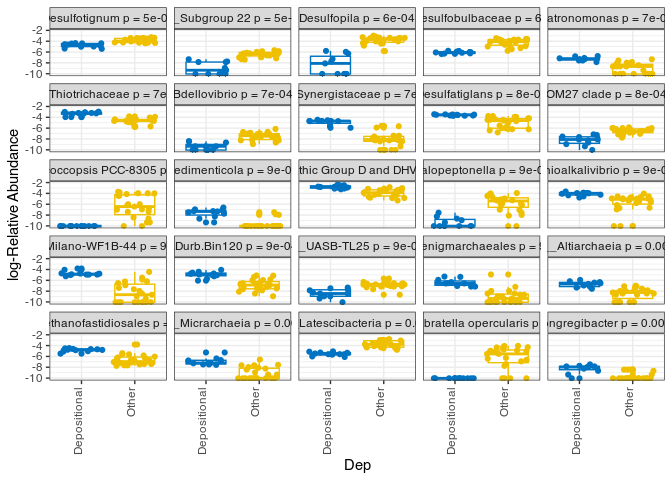<!-- -->

``` r
p + facet_wrap_paginate( ~ Taxa , scales="fixed", ncol=5, nrow=5, page = 2)
```

<!-- -->

``` r
p + facet_wrap_paginate( ~ Taxa , scales="fixed", ncol=5, nrow=5, page = 3)
```

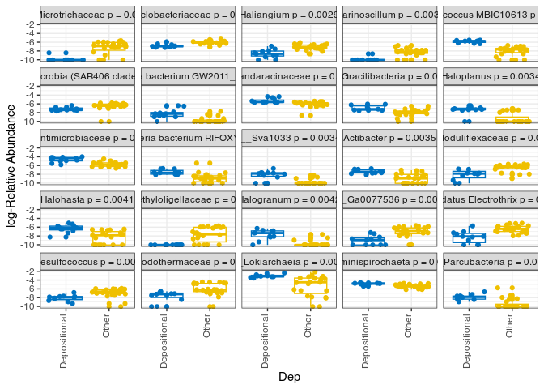<!-- -->

``` r
p + facet_wrap_paginate( ~ Taxa , scales="fixed", ncol=5, nrow=5, page = 4)
```

<!-- -->

``` r
p + facet_wrap_paginate( ~ Taxa , scales="fixed", ncol=5, nrow=5, page = 5)
```

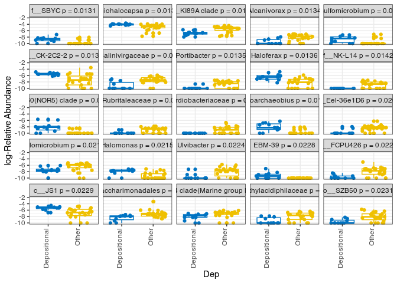<!-- -->

``` r
p + facet_wrap_paginate( ~ Taxa , scales="fixed", ncol=5, nrow=5, page = 6)
```

<!-- -->

``` r
p + facet_wrap_paginate( ~ Taxa , scales="fixed", ncol=5, nrow=5, page = 7)
```

<!-- -->

``` r
# Split the Taxa and p-value and transform values to %
df2 <- df %>%
  separate(Taxa, into = c("Taxa", "p_value"), sep = " p = ") %>%
  mutate(Value = exp(Value)) %>%
  mutate(Value = Value*100)

summary_table <- df2 %>%
  group_by(Taxa, Dep) %>%
  summarise(
    Mean = mean(Value),
    Error = sd(Value) / sqrt(n()),
    p_value = first(p_value),
    .groups = "drop" # This line helps to ungroup the data after summarising
  ) %>%
  pivot_wider(names_from = Dep, values_from = c(Mean, Error), 
              names_glue = "{.value}_{.name}")

# Calculate the mean and standard error for each group and taxon
summary_table <- df2 %>%
  group_by(Taxa, Dep) %>%
  summarise(
    Mean = round(mean(Value), 4),
    Error = round(sd(Value) / sqrt(n()), 4),
    p_value = first(p_value),
    .groups = "drop"
  ) %>%
  pivot_wider(names_from = Dep, values_from = c(Mean, Error)) 

# Rename the columns to reflect the correct Mean and Error for Depositional and Other
colnames(summary_table)[c(3, 4)] <- c("Mean_Depositional", "Mean_Other")
colnames(summary_table)[c(5, 6)] <- c("Error_Depositional", "Error_Other")

# Combine the mean and error into the desired format: value ± error
library(glue)
summary_table <- summary_table %>%
  transmute(
    Taxa,
    Depositional = glue("{format(Mean_Depositional, scientific = FALSE, digits = 4)} ± {format(Error_Depositional, scientific = FALSE, digits = 4)}"),
    Other = glue("{format(Mean_Other, scientific = FALSE, digits = 4)} ± {format(Error_Other, scientific = FALSE, digits = 4)}"),
    p_value
  )

summary_table <- summary_table %>%
    arrange(as.numeric(p_value))

# Write to Excel
library(writexl)
write_xlsx(summary_table, "KW_alltax_summary_table.xlsx")


#pull out relevant taxa before going further
mgens <- c("f__Methermicoccaceae", "o__Methanomassiliicoccales", "Methanococcoides", "o__Methanofastidiosales")
mtrophs <- c("f__Methyloligellaceae", "f__Methylacidiphilaceae", "Methylophaga", "Methyloceanibacter")
#Others
# "Methanolobus", 
#            #"Methanocorpusculum", "Methanogenium", "Methanosarcina", "f__Methanosarcinaceae", "Methanohalobium", "Methanohalophilus", "Methanolobus",
#           # "Methylohalomonas", "Methylobacterium", "Methylotenera", "f__Methylophagaceae", "Marine Methylotrophic Group 3", "Methylohalobius", "Methyloceanibacter", "Methylophaga", "f__Methyloligellaceae")

#Now we plot relevant mgens
df <- NULL
for(i in mtrophs){
  p_val <- round(kruskal.wallis.table[kruskal.wallis.table$id == i, "q.value"], 5)
  tmp <- data.frame(data[,i], groups, rep(i, dim(data)[1]), rep(p_val, dim(data)[1]))
  if(is.null(df)){df <- tmp} else {df <- rbind(df, tmp)} 
}
colnames(df)<-c("Value","Dep","Taxa", "q")

library(rstatix)
library(ggpubr)

stat.test <- df %>%
  group_by(Taxa) %>%
  wilcox_test(Value ~ Dep) %>%
  adjust_pvalue()
stat.test<- stat.test %>% add_xy_position(x = "Dep")

#Painful, but need to do a wilcoxon test with rstatix then plug in our DESeq2-determined qvalues afterwards
#top row mgens, bottom mtrophs
#stat.test$p.adj <- c(0.02350, 0.00590, 0.00096, 0.00765)
stat.test$p.adj <- c(0.00587,0.02783, 0.08138, 0.15082)
p <- ggplot(df, mapping = aes(x = Dep, y = Value, fill = Dep)) 
  
p <- ggboxplot(df, x = "Dep", y = "Value",fill="Dep") + scale_fill_jco() + scale_color_jco() + ylab("log-Relative abundance")

p1 <- facet(p, facet.by = "Taxa", strip.position = "right", nrow = 1) + geom_jitter() + stat_pvalue_manual(stat.test, label = "p.adj", label.size = 3) + theme_bw() + theme(axis.text.x=element_blank(), axis.title.x = element_blank(), axis.ticks.x=element_blank(), legend.title=element_blank())
p1
```

<!-- -->

``` r
ggsave(path = "~/Documents/Postgrad/Figures/June_Methane/draft2", "MtrophKW_jit.png", width = 7, height = 4, device = 'png', dpi = 500)
```

#### Spearman corrs of taxa with CH4pw

``` r
metadata <- metadata[metadata$dep %in% c("Depositional", "Other"), ]

# Extract the taxa names from summary table (replace with actual extraction method)
taxa_names <- summary_table$Taxa

# Select the corresponding columns from the data DataFrame
selected_data <- data[, taxa_names]

# Merge the selected data with metadata based on sample-id
merged_data <- merge(selected_data, metadata, by.x = "row.names", by.y = "sample-id")

# Loop through the taxa and run Spearman correlations with desired metadata variable (e.g., temp_c)
# for (taxon in taxa_names) {
#   correlation <- cor.test(merged_data[[taxon]], merged_data$CH4pw, method = "spearman")
#   print(paste("Correlation with", taxon, ":", correlation$estimate))
# }

# Initialize an empty data frame to store the results
correlation_results <- data.frame(
  taxon = character(),
  correlation = numeric(),
  p_value = numeric()
)

# Loop through the taxa and run Spearman correlations with desired metadata variable (e.g., temp_c)
for (taxon in taxa_names) {
  correlation <- cor.test(abund_table[[taxon]], merged_data$CH4pw, method = "spearman")
  
  # Create a data frame with the results for this taxon
  result <- data.frame(
    taxon = taxon,
    correlation = correlation$estimate,
    p_value = correlation$p.value
  )
  
  # Bind the results to the main results data frame
  correlation_results <- rbind(correlation_results, result)
}
```

    ## Warning in cor.test.default(abund_table[[taxon]], merged_data$CH4pw, method =
    ## "spearman"): Cannot compute exact p-value with ties

    ## Warning in cor.test.default(abund_table[[taxon]], merged_data$CH4pw, method =
    ## "spearman"): Cannot compute exact p-value with ties

    ## Warning in cor.test.default(abund_table[[taxon]], merged_data$CH4pw, method =
    ## "spearman"): Cannot compute exact p-value with ties

    ## Warning in cor.test.default(abund_table[[taxon]], merged_data$CH4pw, method =
    ## "spearman"): Cannot compute exact p-value with ties

    ## Warning in cor.test.default(abund_table[[taxon]], merged_data$CH4pw, method =
    ## "spearman"): Cannot compute exact p-value with ties

    ## Warning in cor.test.default(abund_table[[taxon]], merged_data$CH4pw, method =
    ## "spearman"): Cannot compute exact p-value with ties

    ## Warning in cor.test.default(abund_table[[taxon]], merged_data$CH4pw, method =
    ## "spearman"): Cannot compute exact p-value with ties

    ## Warning in cor.test.default(abund_table[[taxon]], merged_data$CH4pw, method =
    ## "spearman"): Cannot compute exact p-value with ties

    ## Warning in cor.test.default(abund_table[[taxon]], merged_data$CH4pw, method =
    ## "spearman"): Cannot compute exact p-value with ties

    ## Warning in cor.test.default(abund_table[[taxon]], merged_data$CH4pw, method =
    ## "spearman"): Cannot compute exact p-value with ties

    ## Warning in cor.test.default(abund_table[[taxon]], merged_data$CH4pw, method =
    ## "spearman"): Cannot compute exact p-value with ties

    ## Warning in cor.test.default(abund_table[[taxon]], merged_data$CH4pw, method =
    ## "spearman"): Cannot compute exact p-value with ties

    ## Warning in cor.test.default(abund_table[[taxon]], merged_data$CH4pw, method =
    ## "spearman"): Cannot compute exact p-value with ties

    ## Warning in cor.test.default(abund_table[[taxon]], merged_data$CH4pw, method =
    ## "spearman"): Cannot compute exact p-value with ties

    ## Warning in cor.test.default(abund_table[[taxon]], merged_data$CH4pw, method =
    ## "spearman"): Cannot compute exact p-value with ties

    ## Warning in cor.test.default(abund_table[[taxon]], merged_data$CH4pw, method =
    ## "spearman"): Cannot compute exact p-value with ties

    ## Warning in cor.test.default(abund_table[[taxon]], merged_data$CH4pw, method =
    ## "spearman"): Cannot compute exact p-value with ties

    ## Warning in cor.test.default(abund_table[[taxon]], merged_data$CH4pw, method =
    ## "spearman"): Cannot compute exact p-value with ties

    ## Warning in cor.test.default(abund_table[[taxon]], merged_data$CH4pw, method =
    ## "spearman"): Cannot compute exact p-value with ties

    ## Warning in cor.test.default(abund_table[[taxon]], merged_data$CH4pw, method =
    ## "spearman"): Cannot compute exact p-value with ties

    ## Warning in cor.test.default(abund_table[[taxon]], merged_data$CH4pw, method =
    ## "spearman"): Cannot compute exact p-value with ties

    ## Warning in cor.test.default(abund_table[[taxon]], merged_data$CH4pw, method =
    ## "spearman"): Cannot compute exact p-value with ties

    ## Warning in cor.test.default(abund_table[[taxon]], merged_data$CH4pw, method =
    ## "spearman"): Cannot compute exact p-value with ties

    ## Warning in cor.test.default(abund_table[[taxon]], merged_data$CH4pw, method =
    ## "spearman"): Cannot compute exact p-value with ties

    ## Warning in cor.test.default(abund_table[[taxon]], merged_data$CH4pw, method =
    ## "spearman"): Cannot compute exact p-value with ties

    ## Warning in cor.test.default(abund_table[[taxon]], merged_data$CH4pw, method =
    ## "spearman"): Cannot compute exact p-value with ties

    ## Warning in cor.test.default(abund_table[[taxon]], merged_data$CH4pw, method =
    ## "spearman"): Cannot compute exact p-value with ties

    ## Warning in cor.test.default(abund_table[[taxon]], merged_data$CH4pw, method =
    ## "spearman"): Cannot compute exact p-value with ties

    ## Warning in cor.test.default(abund_table[[taxon]], merged_data$CH4pw, method =
    ## "spearman"): Cannot compute exact p-value with ties

    ## Warning in cor.test.default(abund_table[[taxon]], merged_data$CH4pw, method =
    ## "spearman"): Cannot compute exact p-value with ties

    ## Warning in cor.test.default(abund_table[[taxon]], merged_data$CH4pw, method =
    ## "spearman"): Cannot compute exact p-value with ties

    ## Warning in cor.test.default(abund_table[[taxon]], merged_data$CH4pw, method =
    ## "spearman"): Cannot compute exact p-value with ties

    ## Warning in cor.test.default(abund_table[[taxon]], merged_data$CH4pw, method =
    ## "spearman"): Cannot compute exact p-value with ties

    ## Warning in cor.test.default(abund_table[[taxon]], merged_data$CH4pw, method =
    ## "spearman"): Cannot compute exact p-value with ties

    ## Warning in cor.test.default(abund_table[[taxon]], merged_data$CH4pw, method =
    ## "spearman"): Cannot compute exact p-value with ties

    ## Warning in cor.test.default(abund_table[[taxon]], merged_data$CH4pw, method =
    ## "spearman"): Cannot compute exact p-value with ties

    ## Warning in cor.test.default(abund_table[[taxon]], merged_data$CH4pw, method =
    ## "spearman"): Cannot compute exact p-value with ties

    ## Warning in cor.test.default(abund_table[[taxon]], merged_data$CH4pw, method =
    ## "spearman"): Cannot compute exact p-value with ties

    ## Warning in cor.test.default(abund_table[[taxon]], merged_data$CH4pw, method =
    ## "spearman"): Cannot compute exact p-value with ties

    ## Warning in cor.test.default(abund_table[[taxon]], merged_data$CH4pw, method =
    ## "spearman"): Cannot compute exact p-value with ties

    ## Warning in cor.test.default(abund_table[[taxon]], merged_data$CH4pw, method =
    ## "spearman"): Cannot compute exact p-value with ties

    ## Warning in cor.test.default(abund_table[[taxon]], merged_data$CH4pw, method =
    ## "spearman"): Cannot compute exact p-value with ties

    ## Warning in cor.test.default(abund_table[[taxon]], merged_data$CH4pw, method =
    ## "spearman"): Cannot compute exact p-value with ties

    ## Warning in cor.test.default(abund_table[[taxon]], merged_data$CH4pw, method =
    ## "spearman"): Cannot compute exact p-value with ties

    ## Warning in cor.test.default(abund_table[[taxon]], merged_data$CH4pw, method =
    ## "spearman"): Cannot compute exact p-value with ties

    ## Warning in cor.test.default(abund_table[[taxon]], merged_data$CH4pw, method =
    ## "spearman"): Cannot compute exact p-value with ties

    ## Warning in cor.test.default(abund_table[[taxon]], merged_data$CH4pw, method =
    ## "spearman"): Cannot compute exact p-value with ties

    ## Warning in cor.test.default(abund_table[[taxon]], merged_data$CH4pw, method =
    ## "spearman"): Cannot compute exact p-value with ties

    ## Warning in cor.test.default(abund_table[[taxon]], merged_data$CH4pw, method =
    ## "spearman"): Cannot compute exact p-value with ties

    ## Warning in cor.test.default(abund_table[[taxon]], merged_data$CH4pw, method =
    ## "spearman"): Cannot compute exact p-value with ties

    ## Warning in cor.test.default(abund_table[[taxon]], merged_data$CH4pw, method =
    ## "spearman"): Cannot compute exact p-value with ties

    ## Warning in cor.test.default(abund_table[[taxon]], merged_data$CH4pw, method =
    ## "spearman"): Cannot compute exact p-value with ties

    ## Warning in cor.test.default(abund_table[[taxon]], merged_data$CH4pw, method =
    ## "spearman"): Cannot compute exact p-value with ties

    ## Warning in cor.test.default(abund_table[[taxon]], merged_data$CH4pw, method =
    ## "spearman"): Cannot compute exact p-value with ties

    ## Warning in cor.test.default(abund_table[[taxon]], merged_data$CH4pw, method =
    ## "spearman"): Cannot compute exact p-value with ties

    ## Warning in cor.test.default(abund_table[[taxon]], merged_data$CH4pw, method =
    ## "spearman"): Cannot compute exact p-value with ties

    ## Warning in cor.test.default(abund_table[[taxon]], merged_data$CH4pw, method =
    ## "spearman"): Cannot compute exact p-value with ties

    ## Warning in cor.test.default(abund_table[[taxon]], merged_data$CH4pw, method =
    ## "spearman"): Cannot compute exact p-value with ties

    ## Warning in cor.test.default(abund_table[[taxon]], merged_data$CH4pw, method =
    ## "spearman"): Cannot compute exact p-value with ties

    ## Warning in cor.test.default(abund_table[[taxon]], merged_data$CH4pw, method =
    ## "spearman"): Cannot compute exact p-value with ties

    ## Warning in cor.test.default(abund_table[[taxon]], merged_data$CH4pw, method =
    ## "spearman"): Cannot compute exact p-value with ties

    ## Warning in cor.test.default(abund_table[[taxon]], merged_data$CH4pw, method =
    ## "spearman"): Cannot compute exact p-value with ties

    ## Warning in cor.test.default(abund_table[[taxon]], merged_data$CH4pw, method =
    ## "spearman"): Cannot compute exact p-value with ties

    ## Warning in cor.test.default(abund_table[[taxon]], merged_data$CH4pw, method =
    ## "spearman"): Cannot compute exact p-value with ties

    ## Warning in cor.test.default(abund_table[[taxon]], merged_data$CH4pw, method =
    ## "spearman"): Cannot compute exact p-value with ties

    ## Warning in cor.test.default(abund_table[[taxon]], merged_data$CH4pw, method =
    ## "spearman"): Cannot compute exact p-value with ties

    ## Warning in cor.test.default(abund_table[[taxon]], merged_data$CH4pw, method =
    ## "spearman"): Cannot compute exact p-value with ties

    ## Warning in cor.test.default(abund_table[[taxon]], merged_data$CH4pw, method =
    ## "spearman"): Cannot compute exact p-value with ties

    ## Warning in cor.test.default(abund_table[[taxon]], merged_data$CH4pw, method =
    ## "spearman"): Cannot compute exact p-value with ties

    ## Warning in cor.test.default(abund_table[[taxon]], merged_data$CH4pw, method =
    ## "spearman"): Cannot compute exact p-value with ties

    ## Warning in cor.test.default(abund_table[[taxon]], merged_data$CH4pw, method =
    ## "spearman"): Cannot compute exact p-value with ties

    ## Warning in cor.test.default(abund_table[[taxon]], merged_data$CH4pw, method =
    ## "spearman"): Cannot compute exact p-value with ties

    ## Warning in cor.test.default(abund_table[[taxon]], merged_data$CH4pw, method =
    ## "spearman"): Cannot compute exact p-value with ties

    ## Warning in cor.test.default(abund_table[[taxon]], merged_data$CH4pw, method =
    ## "spearman"): Cannot compute exact p-value with ties

    ## Warning in cor.test.default(abund_table[[taxon]], merged_data$CH4pw, method =
    ## "spearman"): Cannot compute exact p-value with ties

    ## Warning in cor.test.default(abund_table[[taxon]], merged_data$CH4pw, method =
    ## "spearman"): Cannot compute exact p-value with ties

    ## Warning in cor.test.default(abund_table[[taxon]], merged_data$CH4pw, method =
    ## "spearman"): Cannot compute exact p-value with ties

    ## Warning in cor.test.default(abund_table[[taxon]], merged_data$CH4pw, method =
    ## "spearman"): Cannot compute exact p-value with ties

    ## Warning in cor.test.default(abund_table[[taxon]], merged_data$CH4pw, method =
    ## "spearman"): Cannot compute exact p-value with ties

    ## Warning in cor.test.default(abund_table[[taxon]], merged_data$CH4pw, method =
    ## "spearman"): Cannot compute exact p-value with ties

    ## Warning in cor.test.default(abund_table[[taxon]], merged_data$CH4pw, method =
    ## "spearman"): Cannot compute exact p-value with ties

    ## Warning in cor.test.default(abund_table[[taxon]], merged_data$CH4pw, method =
    ## "spearman"): Cannot compute exact p-value with ties

    ## Warning in cor.test.default(abund_table[[taxon]], merged_data$CH4pw, method =
    ## "spearman"): Cannot compute exact p-value with ties

    ## Warning in cor.test.default(abund_table[[taxon]], merged_data$CH4pw, method =
    ## "spearman"): Cannot compute exact p-value with ties

    ## Warning in cor.test.default(abund_table[[taxon]], merged_data$CH4pw, method =
    ## "spearman"): Cannot compute exact p-value with ties

    ## Warning in cor.test.default(abund_table[[taxon]], merged_data$CH4pw, method =
    ## "spearman"): Cannot compute exact p-value with ties

    ## Warning in cor.test.default(abund_table[[taxon]], merged_data$CH4pw, method =
    ## "spearman"): Cannot compute exact p-value with ties

    ## Warning in cor.test.default(abund_table[[taxon]], merged_data$CH4pw, method =
    ## "spearman"): Cannot compute exact p-value with ties

    ## Warning in cor.test.default(abund_table[[taxon]], merged_data$CH4pw, method =
    ## "spearman"): Cannot compute exact p-value with ties

    ## Warning in cor.test.default(abund_table[[taxon]], merged_data$CH4pw, method =
    ## "spearman"): Cannot compute exact p-value with ties

    ## Warning in cor.test.default(abund_table[[taxon]], merged_data$CH4pw, method =
    ## "spearman"): Cannot compute exact p-value with ties

    ## Warning in cor.test.default(abund_table[[taxon]], merged_data$CH4pw, method =
    ## "spearman"): Cannot compute exact p-value with ties

    ## Warning in cor.test.default(abund_table[[taxon]], merged_data$CH4pw, method =
    ## "spearman"): Cannot compute exact p-value with ties

    ## Warning in cor.test.default(abund_table[[taxon]], merged_data$CH4pw, method =
    ## "spearman"): Cannot compute exact p-value with ties

    ## Warning in cor.test.default(abund_table[[taxon]], merged_data$CH4pw, method =
    ## "spearman"): Cannot compute exact p-value with ties

    ## Warning in cor.test.default(abund_table[[taxon]], merged_data$CH4pw, method =
    ## "spearman"): Cannot compute exact p-value with ties

    ## Warning in cor.test.default(abund_table[[taxon]], merged_data$CH4pw, method =
    ## "spearman"): Cannot compute exact p-value with ties

    ## Warning in cor.test.default(abund_table[[taxon]], merged_data$CH4pw, method =
    ## "spearman"): Cannot compute exact p-value with ties

    ## Warning in cor.test.default(abund_table[[taxon]], merged_data$CH4pw, method =
    ## "spearman"): Cannot compute exact p-value with ties

    ## Warning in cor.test.default(abund_table[[taxon]], merged_data$CH4pw, method =
    ## "spearman"): Cannot compute exact p-value with ties

    ## Warning in cor.test.default(abund_table[[taxon]], merged_data$CH4pw, method =
    ## "spearman"): Cannot compute exact p-value with ties

    ## Warning in cor.test.default(abund_table[[taxon]], merged_data$CH4pw, method =
    ## "spearman"): Cannot compute exact p-value with ties

    ## Warning in cor.test.default(abund_table[[taxon]], merged_data$CH4pw, method =
    ## "spearman"): Cannot compute exact p-value with ties

    ## Warning in cor.test.default(abund_table[[taxon]], merged_data$CH4pw, method =
    ## "spearman"): Cannot compute exact p-value with ties

    ## Warning in cor.test.default(abund_table[[taxon]], merged_data$CH4pw, method =
    ## "spearman"): Cannot compute exact p-value with ties

    ## Warning in cor.test.default(abund_table[[taxon]], merged_data$CH4pw, method =
    ## "spearman"): Cannot compute exact p-value with ties

    ## Warning in cor.test.default(abund_table[[taxon]], merged_data$CH4pw, method =
    ## "spearman"): Cannot compute exact p-value with ties

    ## Warning in cor.test.default(abund_table[[taxon]], merged_data$CH4pw, method =
    ## "spearman"): Cannot compute exact p-value with ties

    ## Warning in cor.test.default(abund_table[[taxon]], merged_data$CH4pw, method =
    ## "spearman"): Cannot compute exact p-value with ties

    ## Warning in cor.test.default(abund_table[[taxon]], merged_data$CH4pw, method =
    ## "spearman"): Cannot compute exact p-value with ties

    ## Warning in cor.test.default(abund_table[[taxon]], merged_data$CH4pw, method =
    ## "spearman"): Cannot compute exact p-value with ties

    ## Warning in cor.test.default(abund_table[[taxon]], merged_data$CH4pw, method =
    ## "spearman"): Cannot compute exact p-value with ties

    ## Warning in cor.test.default(abund_table[[taxon]], merged_data$CH4pw, method =
    ## "spearman"): Cannot compute exact p-value with ties

    ## Warning in cor.test.default(abund_table[[taxon]], merged_data$CH4pw, method =
    ## "spearman"): Cannot compute exact p-value with ties

    ## Warning in cor.test.default(abund_table[[taxon]], merged_data$CH4pw, method =
    ## "spearman"): Cannot compute exact p-value with ties

    ## Warning in cor.test.default(abund_table[[taxon]], merged_data$CH4pw, method =
    ## "spearman"): Cannot compute exact p-value with ties

    ## Warning in cor.test.default(abund_table[[taxon]], merged_data$CH4pw, method =
    ## "spearman"): Cannot compute exact p-value with ties

    ## Warning in cor.test.default(abund_table[[taxon]], merged_data$CH4pw, method =
    ## "spearman"): Cannot compute exact p-value with ties

    ## Warning in cor.test.default(abund_table[[taxon]], merged_data$CH4pw, method =
    ## "spearman"): Cannot compute exact p-value with ties

    ## Warning in cor.test.default(abund_table[[taxon]], merged_data$CH4pw, method =
    ## "spearman"): Cannot compute exact p-value with ties

    ## Warning in cor.test.default(abund_table[[taxon]], merged_data$CH4pw, method =
    ## "spearman"): Cannot compute exact p-value with ties

    ## Warning in cor.test.default(abund_table[[taxon]], merged_data$CH4pw, method =
    ## "spearman"): Cannot compute exact p-value with ties

    ## Warning in cor.test.default(abund_table[[taxon]], merged_data$CH4pw, method =
    ## "spearman"): Cannot compute exact p-value with ties

    ## Warning in cor.test.default(abund_table[[taxon]], merged_data$CH4pw, method =
    ## "spearman"): Cannot compute exact p-value with ties

    ## Warning in cor.test.default(abund_table[[taxon]], merged_data$CH4pw, method =
    ## "spearman"): Cannot compute exact p-value with ties

    ## Warning in cor.test.default(abund_table[[taxon]], merged_data$CH4pw, method =
    ## "spearman"): Cannot compute exact p-value with ties

    ## Warning in cor.test.default(abund_table[[taxon]], merged_data$CH4pw, method =
    ## "spearman"): Cannot compute exact p-value with ties

    ## Warning in cor.test.default(abund_table[[taxon]], merged_data$CH4pw, method =
    ## "spearman"): Cannot compute exact p-value with ties

    ## Warning in cor.test.default(abund_table[[taxon]], merged_data$CH4pw, method =
    ## "spearman"): Cannot compute exact p-value with ties

    ## Warning in cor.test.default(abund_table[[taxon]], merged_data$CH4pw, method =
    ## "spearman"): Cannot compute exact p-value with ties

    ## Warning in cor.test.default(abund_table[[taxon]], merged_data$CH4pw, method =
    ## "spearman"): Cannot compute exact p-value with ties

    ## Warning in cor.test.default(abund_table[[taxon]], merged_data$CH4pw, method =
    ## "spearman"): Cannot compute exact p-value with ties

    ## Warning in cor.test.default(abund_table[[taxon]], merged_data$CH4pw, method =
    ## "spearman"): Cannot compute exact p-value with ties

    ## Warning in cor.test.default(abund_table[[taxon]], merged_data$CH4pw, method =
    ## "spearman"): Cannot compute exact p-value with ties

    ## Warning in cor.test.default(abund_table[[taxon]], merged_data$CH4pw, method =
    ## "spearman"): Cannot compute exact p-value with ties

    ## Warning in cor.test.default(abund_table[[taxon]], merged_data$CH4pw, method =
    ## "spearman"): Cannot compute exact p-value with ties

    ## Warning in cor.test.default(abund_table[[taxon]], merged_data$CH4pw, method =
    ## "spearman"): Cannot compute exact p-value with ties

    ## Warning in cor.test.default(abund_table[[taxon]], merged_data$CH4pw, method =
    ## "spearman"): Cannot compute exact p-value with ties

    ## Warning in cor.test.default(abund_table[[taxon]], merged_data$CH4pw, method =
    ## "spearman"): Cannot compute exact p-value with ties

    ## Warning in cor.test.default(abund_table[[taxon]], merged_data$CH4pw, method =
    ## "spearman"): Cannot compute exact p-value with ties

    ## Warning in cor.test.default(abund_table[[taxon]], merged_data$CH4pw, method =
    ## "spearman"): Cannot compute exact p-value with ties

    ## Warning in cor.test.default(abund_table[[taxon]], merged_data$CH4pw, method =
    ## "spearman"): Cannot compute exact p-value with ties

    ## Warning in cor.test.default(abund_table[[taxon]], merged_data$CH4pw, method =
    ## "spearman"): Cannot compute exact p-value with ties

    ## Warning in cor.test.default(abund_table[[taxon]], merged_data$CH4pw, method =
    ## "spearman"): Cannot compute exact p-value with ties

    ## Warning in cor.test.default(abund_table[[taxon]], merged_data$CH4pw, method =
    ## "spearman"): Cannot compute exact p-value with ties

    ## Warning in cor.test.default(abund_table[[taxon]], merged_data$CH4pw, method =
    ## "spearman"): Cannot compute exact p-value with ties

    ## Warning in cor.test.default(abund_table[[taxon]], merged_data$CH4pw, method =
    ## "spearman"): Cannot compute exact p-value with ties

    ## Warning in cor.test.default(abund_table[[taxon]], merged_data$CH4pw, method =
    ## "spearman"): Cannot compute exact p-value with ties

    ## Warning in cor.test.default(abund_table[[taxon]], merged_data$CH4pw, method =
    ## "spearman"): Cannot compute exact p-value with ties

    ## Warning in cor.test.default(abund_table[[taxon]], merged_data$CH4pw, method =
    ## "spearman"): Cannot compute exact p-value with ties

    ## Warning in cor.test.default(abund_table[[taxon]], merged_data$CH4pw, method =
    ## "spearman"): Cannot compute exact p-value with ties

    ## Warning in cor.test.default(abund_table[[taxon]], merged_data$CH4pw, method =
    ## "spearman"): Cannot compute exact p-value with ties

    ## Warning in cor.test.default(abund_table[[taxon]], merged_data$CH4pw, method =
    ## "spearman"): Cannot compute exact p-value with ties

    ## Warning in cor.test.default(abund_table[[taxon]], merged_data$CH4pw, method =
    ## "spearman"): Cannot compute exact p-value with ties

    ## Warning in cor.test.default(abund_table[[taxon]], merged_data$CH4pw, method =
    ## "spearman"): Cannot compute exact p-value with ties

    ## Warning in cor.test.default(abund_table[[taxon]], merged_data$CH4pw, method =
    ## "spearman"): Cannot compute exact p-value with ties

    ## Warning in cor.test.default(abund_table[[taxon]], merged_data$CH4pw, method =
    ## "spearman"): Cannot compute exact p-value with ties

    ## Warning in cor.test.default(abund_table[[taxon]], merged_data$CH4pw, method =
    ## "spearman"): Cannot compute exact p-value with ties

    ## Warning in cor.test.default(abund_table[[taxon]], merged_data$CH4pw, method =
    ## "spearman"): Cannot compute exact p-value with ties

    ## Warning in cor.test.default(abund_table[[taxon]], merged_data$CH4pw, method =
    ## "spearman"): Cannot compute exact p-value with ties

    ## Warning in cor.test.default(abund_table[[taxon]], merged_data$CH4pw, method =
    ## "spearman"): Cannot compute exact p-value with ties

    ## Warning in cor.test.default(abund_table[[taxon]], merged_data$CH4pw, method =
    ## "spearman"): Cannot compute exact p-value with ties

    ## Warning in cor.test.default(abund_table[[taxon]], merged_data$CH4pw, method =
    ## "spearman"): Cannot compute exact p-value with ties

    ## Warning in cor.test.default(abund_table[[taxon]], merged_data$CH4pw, method =
    ## "spearman"): Cannot compute exact p-value with ties

    ## Warning in cor.test.default(abund_table[[taxon]], merged_data$CH4pw, method =
    ## "spearman"): Cannot compute exact p-value with ties

    ## Warning in cor.test.default(abund_table[[taxon]], merged_data$CH4pw, method =
    ## "spearman"): Cannot compute exact p-value with ties

    ## Warning in cor.test.default(abund_table[[taxon]], merged_data$CH4pw, method =
    ## "spearman"): Cannot compute exact p-value with ties

    ## Warning in cor.test.default(abund_table[[taxon]], merged_data$CH4pw, method =
    ## "spearman"): Cannot compute exact p-value with ties

    ## Warning in cor.test.default(abund_table[[taxon]], merged_data$CH4pw, method =
    ## "spearman"): Cannot compute exact p-value with ties

    ## Warning in cor.test.default(abund_table[[taxon]], merged_data$CH4pw, method =
    ## "spearman"): Cannot compute exact p-value with ties

    ## Warning in cor.test.default(abund_table[[taxon]], merged_data$CH4pw, method =
    ## "spearman"): Cannot compute exact p-value with ties

``` r
# Print the results
print(correlation_results)
```

    ##                                                             taxon correlation
    ## rho                                                 Desulfotignum -0.86784693
    ## rho1                                               c__Subgroup 22 -0.36812778
    ## rho2                                                  Desulfopila -0.58061342
    ## rho3                                          f__Desulfobulbaceae -0.61107604
    ## rho4                                                 Bdellovibrio -0.61347970
    ## rho5                                                 Natronomonas  0.56492033
    ## rho6                                            f__Synergistaceae  0.38474857
    ## rho7                                            f__Thiotrichaceae  0.41048765
    ## rho8                                    Dactylococcopsis PCC-8305 -0.58841185
    ## rho9                                               Desulfatiglans  0.71848335
    ## rho10                                                  OM27 clade -0.60046864
    ## rho11                                                ADurb.Bin120  0.69414177
    ## rho12                                              Halopeptonella -0.38636205
    ## rho13                                               Sedimenticola  0.34262138
    ## rho14                                            Thioalkalivibrio  0.48533045
    ## rho15                                                f__UASB-TL25 -0.46930902
    ## rho16                                         o__Aenigmarchaeales  0.62194630
    ## rho17                       o__Marine Benthic Group D and DHVEG-1  0.55879790
    ## rho18                                           o__Milano-WF1B-44  0.71409803
    ## rho19                                             c__Altiarchaeia  0.51984189
    ## rho20                                          c__Latescibacteria -0.57686873
    ## rho21                                             c__Micrarchaeia  0.77926640
    ## rho22                                     o__Methanofastidiosales  0.79796027
    ## rho23                                Planoglabratella opercularis -0.42675842
    ## rho24                                              Congregibacter  0.38897121
    ## rho25                                       f__Nitriliruptoraceae -0.55657161
    ## rho26                                                 o__AT-s2-59 -0.60987802
    ## rho27                                             o__CG1-02-42-13  0.61932555
    ## rho28                                        archaeon GW2011_AR13  0.59757482
    ## rho29                                    Candidatus Endomicrobium  0.67100671
    ## rho30                                  Candidatus Marispirochaeta -0.65570461
    ## rho31                                                 Halobaculum  0.65329389
    ## rho32                                      Sva0081 sediment group -0.56226290
    ## rho33                                      Candidatus Paceibacter  0.73509684
    ## rho34                                            c__Bathyarchaeia  0.70507633
    ## rho35                                           f__Arenicellaceae  0.26917551
    ## rho36                                            f__Syntrophaceae  0.58912532
    ## rho37                                       o__Puniceispirillales -0.51907881
    ## rho38                                                    o__SG8-5  0.33734679
    ## rho39                                              c__Subgroup 21 -0.48324660
    ## rho40                                              f__bacteriap25 -0.48297302
    ## rho41                                          o__Chitinophagales -0.56827000
    ## rho42                                                  o__SBR1031  0.62403028
    ## rho43                                                o__GWB1-42-6  0.60871469
    ## rho44                                               Haloterrigena  0.65563728
    ## rho45                                          c__Nanoarchaeaeota  0.65319574
    ## rho46                                      saltmarsh clone LCP-67 -0.44800623
    ## rho47                                                  Haliangium -0.56911673
    ## rho48                                                 Roseovarius -0.52748067
    ## rho49                                        f__Cyclobacteriaceae -0.65003422
    ## rho50                                          f__Microtrichaceae -0.35808619
    ## rho51                               o__Candidatus Portnoybacteria  0.53388156
    ## rho52                                                    o__NB1-j -0.39422979
    ## rho53                                               Marinoscillum -0.51238537
    ## rho54                                     Synechococcus MBIC10613  0.73802895
    ## rho55                            c__Marinimicrobia (SAR406 clade) -0.55396157
    ## rho56         Candidatus Amesbacteria bacterium GW2011_GWC1_47_15  0.43477368
    ## rho57                                          f__Sandaracinaceae  0.52237604
    ## rho58  Candidatus Staskawiczbacteria bacterium RIFOXYA2_FULL_32_7  0.35104114
    ## rho59                                                  Haloplanus  0.59652164
    ## rho60                                          c__Gracilibacteria  0.44112885
    ## rho61                                        f__Lentimicrobiaceae  0.11300181
    ## rho62                                                  f__Sva1033  0.42304211
    ## rho63                                                  Actibacter  0.63193004
    ## rho64                                          f__Moduliflexaceae -0.60966298
    ## rho65                                                   Halohasta  0.54753966
    ## rho66                                       f__Methyloligellaceae -0.35033071
    ## rho67                                                  Halogranum  0.41852665
    ## rho68                                                o__Ga0077536 -0.48182946
    ## rho69                                     Candidatus Electrothrix -0.54582547
    ## rho70                                               Desulfococcus -0.64044484
    ## rho71                                          f__Rhodothermaceae -0.39586869
    ## rho72                                             c__Lokiarchaeia  0.77818831
    ## rho73                                         Sediminispirochaeta  0.30789678
    ## rho74                                            c__Parcubacteria  0.54708203
    ## rho75                                        Sva0996 marine group -0.40409202
    ## rho76                                      f__Desulfovibrionaceae  0.15911253
    ## rho77                                                  k__Archaea  0.69272243
    ## rho78                                  o__Methanomassiliicoccales  0.16500153
    ## rho79                                            Coraliomargarita -0.59251912
    ## rho80                                                o__Run-SP154  0.27753221
    ## rho81                                            Methanococcoides  0.65132338
    ## rho82                                           f__Caldilineaceae  0.56573618
    ## rho83                                    o__UBA10353 marine group -0.47331208
    ## rho84                                                   f__PS-B29  0.73154740
    ## rho85                                                 o__WCHB1-41 -0.53458488
    ## rho86                                                  Haloferula -0.59959508
    ## rho87                                            o__Clostridiales -0.37629727
    ## rho88                                               Puniceicoccus -0.34323898
    ## rho89                                                 Subgroup 10 -0.25442140
    ## rho90                                                  Halorubrum  0.14569282
    ## rho91                                                   Halovivax  0.56832695
    ## rho92                                                  Arcobacter -0.22672612
    ## rho93                                          f__Calditrichaceae  0.06456231
    ## rho94                                                  Rhodovulum  0.18995644
    ## rho95                                                     c__WWE3  0.53307050
    ## rho96                                        f__Methermicoccaceae  0.37463700
    ## rho97                                          o__Fibrobacterales -0.38113622
    ## rho98                                              Aliifodinibius  0.44551838
    ## rho99                                                     f__SBYC  0.47662807
    ## rho100                               o__Bacteroidetes VC2.1 Bac22  0.04322243
    ## rho101                                              Thiohalocapsa  0.03481102
    ## rho102                                             o__KI89A clade -0.36477975
    ## rho103                                                Alcanivorax -0.38652455
    ## rho104                                           Desulfomicrobium  0.08473024
    ## rho105                                                Portibacter -0.32742657
    ## rho106                                                c__CK-2C2-2  0.68732641
    ## rho107                                         f__Salinivirgaceae -0.68866450
    ## rho108                                                  Haloferax  0.55729154
    ## rho109                                                  f__NK-L14 -0.47372061
    ## rho110                                           OM60(NOR5) clade  0.50984078
    ## rho111                                          f__Rubritaleaceae -0.35999848
    ## rho112                                      f__Cardiobacteriaceae -0.26121582
    ## rho113                                            Haloarchaeobius  0.61235704
    ## rho114                                              f__Eel-36e1D6 -0.27782716
    ## rho115                                              Filomicrobium -0.25319040
    ## rho116                                                  Halomonas  0.38829041
    ## rho117                                                 Ulvibacter -0.31974969
    ## rho118                                                     EBM-39  0.34688275
    ## rho119                                                 c__FCPU426 -0.66956958
    ## rho120                                                     c__JS1  0.63205174
    ## rho121                                    f__Methylacidiphilaceae -0.44241242
    ## rho122                            o__SAR324 clade(Marine group B) -0.15815657
    ## rho123                                       o__Saccharimonadales -0.53405103
    ## rho124                                                    PAUC26f -0.44169640
    ## rho125                                                   o__SZB50 -0.27085167
    ## rho126                                          f__Cryomorphaceae -0.56558840
    ## rho127                                        Ruminiclostridium 1 -0.55194731
    ## rho128                                               Sulfurimonas -0.33737522
    ## rho129                                                  f__DEV007 -0.27015528
    ## rho130                                                   o__MSBL5  0.74866048
    ## rho131                                                Subgroup 23 -0.38205865
    ## rho132                                          c__Actinobacteria  0.19936421
    ## rho133                                            o__Myxococcales  0.13968884
    ## rho134             Candidatus Pacearchaeota archaeon CG1_02_32_21  0.44469255
    ## rho135                                f__Methanomassiliicoccaceae  0.73105038
    ## rho136                                                BD1-7 clade -0.58360617
    ## rho137                                               Salinigranum  0.41478008
    ## rho138                                  f__Ectothiorhodospiraceae  0.20915719
    ## rho139                                       Halodurantibacterium -0.62017891
    ## rho140                                                    c__d142 -0.65382501
    ## rho141                                                   f__MSBL8  0.07743747
    ## rho142                                                    Woeseia -0.22950989
    ## rho143                                                 f__P3OB-42 -0.48957325
    ## rho144                                                    IheB3-7 -0.51703269
    ## rho145                                           Halothiobacillus  0.31565573
    ## rho146                                               Desulfocella -0.32152742
    ## rho147                                c__BD2-11 terrestrial group -0.18746954
    ## rho148                                             Halochromatium  0.03481102
    ## rho149                                               Gracilimonas  0.07156640
    ## rho150                                o__Candidatus Woesebacteria  0.51878920
    ## rho151                                                 Halapricum  0.58247512
    ## rho152                             o__Candidatus Yanofskybacteria  0.61777959
    ## rho153                                         f__Amoebophilaceae -0.51894784
    ## rho154                                           f__MAT-CR-H6-H10  0.63499918
    ## rho155                                            f__Balneolaceae -0.60753386
    ## rho156                                            Geothermobacter -0.48802325
    ## rho157                                                     Cm1-21 -0.05718819
    ## rho158                                         o__Cloacimonadales -0.38323869
    ## rho159                                              Marinilabilia -0.40886412
    ## rho160           Candidatus Aenigmarchaeota archaeon CG1_02_38_14  0.64402019
    ## rho161                                 o__Candidatus Pacebacteria  0.20995588
    ## rho162                                               Tangfeifania -0.59115666
    ## rho163                                       f__Izimaplasmataceae -0.52905760
    ## rho164                                                Desulfonema -0.43251662
    ## rho165                                                       AqS1 -0.23112744
    ## rho166                                               Methylophaga -0.26042283
    ## rho167                                               Tropicimonas -0.22742120
    ## rho168                                         o__Aminicenantales  0.76308601
    ## rho169                                              Psychroflexus -0.42408376
    ## rho170                                               c__vadinHA49 -0.15249103
    ##             p_value
    ## rho    2.595013e-10
    ## rho1   4.158956e-02
    ## rho2   6.161383e-04
    ## rho3   2.606378e-04
    ## rho4   2.426159e-04
    ## rho5   9.295048e-04
    ## rho6   3.258157e-02
    ## rho7   2.180644e-02
    ## rho8   4.983598e-04
    ## rho9   5.317241e-06
    ## rho10  3.551514e-04
    ## rho11  1.483740e-05
    ## rho12  3.179885e-02
    ## rho13  5.918684e-02
    ## rho14  5.648739e-03
    ## rho15  7.734308e-03
    ## rho16  1.876176e-04
    ## rho17  1.085299e-03
    ## rho18  6.446143e-06
    ## rho19  2.723593e-03
    ## rho20  6.809332e-04
    ## rho21  2.405697e-07
    ## rho22  7.594260e-08
    ## rho23  1.665576e-02
    ## rho24  3.056547e-02
    ## rho25  1.147368e-03
    ## rho26  2.700557e-04
    ## rho27  2.033181e-04
    ## rho28  3.857088e-04
    ## rho29  3.605011e-05
    ## rho30  6.223538e-05
    ## rho31  6.763907e-05
    ## rho32  9.945377e-04
    ## rho33  2.479562e-06
    ## rho34  9.475686e-06
    ## rho35  1.431117e-01
    ## rho36  4.886489e-04
    ## rho37  2.770164e-03
    ## rho38  6.346690e-02
    ## rho39  5.889324e-03
    ## rho40  5.921549e-03
    ## rho41  8.528627e-04
    ## rho42  1.759121e-04
    ## rho43  2.794885e-04
    ## rho44  6.238089e-05
    ## rho45  6.786771e-05
    ## rho46  1.148975e-02
    ## rho47  8.343903e-04
    ## rho48  2.293453e-03
    ## rho49  7.561253e-05
    ## rho50  4.793423e-02
    ## rho51  1.979660e-03
    ## rho52  2.819782e-02
    ## rho53  3.209044e-03
    ## rho54  2.154624e-06
    ## rho55  1.224069e-03
    ## rho56  1.451732e-02
    ## rho57  2.573754e-03
    ## rho58  5.282824e-02
    ## rho59  3.973936e-04
    ## rho60  1.298927e-02
    ## rho61  5.450089e-01
    ## rho62  1.773264e-02
    ## rho63  1.372145e-04
    ## rho64  2.717778e-04
    ## rho65  1.432155e-03
    ## rho66  5.334293e-02
    ## rho67  1.911820e-02
    ## rho68  6.057884e-03
    ## rho69  1.492665e-03
    ## rho70  1.041687e-04
    ## rho71  2.749129e-02
    ## rho72  2.562411e-07
    ## rho73  9.197598e-02
    ## rho74  1.448096e-03
    ## rho75  2.416108e-02
    ## rho76  3.925725e-01
    ## rho77  1.570437e-05
    ## rho78  3.750580e-01
    ## rho79  4.447054e-04
    ## rho80  1.306338e-01
    ## rho81  7.236383e-05
    ## rho82  9.103020e-04
    ## rho83  7.160103e-03
    ## rho84  2.932067e-06
    ## rho85  1.947570e-03
    ## rho86  3.641418e-04
    ## rho87  3.694051e-02
    ## rho88  5.870091e-02
    ## rho89  1.672181e-01
    ## rho90  4.341941e-01
    ## rho91  8.516091e-04
    ## rho92  2.199987e-01
    ## rho93  7.300523e-01
    ## rho94  3.060586e-01
    ## rho95  2.017234e-03
    ## rho96  3.784969e-02
    ## rho97  3.439066e-02
    ## rho98  1.201446e-02
    ## rho99  6.712276e-03
    ## rho100 8.174153e-01
    ## rho101 8.525147e-01
    ## rho102 4.362539e-02
    ## rho103 3.172087e-02
    ## rho104 6.504134e-01
    ## rho105 7.216905e-02
    ## rho106 1.943288e-05
    ## rho107 1.844067e-05
    ## rho108 1.126965e-03
    ## rho109 7.103595e-03
    ## rho110 3.390960e-03
    ## rho111 4.667008e-02
    ## rho112 1.557815e-01
    ## rho113 2.508907e-04
    ## rho114 1.302085e-01
    ## rho115 1.693524e-01
    ## rho116 3.088348e-02
    ## rho117 7.951686e-02
    ## rho118 5.589745e-02
    ## rho119 3.799739e-05
    ## rho120 1.366830e-04
    ## rho121 1.269760e-02
    ## rho122 3.954592e-01
    ## rho123 1.971886e-03
    ## rho124 1.285962e-02
    ## rho125 1.405421e-01
    ## rho126 9.137543e-04
    ## rho127 1.286289e-03
    ## rho128 6.344319e-02
    ## rho129 1.416056e-01
    ## rho130 1.274445e-06
    ## rho131 3.392116e-02
    ## rho132 2.822683e-01
    ## rho133 4.535682e-01
    ## rho134 1.219301e-02
    ## rho135 3.001082e-06
    ## rho136 5.683218e-04
    ## rho137 2.033476e-02
    ## rho138 2.588019e-01
    ## rho139 1.980821e-04
    ## rho140 6.641374e-05
    ## rho141 6.788313e-01
    ## rho142 2.142349e-01
    ## rho143 5.184732e-03
    ## rho144 2.898454e-03
    ## rho145 8.366387e-02
    ## rho146 7.776617e-02
    ## rho147 3.125517e-01
    ## rho148 8.525147e-01
    ## rho149 7.020301e-01
    ## rho150 2.788019e-03
    ## rho151 5.859942e-04
    ## rho152 2.131175e-04
    ## rho153 2.778226e-03
    ## rho154 1.243593e-04
    ## rho155 2.893608e-04
    ## rho156 5.350315e-03
    ## rho157 7.599277e-01
    ## rho158 3.332811e-02
    ## rho159 2.238546e-02
    ## rho160 9.255767e-05
    ## rho161 2.569463e-01
    ## rho162 4.619088e-04
    ## rho163 2.212395e-03
    ## rho164 1.509490e-02
    ## rho165 2.109336e-01
    ## rho166 1.570865e-01
    ## rho167 2.185498e-01
    ## rho168 5.989597e-07
    ## rho169 1.742513e-02
    ## rho170 4.128152e-01

``` r
# Rename the taxon column in correlation_results to match summary_table
correlation_results <- correlation_results %>%
  rename(Taxa = taxon)

# Merge the two data frames
merged_df <- merge(correlation_results, summary_table, by = "Taxa", all.x = TRUE)

# Rename the p-value columns to differentiate between the two tests
merged_df <- merged_df %>%
  rename(
    p_value_spearman = p_value.x,
    p_value_KW = p_value.y
  )

merged_df <- merged_df %>%
    arrange(as.numeric(rev(correlation)))

# Write to Excel
library(writexl)
write_xlsx(merged_df, "spearman_KW_sigtax_summary_table.xlsx")

print(merged_df)
```

    ##                                                           Taxa correlation
    ## 1                                             o__Clostridiales -0.37629727
    ## 2                                                  Halobaculum  0.65329389
    ## 3                                                 Salinigranum  0.41478008
    ## 4                                         o__Saccharimonadales -0.53405103
    ## 5                                       saltmarsh clone LCP-67 -0.44800623
    ## 6                                           o__Aminicenantales  0.76308601
    ## 7                                               o__KI89A clade -0.36477975
    ## 8                                           f__Rhodothermaceae -0.39586869
    ## 9                                       Sva0081 sediment group -0.56226290
    ## 10                                         o__Aenigmarchaeales  0.62194630
    ## 11                                           f__Cryomorphaceae -0.56558840
    ## 12                                              Halopeptonella -0.38636205
    ## 13                                 o__Candidatus Woesebacteria  0.51878920
    ## 14                                              c__Subgroup 22 -0.36812778
    ## 15                                                  f__P3OB-42 -0.48957325
    ## 16                                           o__Milano-WF1B-44  0.71409803
    ## 17                                        archaeon GW2011_AR13  0.59757482
    ## 18                                  o__Methanomassiliicoccales  0.16500153
    ## 19                                        Sva0996 marine group -0.40409202
    ## 20                                          o__Fibrobacterales -0.38113622
    ## 21                                                  Rhodovulum  0.18995644
    ## 22                                                     f__SBYC  0.47662807
    ## 23                                          f__Amoebophilaceae -0.51894784
    ## 24                                                 o__AT-s2-59 -0.60987802
    ## 25                                                Bdellovibrio -0.61347970
    ## 26                                                   Halohasta  0.54753966
    ## 27                                               Psychroflexus -0.42408376
    ## 28                                          c__Gracilibacteria  0.44112885
    ## 29                                                  o__SBR1031  0.62403028
    ## 30                                                c__vadinHA49 -0.15249103
    ## 31                                  Candidatus Marispirochaeta -0.65570461
    ## 32                                               Marinilabilia -0.40886412
    ## 33                                                      c__JS1  0.63205174
    ## 34                                      Candidatus Paceibacter  0.73509684
    ## 35                                          o__Chitinophagales -0.56827000
    ## 36                                            f__MAT-CR-H6-H10  0.63499918
    ## 37                                               f__Eel-36e1D6 -0.27782716
    ## 38                                                  Haloferula -0.59959508
    ## 39                                            f__Syntrophaceae  0.58912532
    ## 40                                            OM60(NOR5) clade  0.50984078
    ## 41                              o__Candidatus Yanofskybacteria  0.61777959
    ## 42                                                 Desulfonema -0.43251662
    ## 43                                                  Halogranum  0.41852665
    ## 44                                                     c__WWE3  0.53307050
    ## 45                                                f__UASB-TL25 -0.46930902
    ## 46                                                     c__d142 -0.65382501
    ## 47                                               Haloterrigena  0.65563728
    ## 48                                            c__Parcubacteria  0.54708203
    ## 49                                                o__Ga0077536 -0.48182946
    ## 50                                          c__Nanoarchaeaeota  0.65319574
    ## 51                            c__Marinimicrobia (SAR406 clade) -0.55396157
    ## 52                                        f__Izimaplasmataceae -0.52905760
    ## 53                                                 BD1-7 clade -0.58360617
    ## 54                                        Halodurantibacterium -0.62017891
    ## 55  Candidatus Staskawiczbacteria bacterium RIFOXYA2_FULL_32_7  0.35104114
    ## 56                                                Tropicimonas -0.22742120
    ## 57                                          f__Moduliflexaceae -0.60966298
    ## 58                                                      EBM-39  0.34688275
    ## 59                                             c__Altiarchaeia  0.51984189
    ## 60                                                 Desulfopila -0.58061342
    ## 61                                               Desulfotignum -0.86784693
    ## 62                                                  OM27 clade -0.60046864
    ## 63                                               Desulfococcus -0.64044484
    ## 64                                              Halochromatium  0.03481102
    ## 65                                                  Haloplanus  0.59652164
    ## 66                                                  Halorubrum  0.14569282
    ## 67                                             c__Lokiarchaeia  0.77818831
    ## 68                                           c__Actinobacteria  0.19936421
    ## 69                                             c__Micrarchaeia  0.77926640
    ## 70                       o__Marine Benthic Group D and DHVEG-1  0.55879790
    ## 71                                                ADurb.Bin120  0.69414177
    ## 72                                               Marinoscillum -0.51238537
    ## 73            Candidatus Aenigmarchaeota archaeon CG1_02_38_14  0.64402019
    ## 74                                                Methylophaga -0.26042283
    ## 75                                o__Bacteroidetes VC2.1 Bac22  0.04322243
    ## 76                                                   f__DEV007 -0.27015528
    ## 77                                            c__Bathyarchaeia  0.70507633
    ## 78                                           f__Thiotrichaceae  0.41048765
    ## 79                                            Thioalkalivibrio  0.48533045
    ## 80                                                  Actibacter  0.63193004
    ## 81                                                 Alcanivorax -0.38652455
    ## 82                                     Synechococcus MBIC10613  0.73802895
    ## 83                                         Sediminispirochaeta  0.30789678
    ## 84                                    Candidatus Endomicrobium  0.67100671
    ## 85                                                 o__WCHB1-41 -0.53458488
    ## 86                                             o__Myxococcales  0.13968884
    ## 87                                              Aliifodinibius  0.44551838
    ## 88                                           f__Rubritaleaceae -0.35999848
    ## 89                                       f__Cardiobacteriaceae -0.26121582
    ## 90                                  o__Candidatus Pacebacteria  0.20995588
    ## 91                                           f__Synergistaceae  0.38474857
    ## 92                                                   Halomonas  0.38829041
    ## 93                                                o__GWB1-42-6  0.60871469
    ## 94                                                  k__Archaea  0.69272243
    ## 95                                                      Cm1-21 -0.05718819
    ## 96                                       f__Methyloligellaceae -0.35033071
    ## 97                                                Natronomonas  0.56492033
    ## 98                                   Dactylococcopsis PCC-8305 -0.58841185
    ## 99                                          c__Latescibacteria -0.57686873
    ## 100                                               Sulfurimonas -0.33737522
    ## 101                                           Methanococcoides  0.65132338
    ## 102                                         f__Calditrichaceae  0.06456231
    ## 103                                            o__CG1-02-42-13  0.61932555
    ## 104             Candidatus Pacearchaeota archaeon CG1_02_32_21  0.44469255
    ## 105                                c__BD2-11 terrestrial group -0.18746954
    ## 106                                       f__Methermicoccaceae  0.37463700
    ## 107        Candidatus Amesbacteria bacterium GW2011_GWC1_47_15  0.43477368
    ## 108                                                c__CK-2C2-2  0.68732641
    ## 109                                         o__Cloacimonadales -0.38323869
    ## 110                                                   o__NB1-j -0.39422979
    ## 111                                           Halothiobacillus  0.31565573
    ## 112                                               Gracilimonas  0.07156640
    ## 113                                                   f__MSBL8  0.07743747
    ## 114                                                   o__MSBL5  0.74866048
    ## 115                                              Filomicrobium -0.25319040
    ## 116                                                 c__FCPU426 -0.66956958
    ## 117                                                  f__NK-L14 -0.47372061
    ## 118                                                 Halapricum  0.58247512
    ## 119                                                   o__SG8-5  0.33734679
    ## 120                                        Ruminiclostridium 1 -0.55194731
    ## 121                                               o__Run-SP154  0.27753221
    ## 122                                              Thiohalocapsa  0.03481102
    ## 123                                                 Haliangium -0.56911673
    ## 124                                                       AqS1 -0.23112744
    ## 125                                             c__Subgroup 21 -0.48324660
    ## 126                                            f__Balneolaceae -0.60753386
    ## 127                                                Subgroup 23 -0.38205865
    ## 128                                            Haloarchaeobius  0.61235704
    ## 129                                   o__UBA10353 marine group -0.47331208
    ## 130                                          f__Caldilineaceae  0.56573618
    ## 131                                                    PAUC26f -0.44169640
    ## 132                                      f__Nitriliruptoraceae -0.55657161
    ## 133                                                  f__PS-B29  0.73154740
    ## 134                                               Desulfocella -0.32152742
    ## 135                                     f__Desulfovibrionaceae  0.15911253
    ## 136                              o__Candidatus Portnoybacteria  0.53388156
    ## 137                                f__Methanomassiliicoccaceae  0.73105038
    ## 138                                                 f__Sva1033  0.42304211
    ## 139                                            Geothermobacter -0.48802325
    ## 140                                         f__Microtrichaceae -0.35808619
    ## 141                                               Tangfeifania -0.59115666
    ## 142                                           Desulfomicrobium  0.08473024
    ## 143                                         f__Sandaracinaceae  0.52237604
    ## 144                                             f__bacteriap25 -0.48297302
    ## 145                                          f__Arenicellaceae  0.26917551
    ## 146                                        f__Desulfobulbaceae -0.61107604
    ## 147                                    Candidatus Electrothrix -0.54582547
    ## 148                                                    Woeseia -0.22950989
    ## 149                                                Roseovarius -0.52748067
    ## 150                                                    IheB3-7 -0.51703269
    ## 151                                                   o__SZB50 -0.27085167
    ## 152                                  f__Ectothiorhodospiraceae  0.20915719
    ## 153                               Planoglabratella opercularis -0.42675842
    ## 154                                         f__Salinivirgaceae -0.68866450
    ## 155                                    f__Methylacidiphilaceae -0.44241242
    ## 156                            o__SAR324 clade(Marine group B) -0.15815657
    ## 157                                              Sedimenticola  0.34262138
    ## 158                                       f__Lentimicrobiaceae  0.11300181
    ## 159                                                 Ulvibacter -0.31974969
    ## 160                                                Subgroup 10 -0.25442140
    ## 161                                           Coraliomargarita -0.59251912
    ## 162                                    o__Methanofastidiosales  0.79796027
    ## 163                                                  Halovivax  0.56832695
    ## 164                                                  Haloferax  0.55729154
    ## 165                                      o__Puniceispirillales -0.51907881
    ## 166                                                 Arcobacter -0.22672612
    ## 167                                             Congregibacter  0.38897121
    ## 168                                       f__Cyclobacteriaceae -0.65003422
    ## 169                                              Puniceicoccus -0.34323898
    ## 170                                                Portibacter -0.32742657
    ## 171                                             Desulfatiglans  0.71848335
    ##     p_value_spearman    Depositional           Other p_value_KW
    ## 1       3.694051e-02 0.0055 ± 0.0008 0.0268 ± 0.0053     0.0087
    ## 2       6.763907e-05 0.1121 ± 0.0424 0.0159 ± 0.0029     0.0015
    ## 3       2.033476e-02 0.2060 ± 0.0327 0.0929 ± 0.0175     0.0298
    ## 4       1.971886e-03 0.0304 ± 0.0057 0.2408 ± 0.1547      0.023
    ## 5       1.148975e-02 0.0095 ± 0.0027 0.0731 ± 0.0128     0.0027
    ## 6       5.989597e-07 0.6723 ± 0.1551 0.2668 ± 0.0662     0.0487
    ## 7       4.362539e-02 0.1385 ± 0.0272 0.5714 ± 0.0750     0.0133
    ## 8       2.749129e-02 0.0695 ± 0.0142 0.4332 ± 0.0870     0.0051
    ## 9       9.945377e-04 0.0852 ± 0.0161 0.5848 ± 0.0400     0.0015
    ## 10      1.876176e-04 0.1993 ± 0.0452 0.0455 ± 0.0313      9e-04
    ## 11      9.137543e-04 0.0391 ± 0.0105 0.0795 ± 0.0059     0.0232
    ## 12      3.179885e-02 0.0130 ± 0.0045 0.5895 ± 0.1217      9e-04
    ## 13      2.788019e-03 0.0182 ± 0.0051 0.0106 ± 0.0047     0.0354
    ## 14      4.158956e-02 0.0209 ± 0.0065 0.1769 ± 0.0166      5e-04
    ## 15      5.184732e-03 0.0474 ± 0.0092 0.1112 ± 0.0150     0.0325
    ## 16      6.446143e-06 0.9659 ± 0.1550 0.1197 ± 0.0528      9e-04
    ## 17      3.857088e-04 0.6166 ± 0.1391 0.1110 ± 0.0190     0.0013
    ## 18      3.750580e-01 0.0355 ± 0.0110 0.0070 ± 0.0014     0.0064
    ## 19      2.416108e-02 0.1946 ± 0.0340 0.4172 ± 0.0357     0.0062
    ## 20      3.439066e-02 0.0059 ± 0.0012 0.0255 ± 0.0045     0.0127
    ## 21      3.060586e-01 0.1926 ± 0.0280 0.0732 ± 0.0127     0.0115
    ## 22      6.712276e-03 0.0209 ± 0.0058 0.0070 ± 0.0014     0.0131
    ## 23      2.778226e-03 0.0047 ± 0.0004 0.0253 ± 0.0040     0.0362
    ## 24      2.700557e-04 0.0075 ± 0.0021 0.0491 ± 0.0067     0.0012
    ## 25      2.426159e-04 0.0099 ± 0.0021 0.0674 ± 0.0095      7e-04
    ## 26      1.432155e-03 0.2495 ± 0.0556 0.0566 ± 0.0117     0.0041
    ## 27      1.742513e-02 0.0095 ± 0.0034 0.0761 ± 0.0165     0.0491
    ## 28      1.298927e-02 0.1129 ± 0.0215 0.0425 ± 0.0063     0.0034
    ## 29      1.759121e-04 1.1024 ± 0.0914 0.3966 ± 0.0773     0.0022
    ## 30      4.128152e-01 0.0111 ± 0.0024 0.0487 ± 0.0101     0.0494
    ## 31      6.223538e-05 0.0154 ± 0.0069 0.1314 ± 0.0244     0.0015
    ## 32      2.238546e-02 0.0043 ± 0.0000 0.0481 ± 0.0205      0.042
    ## 33      1.366830e-04 0.5538 ± 0.0808 0.2264 ± 0.0524     0.0229
    ## 34      2.479562e-06 0.1235 ± 0.0095 0.0294 ± 0.0095     0.0016
    ## 35      8.528627e-04 0.0300 ± 0.0073 0.1280 ± 0.0157     0.0021
    ## 36      1.243593e-04 0.0201 ± 0.0052 0.0076 ± 0.0023     0.0372
    ## 37      1.302085e-01 0.0087 ± 0.0030 0.0329 ± 0.0080     0.0206
    ## 38      3.641418e-04 0.0166 ± 0.0039 0.0542 ± 0.0065     0.0087
    ## 39      4.886489e-04 0.0422 ± 0.0110 0.0051 ± 0.0008     0.0019
    ## 40      3.390960e-03 0.0758 ± 0.0364 0.0064 ± 0.0012     0.0153
    ## 41      2.131175e-04 0.0253 ± 0.0058 0.0087 ± 0.0020     0.0356
    ## 42      1.509490e-02 0.0079 ± 0.0031 0.0232 ± 0.0045     0.0453
    ## 43      1.911820e-02 0.0687 ± 0.0171 0.0098 ± 0.0026     0.0042
    ## 44      2.017234e-03 0.0805 ± 0.0171 0.1314 ± 0.1112     0.0123
    ## 45      7.734308e-03 0.0288 ± 0.0061 0.1206 ± 0.0142      9e-04
    ## 46      6.641374e-05 0.0071 ± 0.0015 0.0245 ± 0.0046     0.0304
    ## 47      6.238089e-05 1.9622 ± 0.6710 0.2805 ± 0.0543     0.0025
    ## 48      1.448096e-03 0.0450 ± 0.0094 0.0234 ± 0.0134     0.0061
    ## 49      6.057884e-03 0.0205 ± 0.0071 0.1353 ± 0.0222     0.0043
    ## 50      6.786771e-05 0.1073 ± 0.0153 0.0259 ± 0.0086     0.0026
    ## 51      1.224069e-03 0.0801 ± 0.0115 0.1825 ± 0.0154     0.0032
    ## 52      2.212395e-03 0.0805 ± 0.0147 0.2480 ± 0.0807      0.045
    ## 53      5.683218e-04 0.0075 ± 0.0014 0.0247 ± 0.0039     0.0262
    ## 54      1.980821e-04 0.0430 ± 0.0094 0.1418 ± 0.0195       0.03
    ## 55      5.282824e-02 0.0632 ± 0.0114 0.0349 ± 0.0182     0.0034
    ## 56      2.185498e-01 0.1188 ± 0.0145 0.2320 ± 0.0304     0.0486
    ## 57      2.717778e-04 0.0474 ± 0.0121 0.1805 ± 0.0195     0.0037
    ## 58      5.589745e-02 0.0170 ± 0.0073 0.0043 ± 0.0000     0.0228
    ## 59      2.723593e-03 0.1318 ± 0.0201 0.0308 ± 0.0054      0.001
    ## 60      6.161383e-04 0.0829 ± 0.0337 2.5219 ± 0.2582      6e-04
    ## 61      2.595013e-10 0.9081 ± 0.0948 2.2125 ± 0.1768      5e-04
    ## 62      3.551514e-04 0.0343 ± 0.0074 0.1570 ± 0.0148      8e-04
    ## 63      1.041687e-04 0.0375 ± 0.0081 0.1391 ± 0.0170      0.005
    ## 64      8.525147e-01 2.4258 ± 0.3624 1.2167 ± 0.1811      0.035
    ## 65      3.973936e-04 0.0797 ± 0.0119 0.0187 ± 0.0054     0.0034
    ## 66      4.341941e-01 0.1855 ± 0.0209 0.0749 ± 0.0190      0.009
    ## 67      2.562411e-07 5.0485 ± 0.6304 2.0249 ± 0.5584     0.0052
    ## 68      2.822683e-01 0.0308 ± 0.0073 0.0075 ± 0.0013     0.0252
    ## 69      2.405697e-07 0.1279 ± 0.0399 0.0210 ± 0.0063      0.001
    ## 70      1.085299e-03 6.1488 ± 0.5129 2.4591 ± 0.3224      9e-04
    ## 71      1.483740e-05 0.7958 ± 0.1249 0.1635 ± 0.0361      9e-04
    ## 72      3.209044e-03 0.0055 ± 0.0012 0.0351 ± 0.0063     0.0031
    ## 73      9.255767e-05 0.0683 ± 0.0185 0.0253 ± 0.0059     0.0433
    ## 74      1.570865e-01 0.0051 ± 0.0008 0.0308 ± 0.0076     0.0486
    ## 75      8.174153e-01 0.1286 ± 0.0222 0.0470 ± 0.0073     0.0131
    ## 76      1.416056e-01 0.0166 ± 0.0036 0.1248 ± 0.0349     0.0239
    ## 77      9.475686e-06 0.4977 ± 0.0421 0.1344 ± 0.0346     0.0017
    ## 78      2.180644e-02 3.7693 ± 0.3298 1.0554 ± 0.0970      7e-04
    ## 79      5.648739e-03 1.7110 ± 0.1522 0.5797 ± 0.0867      9e-04
    ## 80      1.372145e-04 0.0675 ± 0.0094 0.0225 ± 0.0052     0.0035
    ## 81      3.172087e-02 0.0111 ± 0.0032 0.0423 ± 0.0057     0.0134
    ## 82      2.154624e-06 0.3007 ± 0.0243 0.0478 ± 0.0067     0.0031
    ## 83      9.197598e-02 0.8004 ± 0.0519 0.4942 ± 0.0393     0.0057
    ## 84      3.605011e-05 0.0268 ± 0.0037 0.0051 ± 0.0005     0.0014
    ## 85      1.947570e-03 0.0213 ± 0.0049 0.1608 ± 0.0422     0.0084
    ## 86      4.535682e-01 0.0639 ± 0.0123 0.0240 ± 0.0057     0.0255
    ## 87      1.201446e-02 0.0478 ± 0.0073 0.0160 ± 0.0042     0.0131
    ## 88      4.667008e-02 0.0051 ± 0.0008 0.0164 ± 0.0023      0.018
    ## 89      1.557815e-01 0.0043 ± 0.0000 0.0238 ± 0.0063     0.0189
    ## 90      2.569463e-01 0.0146 ± 0.0041 0.0085 ± 0.0040     0.0444
    ## 91      3.258157e-02 0.7956 ± 0.0914 0.0685 ± 0.0225      7e-04
    ## 92      3.088348e-02 0.0450 ± 0.0060 0.0159 ± 0.0042     0.0215
    ## 93      2.794885e-04 0.0292 ± 0.0055 0.0079 ± 0.0023     0.0024
    ## 94      1.570437e-05 0.1311 ± 0.0263 0.0391 ± 0.0093     0.0062
    ## 95      7.599277e-01 0.0043 ± 0.0000 0.0193 ± 0.0040     0.0391
    ## 96      5.334293e-02 0.0043 ± 0.0000 0.1123 ± 0.0252     0.0041
    ## 97      9.295048e-04 0.0734 ± 0.0073 0.0181 ± 0.0036      7e-04
    ## 98      4.983598e-04 0.0043 ± 0.0000 0.6800 ± 0.1807      8e-04
    ## 99      6.809332e-04 0.4152 ± 0.0391 2.8244 ± 0.3474      0.001
    ## 100     6.344319e-02 0.0146 ± 0.0036 0.1318 ± 0.0293     0.0233
    ## 101     7.236383e-05 0.1018 ± 0.0096 0.0589 ± 0.0245     0.0076
    ## 102     7.300523e-01 1.7637 ± 0.1965 0.8436 ± 0.1395     0.0114
    ## 103     2.033181e-04 0.0817 ± 0.0137 0.0562 ± 0.0468     0.0012
    ## 104     1.219301e-02 0.0371 ± 0.0114 0.0115 ± 0.0017     0.0256
    ## 105     3.125517e-01 0.3354 ± 0.0440 0.5765 ± 0.0560     0.0337
    ## 106     3.784969e-02 0.0414 ± 0.0128 0.0142 ± 0.0049     0.0124
    ## 107     1.451732e-02 0.0454 ± 0.0168 0.0087 ± 0.0020     0.0033
    ## 108     1.943288e-05 0.4283 ± 0.0510 0.2550 ± 0.1285     0.0135
    ## 109     3.332811e-02 0.0170 ± 0.0038 0.0440 ± 0.0058     0.0391
    ## 110     2.819782e-02 0.0568 ± 0.0084 0.2490 ± 0.0373     0.0029
    ## 111     8.366387e-02 0.0418 ± 0.0061 0.0226 ± 0.0062     0.0334
    ## 112     7.020301e-01 0.8236 ± 0.1273 0.3337 ± 0.0393     0.0352
    ## 113     6.788313e-01 0.4921 ± 0.0736 0.2225 ± 0.0314     0.0311
    ## 114     1.274445e-06 1.2123 ± 0.2053 0.5285 ± 0.1448     0.0246
    ## 115     1.693524e-01 0.0734 ± 0.0208 0.2518 ± 0.0333     0.0211
    ## 116     3.799739e-05 0.0083 ± 0.0018 0.0755 ± 0.0287     0.0229
    ## 117     7.103595e-03 0.0043 ± 0.0000 0.0204 ± 0.0036     0.0142
    ## 118     5.859942e-04 0.0833 ± 0.0300 0.0113 ± 0.0026     0.0355
    ## 119     6.346690e-02 0.1425 ± 0.0286 0.0213 ± 0.0046      0.002
    ## 120     1.286289e-03 0.0043 ± 0.0000 0.0200 ± 0.0036     0.0233
    ## 121     1.306338e-01 0.3856 ± 0.0561 0.1597 ± 0.0245     0.0069
    ## 122     8.525147e-01 1.7921 ± 0.1260 1.0004 ± 0.1319     0.0132
    ## 123     8.343903e-04 0.0272 ± 0.0085 0.0951 ± 0.0107     0.0029
    ## 124     2.109336e-01 0.0043 ± 0.0000 0.0270 ± 0.0062     0.0454
    ## 125     5.889324e-03 0.0979 ± 0.0108 0.2448 ± 0.0208     0.0021
    ## 126     2.893608e-04 0.6713 ± 0.1415 2.0716 ± 0.3960     0.0377
    ## 127     3.392116e-02 0.0931 ± 0.0094 0.1923 ± 0.0231      0.025
    ## 128     2.508907e-04 0.0576 ± 0.0179 0.0074 ± 0.0015     0.0193
    ## 129     7.160103e-03 0.0043 ± 0.0000 0.0676 ± 0.0193     0.0077
    ## 130     9.103020e-04 0.5124 ± 0.0673 0.2320 ± 0.0302     0.0077
    ## 131     1.285962e-02 0.0063 ± 0.0020 0.0768 ± 0.0267     0.0231
    ## 132     1.147368e-03 0.6579 ± 0.0791 1.9106 ± 0.1412     0.0012
    ## 133     2.932067e-06 0.0513 ± 0.0107 0.0147 ± 0.0039     0.0079
    ## 134     7.776617e-02 0.0051 ± 0.0008 0.0253 ± 0.0069     0.0335
    ## 135     3.925725e-01 0.0257 ± 0.0073 0.0064 ± 0.0013     0.0062
    ## 136     1.979660e-03 0.0272 ± 0.0122 0.0045 ± 0.0002     0.0029
    ## 137     3.001082e-06 0.0379 ± 0.0072 0.0202 ± 0.0071      0.026
    ## 138     1.773264e-02 0.0399 ± 0.0099 0.0076 ± 0.0014     0.0034
    ## 139     5.350315e-03 0.0075 ± 0.0019 0.0311 ± 0.0051     0.0387
    ## 140     4.793423e-02 0.0059 ± 0.0016 0.1331 ± 0.0227     0.0029
    ## 141     4.619088e-04 0.1894 ± 0.0489 0.4664 ± 0.0752     0.0447
    ## 142     6.504134e-01 0.0257 ± 0.0070 0.0096 ± 0.0035     0.0134
    ## 143     2.573754e-03 0.5523 ± 0.0997 0.2701 ± 0.0206     0.0033
    ## 144     5.921549e-03 0.0170 ± 0.0033 0.0957 ± 0.0127     0.0021
    ## 145     1.431117e-01 0.3749 ± 0.0593 0.0510 ± 0.0148     0.0017
    ## 146     2.606378e-04 0.2321 ± 0.0145 1.7063 ± 0.1790      6e-04
    ## 147     1.492665e-03 0.0596 ± 0.0283 0.2195 ± 0.0366     0.0046
    ## 148     2.142349e-01 2.1584 ± 0.0978 4.5352 ± 0.6496     0.0323
    ## 149     2.293453e-03 0.8600 ± 0.1056 2.7929 ± 0.3019     0.0029
    ## 150     2.898454e-03 0.0359 ± 0.0108 0.1385 ± 0.0235     0.0327
    ## 151     1.405421e-01 0.0087 ± 0.0022 0.0676 ± 0.0177     0.0231
    ## 152     2.588019e-01 0.1815 ± 0.0343 0.0846 ± 0.0198     0.0298
    ## 153     1.665576e-02 0.0043 ± 0.0000 0.5657 ± 0.1178     0.0011
    ## 154     1.844067e-05 0.0217 ± 0.0085 0.0891 ± 0.0146     0.0135
    ## 155     1.269760e-02 0.0142 ± 0.0045 0.0589 ± 0.0107      0.023
    ## 156     3.954592e-01 0.0434 ± 0.0083 0.0999 ± 0.0120      0.023
    ## 157     5.918684e-02 0.0612 ± 0.0111 0.0094 ± 0.0029      9e-04
    ## 158     5.450089e-01 1.1081 ± 0.1593 0.3903 ± 0.0550     0.0034
    ## 159     7.951686e-02 0.0110 ± 0.0059 0.0681 ± 0.0171     0.0224
    ## 160     1.672181e-01 0.0087 ± 0.0019 0.0791 ± 0.0162     0.0088
    ## 161     4.447054e-04 0.0067 ± 0.0020 0.0328 ± 0.0043     0.0066
    ## 162     7.594260e-08 0.8391 ± 0.0659 0.2399 ± 0.0937      0.001
    ## 163     8.516091e-04 0.0853 ± 0.0232 0.0094 ± 0.0026      0.009
    ## 164     1.126965e-03 0.2400 ± 0.0758 0.0557 ± 0.0137     0.0136
    ## 165     2.770164e-03 0.0189 ± 0.0047 0.0766 ± 0.0103     0.0019
    ## 166     2.199987e-01 0.0043 ± 0.0000 0.0296 ± 0.0075     0.0097
    ## 167     3.056547e-02 0.0312 ± 0.0047 0.0074 ± 0.0013     0.0012
    ## 168     7.561253e-05 0.1192 ± 0.0168 0.2595 ± 0.0206     0.0029
    ## 169     5.870091e-02 0.0059 ± 0.0011 0.0243 ± 0.0038     0.0088
    ## 170     7.216905e-02 0.0055 ± 0.0012 0.0247 ± 0.0038     0.0135
    ## 171     5.317241e-06 2.8164 ± 0.0874 0.9777 ± 0.1502      8e-04

``` r
# Select a specific taxon for plotting
taxon <- "o__Methanofastidiosales"

# Compute the Spearman correlation
correlation <- cor.test(merged_data[[taxon]], merged_data$CH4pw, method = "spearman")
```

    ## Warning in cor.test.default(merged_data[[taxon]], merged_data$CH4pw, method =
    ## "spearman"): Cannot compute exact p-value with ties

``` r
# Create the scatter plot using ggplot2
plot <- ggplot(merged_data, aes(x = CH4pw, y = !!sym(taxon))) +
  geom_point() + # Add the points
  geom_smooth(method = "lm", se = FALSE, color = "red") + # Add a linear regression line
  ggtitle(paste("Correlation of", taxon, "with porewater CH4")) +
  xlab("Pore water CH4 concentration") +
  ylab("Log-Relative Abundance") +
  annotate("text", x = Inf, y = Inf, hjust = 2, vjust = 0.5, 
           label = paste("Spearman's rho =", round(correlation$estimate, 2),
                         "\np-value =", round(correlation$p.value, 4)))

# Show the plot
print(plot)
```

    ## Warning: Removed 3 rows containing non-finite values (`stat_smooth()`).

    ## Warning: Removed 3 rows containing missing values (`geom_point()`).

<!-- -->

#### Taxa faceted PCoA Plot with Bray-curtis distances

``` r
prim_abund2 = transform_sample_counts(      #get relative abundance
  physeq = june_rar,                      #ordination to be performed with subsampled data
  function(x) 1E8 * x/sum(x))

phylum.sum = tapply(
  taxa_sums(prim_abund2), 
  tax_table(prim_abund2)[, "Phylum"], 
  sum, na.rm=TRUE)

#select top8 phyla to visualise taxa from bar plot data spatially
top8phyla = names(     
  sort(phylum.sum, TRUE))[1:8]

prim_abund2 = prune_taxa(
  (tax_table(prim_abund2)[, "Phylum"] %in% top8phyla), prim_abund2)

prim.ord <- ordinate(
  physeq = prim_abund2, 
  method = "NMDS", 
  distance = "bray")
```

    ## Square root transformation
    ## Wisconsin double standardization
    ## Run 0 stress 0.09725172 
    ## Run 1 stress 0.09677707 
    ## ... New best solution
    ## ... Procrustes: rmse 0.01326055  max resid 0.05415918 
    ## Run 2 stress 0.1201895 
    ## Run 3 stress 0.1025068 
    ## Run 4 stress 0.1223708 
    ## Run 5 stress 0.1305805 
    ## Run 6 stress 0.1225307 
    ## Run 7 stress 0.1199884 
    ## Run 8 stress 0.1222866 
    ## Run 9 stress 0.1199884 
    ## Run 10 stress 0.09677708 
    ## ... Procrustes: rmse 2.880085e-05  max resid 8.191017e-05 
    ## ... Similar to previous best
    ## Run 11 stress 0.1233463 
    ## Run 12 stress 0.09965437 
    ## Run 13 stress 0.1191929 
    ## Run 14 stress 0.09725197 
    ## ... Procrustes: rmse 0.01335489  max resid 0.05431727 
    ## Run 15 stress 0.1005311 
    ## Run 16 stress 0.1242074 
    ## Run 17 stress 0.1270815 
    ## Run 18 stress 0.1216038 
    ## Run 19 stress 0.1170668 
    ## Run 20 stress 0.0967436 
    ## ... New best solution
    ## ... Procrustes: rmse 0.002272563  max resid 0.010915 
    ## *** Best solution was not repeated -- monoMDS stopping criteria:
    ##     18: stress ratio > sratmax
    ##      2: scale factor of the gradient < sfgrmin

``` r
prim.ord$stress
```

    ## [1] 0.0967436

``` r
#design split plot
p4 <- plot_ordination(
  physeq = prim_abund2, 
  ordination = prim.ord, 
  type="split", 
  color="Phylum", 
  shape="dep", 
  label="site"
  ) + scale_color_npg() +
  geom_point(size = 2)
  #) + 
  #annotate(geom = "text", x=-0.4, y=-0.35, label= prim_phyl_nmds$stress, size = 3
  #) + 
  #annotate(geom = "text", x=-0.5, y=-0.32, label= "Stress =", size = 3
  #)

p4 + facet_wrap(~Phylum, 3) + annotate(geom = "text", x=-0.4, y=-0.35, label= prim.ord$stress, size = 3) + annotate(geom = "text", x=-0.5, y=-0.32, label= "Stress =", size = 3)
```

<!-- -->

### Methano-analysis

#### Subset phyloseq object for Methanogens

``` r
#ref = Ralph Conrad, Microbial Ecology of Methangens & Methanotrophs (2007)
#acetoclastic methanos = methanosarcina spp., methanosaeta spp.
#Hydrogenotrophs = methanosarcina spp., methanobrevibacterium, methanobacterium
#ref = Zhang et al., Genomic & transcriptomic insight into... (2020)
#class 1 = Methanococcales, methanopyrales & methanobacteriales
#class 2 = methanomicrobiales, methanocellales, methanosarcinales
#novel candidate orders = Methanofastidiosales, Methanomassiliicoccales

methano_orders <- c("Methanosarcinales", "Methanobacteriales", "Methanococcales", "Methanomicrobiales", 
                    "Methanofastidiosales", "Methanomassiliicoccales", "Methanopyrales", "Methanocellales")

methano_june <- subset_taxa(phylojune, Order %in% methano_orders)

methano_all <- subset_taxa(archaea21j, Order %in% methano_orders)

tax_table(methano_all)[tax_table(methano_all) == "uncultured Thermoplasmatales archaeon"] <- ""
tax_table(methano_all)[tax_table(methano_all) == "uncultured archaeon"] <- ""
tax_table(methano_all)[tax_table(methano_all) == "uncultured euryarchaeote"] <- ""
tax_table(methano_all)[tax_table(methano_all) == "uncultured sediment archaeon"] <- ""
tax_table(methano_all)[tax_table(methano_all) == "uncultured euryarchaeote"] <- ""
tax_table(methano_all)[tax_table(methano_all) == "uncultured Methanosarcinales archaeon"] <- ""
tax_table(methano_all)[tax_table(methano_all) == "uncultured"] <- ""
tax_table(methano_all)[tax_table(methano_all) == "Ambiguous_taxa"] <- ""
```

### Taxa bar plots (June - Methanogenic Orders)

#### Set up data to visualise relative abundance and group phyla

``` r
library(microbiomeutilities)
methano_all_bh <- format_to_besthit(methano_all)

methano_abund <- transform_sample_counts(
  methano_all_bh, function(x) x/sum(x))                 #get relative abundances in %
# methano_agglom <- tax_glom(
#   methano_abund, taxrank = 'Order')                     #agglomerate @ order level
methano_dat <- psmelt(
  methano_abund)                                       #create dataframe

#Organise methanogens into metabolic groups
methano_dat$Genus <- factor(methano_dat$Genus,                                           levels = c("f__Methanosarcinaceae", "Methanosarcina", #Mult metabs
    "f__Methanomicrobiaceae", "Methanocorpusculum",      #Hydrogenotrophs
    "Methanoculleus sp. 1H2c2", "Methanogenium",
    "Methanohalobium",
    "f__Methanomassiliicoccaceae", "o__Methanomassiliicoccales", #methylotrophs
    "f__Methermicoccaceae", "Methanococcoides", "Methanohalophilus", 
    "Methanolobus", "o__Methanofastidiosales"))

# methano_dat_abs <- psmelt(methano_june_scale)               #create dataframe
```

### Plot

#### Taxa Stacked METHANO BY GENUS

``` r
#Plot
methanobarrel <- ggplot(methano_dat, 
  aes(x = dep, y = Abundance, fill = Order, color = Order)
  ) +
  geom_bar(position = "fill", stat = "identity"
  ) + 
  theme(axis.title.x = element_blank()
  ) +
  guides(fill = guide_legend(reverse = FALSE, 
      keywidth = 1, keyheight = 1)
  ) +
  labs(y = "Relative methanogen abundance \n") 

methanogenbarplot <- methanobarrel + scale_fill_igv() +scale_color_igv()

ggsave(path = "~/Documents/Postgrad/Figures/June_Methane/draft2", "methanobar.tiff", width = 6, height = 4, device = 'tiff', dpi = 700)

ggsave(path = "~/Documents/Postgrad/Figures/June_Methane/draft2", "methanobar.png", width = 6, height = 4, device = 'png', dpi = 300)

#rename taxa to their metabolic group
methano_dat1 <- data.frame(methano_dat, stringsAsFactors = F)

methano_dat1$Genus <- as.character(methano_dat1$Genus)

methano_dat1$Genus[methano_dat1$Genus == "f__Methanosarcinaceae"] <- "Acetoclastic + H2/CO2 + Methylotrophic"
methano_dat1$Genus[methano_dat1$Genus == "Methanosarcina"] <- "Acetoclastic + H2/CO2 + Methylotrophic"
methano_dat1$Genus[methano_dat1$Genus == "f__Methanomicrobiaceae"] <- "H2/CO2"
methano_dat1$Genus[methano_dat1$Genus == "Methanocorpusculum"] <- "H2/CO2"
methano_dat1$Genus[methano_dat1$Genus == "Methanoculleus sp. 1H2c2"] <- "H2/CO2"
methano_dat1$Genus[methano_dat1$Genus == "Methanogenium"] <- "H2/CO2"
methano_dat1$Genus[methano_dat1$Genus == "Methanohalobium"] <- "H2/CO2"
methano_dat1$Genus[methano_dat1$Genus == "f__Methanomassiliicoccaceae"] <- "Methylotrophic"
methano_dat1$Genus[methano_dat1$Genus == "o__Methanomassiliicoccales"] <- "Methylotrophic"
methano_dat1$Genus[methano_dat1$Genus == "f__Methermicoccaceae"] <- "Methylotrophic"
methano_dat1$Genus[methano_dat1$Genus == "Methanococcoides"] <- "Methylotrophic"
methano_dat1$Genus[methano_dat1$Genus == "Methanohalophilus"] <- "Methylotrophic"
methano_dat1$Genus[methano_dat1$Genus == "Methanolobus"] <- "Methylotrophic"
methano_dat1$Genus[methano_dat1$Genus == "o__Methanofastidiosales"] <- "Methylotrophic"

#Plot
methanometab <- ggplot(methano_dat1, 
  aes(x = dep, y = Abundance, fill = Genus, color = Genus)
  ) +
  geom_bar(position = "fill", stat = "identity"
  ) + 
  theme(axis.title.x = element_blank(), legend.title = element_blank()
  ) + 
 # facet_grid(cols = vars(dep)
  #) +
  guides(fill = guide_legend(reverse = FALSE, 
      keywidth = 1, keyheight = 1)
  ) +
  labs(y = "Relative abundance \n") 

methanometabplot <- methanometab + scale_fill_igv() + scale_color_igv()

ggsave(path = "~/Documents/Postgrad/Figures/June_Methane/draft2", "methanomet.tiff", width = 6, height = 4, device = 'tiff', dpi = 700)

ggsave(path = "~/Documents/Postgrad/Figures/June_Methane/draft2", "methanomet.png", width = 6, height = 4, device = 'png', dpi = 300)

#Ordination
methanopcoa <- ordinate(
  physeq = methano_all,
  method = "PCoA",
  distance = "unifrac"
)

mgenpcoa <- plot_ordination(
  physeq = methano_all,
  ordination = methanopcoa,
  color = "dep",
  label = "site",
  title = "PCoA of Methanogen communities w/ unifrac distances") +
  geom_point(aes(color = dep), alpha = 0.7, size = 2)

mgenpcoa + scale_color_igv()
```

<!-- -->

``` r
mgenpcoa
```

<!-- -->

### Alpha Diversity

``` r
#Prune samples with 0
ps1 <- prune_taxa(taxa_sums(bact21j) > 0, bact21j)
#calculate alpha indicies with microbiome package
hmp.div <- microbiome::alpha(ps1, index = "all")
data.table(hmp.div)
```

    ##     observed     chao1 diversity_inverse_simpson diversity_gini_simpson
    ##  1:      818  840.1622                 130.03700              0.9923099
    ##  2:      873  899.0204                 121.87966              0.9917952
    ##  3:      931 1006.0588                 109.52116              0.9908693
    ##  4:      861  904.9091                 100.93835              0.9900930
    ##  5:      879  894.4000                  65.70667              0.9847808
    ##  6:     1322 1412.3976                 196.28926              0.9949055
    ##  7:      879  917.5918                 148.25044              0.9932547
    ##  8:     1117 1183.3729                 157.24469              0.9936405
    ##  9:      856  890.3818                  69.07962              0.9855240
    ## 10:      536  581.5556                  77.81560              0.9871491
    ## 11:      951  971.2941                  71.18953              0.9859530
    ## 12:      923  984.1875                 121.51879              0.9917708
    ## 13:     1252 1312.6804                 123.01944              0.9918712
    ## 14:     1372 1398.0526                  89.11102              0.9887780
    ## 15:      777  819.5581                 119.48673              0.9916309
    ## 16:      965 1006.1370                 120.44858              0.9916977
    ## 17:      654  658.0000                 120.96064              0.9917328
    ## 18:     1181 1262.7590                 144.85218              0.9930964
    ## 19:     1217 1296.3448                 111.65575              0.9910439
    ## 20:     1194 1244.0000                 139.82072              0.9928480
    ## 21:     1016 1047.0154                 128.40759              0.9922123
    ## 22:      906  981.4444                 105.82677              0.9905506
    ## 23:     1034 1081.0000                 118.61220              0.9915692
    ## 24:     1198 1243.6000                 188.92406              0.9947069
    ## 25:     1447 1512.2388                 196.22268              0.9949037
    ## 26:     1193 1201.2609                 218.27477              0.9954186
    ## 27:     1107 1167.6818                 165.41555              0.9939546
    ## 28:     1070 1096.9655                 147.43833              0.9932175
    ## 29:     1157 1182.8750                 164.73394              0.9939296
    ## 30:     1082 1119.8857                 106.24401              0.9905877
    ## 31:     1346 1367.0000                 177.15072              0.9943551
    ## 32:      400  400.4286                 120.41693              0.9916955
    ## 33:     1270 1310.0400                 158.19707              0.9936788
    ## 34:     1232 1274.0115                 131.81479              0.9924136
    ##     observed     chao1 diversity_inverse_simpson diversity_gini_simpson
    ##     diversity_shannon diversity_fisher diversity_coverage evenness_camargo
    ##  1:          5.634187        159.42280                 50        0.9406057
    ##  2:          5.615281        167.91603                 48        0.9297354
    ##  3:          5.668001        174.71662                 56        0.9405463
    ##  4:          5.607600        164.41887                 52        0.9407001
    ##  5:          5.675460        149.78571                 63        0.9340624
    ##  6:          6.091266        261.93431                 83        0.9322384
    ##  7:          5.792287        174.45585                 66        0.9597178
    ##  8:          5.941948        221.69600                 75        0.9571189
    ##  9:          5.297258        152.81844                 33        0.9791926
    ## 10:          5.160364         99.34089                 32        0.9836407
    ## 11:          5.336295        165.95162                 33        0.9797722
    ## 12:          5.732459        187.16854                 59        0.9473160
    ## 13:          5.859690        241.26972                 61        0.9296950
    ## 14:          6.037138        251.93703                 87        0.9241208
    ## 15:          5.562849        145.70437                 50        0.9421550
    ## 16:          5.640012        180.61460                 52        0.9435916
    ## 17:          5.603274        106.72827                 56        0.9493642
    ## 18:          5.831743        229.94359                 60        0.9489039
    ## 19:          5.732695        230.97013                 55        0.9480822
    ## 20:          5.835798        223.95828                 59        0.9562548
    ## 21:          5.689645        188.67814                 52        0.9687095
    ## 22:          5.515838        171.13344                 42        0.9713996
    ## 23:          5.678296        184.13019                 50        0.9679968
    ## 24:          6.058768        245.70686                 84        0.9543666
    ## 25:          6.169563        278.56172                 89        0.8737594
    ## 26:          6.197063        211.56757                104        0.9496672
    ## 27:          5.858300        209.19314                 64        0.9257851
    ## 28:          5.806556        200.06621                 60        0.9362172
    ## 29:          5.950372        211.02653                 69        0.9191621
    ## 30:          5.804871        206.80943                 62        0.9414958
    ## 31:          6.151624        256.69317                 88        0.9141035
    ## 32:          5.252875         60.25600                 46        0.9637535
    ## 33:          5.988131        242.54779                 73        0.9377840
    ## 34:          5.850164        233.91717                 60        0.9286660
    ##     diversity_shannon diversity_fisher diversity_coverage evenness_camargo
    ##     evenness_pielou evenness_simpson evenness_evar evenness_bulla dominance_dbp
    ##  1:       0.8400630       0.15896943     0.3371745      0.4472599    0.03166375
    ##  2:       0.8291988       0.13961015     0.3194078      0.4348798    0.03733342
    ##  3:       0.8291085       0.11763820     0.2750089      0.4331487    0.06238143
    ##  4:       0.8297606       0.11723385     0.2881651      0.4374831    0.06871098
    ##  5:       0.8372385       0.07475162     0.3387032      0.4842975    0.10769318
    ##  6:       0.8475512       0.14847902     0.3042389      0.4433051    0.02660179
    ##  7:       0.8544727       0.16865806     0.3287745      0.4680113    0.03605895
    ##  8:       0.8466241       0.14077412     0.3176825      0.4513508    0.03935826
    ##  9:       0.7845151       0.08070049     0.2710313      0.3893816    0.06589542
    ## 10:       0.8211734       0.14517836     0.3009781      0.4370544    0.05041747
    ## 11:       0.7781676       0.07485755     0.2790440      0.3732703    0.06725261
    ## 12:       0.8395973       0.13165632     0.3166722      0.4578903    0.05200202
    ## 13:       0.8215481       0.09825834     0.2968364      0.4326095    0.04643812
    ## 14:       0.8357028       0.06494972     0.3569869      0.4733647    0.08776637
    ## 15:       0.8358349       0.15377958     0.2845063      0.4439691    0.04221223
    ## 16:       0.8207083       0.12481718     0.2753064      0.4142046    0.03783122
    ## 17:       0.8642883       0.18495511     0.3448175      0.5138121    0.05213455
    ## 18:       0.8243775       0.12265214     0.2885874      0.4153791    0.03105223
    ## 19:       0.8069509       0.09174671     0.2823712      0.3986866    0.05038985
    ## 20:       0.8236760       0.11710278     0.3077821      0.4182939    0.03221045
    ## 21:       0.8217721       0.12638543     0.2928076      0.4149017    0.03635520
    ## 22:       0.8100758       0.11680659     0.2706345      0.4057079    0.03918967
    ## 23:       0.8180580       0.11471199     0.3092047      0.4137858    0.03308065
    ## 24:       0.8547431       0.15769955     0.3256610      0.4639291    0.03044526
    ## 25:       0.8477880       0.13560655     0.3225610      0.4484433    0.03121621
    ## 26:       0.8747692       0.18296292     0.3713911      0.5123893    0.02802477
    ## 27:       0.8357766       0.14942688     0.2804643      0.4252559    0.02766225
    ## 28:       0.8324317       0.13779283     0.2853905      0.4309002    0.03229737
    ## 29:       0.8435953       0.14238024     0.3198237      0.4443693    0.03856275
    ## 30:       0.8308617       0.09819225     0.3485373      0.4531951    0.05340815
    ## 31:       0.8538121       0.13161272     0.3768119      0.4739755    0.03495419
    ## 32:       0.8767264       0.30104234     0.2822461      0.5131056    0.03052322
    ## 33:       0.8378792       0.12456462     0.3149964      0.4451235    0.03284076
    ## 34:       0.8220686       0.10699253     0.3040193      0.4215280    0.03906960
    ##     evenness_pielou evenness_simpson evenness_evar evenness_bulla dominance_dbp
    ##     dominance_dmn dominance_absolute dominance_relative dominance_simpson
    ##  1:    0.05795696                849         0.03166375       0.007690119
    ##  2:    0.06130750               1129         0.03733342       0.008204814
    ##  3:    0.08891307               2236         0.06238143       0.009130655
    ##  4:    0.09033559               2113         0.06871098       0.009907038
    ##  5:    0.12446523               5689         0.10769318       0.015219155
    ##  6:    0.05051129               1077         0.02660179       0.005094522
    ##  7:    0.06901324                964         0.03605895       0.006745343
    ##  8:    0.06814837               1337         0.03935826       0.006359515
    ##  9:    0.12034342               2717         0.06589542       0.014476049
    ## 10:    0.09844940               1099         0.05041747       0.012850893
    ## 11:    0.11327788               3428         0.06725261       0.014047009
    ## 12:    0.07561459               1339         0.05200202       0.008229180
    ## 13:    0.07930273               1998         0.04643812       0.008128797
    ## 14:    0.11057221               5103         0.08776637       0.011221957
    ## 15:    0.07556222               1267         0.04221223       0.008369130
    ## 16:    0.07435884               1422         0.03783122       0.008302298
    ## 17:    0.07841691               2545         0.05213455       0.008267152
    ## 18:    0.05829689               1207         0.03105223       0.006903590
    ## 19:    0.08354992               2249         0.05038985       0.008956099
    ## 20:    0.05945043               1484         0.03221045       0.007152016
    ## 21:    0.06421369               1489         0.03635520       0.007787701
    ## 22:    0.07655107               1329         0.03918967       0.009449405
    ## 23:    0.06556596               1667         0.03308065       0.008430836
    ## 24:    0.04975124                973         0.03044526       0.005293132
    ## 25:    0.05314164               1559         0.03121621       0.005096251
    ## 26:    0.04670232               1661         0.02802477       0.004581382
    ## 27:    0.05048844               1144         0.02766225       0.006045381
    ## 28:    0.06077256               1352         0.03229737       0.006782497
    ## 29:    0.06216735               1949         0.03856275       0.006070394
    ## 30:    0.10037406               2056         0.05340815       0.009412295
    ## 31:    0.06113880               1690         0.03495419       0.005644911
    ## 32:    0.05913195               1403         0.03052322       0.008304480
    ## 33:    0.06146890               1489         0.03284076       0.006321229
    ## 34:    0.06997938               1762         0.03906960       0.007586402
    ##     dominance_dmn dominance_absolute dominance_relative dominance_simpson
    ##     dominance_core_abundance dominance_gini rarity_log_modulo_skewness
    ##  1:                0.2213851      0.9776177                   2.059586
    ##  2:                0.2205615      0.9775302                   2.059582
    ##  3:                0.3975840      0.9764919                   2.058696
    ##  4:                0.4023803      0.9778091                   2.058997
    ##  5:                0.3511339      0.9737258                   2.055262
    ##  6:                0.3189745      0.9648138                   2.059058
    ##  7:                0.3643675      0.9743057                   2.059295
    ##  8:                0.3606712      0.9693265                   2.059055
    ##  9:                0.2557237      0.9818616                   2.058003
    ## 10:                0.2625011      0.9859159                   2.059271
    ## 11:                0.2682453      0.9807757                   2.057216
    ## 12:                0.4378811      0.9745767                   2.059918
    ## 13:                0.4447182      0.9691504                   2.060175
    ## 14:                0.3609033      0.9604087                   2.059221
    ## 15:                0.4034983      0.9795956                   2.058904
    ## 16:                0.3985314      0.9771888                   2.057644
    ## 17:                0.3198951      0.9787615                   2.050930
    ## 18:                0.3907126      0.9719035                   2.059098
    ## 19:                0.4328061      0.9729225                   2.058191
    ## 20:                0.4125716      0.9709772                   2.058516
    ## 21:                0.2965793      0.9757086                   2.058842
    ## 22:                0.3004836      0.9793673                   2.059449
    ## 23:                0.2853826      0.9750802                   2.058653
    ## 24:                0.3055790      0.9659837                   2.060037
    ## 25:                0.3091987      0.9607418                   2.058949
    ## 26:                0.2813950      0.9611116                   2.055575
    ## 27:                0.3627769      0.9725548                   2.058875
    ## 28:                0.3747641      0.9733503                   2.058717
    ## 29:                0.3160404      0.9690442                   2.058453
    ## 30:                0.3279562      0.9704609                   2.059486
    ## 31:                0.2964901      0.9601357                   2.059698
    ## 32:                0.1779397      0.9865067                   2.005089
    ## 33:                0.2634980      0.9666927                   2.059184
    ## 34:                0.2894299      0.9700527                   2.059552
    ##     dominance_core_abundance dominance_gini rarity_log_modulo_skewness
    ##     rarity_low_abundance rarity_rare_abundance
    ##  1:            0.3441987             0.4444859
    ##  2:            0.3444661             0.4472405
    ##  3:            0.3507700             0.3353699
    ##  4:            0.3309378             0.3228083
    ##  5:            0.3932912             0.4037595
    ##  6:            0.4323470             0.4336808
    ##  7:            0.3662003             0.3808259
    ##  8:            0.4081543             0.4147483
    ##  9:            0.2920062             0.3440289
    ## 10:            0.2426369             0.3185613
    ## 11:            0.3008514             0.3373421
    ## 12:            0.3746942             0.3386928
    ## 13:            0.4218710             0.3655782
    ## 14:            0.5033280             0.4600554
    ## 15:            0.3199067             0.3122106
    ## 16:            0.3361711             0.3260615
    ## 17:            0.3572189             0.4013643
    ## 18:            0.3746848             0.3523025
    ## 19:            0.3571205             0.3293601
    ## 20:            0.3778000             0.3547274
    ## 21:            0.3542984             0.3703640
    ## 22:            0.3202406             0.3404989
    ## 23:            0.3627163             0.3689871
    ## 24:            0.4390625             0.4059576
    ## 25:            0.4666814             0.4122782
    ## 26:            0.4862576             0.4835749
    ## 27:            0.3775268             0.3625834
    ## 28:            0.3810229             0.3509950
    ## 29:            0.4170871             0.4018717
    ## 30:            0.4104063             0.4519950
    ## 31:            0.4705578             0.4900205
    ## 32:            0.1768737             0.6653541
    ## 33:            0.4377592             0.4214821
    ## 34:            0.4024036             0.3920708
    ##     rarity_low_abundance rarity_rare_abundance

``` r
#calculate faith's pd
library(picante)

ps0.rar.asvtab <- as.data.frame(ps1@otu_table)

ps0.rar.tree <- ps1@phy_tree

# hmp.meta from previous code chunks

# We first need to check if the tree is rooted or not 

ps1@phy_tree
```

    ## 
    ## Phylogenetic tree with 10833 tips and 10804 internal nodes.
    ## 
    ## Tip labels:
    ##   04f728953845ddde86934a0a3e02925f, c729554d8378b0eb2a0e8b1def2e3db8, 2270ca1b7393c0e5f103e4ad5f827827, cf5b90ab228bc79b4838702a6dbb88fa, a77828fade4205db4dd92e88232ec34a, 8b99143942e788496b5eec753e8aea9a, ...
    ## Node labels:
    ##   root, 0.922, , 1.000, 0.000, 0.789, ...
    ## 
    ## Rooted; includes branch lengths.

``` r
# it is a rooted tree
df.pd <- pd(t(ps0.rar.asvtab), ps0.rar.tree, include.root=T) # t(ou_table) transposes the table for use in picante and the tre file comes from the first code chunck we used to read tree file (see making a phyloseq object section).

# get the metadata out as seprate object
hmp.meta <- meta(ps1)

# Add the results of PD to this file.
hmp.meta$Phylogenetic_Diversity <- df.pd$PD

# Add the rownames as a new colum for easy integration later.
hmp.meta$sam_name <- rownames(hmp.meta)

# Add the rownames to diversity table
hmp.div$sam_name <- rownames(hmp.div)

# merge these two data frames into one
div.df <- merge(hmp.div,hmp.meta, by = "sam_name")

# check the tables
colnames(div.df)
```

    ##  [1] "sam_name"                      "observed"                     
    ##  [3] "chao1"                         "diversity_inverse_simpson"    
    ##  [5] "diversity_gini_simpson"        "diversity_shannon"            
    ##  [7] "diversity_fisher"              "diversity_coverage"           
    ##  [9] "evenness_camargo"              "evenness_pielou"              
    ## [11] "evenness_simpson"              "evenness_evar"                
    ## [13] "evenness_bulla"                "dominance_dbp"                
    ## [15] "dominance_dmn"                 "dominance_absolute"           
    ## [17] "dominance_relative"            "dominance_simpson"            
    ## [19] "dominance_core_abundance"      "dominance_gini"               
    ## [21] "rarity_log_modulo_skewness"    "rarity_low_abundance"         
    ## [23] "rarity_rare_abundance"         "month"                        
    ## [25] "ctrl"                          "is.neg"                       
    ## [27] "site"                          "side"                         
    ## [29] "depth"                         "temp_c"                       
    ## [31] "do_mgl"                        "cond"                         
    ## [33] "psu"                           "turb_ntu"                     
    ## [35] "ph"                            "watercont"                    
    ## [37] "organiccont"                   "bulkdensity"                  
    ## [39] "meangrainsize"                 "D50"                          
    ## [41] "sand"                          "mud"                          
    ## [43] "shells"                        "ruppia"                       
    ## [45] "Ruppia.Presence"               "waterdepth"                   
    ## [47] "Replicate"                     "dep"                          
    ## [49] "mcrA_raw"                      "mcrabypro"                    
    ## [51] "mcrA_mean"                     "pro_raw"                      
    ## [53] "log16sr"                       "pro_mean"                     
    ## [55] "CH4pw"                         "Sulfatepw"                    
    ## [57] "CH4wc"                         "Sulfatewc"                    
    ## [59] "glycine_betaine_biosynth"      "glycine_betaine_degradation"  
    ## [61] "mgen_superpath"                "Acetatoclastic"               
    ## [63] "H2.CO2"                        "Ass_sulfate_red"              
    ## [65] "trehalose_biosynth"            "methanogenesis_methanol"      
    ## [67] "methanogenesis_trimethylamine" "methanogenesis_methylamine"   
    ## [69] "methanogenesis_methylcomp"     "methylotrophic"               
    ## [71] "Phylogenetic_Diversity"

``` r
# Now use this data frame to plot 
p <- ggboxplot(div.df, 
               x = "dep", 
               y = "diversity_shannon",
              fill = "side", 
              palette = "jco")

p <- p + rotate_x_text()

print(p)
```

<!-- -->

``` r
colnames(hmp.div)
```

    ##  [1] "observed"                   "chao1"                     
    ##  [3] "diversity_inverse_simpson"  "diversity_gini_simpson"    
    ##  [5] "diversity_shannon"          "diversity_fisher"          
    ##  [7] "diversity_coverage"         "evenness_camargo"          
    ##  [9] "evenness_pielou"            "evenness_simpson"          
    ## [11] "evenness_evar"              "evenness_bulla"            
    ## [13] "dominance_dbp"              "dominance_dmn"             
    ## [15] "dominance_absolute"         "dominance_relative"        
    ## [17] "dominance_simpson"          "dominance_core_abundance"  
    ## [19] "dominance_gini"             "rarity_log_modulo_skewness"
    ## [21] "rarity_low_abundance"       "rarity_rare_abundance"     
    ## [23] "sam_name"

``` r
# convert phyloseq object into a long data format.

div.df2 <- div.df[, c("dep", "chao1", "diversity_shannon", "dominance_core_abundance",
                      "rarity_rare_abundance","evenness_simpson", "Phylogenetic_Diversity")]

# the names are not pretty. we can replace them

colnames(div.df2) <- c("Dep", "Chao 1", "Shannon", "Dominance (Core)", 
                       "Rarity","Evenness (Simpson)", "Faith PD")

# check
colnames(div.df2)
```

    ## [1] "Dep"                "Chao 1"             "Shannon"           
    ## [4] "Dominance (Core)"   "Rarity"             "Evenness (Simpson)"
    ## [7] "Faith PD"

``` r
div_df_melt <- reshape2::melt(div.df2)

head(div_df_melt)
```

    ##            Dep variable     value
    ## 1 Depositional   Chao 1  840.1622
    ## 2 Depositional   Chao 1  899.0204
    ## 3 Depositional   Chao 1 1006.0588
    ## 4 Depositional   Chao 1  904.9091
    ## 5 Depositional   Chao 1  894.4000
    ## 6        Other   Chao 1 1412.3976

``` r
# Now use this data frame to plot 
p <- ggboxplot(div_df_melt, x = "Dep", y = "value",
              fill = "Dep", 
              palette = "jco", 
              legend= "right",
              add="jitter",
              facet.by = "variable", 
              scales = "free") +
  scale_y_continuous(expand = expansion(mult = c(0.1, 0.1))) 

p <- p + rotate_x_text() 
# we will remove the x axis lables

p <- p + rremove("x.text") + rremove("x.ticks")
p
```

<!-- -->

``` r
lev <- levels(as.factor(div_df_melt$Dep)) # get the variables

# make a pairwise list that we want to compare.
L.pairs <- combn(seq_along(lev), 2, simplify = FALSE, FUN = function(i) lev[i])

pval <- list(
  cutpoints = c(0, 0.0001, 0.001, 0.01, 0.05, 0.1, 1),
  symbols = c("****", "***", "**", "*", "n.s")
)

p2 <- p + stat_compare_means(comparisons = L.pairs, label = "p.signif")
# #,
#   symnum.args = list(
#     cutpoints = c(0, 0.0001, 0.001, 0.01, 0.05, 0.1, 1),
#     symbols = c("****", "***", "**", "*", ".", "n.s")
#   )
# )

print(p2)
```

<!-- -->

``` r
ggplot2::ggsave("Alphadiv*bact.tiff",  path = "~/Documents/Postgrad/Figures/June_Methane/", dpi = 300)
```

#### now for mgens

``` r
#Prune samples with 0
ps1 <- prune_taxa(taxa_sums(methano_june) > 0, methano_june)
#calculate alpha indicies with microbiome package
hmp.div <- microbiome::alpha(ps1, index = "all")
data.table(hmp.div)
```

    ##     observed chao1 diversity_inverse_simpson diversity_gini_simpson
    ##  1:       20    20                  7.040324              0.8579611
    ##  2:       18    18                  7.124338              0.8596361
    ##  3:       15    15                  5.235556              0.8089983
    ##  4:       12    12                  4.640448              0.7845036
    ##  5:       19    19                  6.897504              0.8550200
    ##  6:       11    11                  4.426885              0.7741075
    ##  7:        7     7                  3.641128              0.7253598
    ##  8:        7     7                  2.965273              0.6627629
    ##  9:        2     2                  1.742268              0.4260355
    ## 10:        1     1                  1.000000              0.0000000
    ## 11:        4     4                  2.156094              0.5361983
    ## 12:        8     8                  4.703089              0.7873738
    ## 13:        8     8                  4.622662              0.7836744
    ## 14:       13    13                  8.093264              0.8764405
    ## 15:       13    13                  3.653142              0.7262630
    ## 16:       15    15                  4.466365              0.7761043
    ## 17:       15    15                  5.138027              0.8053728
    ## 18:        3     3                  2.662050              0.6243496
    ## 19:        5     5                  3.985782              0.7491082
    ## 20:        3     3                  1.473628              0.3214025
    ## 21:        3     3                  2.625641              0.6191406
    ## 22:        2     2                  1.882353              0.4687500
    ## 23:        4     4                  2.586810              0.6134235
    ## 24:       16    16                  3.833366              0.7391327
    ## 25:       19    19                  4.026199              0.7516268
    ## 26:       17    17                  5.361754              0.8134939
    ## 27:       17    17                  3.109089              0.6783623
    ## 28:       18    18                  3.103885              0.6778231
    ## 29:       27    27                  5.532769              0.8192587
    ## 30:       17    17                  8.749119              0.8857028
    ## 31:       17    17                  9.987829              0.8998781
    ## 32:        4     4                  1.235662              0.1907173
    ## 33:        6     6                  3.712114              0.7306117
    ## 34:        7     7                  4.930197              0.7971684
    ##     observed chao1 diversity_inverse_simpson diversity_gini_simpson
    ##     diversity_shannon diversity_fisher diversity_coverage evenness_camargo
    ##  1:         2.3820177        4.2350273                  3        0.5337924
    ##  2:         2.3934430        3.3371302                  3        0.5845873
    ##  3:         2.0911922        3.2811271                  2        0.5813163
    ##  4:         1.9141908        2.3784091                  2        0.5649410
    ##  5:         2.3241621        3.3794849                  3        0.6259822
    ##  6:         1.8026680        2.1730028                  2        0.6656891
    ##  7:         1.5164208        1.6689017                  2        0.7142857
    ##  8:         1.3767388        1.5241660                  1        0.8044104
    ##  9:         0.6172418        0.5049774                  1        1.0000000
    ## 10:         0.0000000               NA                  1        1.0000000
    ## 11:         0.9964407        0.9916820                  1        0.9318182
    ## 12:         1.7808610        2.0395892                  2        0.8353960
    ## 13:         1.8057985        2.0974366                  2        0.9059140
    ## 14:         2.2727662        2.8769035                  4        0.9770115
    ## 15:         1.8372654        2.5225173                  2        0.4927331
    ## 16:         2.0055523        2.9243752                  2        0.5554650
    ## 17:         2.1466629        2.4360457                  3        0.5497096
    ## 18:         1.0340788        0.8199971                  2        1.0000000
    ## 19:         1.4842586        1.7417161                  2        1.0000000
    ## 20:         0.5982313        0.7708523                  1        1.0000000
    ## 21:         1.0176630        0.8106684                  2        0.7083333
    ## 22:         0.6615632        0.6033345                  1        1.0000000
    ## 23:         1.1467854        0.9550065                  1        0.5766129
    ## 24:         1.8615448        3.6831716                  2        0.7294643
    ## 25:         2.0357105        4.0737244                  2        0.8344811
    ## 26:         2.1283546        3.1134344                  2        0.7129024
    ## 27:         1.7747345        3.2843437                  1        0.3999593
    ## 28:         1.7977053        3.4537510                  1        0.4166667
    ## 29:         2.3984650        5.1858155                  3        0.3816665
    ## 30:         2.4212349        3.8348721                  4        0.6957404
    ## 31:         2.4962206        3.4071182                  4        0.7251746
    ## 32:         0.4203548        0.4954367                  1        1.0000000
    ## 33:         1.5417303        1.4625624                  2        0.6264368
    ## 34:         1.7390285        2.0964832                  2        0.7293233
    ##     diversity_shannon diversity_fisher diversity_coverage evenness_camargo
    ##     evenness_pielou evenness_simpson evenness_evar evenness_bulla dominance_dbp
    ##  1:       0.7951371        0.3520162     0.4478475      0.5285459     0.3072034
    ##  2:       0.8280744        0.3957966     0.5437065      0.5916150     0.3105335
    ##  3:       0.7722132        0.3490371     0.4410861      0.5416288     0.3757962
    ##  4:       0.7703270        0.3867040     0.4032164      0.5491702     0.4032698
    ##  5:       0.7893396        0.3630265     0.4038073      0.5056689     0.3050483
    ##  6:       0.7517710        0.4024441     0.4271448      0.4677419     0.3460411
    ##  7:       0.7792862        0.5201611     0.4785767      0.5091743     0.3853211
    ##  8:       0.7075038        0.4236104     0.3982153      0.4798658     0.5167785
    ##  9:       0.8904916        0.8711340     0.8962664      0.6153846     0.6923077
    ## 10:             NaN        1.0000000     1.0000000            NaN     1.0000000
    ## 11:       0.7187800        0.5390235     0.5442502      0.4848485     0.6363636
    ## 12:       0.8564131        0.5878861     0.6634828      0.6138614     0.3663366
    ## 13:       0.8684055        0.5778327     0.7530060      0.6835637     0.3978495
    ## 14:       0.8860862        0.6225587     0.5147280      0.6816731     0.2298851
    ## 15:       0.7162970        0.2810109     0.4281967      0.5226575     0.4930876
    ## 16:       0.7405890        0.2977577     0.4147437      0.5448065     0.4317719
    ## 17:       0.7926969        0.3425352     0.5720013      0.5726730     0.3980836
    ## 18:       0.9412591        0.8873500     0.9111065      0.7741935     0.4838710
    ## 19:       0.9222217        0.7971564     0.8151655      0.7672414     0.3793103
    ## 20:       0.5445336        0.4912092     0.4258941      0.2837838     0.8108108
    ## 21:       0.9263168        0.8752137     0.8622336      0.7343750     0.4375000
    ## 22:       0.9544340        0.9411765     0.9585284      0.7500000     0.6250000
    ## 23:       0.8272308        0.6467026     0.7432113      0.5806452     0.5645161
    ## 24:       0.6714104        0.2395854     0.4160022      0.4171429     0.4464286
    ## 25:       0.6913747        0.2119052     0.4537844      0.4601506     0.4672897
    ## 26:       0.7512158        0.3153973     0.4374643      0.4777092     0.3566529
    ## 27:       0.6264034        0.1828876     0.3431531      0.4503676     0.5467128
    ## 28:       0.6219633        0.1724381     0.3643628      0.4168067     0.5476190
    ## 29:       0.7277257        0.2049174     0.3776769      0.4912123     0.3910733
    ## 30:       0.8545897        0.5146540     0.5106250      0.5789577     0.2100313
    ## 31:       0.8810564        0.5875194     0.5277573      0.6187123     0.1589537
    ## 32:       0.3032219        0.3089155     0.2004508      0.1376128     0.8967904
    ## 33:       0.8604561        0.6186856     0.7550227      0.6551724     0.4482759
    ## 34:       0.8936838        0.7043139     0.6959538      0.6812865     0.3157895
    ##     evenness_pielou evenness_simpson evenness_evar evenness_bulla dominance_dbp
    ##     dominance_dmn dominance_absolute dominance_relative dominance_simpson
    ##  1:     0.4258475                145          0.3072034         0.1420389
    ##  2:     0.4295486                227          0.3105335         0.1403639
    ##  3:     0.5286624                118          0.3757962         0.1910017
    ##  4:     0.5422343                148          0.4032698         0.2154964
    ##  5:     0.4242750                284          0.3050483         0.1449800
    ##  6:     0.6304985                118          0.3460411         0.2258925
    ##  7:     0.7064220                 42          0.3853211         0.2746402
    ##  8:     0.7315436                 77          0.5167785         0.3372371
    ##  9:     1.0000000                 18          0.6923077         0.5739645
    ## 10:     1.0000000                 10          1.0000000         1.0000000
    ## 11:     0.8545455                 35          0.6363636         0.4638017
    ## 12:     0.5544554                 37          0.3663366         0.2126262
    ## 13:     0.5268817                 37          0.3978495         0.2163256
    ## 14:     0.3793103                 60          0.2298851         0.1235595
    ## 15:     0.5944700                214          0.4930876         0.2737370
    ## 16:     0.5458248                212          0.4317719         0.2238957
    ## 17:     0.4965157                457          0.3980836         0.1946272
    ## 18:     0.8064516                 15          0.4838710         0.3756504
    ## 19:     0.5862069                 11          0.3793103         0.2508918
    ## 20:     0.9459459                 30          0.8108108         0.6785975
    ## 21:     0.8437500                 14          0.4375000         0.3808594
    ## 22:     1.0000000                 10          0.6250000         0.5312500
    ## 23:     0.7580645                 35          0.5645161         0.3865765
    ## 24:     0.6714286                125          0.4464286         0.2608673
    ## 25:     0.5771028                200          0.4672897         0.2483732
    ## 26:     0.5185185                260          0.3566529         0.1865061
    ## 27:     0.6349481                316          0.5467128         0.3216377
    ## 28:     0.6269841                345          0.5476190         0.3221769
    ## 29:     0.4845909                368          0.3910733         0.1807413
    ## 30:     0.3510972                 67          0.2100313         0.1142972
    ## 31:     0.3098592                 79          0.1589537         0.1001219
    ## 32:     0.9584644               1425          0.8967904         0.8092827
    ## 33:     0.6206897                 39          0.4482759         0.2693883
    ## 34:     0.5438596                 18          0.3157895         0.2028316
    ##     dominance_dmn dominance_absolute dominance_relative dominance_simpson
    ##     dominance_core_abundance dominance_gini rarity_log_modulo_skewness
    ##  1:               0.39830508      0.9093767                   1.978854
    ##  2:               0.39534884      0.9062560                   1.824273
    ##  3:               0.59235669      0.9312376                   2.046384
    ##  4:               0.65940054      0.9433653                   1.910210
    ##  5:               0.48335124      0.9146137                   1.903904
    ##  6:               0.63049853      0.9497052                   2.005379
    ##  7:               0.70642202      0.9620203                   1.912955
    ##  8:               0.73154362      0.9674533                   1.970800
    ##  9:               0.00000000      0.9826303                   2.061423
    ## 10:               0.00000000      0.9892473                   2.061423
    ## 11:               0.00000000      0.9771261                   1.949125
    ## 12:               0.34653465      0.9500692                   2.036323
    ## 13:               0.23655914      0.9462366                   2.036323
    ## 14:               0.33333333      0.9180571                   2.003044
    ## 15:               0.62211982      0.9424211                   2.040643
    ## 16:               0.61507128      0.9344546                   1.822635
    ## 17:               0.48170732      0.9231764                   1.615395
    ## 18:               0.19354839      0.9739854                   2.061423
    ## 19:               0.37931034      0.9603263                   2.061423
    ## 20:               0.00000000      0.9840163                   1.860501
    ## 21:               0.00000000      0.9737903                   2.061423
    ## 22:               0.00000000      0.9811828                   2.061423
    ## 23:               0.00000000      0.9725980                   1.949125
    ## 24:               0.72142857      0.9420123                   2.048403
    ## 25:               0.61214953      0.9285499                   2.037184
    ## 26:               0.51851852      0.9281532                   2.004198
    ## 27:               0.60380623      0.9432600                   1.941612
    ## 28:               0.69365079      0.9410480                   2.002631
    ## 29:               0.50371945      0.8978552                   1.952703
    ## 30:               0.37931034      0.9078100                   1.994291
    ## 31:               0.28772636      0.9000671                   1.833397
    ## 32:               0.06167401      0.9859856                   1.410080
    ## 33:               0.57471264      0.9593375                   2.014696
    ## 34:               0.54385965      0.9515186                   2.061423
    ##     dominance_core_abundance dominance_gini rarity_log_modulo_skewness
    ##     rarity_low_abundance rarity_rare_abundance
    ##  1:                    0            0.07627119
    ##  2:                    0            0.12722298
    ##  3:                    0            0.08598726
    ##  4:                    0            0.10899183
    ##  5:                    0            0.12674544
    ##  6:                    0            0.23460411
    ##  7:                    0            0.13761468
    ##  8:                    0            0.18120805
    ##  9:                    0            0.00000000
    ## 10:                    0            0.00000000
    ## 11:                    0            0.30909091
    ## 12:                    0            0.10891089
    ## 13:                    0            0.09677419
    ## 14:                    0            0.18773946
    ## 15:                    0            0.03225806
    ## 16:                    0            0.03665988
    ## 17:                    0            0.21080139
    ## 18:                    0            0.48387097
    ## 19:                    0            0.44827586
    ## 20:                    0            1.00000000
    ## 21:                    0            0.43750000
    ## 22:                    0            0.62500000
    ## 23:                    0            0.70967742
    ## 24:                    0            0.15714286
    ## 25:                    0            0.15887850
    ## 26:                    0            0.13443073
    ## 27:                    0            0.05709343
    ## 28:                    0            0.06507937
    ## 29:                    0            0.17428268
    ## 30:                    0            0.13166144
    ## 31:                    0            0.23742455
    ## 32:                    0            0.04153556
    ## 33:                    0            0.31034483
    ## 34:                    0            0.35087719
    ##     rarity_low_abundance rarity_rare_abundance

``` r
#calculate faith's pd
library(picante)

ps0.rar.asvtab <- as.data.frame(ps1@otu_table)

ps0.rar.tree <- ps1@phy_tree

# hmp.meta from previous code chunks

# We first need to check if the tree is rooted or not 

ps1@phy_tree
```

    ## 
    ## Phylogenetic tree with 93 tips and 92 internal nodes.
    ## 
    ## Tip labels:
    ##   7299ee5b53d7681d474195ed3b46aa5a, 260aba383179d57387453d2559145f8f, 2cece0c9ea8f2921e8a50e5ec13fbee1, 19ce9ebb94ab5a623a6d3dc5343b0e8b, 0937d9065e66e9e3597420c961873c98, 2d57ebb92bc282a7cda00b9ae022eca8, ...
    ## Node labels:
    ##   0.937, 0.947, 0.974, 0.826, 0.998, 0.000, ...
    ## 
    ## Rooted; includes branch lengths.

``` r
# it is a rooted tree
df.pd <- pd(t(ps0.rar.asvtab), ps0.rar.tree, include.root=T) # t(ou_table) transposes the table for use in picante and the tre file comes from the first code chunck we used to read tree file (see making a phyloseq object section).

# get the metadata out as seprate object
hmp.meta <- meta(ps1)

# Add the results of PD to this file.
hmp.meta$Phylogenetic_Diversity <- df.pd$PD

# Add the rownames as a new colum for easy integration later.
hmp.meta$sam_name <- rownames(hmp.meta)

# Add the rownames to diversity table
hmp.div$sam_name <- rownames(hmp.div)

# merge these two data frames into one
div.df <- merge(hmp.div,hmp.meta, by = "sam_name")

# check the tables
colnames(div.df)
```

    ##  [1] "sam_name"                      "observed"                     
    ##  [3] "chao1"                         "diversity_inverse_simpson"    
    ##  [5] "diversity_gini_simpson"        "diversity_shannon"            
    ##  [7] "diversity_fisher"              "diversity_coverage"           
    ##  [9] "evenness_camargo"              "evenness_pielou"              
    ## [11] "evenness_simpson"              "evenness_evar"                
    ## [13] "evenness_bulla"                "dominance_dbp"                
    ## [15] "dominance_dmn"                 "dominance_absolute"           
    ## [17] "dominance_relative"            "dominance_simpson"            
    ## [19] "dominance_core_abundance"      "dominance_gini"               
    ## [21] "rarity_log_modulo_skewness"    "rarity_low_abundance"         
    ## [23] "rarity_rare_abundance"         "month"                        
    ## [25] "ctrl"                          "is.neg"                       
    ## [27] "site"                          "side"                         
    ## [29] "depth"                         "temp_c"                       
    ## [31] "do_mgl"                        "cond"                         
    ## [33] "psu"                           "turb_ntu"                     
    ## [35] "ph"                            "watercont"                    
    ## [37] "organiccont"                   "bulkdensity"                  
    ## [39] "meangrainsize"                 "D50"                          
    ## [41] "sand"                          "mud"                          
    ## [43] "shells"                        "ruppia"                       
    ## [45] "Ruppia.Presence"               "waterdepth"                   
    ## [47] "Replicate"                     "dep"                          
    ## [49] "mcrA_raw"                      "mcrabypro"                    
    ## [51] "mcrA_mean"                     "pro_raw"                      
    ## [53] "log16sr"                       "pro_mean"                     
    ## [55] "CH4pw"                         "Sulfatepw"                    
    ## [57] "CH4wc"                         "Sulfatewc"                    
    ## [59] "glycine_betaine_biosynth"      "glycine_betaine_degradation"  
    ## [61] "mgen_superpath"                "Acetatoclastic"               
    ## [63] "H2.CO2"                        "Ass_sulfate_red"              
    ## [65] "trehalose_biosynth"            "methanogenesis_methanol"      
    ## [67] "methanogenesis_trimethylamine" "methanogenesis_methylamine"   
    ## [69] "methanogenesis_methylcomp"     "methylotrophic"               
    ## [71] "Phylogenetic_Diversity"

``` r
# Now use this data frame to plot 
p <- ggboxplot(div.df, 
               x = "side", 
               y = "diversity_shannon",
              fill = "side", 
              palette = "jco")

p <- p + rotate_x_text()

print(p)
```

<!-- -->

``` r
colnames(hmp.div)
```

    ##  [1] "observed"                   "chao1"                     
    ##  [3] "diversity_inverse_simpson"  "diversity_gini_simpson"    
    ##  [5] "diversity_shannon"          "diversity_fisher"          
    ##  [7] "diversity_coverage"         "evenness_camargo"          
    ##  [9] "evenness_pielou"            "evenness_simpson"          
    ## [11] "evenness_evar"              "evenness_bulla"            
    ## [13] "dominance_dbp"              "dominance_dmn"             
    ## [15] "dominance_absolute"         "dominance_relative"        
    ## [17] "dominance_simpson"          "dominance_core_abundance"  
    ## [19] "dominance_gini"             "rarity_log_modulo_skewness"
    ## [21] "rarity_low_abundance"       "rarity_rare_abundance"     
    ## [23] "sam_name"

``` r
# convert phyloseq object into a long data format.

div.df2 <- div.df[, c("dep", "Replicate", "chao1", "diversity_shannon",
                      "dominance_core_abundance", "rarity_rare_abundance",
                      "evenness_simpson", "Phylogenetic_Diversity")]

# the names are not pretty. we can replace them

colnames(div.df2) <- c("Dep", "Sites", "Chao 1", "Shannon", "Dominance (Core)", 
                       "Rarity","Evenness (Simpson)", "Faith PD")

# check
colnames(div.df2)
```

    ## [1] "Dep"                "Sites"              "Chao 1"            
    ## [4] "Shannon"            "Dominance (Core)"   "Rarity"            
    ## [7] "Evenness (Simpson)" "Faith PD"

``` r
div_df_melt <- reshape2::melt(div.df2)

head(div_df_melt)
```

    ##            Dep        Sites variable value
    ## 1 Depositional    West deep   Chao 1    20
    ## 2 Depositional    West deep   Chao 1    18
    ## 3 Depositional    East deep   Chao 1    15
    ## 4 Depositional    East deep   Chao 1    12
    ## 5 Depositional    East deep   Chao 1    19
    ## 6        Other West shallow   Chao 1    11

``` r
# Now use this data frame to plot 
p <- ggboxplot(div_df_melt, x = "Dep", y = "value",
              fill = "Dep", 
              palette = "jco", 
              add = "jitter",
              legend= "right",
              facet.by = "variable", 
              scales = "free") +
  scale_y_continuous(expand = expansion(mult = c(0.1, 0.1)))

p <- p + rotate_x_text() 
# we will remove the x axis lables

p <- p + rremove("x.text") + rremove("x.ticks") +rremove ("xlab")
p
```

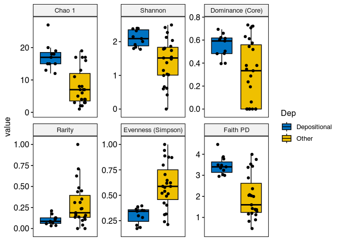<!-- -->

``` r
lev <- levels(as.factor(div_df_melt$Dep)) # get the variables

# make a pairwise list that we want to compare.
L.pairs <- combn(seq_along(lev), 2, simplify = FALSE, FUN = function(i) lev[i])

pval <- list(
  cutpoints = c(0, 0.0001, 0.001, 0.01, 0.05, 0.1, 1),
  symbols = c("****", "***", "**", "*", "n.s")
)

p2 <- p + stat_compare_means(comparisons = L.pairs, label = "p.signif")
#   symnum.args = list(
#     cutpoints = c(0, 0.0001, 0.001, 0.01, 0.05, 0.1, 1),
#     symbols = c("****", "***", "**", "*", ".", "n.s")
#   )
# )

print(p2)
```

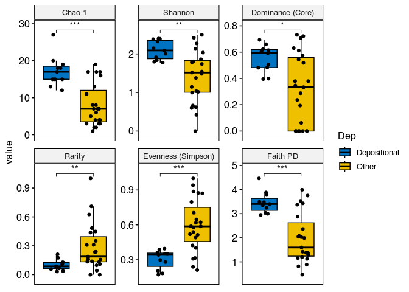<!-- -->

#### Barplot Counts

``` r
ps1.com <- ps1

# if you have dada2/deblur output and sequences as taxa names, then you can change them as follows
taxa_names(ps1.com) <- paste0("ASV_", rownames(tax_table(ps1.com)))

# We need to set Palette
taxic <- as.data.frame(ps1.com@tax_table) # this will help in setting large color options

# colourCount = length(unique(taxic$Family))  
#define number of variable colors based on number of Family (change the level accordingly to phylum/class/order)
# getPalette = colorRampPalette(brewer.pal(12, "Paired"))  
# change the palette as well as the number of colors will change according to palette.

taxic$OTU <- rownames(taxic) # Add the OTU ids from OTU table into the taxa table at the end.
colnames(taxic) # You can see that we now have extra taxonomy levels.
```

    ## [1] "Kingdom" "Phylum"  "Class"   "Order"   "Family"  "Genus"   "Species"
    ## [8] "OTU"

``` r
## [1] "Domain" "Phylum" "Class"  "Order"  "Family" "Genus"  "OTU"

taxmat <- as.matrix(taxic) # convert it into a matrix.
new.tax <- tax_table(taxmat) # convert into phyloseq compatible file.
tax_table(ps1.com) <- new.tax # incroporate into phyloseq Object


# now edit the unclassified taxa
tax_table(ps1.com)[tax_table(ps1.com)[, "Family"] == "", "Family"] <- "Unclassified family"

# it would be nice to have the Taxonomic names in italics.
# for that we set this

guide_italics <- guides(fill = guide_legend(label.theme = element_text(
  size = 15,
  face = "italic", colour = "Black", angle = 0
)))


## Now we need to plot at family level, we can do it as follows:

# first remove the phy_tree

ps1.com@phy_tree <- NULL

# Second merge at family level

library(microbiomeutilities)

ps1.com.ord <- aggregate_top_taxa2(ps1.com, "Order", top = 50)

plot.composition.COuntAbun <- plot_composition(ps1.com.ord) + 
  theme(legend.position = "bottom") +
  theme_bw() +
  theme(axis.text.x = element_text(angle = 90))

plot.composition.COuntAbun
```

<!-- -->

``` r
# Use traqnsform function of microbiome to convert it to rel abun.
ps1.com.fam.rel <- microbiome::transform(ps1.com.ord, "compositional")

plot.composition.relAbun <- plot_composition(ps1.com.fam.rel,
                                             sample.sort = "Replicate",
                                             x.label = "env_material") 
plot.composition.relAbun <- plot.composition.relAbun + theme(legend.position = "bottom") 
plot.composition.relAbun <- plot.composition.relAbun + theme_bw() 
plot.composition.relAbun <- plot.composition.relAbun + theme(axis.text.x = element_text(angle = 90)) 
plot.composition.relAbun <- plot.composition.relAbun + ggtitle("Relative abundance") + guide_italics + theme(legend.title = element_text(size = 18))

print(plot.composition.relAbun)
```

<!-- -->

\#Prep PS object for SpeicEasi

``` r
microbiome::summarize_phyloseq(phylojune)
```

    ## [[1]]
    ## [1] "1] Min. number of reads = 22074"
    ## 
    ## [[2]]
    ## [1] "2] Max. number of reads = 69712"
    ## 
    ## [[3]]
    ## [1] "3] Total number of reads = 1630097"
    ## 
    ## [[4]]
    ## [1] "4] Average number of reads = 47944.0294117647"
    ## 
    ## [[5]]
    ## [1] "5] Median number of reads = 47755"
    ## 
    ## [[6]]
    ## [1] "7] Sparsity = 0.926769269807258"
    ## 
    ## [[7]]
    ## [1] "6] Any OTU sum to 1 or less? YES"
    ## 
    ## [[8]]
    ## [1] "8] Number of singletons = 5376"
    ## 
    ## [[9]]
    ## [1] "9] Percent of OTUs that are singletons \n        (i.e. exactly one read detected across all samples)9.11868671739261"
    ## 
    ## [[10]]
    ## [1] "10] Number of sample variables are: 47"
    ## 
    ## [[11]]
    ##  [1] "month"                         "ctrl"                         
    ##  [3] "is.neg"                        "site"                         
    ##  [5] "side"                          "depth"                        
    ##  [7] "temp_c"                        "do_mgl"                       
    ##  [9] "cond"                          "psu"                          
    ## [11] "turb_ntu"                      "ph"                           
    ## [13] "watercont"                     "organiccont"                  
    ## [15] "bulkdensity"                   "meangrainsize"                
    ## [17] "D50"                           "sand"                         
    ## [19] "mud"                           "shells"                       
    ## [21] "ruppia"                        "Ruppia.Presence"              
    ## [23] "waterdepth"                    "Replicate"                    
    ## [25] "dep"                           "mcrA_raw"                     
    ## [27] "mcrabypro"                     "mcrA_mean"                    
    ## [29] "pro_raw"                       "log16sr"                      
    ## [31] "pro_mean"                      "CH4pw"                        
    ## [33] "Sulfatepw"                     "CH4wc"                        
    ## [35] "Sulfatewc"                     "glycine_betaine_biosynth"     
    ## [37] "glycine_betaine_degradation"   "mgen_superpath"               
    ## [39] "Acetatoclastic"                "H2.CO2"                       
    ## [41] "Ass_sulfate_red"               "trehalose_biosynth"           
    ## [43] "methanogenesis_methanol"       "methanogenesis_trimethylamine"
    ## [45] "methanogenesis_methylamine"    "methanogenesis_methylcomp"    
    ## [47] "methylotrophic"

``` r
# OTU table  
otu_tab <- microbiome::abundances(phylojune)
# check 
otu_tab[1:5,1:5] # for my table show me [1 to 5 rows, 1 to 5 columns]
```

    ##                                  T1D1_1 T1D1_2 T1D2_1 T1D2_2 T1D2_3
    ## 04f728953845ddde86934a0a3e02925f      0      0      0      0      0
    ## c729554d8378b0eb2a0e8b1def2e3db8      0      0      0      0      0
    ## 2270ca1b7393c0e5f103e4ad5f827827      0      0      0      0      0
    ## b1f7c8c5ae260e9e16a2e1c0c11b0d66      0      0      0      0      0
    ## 0e9483d29058ced8b8d00af75668973a      0      0      0      0      0

``` r
# Taxonomy table
tax_tab <- phyloseq::tax_table(phylojune)
# check 
tax_tab[1:5,1:5] # for my table show me [1 to 5 otu ids, 1 to 5 first five ranks]
```

    ## Taxonomy Table:     [5 taxa by 5 taxonomic ranks]:
    ##                                  Kingdom      Phylum          
    ## 04f728953845ddde86934a0a3e02925f "Bacteria"   NA              
    ## c729554d8378b0eb2a0e8b1def2e3db8 "Bacteria"   NA              
    ## 2270ca1b7393c0e5f103e4ad5f827827 "Bacteria"   "Proteobacteria"
    ## b1f7c8c5ae260e9e16a2e1c0c11b0d66 "Archaea"    "Euryarchaeota" 
    ## 0e9483d29058ced8b8d00af75668973a "Unassigned" NA              
    ##                                  Class                
    ## 04f728953845ddde86934a0a3e02925f NA                   
    ## c729554d8378b0eb2a0e8b1def2e3db8 NA                   
    ## 2270ca1b7393c0e5f103e4ad5f827827 "Deltaproteobacteria"
    ## b1f7c8c5ae260e9e16a2e1c0c11b0d66 "Thermoplasmata"     
    ## 0e9483d29058ced8b8d00af75668973a NA                   
    ##                                  Order                               
    ## 04f728953845ddde86934a0a3e02925f NA                                  
    ## c729554d8378b0eb2a0e8b1def2e3db8 NA                                  
    ## 2270ca1b7393c0e5f103e4ad5f827827 "Desulfobacterales"                 
    ## b1f7c8c5ae260e9e16a2e1c0c11b0d66 "Marine Benthic Group D and DHVEG-1"
    ## 0e9483d29058ced8b8d00af75668973a NA                                  
    ##                                  Family              
    ## 04f728953845ddde86934a0a3e02925f NA                  
    ## c729554d8378b0eb2a0e8b1def2e3db8 NA                  
    ## 2270ca1b7393c0e5f103e4ad5f827827 "Desulfobacteraceae"
    ## b1f7c8c5ae260e9e16a2e1c0c11b0d66 NA                  
    ## 0e9483d29058ced8b8d00af75668973a NA

``` r
# accessing the OTUids 
taxa_names(phylojune)[1:5] # print first 5 ids
```

    ## [1] "04f728953845ddde86934a0a3e02925f" "c729554d8378b0eb2a0e8b1def2e3db8"
    ## [3] "2270ca1b7393c0e5f103e4ad5f827827" "b1f7c8c5ae260e9e16a2e1c0c11b0d66"
    ## [5] "0e9483d29058ced8b8d00af75668973a"

``` r
tax_table(phylojune)[tax_table(phylojune) == "uncultured"] <- ""
tax_table(phylojune)[tax_table(phylojune) == "Chloroplast"] <- ""
tax_table(phylojune)[tax_table(phylojune) == "uncultured archaeon"] <- ""
tax_table(phylojune)[tax_table(phylojune) == "uncultured euryarchaeote"] <- ""
tax_table(phylojune)[tax_table(phylojune) == "uncultured crenarchaeote"] <- ""
tax_table(phylojune)[tax_table(phylojune) == "uncultured archaeon 20c-10"] <- ""
tax_table(phylojune)[tax_table(phylojune) == "uncultured haloarchaeon"] <- ""
tax_table(phylojune)[tax_table(phylojune) == "uncultured Halobacteriales archaeon"] <- ""
tax_table(phylojune)[tax_table(phylojune) == "uncultured archaeon 2MT16"] <- ""
tax_table(phylojune)[tax_table(phylojune) == "uncultured Methanosarcinales archaeon"] <- ""
tax_table(phylojune)[tax_table(phylojune) == "uncultured archaeon VC2.1 Arc6"] <- ""
tax_table(phylojune)[tax_table(phylojune) == "uncultured Thermoplasmatales archaeon"] <- ""
tax_table(phylojune)[tax_table(phylojune) == "uncultured Thermoplasmata archaeon"] <- ""
tax_table(phylojune)[tax_table(phylojune) == "unidentified archaeon"] <- ""
tax_table(phylojune)[tax_table(phylojune) == "unidentified marine bacterioplankton"] <- ""
tax_table(phylojune)[tax_table(phylojune) == "uncultured archaeon 20c-39"] <- ""
tax_table(phylojune)[tax_table(phylojune) == "uncultured archeon 'KTK 4A'"] <- ""
tax_table(phylojune)[tax_table(phylojune) == "uncultured sediment archaeon"] <- ""
tax_table(phylojune)[tax_table(phylojune) == "uncultured archaeon 19b-26"] <- ""
tax_table(phylojune)[tax_table(phylojune) == "uncultured archaeon 20c-52"] <- ""
tax_table(phylojune)[tax_table(phylojune) == "uncultured archaeon TA1f2"] <- ""
tax_table(phylojune)[tax_table(phylojune) == "uncultured eukaryote"] <- ""
tax_table(phylojune)[tax_table(phylojune) == "uncultured archaeon 19a-29"] <- ""
tax_table(phylojune)[tax_table(phylojune) == "uncultured archaeon 19b-39"] <- ""
tax_table(phylojune)[tax_table(phylojune) == "uncultured euryarchaeote VAL31-1"] <- ""
tax_table(phylojune)[tax_table(phylojune) == "uncultured bacterium"] <- ""
tax_table(phylojune)[tax_table(phylojune) == "uncultured Firmicutes bacterium"] <- ""
tax_table(phylojune)[tax_table(phylojune) == "uncultured microorganism"] <- ""
tax_table(phylojune)[tax_table(phylojune) == "uncultured Chloroflexi bacterium"] <- ""
tax_table(phylojune)[tax_table(phylojune) == "uncultured Aminicenantes bacterium"] <- ""
tax_table(phylojune)[tax_table(phylojune) == "uncultured sediment bacterium"] <- ""
tax_table(phylojune)[tax_table(phylojune) == "uncultured proteobacterium"] <- ""
tax_table(phylojune)[tax_table(phylojune) == "uncultured spirochete"] <- ""
tax_table(phylojune)[tax_table(phylojune) == "uncultured cyanobacterium"] <- ""
tax_table(phylojune)[tax_table(phylojune) == "possible genus 03"] <- ""
tax_table(phylojune)[tax_table(phylojune) == "uncultured soil bacterium"] <- ""
tax_table(phylojune)[tax_table(phylojune) == "uncultured candidate division SR1 bacterium"] <- ""
tax_table(phylojune)[tax_table(phylojune) == "uncultured marine bacterium"] <- ""
tax_table(phylojune)[tax_table(phylojune) == "uncultured candidate division WS6 bacterium"] <- ""
tax_table(phylojune)[tax_table(phylojune) == "uncultured anaerobic bacterium"] <- ""
tax_table(phylojune)[tax_table(phylojune) == "uncultured deep-sea bacterium"] <- ""
tax_table(phylojune)[tax_table(phylojune) == "uncultured Flavobacterium sp."] <- ""
tax_table(phylojune)[tax_table(phylojune) == "uncultured Microgenomates group bacterium"] <- ""
tax_table(phylojune)[tax_table(phylojune) == "uncultured KB1 group bacterium"] <- ""
tax_table(phylojune)[tax_table(phylojune) == "uncultured Dehalococcoides sp."] <- ""
tax_table(phylojune)[tax_table(phylojune) == "uncultured Chlorobi bacterium"] <- ""
tax_table(phylojune)[tax_table(phylojune) == "uncultured delta proteobacterium"] <- ""
tax_table(phylojune)[tax_table(phylojune) == "uncultured prokaryote"] <- ""
tax_table(phylojune)[tax_table(phylojune) == "uncultured bacterium HF0500_03M05"] <- ""
tax_table(phylojune)[tax_table(phylojune) == "uncultured Candidatus Gracilibacteria bacterium"] <- ""
tax_table(phylojune)[tax_table(phylojune) == "uncultured Parcubacteria group bacterium"] <- ""
tax_table(phylojune)[tax_table(phylojune) == "uncultured Dehalococcoidia bacterium"] <- ""
tax_table(phylojune)[tax_table(phylojune) == "uncultured Anaerolineae bacterium"] <- ""
tax_table(phylojune)[tax_table(phylojune) == "uncultured Actinomycetales bacterium"] <- ""
tax_table(phylojune)[tax_table(phylojune) == "uuncultured Clostridia bacterium"] <- ""
tax_table(phylojune)[tax_table(phylojune) == "uncultured Lentisphaerae bacterium"] <- ""
tax_table(phylojune)[tax_table(phylojune) == "uncultured actinomycete"] <- ""
tax_table(phylojune)[tax_table(phylojune) == "uncultured soil bacterium PBS-III-18"] <- ""
tax_table(phylojune)[tax_table(phylojune) == "uncultured candidate division BRC1 bacterium"] <- ""
tax_table(phylojune)[tax_table(phylojune) == "uncultured soil bacterium PBS-III-4"] <- ""
tax_table(phylojune)[tax_table(phylojune) == "uncultured actinobacterium"] <- ""
tax_table(phylojune)[tax_table(phylojune) == "uncultured Latescibacteria bacterium"] <- "Latescibacteria"
tax_table(phylojune)[tax_table(phylojune) == "uncultured bacterium mle1-16"] <- ""
tax_table(phylojune)[tax_table(phylojune) == "uncultured soil bacterium PBS-III-30"] <- ""
tax_table(phylojune)[tax_table(phylojune) == "uncultured Verrucomicrobia bacterium"] <- ""
tax_table(phylojune)[tax_table(phylojune) == "uncultured Acidobacteria bacterium"] <- ""
tax_table(phylojune)[tax_table(phylojune) == "uncultured Omnitrophica bacterium"] <- ""
tax_table(phylojune)[tax_table(phylojune) == "uncultured Kiritimatiellaeota bacterium"] <- ""
tax_table(phylojune)[tax_table(phylojune) == "uncultured Verrucomicrobium sp."] <- ""
tax_table(phylojune)[tax_table(phylojune) == "uncultured planctomycete"] <- ""
tax_table(phylojune)[tax_table(phylojune) == "uncultured Planctomyces sp."] <- ""
tax_table(phylojune)[tax_table(phylojune) == "uncultured Planctomycetales bacterium"] <- ""
tax_table(phylojune)[tax_table(phylojune) == "uncultured Deferribacteres bacterium"] <- ""
tax_table(phylojune)[tax_table(phylojune) == "uncultured Chitinivibrionia bacterium"] <- ""
tax_table(phylojune)[tax_table(phylojune) == "uncultured Caldithrix sp."] <- ""
tax_table(phylojune)[tax_table(phylojune) == "uncultured candidate division TA06 bacterium"] <- ""
tax_table(phylojune)[tax_table(phylojune) == "uncultured Clostridia bacterium"] <- ""
tax_table(phylojune)[tax_table(phylojune) == "uncultured verrucomicrobium DEV007"] <- ""
tax_table(phylojune)[tax_table(phylojune) == "uncultured Geobacter sp."] <- ""
tax_table(phylojune)[tax_table(phylojune) == "uncultured candidate division GN04 bacterium"] <- ""
tax_table(phylojune)[tax_table(phylojune) == "uncultured Ignavibacteriales bacterium"] <- ""
tax_table(phylojune)[tax_table(phylojune) == "uncultured Bacteroidetes bacterium"] <- ""
tax_table(phylojune)[tax_table(phylojune) == "uncultured Cytophagales bacterium"] <- ""
tax_table(phylojune)[tax_table(phylojune) == "uncultured Epsilonproteobacteria bacterium"] <- ""
tax_table(phylojune)[tax_table(phylojune) == "uncultured Bacteroidetes/Chlorobi group bacterium"] <- ""
tax_table(phylojune)[tax_table(phylojune) == "uncultured gamma proteobacterium"] <- ""
tax_table(phylojune)[tax_table(phylojune) == "uncultured Cytophaga sp."] <- ""
tax_table(phylojune)[tax_table(phylojune) == "uncultured candidate division KSB1 bacterium"] <- ""
tax_table(phylojune)[tax_table(phylojune) == "uncultured Bacteroidales bacterium"] <- ""
tax_table(phylojune)[tax_table(phylojune) == "uncultured Acidobacteriaceae bacterium"] <- ""
tax_table(phylojune)[tax_table(phylojune) == "uncultured Syntrophobacterales bacterium"] <- ""
tax_table(phylojune)[tax_table(phylojune) == "uncultured Actinobacteridae bacterium"] <- ""
tax_table(phylojune)[tax_table(phylojune) == "uncultured forest soil bacterium"] <- ""
tax_table(phylojune)[tax_table(phylojune) == "uncultured Gemmatimonadetes bacterium"] <- ""
tax_table(phylojune)[tax_table(phylojune) == "uncultured Gloeobacter sp."] <- ""
tax_table(phylojune)[tax_table(phylojune) == "uncultured low G+C Gram-positive bacterium"] <- ""
tax_table(phylojune)[tax_table(phylojune) == "uncultured alpha proteobacterium"] <- ""
tax_table(phylojune)[tax_table(phylojune) == "uncultured archaeon"] <- "uncultured bacterium zdt-33i5"
tax_table(phylojune)[tax_table(phylojune) == "uncultured Desulfuromonadales bacterium"] <- ""
tax_table(phylojune)[tax_table(phylojune) == "uncultured compost bacterium"] <- ""
tax_table(phylojune)[tax_table(phylojune) == "uncultured bacterium zdt-33i5"] <- ""
tax_table(phylojune)[tax_table(phylojune) == "uncultured Rickettsiales bacterium"] <- ""
tax_table(phylojune)[tax_table(phylojune) == "uncultured Ochrobactrum sp."] <- "Ochrobactrum"
tax_table(phylojune)[tax_table(phylojune) == "uncultured Rhizobiales bacterium"] <- ""
tax_table(phylojune)[tax_table(phylojune) == "uncultured Marinobacter sp."] <- ""
tax_table(phylojune)[tax_table(phylojune) == "uncultured candidate division GN06 bacterium"] <- ""
tax_table(phylojune)[tax_table(phylojune) == "Verruc-01"] <- ""
tax_table(phylojune)[tax_table(phylojune) == "Unknown Family"] <- ""
tax_table(phylojune)[tax_table(phylojune) == "uncultured bacterium GR-WP33-58"] <- ""
tax_table(phylojune)[tax_table(phylojune) == "uncultured Polyangiaceae bacterium"] <- ""
tax_table(phylojune)[tax_table(phylojune) == "uncultured Kofleriaceae bacterium"] <- ""
tax_table(phylojune)[tax_table(phylojune) == "uncultured eubacterium AB16"] <- ""
tax_table(phylojune)[tax_table(phylojune) == "uncultured Desulfobulbaceae bacterium"] <- ""
tax_table(phylojune)[tax_table(phylojune) == "uncultured Geobacteraceae bacterium"] <- ""
tax_table(phylojune)[tax_table(phylojune) == "uncultured Marinobacter sp."] <- ""
tax_table(phylojune)[tax_table(phylojune) == "metagenome"] <- ""
tax_table(phylojune)[tax_table(phylojune) == "marine metagenome"] <- ""
tax_table(phylojune)[tax_table(phylojune) == "hypersaline lake metagenome"] <- ""
tax_table(phylojune)[tax_table(phylojune) == "wastewater metagenome"] <- ""
tax_table(phylojune)[tax_table(phylojune) == "bioreactor metagenome"] <- ""
tax_table(phylojune)[tax_table(phylojune) == "umicrobial mat metagenome"] <- ""
tax_table(phylojune)[tax_table(phylojune) == "anaerobic digester metagenome"] <- ""
tax_table(phylojune)[tax_table(phylojune) == "hydrothermal vent metagenome"] <- ""
tax_table(phylojune)[tax_table(phylojune) == "Ambiguous_taxa"] <- ""
tax_table(phylojune)[tax_table(phylojune) == "uncultured archaeon"] <- ""
tax_table(phylojune)[tax_table(phylojune) == "uncultured organism"] <- ""


taxa_names(phylojune) <- paste0("ASV", seq(ntaxa(phylojune)))
#besthit
ps.bh <- format_to_besthit(phylojune)

ps.dep <- subset_samples(ps.bh, dep == "Depositional")
ps.nodep <- subset_samples(ps.bh, dep == "Other")

#ps.glom.order <-  
#besthitfiltered = filter_taxa(GlobalPatterns, function(x) sum(x > 3) > (0.2*length(x)), TRUE)
```

# Core & shared taxa

``` r
require(eulerr) # for euler diagrams

pseq.rel <- microbiome::transform(phylojune, "compositional")

#need taxnames
# format names
pseq.rel.f <- format_to_besthit(pseq.rel)

groups <- unique(as.character(meta(pseq.rel.f)$dep))
print(groups)
```

    ## [1] "Depositional" "Other"

``` r
list_core <- c() # an empty object to store information

for (n in groups){ # for each variable n in groups
    #print(paste0("Identifying Core Taxa for ", n))
    
    ps.sub <- subset_samples(pseq.rel.f, dep == n) # Choose sample from groups by n
    
    core_m <- core_members(ps.sub, # ps.sub is phyloseq selected with only samples from g 
                           detection = 0, # 0.001 in atleast 90% samples 
                           prevalence = 0)
    print(paste0("No. of core taxa in ", n, " : ", length(core_m))) # print core taxa identified in each group.
    list_core[[n]] <- core_m # add to a list core taxa for each group.
    #print(list_core)
}
```

    ## [1] "No. of core taxa in Depositional : 5198"
    ## [1] "No. of core taxa in Other : 10043"

``` r
# Specify colors and plot venn
# supplying colors in the order they appear in list_core
library(gplots)
mycols <- c('Depositional'="#d6e2e9", 'Other'="#cbf3f0") 
venn <- venn(list_core)
plot(venn, quantities = list(type = c("percent", "counts")), fills = mycols)
```

<!-- -->

``` r
#Other method
require(MicEco)
euler <- ps_euler(pseq.rel.f, "dep", shape = "ellipse", quantities = list(type=c("percent","counts"), font = 2), labels = list(cex = 1), fills = mycols) 
euler
```

<!-- -->
