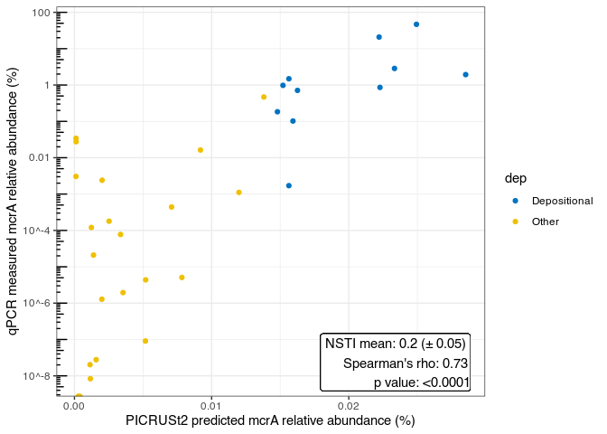
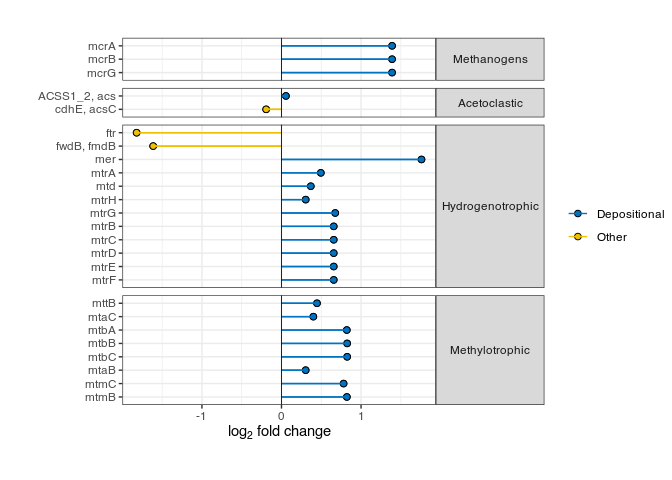
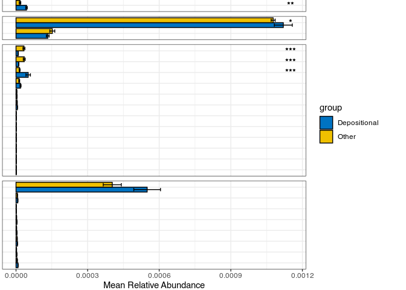

PICRUSt_Analysis_CH4
================
Christopher Keneally
2024-01-18

# PICRUSt pre-processing

``` r
# Starting with decontaminated physeq file
mean(sample_sums(ps)) #32992.51 ASVs
ps #22002 Taxa

#Filters ASVS with \<5 reads, and not present in at least 2 samples
filter <- phyloseq::genefilter_sample(ps, filterfun_sample(function(x) x >= 5), A = 2)
pi_ps <- phyloseq::prune_taxa(filter, ps)

mean(sample_sums(pi_ps)) #31377.9 ASVs
pi_ps #7750 taxa

library(biomformat)
biom_pi <- make_biom(otu_table(pi_ps))
output_path <- "~/Documents/Postgrad/Data/SeasonalAnalysis/picrust/biom_pi.biom" # Set the output file path
write_biom(biom_pi, output_path)
```

To get the rep-seqs (required input for picrust2), rep-seqs.qza must be
exported from qiime as follows:

``` r
qiime tools export --input-path rep-seqs.qza --output-path $/output/path
```

Now we have the files we need.

Next step will require loads of RAM, so you may need to use a cluster

1)  scp files and script below -\> HPC
2)  ssh into HPC
3)  install Picrust2 on the cluster

# Run Picrust on a cluster

Picrust2 can be run with with the following slurm job script from the
HPC Example here is the UoA phoenix HPC, which uses slurm to schedule
jobs

``` r
#!/bin/bash -l
#SBATCH -p skylake,v100cpu # partition
#SBATCH -N 1 # number of nodes
#SBATCH -n 16 # number of cores
#SBATCH --time=24:00:00 # walltime (D-HH:MM:SS)
#SBATCH --mem=128GB # memory per node
#SBATCH --gres=tmpfs:100G
# Notification configuration
#SBATCH --mail-type=END # Email when the job complete (=END)
#SBATCH --mail-type=FAIL # Email when the job fails (=FAIL)
#SBATCH --mail-user=your.name@adelaide.edu.au # Email address

# Execute the program
## Picrust2 full pipeline
conda activate qiime2-2023.5
eval "$(micromamba shell hook --shell=bash)"
micromamba activate picrust2

picrust2_pipeline.py -s /hpcfs/users/a1667276/resuspicrust/dna-sequences.fasta -i /hpcfs/users/a1667276/resuspicrust/biom_pi.biom -o /hpcfs/users/a1667276/resuspicrust/picrust2_out_pipeline -p 16 --max_nsti 0.7

conda deactivate

#
```

# GGPICRUST2 analysis

    ## 
    ##  Shapiro-Wilk normality test
    ## 
    ## data:  merged_data$mcrA_mean
    ## W = 0.5815, p-value = 1.146e-08

    ## 
    ##  Shapiro-Wilk normality test
    ## 
    ## data:  merged_data$K00399_relative
    ## W = 0.9261, p-value = 0.02412

    ## Warning in cor.test.default(merged_data$K00399_rel_adjusted,
    ## merged_data$mcrabypro, : Cannot compute exact p-value with ties

    ## 
    ##  Spearman's rank correlation rho
    ## 
    ## data:  merged_data$K00399_rel_adjusted and merged_data$mcrabypro
    ## S = 1798.5, p-value = 1.225e-06
    ## alternative hypothesis: true rho is not equal to 0
    ## sample estimates:
    ##       rho 
    ## 0.7252025

    ## Warning: Transformation introduced infinite values in continuous y-axis

    ## Warning: Transformation introduced infinite values in continuous y-axis

<!-- -->

    ## Warning: Transformation introduced infinite values in continuous y-axis
    ## Transformation introduced infinite values in continuous y-axis

## Running GGPICRUST2 functions

Below I’ve taken a step-by-step approach because I had to troubleshoot,
but there is a full pipeline analysis available on github. In the
following example, I’m analysing single orthologs of interest to our
study on methane production.

### 1. Ortholog-based analysis

#### 1.1 Default GGPICRUST2 pathway plot

``` r
#If using ALDEx2, you'll need to filter the df for a specific test
#ko_sub_method_results_df \<- ko_daa_results_df[ko_daa_results_df\$method == "ALDEx2_Wilcoxon rank test", ]

ko_daa_results_df <-pathway_daa(abundance = ko_abundance,
                                metadata = metadata,
                                group = group,
                                daa_method = "DESeq2",
                                select = NULL,
                                reference = NULL)

ko_annotated_sub_method_results_df <- pathway_annotation(file = NULL,
                                                         pathway = "KO",
                                                         daa_results_df = ko_daa_results_df,
                                                         ko_to_kegg = F)

#Pick orthologs
Methanogens <- c("K00399", "K00401", "K00402")
Methylotrophic <- c("K14080", "K04480", "K14081",
                    "K14082", "K14083", "K14084",
                    "K16178", "K16179", "K16176",
                    "K16177")
Hydrogenotrophic <- c("K00201", "K00672", "K01499",
                      "K00319", "K00320", "K00577",
                      "K00578", "K00579", "K00580",
                      "K00581", "K00582", "K00583",
                      "K00584", "K14093")
Acetoclastic <- c("K01895", "K00193", "K00197", "K00194", "K01762")
Methanotrophs <- c("K10944", "K10945", "K10946", "K161157")
SRB <- c("K11180", "K11181")
Osmolytes <- c("K02168", "K07811")

daa_results_list <- pathway_errorbar(abundance = ko_abundance,
                                     daa_results_df = ko_annotated_sub_method_results_df,
                                     Group = metadata$dep,
                                     p_values_threshold = 0.5, #plotting of all features selected regardless of signif
                                     order = "p_values",
                                     select = c(Osmolytes),  #For desired analysis
                                     ko_to_kegg = FALSE,
                                     p_value_bar = T,
                                     colors = c('#0073C2FF', '#EFC000FF'),
                                     x_lab = "description")
daa_results_list
```

<!-- -->

Looks okay, but we can pull the data out and replot.

#### 1.2 Redesigned ggpubr split plot

``` r
library(ggpubr)
library(ggsci)

plot1df <- daa_results_list[[1]]$data
plot2df <- daa_results_list[[2]]$data

#Calculating std. error
plot1df <- plot1df %>% mutate(se = ifelse(group == "Depositional", sd / sqrt(12),
                                          ifelse(group == "Other", sd / sqrt(23), NA)))
joined_df <- plot2df %>% inner_join(plot1df, by = c("feature" = "name"))

# Create new column
joined_df <- joined_df %>% mutate(color_group = ifelse(log_2_fold_change < 0, "Other", "Depositional"))

joined_df$short_description <- gsub("\\[.*\\]", "", joined_df$description.x)
joined_df$short_description <- gsub(";.*$", "", joined_df$description.x)
joined_df$short_description <- fct_rev(fct_inorder(joined_df$short_description))

joined_df <- joined_df %>% mutate(category = case_when(
  feature %in% Methanogens ~ "Methanogens",
  feature %in% Methylotrophic ~ "Methylotrophic",
  feature %in% Hydrogenotrophic ~ "Hydrogenotrophic",
  feature %in% Acetoclastic ~ "Acetoclastic",
  feature %in% Methanotrophs ~ "Methanotrophs",
  feature %in% SRB ~ "Sulfate Reduction",
  feature %in% Osmolytes ~ "Osmolytes",
  TRUE ~ "other" # default case if none of the above conditions are met
))

#Relevel methanogens to top for plot
joined_df$category <- fct_relevel(joined_df$category, "Methanogens", after = 0)
```

    ## Warning: 1 unknown level in `f`: Methanogens

``` r
# Plot 1
xl <- expression('log'[2]*' fold change')
# a <- ggplot(joined_df, aes(log_2_fold_change, short_description, color = color_group)) +
# geom_point(aes(fill = color_group, size = negative_log10_p), color = "black", shape = 21) + theme_bw() +
# geom_segment(aes(x=0, xend=log_2_fold_change, y=short_description, yend=short_description, color = color_group)) +
# geom_vline(xintercept = 0, linewidth=0.3) + xlab(xl) + ylab(NULL) + theme() +
# scale_color_jco() +scale_fill_jco()

a <- ggplot(joined_df, aes(log_2_fold_change, short_description, color = color_group)) +
  geom_point(aes(fill = color_group), color = "black", shape = 21, size = 2) + 
  theme_bw() +
  geom_segment(aes(x=0, xend=log_2_fold_change, y=short_description, yend=short_description, color = color_group)) +
  geom_vline(xintercept = 0, linewidth=0.3) + 
  xlab(xl) + ylab(NULL) + 
  theme(legend.title = element_blank()) +
  scale_color_jco() + scale_fill_jco() + 
  facet_grid(category ~., scale="free", space = "free_y") +
  theme(strip.text.y = element_text(angle = 0), plot.margin=unit(c(1,0,1,1), "cm"))

a
```

<!-- -->

Looks okay, now we’ll make the other half

``` r
dodge <- position_dodge(preserve = "single")

# b <- ggplot(joined_df, aes(y = short_description, x = mean, fill = group)) +
# geom_col(position = "dodge", color = "black") +
# geom_errorbar(aes(xmin = mean - se, xmax = mean + se), width = 0.3, position = position_dodge(width = 0.9)) +
# theme_bw() +
# theme(axis.text.y = element_blank()) +
# xlab("Mean Relative Abundance") + ylab(NULL) + scale_fill_jco() +
# facet_grid(category ~., scale="free", space = "free_y") + theme(
# strip.background = element_blank(),
# strip.text.y = element_blank(), plot.margin=unit(c(-1,1,0,0), "cm" ),
# axis.ticks.y = element_blank())
# Summarize the data and create significance labels

label_data <- joined_df %>%
  group_by(short_description, category) %>%
  summarise(p_value = min(p_adjust), # Adjust based on how you want to select the p_value
            .groups = 'drop') %>%
  mutate(significance = case_when(
        p_value < 0.001 ~ "***",
        p_value < 0.01 ~ "**",
        p_value < 0.05 ~ "*",
        TRUE ~ NA_character_))

# Filter the label_data to exclude 'ns'
label_data_filtered <- label_data %>%
  filter(significance != "ns")

joined_df <- joined_df %>%
  left_join(label_data, by = c("short_description", "category"))

b <- ggplot(joined_df, aes(y = short_description, x = mean, fill = group)) +
  geom_col(position = "dodge", color = "black") +
  geom_errorbar(aes(xmin = mean - se, xmax = mean + se), width = 0.6, position = position_dodge(width = 0.9)) +
  theme_bw() + theme(axis.text.y = element_blank()) +
  xlab("Mean Relative Abundance") + ylab(NULL) + scale_fill_jco() +
  facet_grid(category ~., scale="free", space = "free_y") +
  theme(strip.background = element_blank(), 
        strip.text.y = element_blank(), plot.margin=unit(c(-1,1,0,0), "cm"),
        axis.ticks.y = element_blank()) +
  geom_text(aes(x = 0.00115, y = short_description, label = significance),
            na.rm = TRUE, hjust = 0.5, vjust = 0.5)

b
```

<!-- -->

Now combine with ggpubr

``` r
c <- ggarrange(a, b, ncol = 2, nrow = 1,
               align = "h", common.legend = T,
               widths = c(0.5, 0.4) )

c
```

<!-- -->

``` r
ggsave(path = "~/Documents/Postgrad/Figures/June_Methane/draft2", "PICRUST2DESEQ2_Methanos_Final.png",

width = 7, height = 5.2, device = 'png', dpi = 300)
```

### 2 Pathway Analysis

#### 2.1 Default

``` r
setwd("~/Documents/Postgrad/Data/Resuspension/PICRUST/picrust2_out_pipeline/KO_metagenome_out")
kegg_abundance <- ko2kegg_abundance("pred_metagenome_unstrat.tsv")
```

    ##   |                                                                              |                                                                      |   0%  |                                                                              |                                                                      |   1%  |                                                                              |=                                                                     |   1%  |                                                                              |=                                                                     |   2%  |                                                                              |==                                                                    |   2%  |                                                                              |==                                                                    |   3%  |                                                                              |===                                                                   |   4%  |                                                                              |===                                                                   |   5%  |                                                                              |====                                                                  |   5%  |                                                                              |====                                                                  |   6%  |                                                                              |=====                                                                 |   7%  |                                                                              |=====                                                                 |   8%  |                                                                              |======                                                                |   8%  |                                                                              |======                                                                |   9%  |                                                                              |=======                                                               |   9%  |                                                                              |=======                                                               |  10%  |                                                                              |========                                                              |  11%  |                                                                              |========                                                              |  12%  |                                                                              |=========                                                             |  12%  |                                                                              |=========                                                             |  13%  |                                                                              |==========                                                            |  14%  |                                                                              |==========                                                            |  15%  |                                                                              |===========                                                           |  15%  |                                                                              |===========                                                           |  16%  |                                                                              |============                                                          |  17%  |                                                                              |============                                                          |  18%  |                                                                              |=============                                                         |  18%  |                                                                              |=============                                                         |  19%  |                                                                              |==============                                                        |  20%  |                                                                              |==============                                                        |  21%  |                                                                              |===============                                                       |  21%  |                                                                              |===============                                                       |  22%  |                                                                              |================                                                      |  22%  |                                                                              |================                                                      |  23%  |                                                                              |================                                                      |  24%  |                                                                              |=================                                                     |  24%  |                                                                              |=================                                                     |  25%  |                                                                              |==================                                                    |  25%  |                                                                              |==================                                                    |  26%  |                                                                              |===================                                                   |  26%  |                                                                              |===================                                                   |  27%  |                                                                              |===================                                                   |  28%  |                                                                              |====================                                                  |  28%  |                                                                              |====================                                                  |  29%  |                                                                              |=====================                                                 |  29%  |                                                                              |=====================                                                 |  30%  |                                                                              |======================                                                |  31%  |                                                                              |======================                                                |  32%  |                                                                              |=======================                                               |  32%  |                                                                              |=======================                                               |  33%  |                                                                              |========================                                              |  34%  |                                                                              |========================                                              |  35%  |                                                                              |=========================                                             |  35%  |                                                                              |=========================                                             |  36%  |                                                                              |==========================                                            |  37%  |                                                                              |==========================                                            |  38%  |                                                                              |===========================                                           |  38%  |                                                                              |===========================                                           |  39%  |                                                                              |============================                                          |  40%  |                                                                              |============================                                          |  41%  |                                                                              |=============================                                         |  41%  |                                                                              |=============================                                         |  42%  |                                                                              |==============================                                        |  42%  |                                                                              |==============================                                        |  43%  |                                                                              |===============================                                       |  44%  |                                                                              |===============================                                       |  45%  |                                                                              |================================                                      |  45%  |                                                                              |================================                                      |  46%  |                                                                              |=================================                                     |  47%  |                                                                              |=================================                                     |  48%  |                                                                              |==================================                                    |  48%  |                                                                              |==================================                                    |  49%  |                                                                              |===================================                                   |  49%  |                                                                              |===================================                                   |  50%  |                                                                              |===================================                                   |  51%  |                                                                              |====================================                                  |  51%  |                                                                              |====================================                                  |  52%  |                                                                              |=====================================                                 |  52%  |                                                                              |=====================================                                 |  53%  |                                                                              |======================================                                |  54%  |                                                                              |======================================                                |  55%  |                                                                              |=======================================                               |  55%  |                                                                              |=======================================                               |  56%  |                                                                              |========================================                              |  57%  |                                                                              |========================================                              |  58%  |                                                                              |=========================================                             |  58%  |                                                                              |=========================================                             |  59%  |                                                                              |==========================================                            |  59%  |                                                                              |==========================================                            |  60%  |                                                                              |===========================================                           |  61%  |                                                                              |===========================================                           |  62%  |                                                                              |============================================                          |  62%  |                                                                              |============================================                          |  63%  |                                                                              |=============================================                         |  64%  |                                                                              |=============================================                         |  65%  |                                                                              |==============================================                        |  65%  |                                                                              |==============================================                        |  66%  |                                                                              |===============================================                       |  67%  |                                                                              |===============================================                       |  68%  |                                                                              |================================================                      |  68%  |                                                                              |================================================                      |  69%  |                                                                              |=================================================                     |  70%  |                                                                              |=================================================                     |  71%  |                                                                              |==================================================                    |  71%  |                                                                              |==================================================                    |  72%  |                                                                              |===================================================                   |  72%  |                                                                              |===================================================                   |  73%  |                                                                              |===================================================                   |  74%  |                                                                              |====================================================                  |  74%  |                                                                              |====================================================                  |  75%  |                                                                              |=====================================================                 |  75%  |                                                                              |=====================================================                 |  76%  |                                                                              |======================================================                |  76%  |                                                                              |======================================================                |  77%  |                                                                              |======================================================                |  78%  |                                                                              |=======================================================               |  78%  |                                                                              |=======================================================               |  79%  |                                                                              |========================================================              |  79%  |                                                                              |========================================================              |  80%  |                                                                              |=========================================================             |  81%  |                                                                              |=========================================================             |  82%  |                                                                              |==========================================================            |  82%  |                                                                              |==========================================================            |  83%  |                                                                              |===========================================================           |  84%  |                                                                              |===========================================================           |  85%  |                                                                              |============================================================          |  85%  |                                                                              |============================================================          |  86%  |                                                                              |=============================================================         |  87%  |                                                                              |=============================================================         |  88%  |                                                                              |==============================================================        |  88%  |                                                                              |==============================================================        |  89%  |                                                                              |===============================================================       |  90%  |                                                                              |===============================================================       |  91%  |                                                                              |================================================================      |  91%  |                                                                              |================================================================      |  92%  |                                                                              |=================================================================     |  92%  |                                                                              |=================================================================     |  93%  |                                                                              |==================================================================    |  94%  |                                                                              |==================================================================    |  95%  |                                                                              |===================================================================   |  95%  |                                                                              |===================================================================   |  96%  |                                                                              |====================================================================  |  97%  |                                                                              |====================================================================  |  98%  |                                                                              |===================================================================== |  98%  |                                                                              |===================================================================== |  99%  |                                                                              |======================================================================|  99%  |                                                                              |======================================================================| 100%

``` r
daa_results_df <- pathway_daa(abundance = kegg_abundance, metadata = metadata,
                              group = "dep", daa_method = "DESeq2",
                              select = NULL, reference = NULL, p.adjust = "BH")

#Pathway annotation API gets overloaded easily, so I've split the df into blocks of <=80 rows
f1 <- daa_results_df[1:80, ]
f2 <- daa_results_df[81:161, ]
f3 <- daa_results_df[162:233, ]

daa_paths_df1 <- pathway_annotation(pathway = "KO", daa_results_df = f1, ko_to_kegg = TRUE)
```

    ## 
    ## 
    ##   |                                                                              |                                                                      |   0%  |                                                                              |===============                                                       |  22%  |                                                                              |==============================                                        |  43%  |                                                                              |==============================================                        |  65%  |                                                                              |=============================================================         |  87%  |                                                                              |======================================================================| 100%
    ## 
    ## 
    ##   |                                                                              |==                                                                    |   2%  |                                                                              |===                                                                   |   4%  |                                                                              |=====                                                                 |   7%  |                                                                              |======                                                                |   9%  |                                                                              |========                                                              |  11%

``` r
daa_paths_df2 <- pathway_annotation(pathway = "KO", daa_results_df = f2, ko_to_kegg = TRUE)
```

    ## 
    ## 
    ##   |                                                                              |                                                                      |   0%  |                                                                              |===============                                                       |  21%  |                                                                              |=============================                                         |  42%  |                                                                              |============================================                          |  62%  |                                                                              |==========================================================            |  83%  |                                                                              |======================================================================| 100%
    ## 
    ## 
    ##   |                                                                              |=                                                                     |   2%  |                                                                              |===                                                                   |   4%  |                                                                              |====                                                                  |   6%  |                                                                              |======                                                                |   8%  |                                                                              |=======                                                               |  10%

``` r
daa_paths_df3 <- pathway_annotation(pathway = "KO", daa_results_df = f3, ko_to_kegg = TRUE)
```

    ## 
    ## 
    ##   |                                                                              |                                                                      |   0%  |                                                                              |=====================                                                 |  29%  |                                                                              |=========================================                             |  59%  |                                                                              |==============================================================        |  88%  |                                                                              |======================================================================| 100%
    ## 
    ## 
    ##   |                                                                              |==                                                                    |   3%  |                                                                              |====                                                                  |   6%  |                                                                              |======                                                                |   9%  |                                                                              |========                                                              |  12%

``` r
daa_paths_full <- rbind(daa_paths_df1, daa_paths_df2, daa_paths_df3)
daa_paths_full <- daa_paths_full %>%
  separate(pathway_class, into = c("path", "module"), sep = ";\\s*", remove = F)

metab_paths <- daa_paths_full %>% filter(path == "Metabolism")

relevant <- c("ko00270", "ko00680", "ko00720", "ko00910", "ko00400", #First 16 are relevant pways of interes
              "ko00710", "ko00195", "ko00250", "ko00300", "ko00010",
              "ko00630", "ko00030", "ko00300", "ko00020", "ko00710",
              "ko00190", "ko00621", "ko00362", "ko00622", "ko00510", #last 14 are top(sig) in metabolism categor
              "ko00311", "ko01040", "ko00513", "ko00930", "ko00361", 
              "ko00626", "ko00750", "ko00240", "ko00960", "ko00643")

#Only 30 features fit on the default plot so we can plot the most significant to begin with
plot1 <- metab_paths[order(metab_paths$p_adjust),][1:29,]

p <- pathway_errorbar(abundance = kegg_abundance,
                      daa_results_df = metab_paths,
                      Group = metadata$dep,
                      ko_to_kegg = TRUE,
                      p_values_threshold = 1,
                      order = "p_values",
                      select = relevant,
                      p_value_bar = TRUE,
                      colors = c('#0073C2FF', '#EFC000FF'),
                      x_lab = "pathway_name")
p
```

<!-- -->

#### 2.2 Redesign

``` r
plot2df <- p[[2]]$data
plot2df <- plot2df %>% rename("feature" = "name")
plot3df <- p[[3]]$data
plot4df <- p[[4]]$data

#Calculating std. error
plot2df <- plot2df %>% mutate(se = ifelse(group == "Depositional", sd / sqrt(12),
                                          ifelse(group == "Other", sd / sqrt(23), NA)))
joined_df <- plot2df %>%
  full_join(plot3df, by = "feature") %>%
  full_join(plot4df, by = "feature")

# Create new column
joined_df <- joined_df %>% mutate(color_group = ifelse(log_2_fold_change.x < 0, "Other", "Depositional"))

joined_df$pathway_class <- gsub(".*;", "", joined_df$pathway_class)

joined_df$pathway_name.x <- fct_rev(fct_inorder(joined_df$pathway_name.x))

xl <- expression('log'[2]*' fold change')
# a <- ggplot(joined_df, aes(log_2_fold_change, short_description, color = color_group)) +
# geom_point(aes(fill = color_group, size = negative_log10_p), color = "black", shape = 21) + theme_bw() +
# geom_segment(aes(x=0, xend=log_2_fold_change, y=short_description, yend=short_description, color = color_group)) +
# geom_vline(xintercept = 0, linewidth=0.3) + xlab(xl) + ylab(NULL) + theme() +
# scale_color_jco() +scale_fill_jco()

a <- ggplot(joined_df, aes(log_2_fold_change.x, pathway_name.x, color = color_group)) +
  geom_point(aes(fill = color_group), color = "black", shape = 21, size = 2) + 
  theme_bw() +
  geom_segment(aes(x=0, xend=log_2_fold_change.x, y=pathway_name.x, yend=pathway_name.x, color = color_group)) +
  geom_vline(xintercept = 0, linewidth=0.3) + 
  xlab(xl) + ylab(NULL) + 
  theme(legend.title = element_blank()) +
  scale_color_jco() + scale_fill_jco() + 
  facet_grid(pathway_class ~., scale="free", space = "free_y") +
  theme(strip.text.y = element_text(angle = 0), plot.margin=unit(c(1,0,1,1), "cm"))

a
```

<!-- -->

Second part

``` r
dodge <- position_dodge(preserve = "single")

# b <- ggplot(joined_df, aes(y = short_description, x = mean, fill = group)) +
# geom_col(position = "dodge", color = "black") +
# geom_errorbar(aes(xmin = mean - se, xmax = mean + se), width = 0.3, position = position_dodge(width = 0.9)) +
# theme_bw() +
# theme(axis.text.y = element_blank()) +
# xlab("Mean Relative Abundance") + ylab(NULL) + scale_fill_jco() +
# facet_grid(category ~., scale="free", space = "free_y") + theme(
# strip.background = element_blank(),
# strip.text.y = element_blank(), plot.margin=unit(c(-1,1,0,0), "cm" ),
# axis.ticks.y = element_blank())
# Summarize the data and create significance labels

label_data <- joined_df %>%
  group_by(pathway_name.x, pathway_class) %>%
  summarise(p_value = min(p_adjust.x), # Adjust based on how you want to select the p_value
            .groups = 'drop') %>%
  mutate(significance = case_when(
        p_value < 0.001 ~ "***",
        p_value < 0.01 ~ "**",
        p_value < 0.05 ~ "*",
        TRUE ~ NA_character_))

# Filter the label_data to exclude 'ns'
label_data_filtered <- label_data %>%
  filter(significance != "ns")

joined_df <- joined_df %>%
  left_join(label_data, by = c("pathway_name.x", "pathway_class"))

b <- ggplot(joined_df, aes(y = pathway_name.x, x = mean, fill = group)) +
  geom_col(position = "dodge", color = "black") +
  geom_errorbar(aes(xmin = mean - se, xmax = mean + se), width = 0.6, position = position_dodge(width = 0.9)) +
  theme_bw() + theme(axis.text.y = element_blank()) +
  xlab("Mean Relative Abundance") + ylab(NULL) + scale_fill_jco() +
  facet_grid(pathway_class ~., scale="free", space = "free_y") +
  theme(strip.background = element_blank(), 
        strip.text.y = element_blank(), plot.margin=unit(c(-1,1,0,0), "cm"),
        axis.ticks.y = element_blank()) +
  geom_text(aes(x = 0.033, y = pathway_name.x, label = significance),
            na.rm = TRUE, hjust = 0.5, vjust = 0.5)

b
```

<!-- -->

Combine plots

``` r
c <- ggarrange(a, b, ncol = 2, nrow = 1,
               align = "h", common.legend = T,
               widths = c(0.9, 0.3) )

c
```

<!-- -->

``` r
ggsave(path = "~/Documents/Postgrad/Figures/June_Methane/draft2", "PICRUST2DESEQ2_Pathways.png",

width = 10, height = 6.25, device = 'png', dpi = 300)
```
